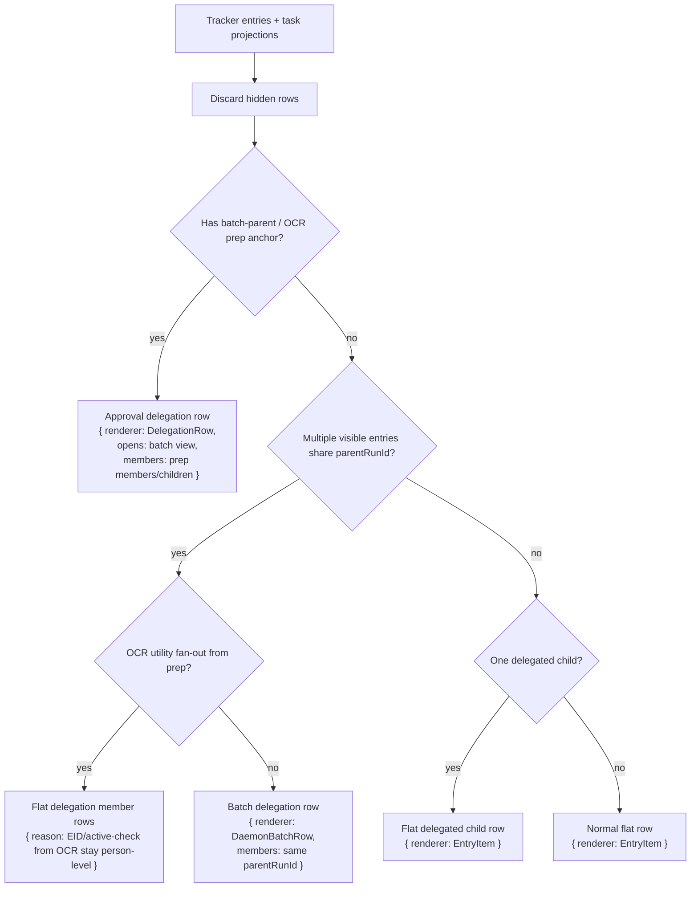
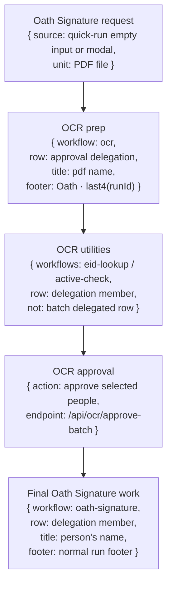
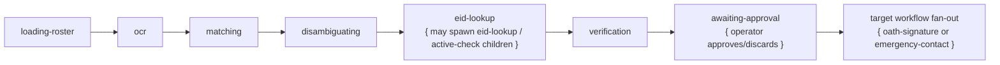
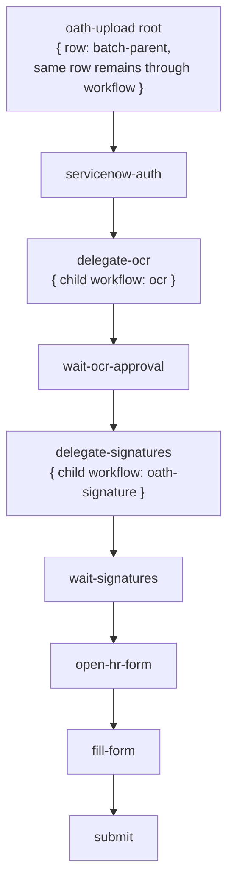
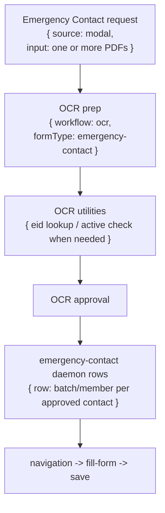
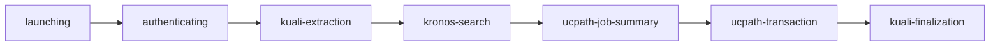

# Workflow, Delegation, And Queue Behavior Map

Last checked: 2026-05-20 · **Post–workflow-runtime migration (Phases 1–6)**

This file maps what the dashboard does **after** the workflow runtime migration: queue rows render from `WorkflowRunProjection` + per-workflow `runtimePolicy`, operator actions funnel through `performWorkflowAction`, and this doc describes the resulting behavior (not pre-migration inline special cases).

Implementation reference: each row says what appears in the queue, what appears in batch view, which workflow owns the work, and what cancel/retry means for that scope.

## Source Map

- Workflow registry and loader: `src/workflows/*/workflow.ts`, `src/core/workflow-loaders.ts`
- Run modal registry: `src/dashboard/lib/run-modal-registry.ts`
- Quick run registry: `src/dashboard/lib/quick-run-registry.ts`
- Queue surface builder: `src/tracker/queue-surfaces.ts`
- Queue renderer: `src/dashboard/components/queue-panel/QueuePanel.tsx`
- Flat queue row: `src/dashboard/components/queue-panel/EntryItem.tsx`
- Group row base UI: `src/dashboard/components/queue-panel/group-row-base.tsx`
- Approval delegation row: `src/dashboard/components/ocr/DelegationRow.tsx`
- Daemon/batch group row: `src/dashboard/components/queue-panel/DaemonBatchRow.tsx`
- Batch view: `src/dashboard/components/queue-panel/batch-queue-view.tsx`
- Pending controls: `src/dashboard/components/queue-panel/QueueItemControls.tsx`
- Running cancel control: `src/dashboard/components/queue-panel/CancelRunningButton.tsx`
- Retry/delete group controls: `src/dashboard/components/queue-panel/BatchFooterActions.tsx`
- Cancel endpoints: `src/tracker/dashboard/ops/cancel.ts`
- Retry endpoints: `src/tracker/dashboard/ops/retry.ts`
- Delete endpoints: `src/tracker/dashboard/ops/delete.ts`
- OCR prepare/approve/discard: `src/tracker/dashboard/ocr/*`
- Parent/child dependencies: `src/core/task-store/child-state.ts`, `src/core/task-store/terminal.ts`

## Row Units

| Unit | Meaning | Renderer | Opens batch view? | Common title | Common footer/subtitle |
|---|---|---|---|---|---|
| Normal row | One tracker entry or one SQLite task projection. | `EntryItem` | No. | `resolveEntryName()` from data/name/EID/file/person. | Time, `#run`, optional secondary id, duration. |
| Approval delegation row | OCR prep parent that is awaiting or has completed approval. | `DelegationRow` over `GroupRowBase` | Yes. | Prep/PDF title. | Prep footer; Oath prep uses `Oath · <last4 run id>` as the useful secondary id. |
| Batch delegation row | Multiple rows share one `parentRunId`, or multiple delegated prep rows are grouped under one upstream batch id. | `DaemonBatchRow` over `GroupRowBase` | Yes. | Batch/workflow title or inherited parent subject. | Usual footer, but no raw `parentRunId` beside the run number. |
| Passive delegation row | Utility children grouped under a parent, not intended as the main operator task. | `GroupRowBase` | Yes. | Parent subject or delegated utility work. | Usual footer; no direct retry/delete actions unless wired by caller. |
| Batch view member | A row shown inside an opened group. | `EntryItem` | No nested batch view. | The member's own title. | The member's own footer/subtitle. |
| Log panel row label | Small bottom label in the right log panel. | Log panel surface classifier | N/A | Row type text such as `Normal row`, `Single delegation`, or `Batch delegation · Preview`. | Informational only. |

Dashboard grouping is display-only unless an endpoint explicitly cancels/deletes descendants. Sharing a `parentRunId` makes rows appear together; it does not automatically make every button operate on the full tree.

## Global Queue Surface Algorithm

Special Oath rule now: multi-PDF Oath Signature upload is simplified into multiple single-file OCR prep runs. The dashboard may group those single-file rows by a shared batch id for display, but the backend work is still one OCR prep per PDF.

## Global Action Map

| Action | Where it appears | Endpoint | Scope now | Effect |
|---|---|---|---|---|
| Start from run modal | Oath Signature, Emergency Contact, OCR, Oath Upload. | `/api/ocr/prepare`, `/api/ocr/reupload`, or `/api/oath-upload/start` | The uploaded PDF list and selected form options. | Creates prep/root rows. Oath Signature and Emergency Contact go through OCR prepare first. |
| Start from quick run | Separations, EID Lookup, Active Check, Oath Signature, CRM Doc Download. | Workflow enqueue endpoint or modal handoff. | Input names/EIDs/doc ids. | Creates normal daemon rows, except empty Oath Signature opens OCR modal. |
| Cancel queued row | Pending row footer. | `/api/cancel-queued` | One queued task only. | Refuses claimed/running tasks. Marks task attempt cancelled, updates dependency child state as cancelled, writes cancelled/failed tracker audit. |
| Cancel queued OCR prep row | Pending OCR prep/proxy row footer. | `/api/ocr/discard-prepare` | The OCR prep run and children for that prep run. | Requests OCR abort, deletes delegated children for that OCR run, writes OCR discarded, mirrors discarded to parent when known. |
| Stop running row | Running row footer. | `/api/task/force-stop` | One running task. | Marks task cancelled immediately, records dependency cancelled, sends daemon `force-current`. Does not kill Chrome. |
| Stop running OCR prep row | Running OCR prep/proxy row footer. | `/api/ocr/discard-prepare` | The OCR prep run and children for that prep run. | Same as OCR discard. |
| Stop all visible active rows | Queue toolbar stop button. | `/api/cancel-active-bulk` | Visible pending/running rows in current filter. | Cancels pending through `/api/cancel-queued`; requests running cancellation through running cancel path. |
| Stop daemon | Daemon controls/API. | `/api/daemon/stop` or `/api/daemons/stop` | Daemon process/session, not automatically a workflow tree. | Stops the worker/daemon. Items not processed may later appear cancelled/failed depending on tracker/task state. |
| Kill browser | Session/worker controls. | `/api/browser/kill` | Recorded browser process only. | Sends kill command/SIGTERM for browser process. Does not by itself mark an entire delegation tree cancelled. |
| Retry one row | Failed/cancelled row footer. | `/api/retry` | One row/task, preserving parent batch context when known. | Re-enqueues from SQLite task when possible. Falls back to latest JSONL input. OCR and SharePoint have special retry handlers. |
| Retry group | Batch/delegation group footer. | `/api/retry-bulk` | Members passed by the group. | Retries each eligible member. Group retry is member retry, not a special parent transaction. |
| Delete one row | Terminal row footer. | Delete endpoint in `ops/delete.ts` | One row plus task subtree/projected entry when resolvable. | Rewrites tracker/log JSONL, removes screenshots, deletes task subtree data. |
| Delete group | Batch/delegation group footer or queue toolbar. | `/api/delete-bulk` | Members passed by caller or visible entries. | Bulk version of delete. OCR discard also calls delegated-child cleanup for that prep run. |
| Bump queued row | Pending row footer. | `/api/queue/bump` | One queued task. | Moves pending task earlier/later according to queue bump logic. |
| OCR approve | OCR preview/approval UI. | `/api/ocr/approve-batch` | Selected OCR records. | Enqueues target workflow children, pre-emits child pending rows, writes OCR approved/done, records dependencies when there is an upstream parent. |
| OCR discard | OCR preview/queue cancel. | `/api/ocr/discard-prepare` | One OCR prep file/run. | Cancels that file's OCR chain and removes delegated children for that run. |
| OCR retry page | OCR preview page action. | `/api/ocr/retry-page` | One OCR page. | Re-runs OCR for that page/session. |
| OCR re-OCR whole PDF | OCR preview action. | `/api/ocr/reocr-whole-pdf` | One OCR session/PDF. | Re-runs OCR for the PDF/session. |
| OCR force research | OCR preview action. | `/api/ocr/force-research` | One OCR record/session path. | Forces lookup/research path for unresolved OCR data. |
| OCR reupload | Run modal when existing prep file is replaced. | `/api/ocr/reupload` | One OCR prep/session. | Replaces source PDF and reruns prep path. |
| Edit and resume | Editable workflow detail fields. | `/api/run-with-data` | One failed/cancelled row with edited data. | Re-enqueues with `prefilledData`; used mostly by workflows with editable detail fields such as Separations. |

## Cancellation And Dependency Rules

| Situation | Current behavior |
|---|---|
| Cancel one queued child | Only that child task is cancelled. Parent dependency state becomes `cancelled`; if every dependency is either satisfied or cancelled, the parent can release. Sibling children continue. |
| Cancel one running child | Force-stop marks that child cancelled and notifies daemon. Siblings continue unless a parent/tree cancel endpoint is used. |
| Child fails | Dependency policy decides parent effect. Oath Upload approval dependencies use `block_parent`, so failed signature children block the parent until retried/resolved. |
| Child is cancelled | Dependency is marked `cancelled`, not `failed`. Parent may release if no unsatisfied or failed dependencies remain. |
| Parent/root cancel through normal row cancel | Normal row controls operate on the row/task. They do not automatically walk the full dependency tree unless the endpoint is a tree-aware path. |
| Parent/tree cancel through task-store helper | `requestCancelParentAndChildren()` can mark the parent cancelling/cancelled and cancel pending dependency children with cascade cancel enabled. This is task-store behavior, not every dashboard button. |
| OCR prep discard | This is the strongest file-scope cancel path. It aborts OCR, deletes delegated children for that prep run, writes the prep as discarded, and mirrors discarded to the upstream parent when known. |
| Daemon stop | Stops processing. It is not the same as "cancel this workflow tree". Rows can remain cancelled/failed/queued based on where the daemon stopped and which tracker events were written. |
| Retry child | Re-enqueues that child and preserves parent/batch context. For dependency children, retry can let a blocked/waiting parent resume after the child reaches a good terminal state. |
| Delete child | Removes dashboard/tracker visibility for that child and task subtree. It is cleanup, not business approval. |

## Workflow Inventory

| Workflow | Archetype | Start paths | Queue row when direct | Delegates to | Batch view members | Notes |
|---|---|---|---|---|---|---|
| Oath Signature | `single` | Quick run, OCR approval, Oath Signature modal through OCR. | Normal row for direct person run; OCR prep row before approval. | OCR prep first when using PDF; final work is `oath-signature` per approved person. | PDF prep members, EID lookup members, final person signature rows. | Final signature rows should title by person name and show as delegation members. |
| Oath Upload | `delegating-batch` | Run modal. | Root batch-parent row using the same row through the whole ServiceNow flow. | OCR, then Oath Signature, then ServiceNow submit. | OCR/signature children under same parent context. | Full mode waits on OCR approval and signature children; upload-only skips them. |
| OCR | `delegating-batch` | OCR modal, Oath/Emergency modal, retry/reupload. | Approval delegation prep row. | SharePoint roster download, EID Lookup, Active Check, then target workflow after approval. | OCR records/utility children/approved target children depending stage. | Single file should label as single delegation; multiple files group as batch delegation. |
| Emergency Contact | `batch` | Emergency Contact modal through OCR approval. | OCR prep row first; final rows are emergency-contact daemon rows. | OCR prep, EID/verification utilities, final emergency-contact rows. | Contact/person rows after approval. | Final rows use editable contact detail fields. |
| EID Lookup | `utility` | Quick run, OCR utility child. | Normal utility row if direct. | None. | If OCR-created, appears as delegation member; OCR fan-out is not promoted to batch group. | Canceling one lookup cancels only that lookup/person. |
| Active Check | `single` | Quick run, OCR utility child. | Normal row if direct. | None. | If OCR-created, appears as delegation member. | Used for UCPath active status verification. |
| CRM Doc Download | `utility` | Quick run, daemon loader. | Normal utility row. | None. | Usually none. | Retry uses normal retry path. |
| SharePoint Download | `utility` | SharePoint UI/API, OCR roster-download child. | Normal/in-process row if direct. | None. | If OCR-created, passive utility member under OCR prep. | Retry is special-cased by sharepoint download spec id. |
| Separations | `batch` | Quick run, daemon loader. | Normal rows per separation/doc/person; multiple inputs can group as daemon batch. | None. | Separation rows. | Has editable detail fields and edit-and-resume. |
| Onboarding | `batch` | Daemon loader/API. | Normal rows per onboarding record; multiple inputs can group as daemon batch. | None. | Onboarding rows. | Multi-system workflow: CRM, UCPath, I-9. |
| Work Study | `single` | Daemon loader/API. | Normal row. | None. | None unless launched in a batch. | Direct UCPath transaction workflow. |
| Kronos Reports | `batch` | Workflow exists; not in generic dashboard loader. | Normal/batch rows when run by its own path. | None. | Kronos report rows. | Not currently exposed by run modal or quick run registry. |

## Oath Signature Detailed Flow

Desired mental model:

### Single Oath PDF Upload

| Stage | Queue row | Title | Footer/subtitle | Batch view | Cancel effect |
|---|---|---|---|---|---|
| 1. Oath Signature started | Approval delegation row over one OCR prep file. | PDF name. | Default title: `Oath · <last4 run id>`. | Batch view contains the Oath Signature request/prep row. The request row subtitle is the default title. | Cancel/discard this file. Since it is the only file, the whole Oath Signature request is cancelled. |
| 2. OCR running | Same OCR prep row. Log panel should show `Single delegation · Preview`. | PDF name. | `Oath · <last4 run id>`. | OCR preview/records appear for that file. | Cancel from queue or preview discards this OCR prep and its children. |
| 3. EID lookup/active checks | Delegation member rows, not a batch delegated row. | Person/EID when known. | Normal footer for that child. | Members appear inside the file's batch/delegation view. | Cancel one utility lookup cancels that person/lookup only. |
| 4. OCR approval | OCR prep row becomes approved/done. | PDF name. | `Oath · <last4 run id>`. | Approved selected people become downstream members. | Discard before approval cancels file. After approval, cancel final person rows individually. |
| 5. Final Oath Signature work | Delegation member rows. | Person's name, not PDF name. | Normal footer/subtitle. | Every approved person from the PDF gets a row in the batch view. | Cancel one person cancels only that person and shows that member as Cancelled. |

### Multiple Oath PDF Upload

The current simplification is "multiple singles": each PDF becomes its own OCR prep run. The shared batch id is for dashboard grouping.

| Stage | Queue row | Title | Footer/subtitle | Batch view | Cancel effect |
|---|---|---|---|---|---|
| 1. Oath Signature started | Batch delegation row over multiple single-file OCR prep rows. | `Oath · <last4 batch/run id>` when the group title is inherited; no PDF title at top because there are multiple files. | Empty/normal group footer; do not show raw parent run id beside `#run`. | Batch view contains normal preview rows, one per PDF. Each member title is PDF name and subtitle/default title is `Oath · <last4 file run id>`. | Canceling the main/group row should cancel all file rows if wired through a tree/group cancel. Current group actions are retry/delete, not a dedicated cancel-all. |
| 2. Per-file OCR | Each PDF row is a single OCR prep row inside the group. | PDF name. | `Oath · <last4 file run id>`. | Open file row to see OCR preview/logs. | Canceling one file cancels only that file's OCR/signature chain. Other uploaded PDFs continue. |
| 3. Per-file EID lookup | Delegation member rows under that file/prep. | Person/EID when known. | Normal child footer. | They appear as file members, not as an EID batch delegated row. | Cancel one lookup cancels that one lookup/person only. |
| 4. Per-file final signature | Delegation member rows. | Person's name. | Normal child footer. | Every person from each PDF gets a row under that PDF's context. | Cancel one person cancels only that person and marks the parent batch view member Cancelled. |

## OCR Workflow

| Scenario | Row type | Title | Footer/subtitle | Batch view | Actions |
|---|---|---|---|---|---|
| One PDF OCR prep | Approval delegation row; log label should be `Single delegation · Preview`. | PDF name. | Form-specific default title when present, otherwise normal footer id. | OCR preview/records for that file. | Cancel/discard, retry prep, delete prep, retry page, re-OCR whole PDF, force research, approve selected records. |
| Multiple PDFs OCR prep | Batch delegation row over multiple single-file prep rows. | Batch/default title. | No raw parent run id in group footer. | Normal preview rows, one per PDF. | Retry/delete group members; cancel per file through member row. |
| Roster download needed | Passive SharePoint Download utility child under OCR. | Roster/download label. | Normal child footer. | Utility member row. | Cancel/retry utility child only. |
| EID/active verification needed | Flat delegation member rows for EID Lookup/Active Check. | Person/EID. | Normal child footer. | Member rows in file/prep context. | Cancel/retry one lookup/check only. |
| OCR approved | Prep row becomes done/approved; selected records fan out. | PDF name. | Same prep footer. | Target workflow children appear as members. | Retry target children individually; retry prep only if the prep row is retried. |
| OCR discarded | Prep row is hidden from normal queue surfaces after discarded filtering. | PDF name in logs/history. | Same prep footer. | Delegated children for that OCR run are deleted. | Discard is file-scope cancellation. |

## Oath Upload Workflow

| Stage | Queue row | Title | Footer/subtitle | Batch view | Cancel effect |
|---|---|---|---|---|---|
| Root starts | Existing Oath Upload root row (`batch-parent`). | Oath Upload/request title from upload data. | Normal root footer. | Children appear under this root as they are created. | Cancel root row cancels root task. Tree-wide child cancellation depends on tree-aware cancellation path, not every row button. |
| Delegate OCR | Same root row; OCR child appears. | Root title. | Normal root footer. | OCR file/prep child appears as member. | Cancel OCR child discards that file's OCR chain. |
| Wait OCR approval | Same root row waits. | Root title. | Normal root footer. | OCR approval view controls selected signer records. | Discard OCR blocks/cancels that prep path and mirrors discarded to parent when parent known. |
| Delegate signatures | Same root row; signature children are enqueued. | Root title. | Normal root footer. | One Oath Signature member per selected signer/person. | Cancel one signature child cancels that person only; failed child blocks parent because dependency policy is `block_parent`. |
| Submit ServiceNow | Same root row continues after signatures resolve. | Root title. | Normal root footer. | Signature children remain visible as member history. | Stop daemon stops processing, not a clean tree cancel. |

Upload-only mode skips OCR/signature delegation and goes straight to the ServiceNow upload path.

## Emergency Contact Workflow

| Scenario | Queue row | Title | Footer/subtitle | Batch view | Actions |
|---|---|---|---|---|---|
| One PDF before approval | OCR approval delegation row. | PDF name when available. | Emergency/default prep footer. | OCR preview/records for that PDF. | OCR cancel/discard/retry/approve actions. |
| Multiple PDFs before approval | Batch delegation row over single-file OCR prep rows. | Batch/default emergency contact title. | No raw parent run id in group footer. | One PDF prep member per uploaded file. | Retry/delete group members; cancel each PDF through member row. |
| After approval | Final emergency-contact rows. | Employee/contact subject. | Normal footer. | Approved records become member rows. | Cancel/retry/delete one contact row; edit details where field editing is wired. |

## EID Lookup Workflow

Stages: `searching`, `cross-verification`, `active-status`.

| Source | Queue row | Title | Footer/subtitle | Batch view | Cancel/retry |
|---|---|---|---|---|---|
| Direct quick run | Normal utility row. | Search input, person, or EID. | Normal footer. | None unless launched as a multi-input daemon batch. | Cancel/retry affects only that lookup. |
| OCR utility child | Delegation member row, not a batch delegated row. | Person/EID, preferring resolved person/EID over technical OCR retry ids. | Normal child footer. | Appears inside OCR/Oath/Emergency prep context. | Cancel/retry affects only that lookup/person. |
| Grouped utility children outside OCR special case | Passive or batch group depending shared parent and count. | Parent subject or utility title. | Group footer with no raw parent id. | Member rows for each lookup. | Group retry/delete acts on members. |

## Active Check Workflow

Stages: active-status verification in UCPath.

| Source | Queue row | Title | Footer/subtitle | Batch view | Cancel/retry |
|---|---|---|---|---|---|
| Direct quick run | Normal row. | Name/EID/search input. | Normal footer. | None unless multi-input batch. | Cancel/retry affects only that check. |
| OCR utility child | Delegation member row. | Person/EID. | Normal child footer. | Appears inside OCR context. | Cancel/retry affects only that check/person. |

## CRM Doc Download Workflow

| Source | Queue row | Title | Footer/subtitle | Stages | Cancel/retry |
|---|---|---|---|---|---|
| Quick run or daemon loader | Normal utility row; multiple inputs can group as daemon batch. | Email, EID, or person name. | Normal footer. | CRM document download steps from workflow metadata. | Cancel/retry affects one download row; group retry/delete acts on visible members. |

## SharePoint Download Workflow

| Source | Queue row | Title | Footer/subtitle | Batch view | Cancel/retry |
|---|---|---|---|---|---|
| Direct SharePoint download UI/API | Normal utility/in-process row. | Download label/filename/path. | Normal footer. | None unless grouped by caller. | Retry uses SharePoint special handler/spec id. |
| OCR roster download | Passive utility child under OCR prep. | Roster/download label. | Normal child footer. | Appears as utility member under OCR prep. | Cancel/retry affects only the roster download child. |

## Separations Workflow

| Source | Queue row | Title | Footer/subtitle | Batch view | Actions |
|---|---|---|---|---|---|
| Quick run / daemon loader | Normal row per separation record; multiple records can show as daemon batch. | Person/name/doc/EID subject. | Normal footer. | Member rows for each separation record. | Cancel/retry/delete per row, group retry/delete, edit-and-resume via `/api/run-with-data` for editable fields. |

## Onboarding Workflow

Stages: `crm-auth`, `extraction`, `pdf-download`, `ucpath-auth`, `person-search`, `i9-creation`, `transaction`.

| Source | Queue row | Title | Footer/subtitle | Batch view | Actions |
|---|---|---|---|---|---|
| Daemon loader/API | Normal row per onboarding record; multiple records can show as daemon batch. | Email/person/input subject. | Normal footer. | Member rows for each onboarding record. | Cancel/retry/delete per row; group retry/delete for grouped members. |

## Work Study Workflow

Stages: `ucpath-auth`, `transaction`.

| Source | Queue row | Title | Footer/subtitle | Batch view | Actions |
|---|---|---|---|---|---|
| Daemon loader/API | Normal single row. | Person/name/EID subject. | Normal footer. | None unless launched in a parent batch. | Cancel/retry/delete per row. |

## Kronos Reports Workflow

| Source | Queue row | Title | Footer/subtitle | Batch view | Actions |
|---|---|---|---|---|---|
| Workflow-specific runner; not currently in quick-run or run-modal registries. | Normal/batch rows when launched by its own path. | Name/id subject. | Normal footer. | Member rows for each report target when batched. | Cancel/retry/delete per row if surfaced through normal task/tracker paths. |

## UI Copy Rules To Preserve

| Place | Current/desired rule |
|---|---|
| Oath default title | `Oath · <last4 of run id>`. This is the default title/secondary id for file prep context, not the final person row title. |
| Oath final signature row title | Person's name. If unavailable, fall back to EID/search input, not raw OCR retry task id. |
| Oath single file prep row title | PDF filename. |
| Oath multiple file group title | Shared Oath default title; member rows are PDF filenames. |
| Batch group footer | Usual time/run/footer controls without raw parent run id beside the run number. |
| OCR workflow footer | OCR prep/member rows may show the Oath default title beside the run number when the prep is for Oath. |
| EID lookup title | Resolved person/EID should win over technical `ocr-retry-*` ids. |
| Status badges | Badges should describe what happened: Queued, Running, Needs review, Done, Skipped/Existing, Cancelled, Failed, Not found. They are not separate arbitrary tags. |

## Known Sharp Edges

- A group row is often just a display group. Do not assume group cancel exists because group retry/delete exists.
- `/api/ocr/discard-prepare` is the file-scope cancel path for OCR prep; it is stronger than generic queued/running cancel.
- OCR utility EID/active-check rows intentionally stay as delegation member rows instead of becoming their own batch delegated row.
- Multi-PDF Oath Signature now behaves as multiple single-file OCR prep runs grouped for display.
- Daemon stop is operational control. It stops workers; it is not the same as a clean cancellation decision for every related row.
- Some workflows exist in metadata but are not exposed through the dashboard run modal or quick-run registry.
- Parent dependency behavior depends on policy. Oath Upload signature children use `block_parent` on failure and cascade-capable dependencies, but dashboard buttons still need the correct endpoint to apply tree-wide cancellation.

## How To Add A New Workflow

1. **Kernel workflow** — `defineWorkflow({ archetype, runtimePolicy, operatorSubject, detailFields, ... })`. Spread `DEFAULT_WORKFLOW_RUNTIME_POLICY` unless the workflow needs delegation/preview/memberRow/prepRow overrides (see `src/workflows/ocr/workflow.ts` and `src/workflows/oath-upload/workflow.ts`).
2. **Runtime policy** — declare cancel/retry/delete scopes in `runtimePolicy.rowActions` / `groupActions`. OCR-style file-scope cancel uses `delegation.fileScopeCancelKind: "ocr-discard"`. Utility fan-out uses `delegation.utilityChildSurface: "delegation-member"`.
3. **Architecture guards** — `tests/unit/architecture/archetype-coverage.test.ts` requires `archetype:`; `tests/unit/architecture/runtime-policy-coverage.test.ts` requires `runtimePolicy:` and validates action descriptors.
4. **Dashboard** — no frontend registry edits. Queue rows pick up titles/actions from projections automatically once the workflow registers and emits tracker rows with the right `data.archetype` stamps.
5. **Document behavior here** — add a row to **Workflow Inventory** and, if the workflow delegates or batches, a short flow section with cancel/retry scope notes.
