# HR Automation — Architecture Deep Dive

A from-scratch walkthrough of how the codebase is wired. Assumes zero prior context. Every term is defined on first use; every diagram reflects real files in `src/`.

**Table of contents**

1. [The 10,000-foot view](#1-the-10000-foot-view)
2. [The three-layer split](#2-the-three-layer-split)
3. [What is `Ctx`?](#3-what-is-ctx)
4. [The kernel internals](#4-the-kernel-internals)
5. [Run modes: single, sequential batch, pool](#5-run-modes-single-sequential-batch-pool)
6. [Auth chains (sequential vs interleaved)](#6-auth-chains-sequential-vs-interleaved)
7. [Tracker + Dashboard (observability)](#7-tracker--dashboard-observability)
8. [Reliability primitives: idempotency & step-cache](#8-reliability-primitives-idempotency--step-cache)
9. [Systems + Selector Intelligence](#9-systems--selector-intelligence)
10. [End-to-end: one onboarding, step by step](#10-end-to-end-one-onboarding-step-by-step)
11. [Glossary](#11-glossary)

---

## 1. The 10,000-foot view

The repo is a **Playwright robot** that logs into UCSD's HR systems (UCPath, ACT CRM, I9 Complete, Kuali, Kronos) and does routine HR work: onboarding, separations, EID lookups, report downloads, etc.

The trick: each automation is **declarative**. You don't write "launch a browser, log in, run this, tear down." You write:

```ts
defineWorkflow({
  name: "onboarding",
  systems: [crm, ucpath, i9],
  steps: ["crm-auth", "extraction", "pdf-download", ...],
  handler: async (ctx, data) => { /* your Playwright code */ },
})
```

The **kernel** (`src/core/`) takes that declaration and handles every piece of infrastructure around it: browser launch, window tiling, authentication retries, Duo MFA sequencing, step tracking, screenshot-on-failure, SIGINT cleanup, live dashboard streaming, batch parallelism.

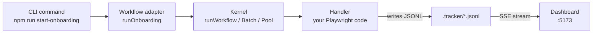

---

## 2. The three-layer split

Top-level directory tree and what each thing is responsible for:

```
src/
├── core/          ← THE KERNEL: defineWorkflow, runWorkflow, Session, Stepper, Ctx
├── systems/       ← PER-SYSTEM DRIVERS: one folder per external system
│   ├── ucpath/    ←   Playwright selectors + navigate helpers for PeopleSoft
│   ├── crm/       ←   ACT CRM (Salesforce) extract
│   ├── i9/        ←   I9 Complete profile + Section 1
│   ├── kuali/     ←   Kuali Build separation form
│   ├── new-kronos/    ←   WFD/Dayforce timecard
│   ├── old-kronos/    ←   UKG Kronos Time Detail PDFs
│   └── common/    ←   safeClick, safeFill, dismissPeopleSoftModalMask
├── workflows/     ← COMPOSED WORKFLOWS: each is defineWorkflow(...) + CLI adapter
│   ├── onboarding/
│   ├── separations/
│   ├── eid-lookup/
│   ├── old-kronos-reports/
│   ├── work-study/
│   └── emergency-contact/
├── auth/          ← Per-system login flows + Duo polling + SSO fields
├── browser/       ← launchBrowser, CDP-based tiling math (kernel-internal)
├── tracker/       ← JSONL append + SSE dashboard server + Excel export
├── dashboard/     ← React SPA (Vite + HeroUI) — reads SSE, renders queue + logs
├── utils/         ← env, errors, log (AsyncLocalStorage), pii, screenshot, worker-pool
├── scripts/       ← selector catalog generator, fuzzy search, clean-tracker, setup
├── cli.ts         ← Commander entry point
└── config.ts      ← URLs, PATHS, TIMEOUTS, SCREEN dims, ANNUAL_DATES
```

**Read-it-once mental model:**

| Layer | Answers the question |
|---|---|
| `core/` | "How do I *run* any workflow?" |
| `systems/` | "How do I *talk to* UCPath / CRM / I9?" |
| `workflows/` | "What is *this particular* workflow's flow?" |

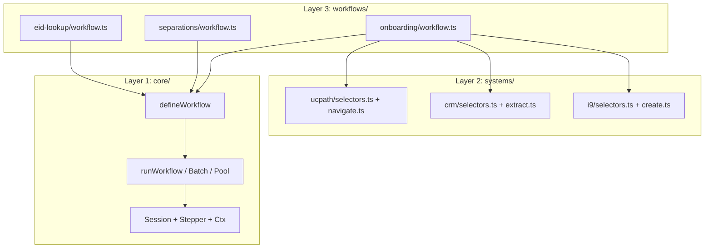

---

## 3. What is `Ctx`?

`Ctx` is the **only** object your handler receives at runtime. It's the "remote control" the kernel hands you so you can drive browsers, announce step transitions, update dashboard data, and retry flaky work — without ever touching the kernel internals directly.

### The shape (from `src/core/types.ts`)

```ts
export interface Ctx<TSteps extends readonly string[], TData> {
  page(id: string): Promise<Page>          // get a Playwright Page (auth-ready-aware)
  step<R>(name, fn: () => Promise<R>): Promise<R>  // wrap work in a named step
  markStep(name): void                      // announce-only step transition
  parallel(tasks): PromiseSettledResult<…>  // allSettled fan-out
  parallelAll(tasks): Awaited<…>            // Promise.all fan-out
  retry<R>(fn, opts?): Promise<R>           // linear-backoff retry
  updateData(patch): void                   // push fields into the dashboard row
  session: SessionHandle                    // escape hatch to raw Session
  log: typeof log                           // colored console + JSONL
  isBatch: boolean                          // are we inside a batch run?
  runId: string                             // unique per run
}
```

### Why it exists

Before the kernel, every workflow file looked like this:

```ts
// PRE-KERNEL (obsolete):
const { browser, context, page } = await launchBrowser({...})
await withTrackedWorkflow(name, id, {}, async (setStep, updateData) => {
  setStep("auth")
  await loginToUCPath(page)
  setStep("extraction")
  try { await extract(page) } catch (err) {
    await debugScreenshot(page, "extraction-failed")
    throw err
  }
  // ... 200 more lines of plumbing ...
})
```

Every workflow re-implemented: browser launch, tiling, auth retry, screenshot-on-failure, tracker emit, SIGINT handler, log context. **`Ctx` centralizes all of it.**

### What each method does

#### `ctx.page(id)` — get a Playwright Page, waiting for auth

```ts
const ucpath = await ctx.page("ucpath")
await ucpath.goto("/hr/...")
```

Under the hood: `ctx.page(id) === ctx.session.page(id)`. The `Session` holds a `Map<systemId, { page, browser, context }>` plus a `Map<systemId, Promise<void>>` of "auth-ready" promises. Calling `ctx.page("ucpath")` `await`s the ucpath ready promise before returning — so if you're on an `interleaved` auth chain and ucpath's Duo hasn't been approved yet, this call blocks until it is.

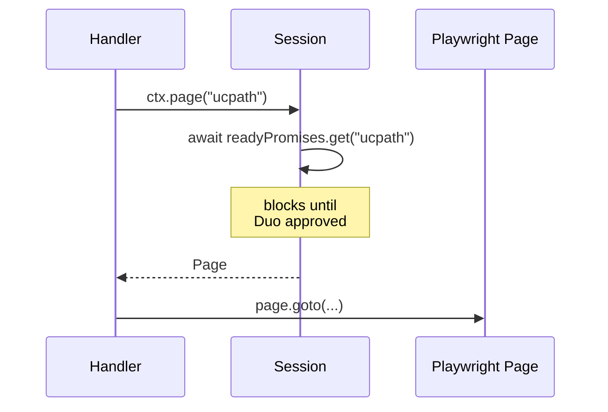

#### `ctx.step(name, fn)` — wrap work in a tracked step

```ts
await ctx.step("extraction", async () => {
  const data = await extractEmployee(page)
  ctx.updateData({ name: data.fullName })
})
```

What happens on the way in: `emitStep(name)` — writes a `running` entry to `.tracker/{workflow}-{date}.jsonl` so the dashboard row updates to show this step.

What happens on success: nothing extra, your value is returned.

What happens on **failure**:
1. `screenshotFn(name)` fires — screenshots **every open page** to `.screenshots/{workflow}-{itemId}-{step}-{systemId}-{ts}.png`
2. `emitFailed(name, classifiedError)` fires — writes a `failed` entry
3. The error is **re-thrown** so your handler's control flow continues to work as expected

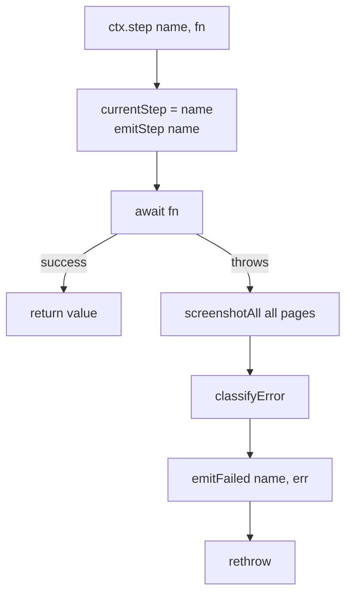

#### `ctx.markStep(name)` vs `ctx.step(name, fn)`

| | `step` | `markStep` |
|---|---|---|
| Wraps a body | ✅ | ❌ |
| Emits `running` | ✅ | ✅ |
| Catches errors | ✅ | ❌ |
| Screenshots on failure | ✅ | ❌ |

`markStep` is for phase transitions whose work is already managed elsewhere. Example: onboarding's `"crm-auth"` step is actually handled by `Session.launch` before the handler runs — but the dashboard still wants the row to say "currently in crm-auth." You call `ctx.markStep("crm-auth")` to announce it.

#### `ctx.parallel` vs `ctx.parallelAll`

```ts
// parallel — allSettled shape (each task may fail independently)
const r = await ctx.parallel({
  kronos: () => downloadKronos(),
  kuali: () => extractKuali(),
})
if (r.kronos.status === "fulfilled") { use(r.kronos.value) }

// parallelAll — Promise.all shape (first failure tears the rest down)
const { kronos, kuali } = await ctx.parallelAll({
  kronos: () => downloadKronos(),
  kuali: () => extractKuali(),
})
```

Used by separations for its 4-way Phase-1 fan-out (Old Kronos + New Kronos + UCPath Job Summary + Kuali timekeeper fill, all in parallel).

#### `ctx.retry(fn, opts)` — linear backoff

```ts
const data = await ctx.retry(
  () => extractEmployee(page),
  { attempts: 3, backoffMs: 1000, onAttempt: (n, err) => log.warn(`attempt ${n}: ${err}`) }
)
```

Attempt N waits `backoffMs * (N-1)` ms before retrying (default 0, 1s, 2s). On exhaustion, the **last error** is re-thrown verbatim.

#### `ctx.updateData(patch)` — push fields into the dashboard row

```ts
ctx.updateData({ emplId: "1234567", name: "Jane Doe", wage: "$25.00" })
```

This is what makes the dashboard's per-row detail grid populate. Every key you list in `detailFields` (on `defineWorkflow`) should be populated by at least one `ctx.updateData({ key: ... })` call — a runtime `log.warn` fires at workflow end if any declared field was never populated.

Data flow:

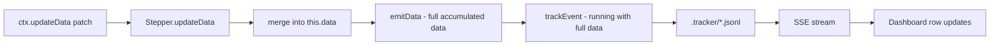

#### `ctx.session`, `ctx.log`, `ctx.isBatch`, `ctx.runId` — escape hatches

- `ctx.session.page(id)` — same as `ctx.page(id)`. Also has `newWindow(id)`/`closeWindow(id)` stubs (not implemented).
- `ctx.log.step/success/warn/error/waiting` — colored console + JSONL (via `AsyncLocalStorage`).
- `ctx.isBatch` — are we inside `runWorkflowBatch` / `runWorkflowPool`? Most handlers ignore it.
- `ctx.runId` — the unique UUID for this run. Useful when writing external state keyed by run.

### How `Ctx` is built

`Ctx` is not a class — it's a plain object. One factory builds it: `makeCtx` in `src/core/ctx.ts`. All three run modes (`runWorkflow`, `runWorkflowBatch`, `runWorkflowPool`) call `makeCtx` so the handler receives an identical surface in every mode.

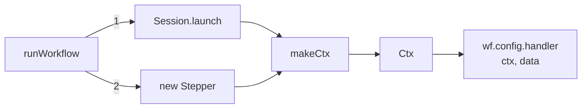

The body of `makeCtx` is just method delegation:

```ts
return {
  page: (id) => session.page(id),
  step: (name, fn) => stepper.step(name, fn),
  markStep: (name) => stepper.markStep(name),
  parallel: (tasks) => stepper.parallel(tasks),
  parallelAll: (tasks) => stepper.parallelAll(tasks),
  retry,                              // local linear-backoff impl
  updateData: (patch) => stepper.updateData(patch),
  session: { page: (id) => session.page(id), newWindow: throw, closeWindow: throw },
  log, isBatch, runId,
}
```

So **`Ctx` is a façade over two internal objects: `Session` (browsers + auth) and `Stepper` (state + emits).** Everything else is just `log` and run metadata.

---

## 4. The kernel internals

Three collaborating classes + one factory. Together they own the entire runtime of a workflow.

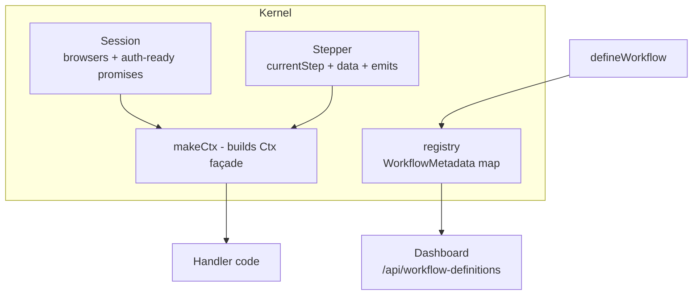

### `Session` — the browser + auth manager (`src/core/session.ts`)

**State:**

```ts
interface SessionState {
  systems: SystemConfig[]
  browsers: Map<string, { page, browser, context }>
  readyPromises: Map<string, Promise<void>>  // one per system, resolves when auth completes
}
```

**`Session.launch(systems, opts)` lifecycle:**

1. Launch all browsers in parallel (`Promise.all`).
2. Tile windows using real screen dims (first browser's `window.screen.availWidth`, via CDP `Browser.setWindowBounds`).
3. Run the auth chain (sequential or interleaved — see §6).
4. Return a `Session` with `browsers` map + `readyPromises` map populated.

**Key methods used by handlers (via `Ctx`):**

| Method | Purpose |
|---|---|
| `page(id)` | `await readyPromises.get(id)` then return `browsers.get(id).page` |
| `reset(id)` | `page.goto(system.resetUrl)` — clear state between batch items |
| `healthCheck(id)` | check if page is closed; placeholder for deeper probes |
| `screenshotAll(prefix)` | screenshot every open page (best-effort, never throws) |
| `killChrome()` | SIGINT force-kill path |
| `close()` | graceful close: each context + browser closed in turn |

### `Stepper` — the state/emits manager (`src/core/stepper.ts`)

**State:**

```ts
class Stepper {
  private data: Record<string, unknown> = {}
  private currentStep: string | null = null
  // constructor receives: emitStep, emitData, emitFailed, screenshotFn
}
```

**The `step(name, fn)` method in full:**

```ts
async step<R>(name: string, fn: () => Promise<R>): Promise<R> {
  this.currentStep = name
  this.opts.emitStep(name)                // dashboard row: "running → extraction"
  try {
    return await fn()
  } catch (err) {
    if (this.opts.screenshotFn) {
      try { await this.opts.screenshotFn(name) } catch {}  // best-effort
    }
    const classified = classifyError(err)    // "Target closed" → "Browser closed unexpectedly"
    this.opts.emitFailed(name, classified)   // dashboard row: "failed: extraction: Browser closed unexpectedly"
    throw err                                // rethrow — control flow preserved
  }
}
```

**`updateData` pattern:**

```ts
updateData(patch) {
  this.data = { ...this.data, ...patch }     // accumulate
  this.opts.emitData({ ...this.data })       // emit FULL merged data, not just patch
}
```

The emitted data is the *accumulated* dictionary, so every tracker entry carries the latest full snapshot of whatever `updateData` has been called with so far.

### `registry` — workflow metadata (`src/core/registry.ts`)

An in-memory `Map<name, WorkflowMetadata>` populated at module-load time when `defineWorkflow` runs. The dashboard reads it via `/api/workflow-definitions`.

```ts
interface WorkflowMetadata {
  name: string           // "onboarding"
  label: string          // "Onboarding"
  steps: readonly string[]
  systems: string[]      // ["crm", "ucpath", "i9"]
  detailFields: Array<{ key, label }>
}
```

**Why it matters:** the frontend has **zero workflow-specific code**. To add a new workflow's detail panel to the dashboard, you just add `detailFields` to your `defineWorkflow` call. The React app fetches `/api/workflow-definitions` and renders whatever's there.

### `defineWorkflow` — the declaration

```ts
export function defineWorkflow<TData, TSteps extends readonly string[]>(
  config: WorkflowConfig<TData, TSteps>,
): RegisteredWorkflow<TData, TSteps> {
  const metadata = {
    name: config.name,
    label: config.label ?? autoLabel(config.name),
    steps: config.steps,
    systems: config.systems.map((s) => s.id),
    detailFields: (config.detailFields ?? []).map(normalizeDetailField),
  }
  register(metadata)
  return { config, metadata }
}
```

That's it. It derives a `WorkflowMetadata`, shoves it in the registry, and returns a `RegisteredWorkflow`. No side effects beyond the registry write.

The **type parameters** are important: `TSteps extends readonly string[]` is a tuple type. When a workflow declares `steps: ["crm-auth", "extraction", ...] as const`, TypeScript narrows `ctx.step(name, ...)` / `ctx.markStep(name)` to accept only those exact strings — so typos become compile-time errors.

---

## 5. Run modes: single, sequential batch, pool

Three entry points. Same handler shape. Different orchestration.

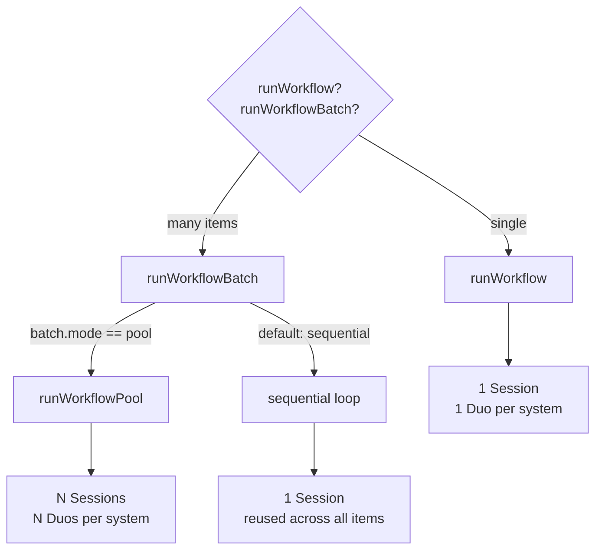

### Mode 1: `runWorkflow(wf, data)` — single item

```
1. schema.parse(data) — throws if validation fails
2. derive itemId from data (emplId → docId → email → UUID fallback)
3. withLogContext(name, itemId, async () => {
4.   withTrackedWorkflow(...) {
5.     Session.launch(systems)  — 1 Duo per system
6.     stepper = new Stepper({ emitStep, emitData, emitFailed, screenshotFn })
7.     ctx = makeCtx({ session, stepper, isBatch: false, runId })
8.     await handler(ctx, data)     ← your code runs here
9.     session.close()
10.   }
11. })
```

SIGINT handling is **owned by `withTrackedWorkflow`** in this mode — it writes a `failed` tracker entry + log entry synchronously via `appendFileSync` before `process.exit`.

### Mode 2: `runWorkflowBatch(wf, items)` sequential — one browser set, many items

```
1. Validate every item upfront (fail fast before launch)
2. Pre-generate { itemId, runId } per item
3. Optionally pre-emit `pending` rows for every item (if preEmitPending)
4. Session.launch(systems) ONCE — shared across all items
5. For each item i:
   a. If i > 0 and betweenItems hooks set: reset-browsers / navigate-home / health-check
   b. withLogContext → withTrackedWorkflow → new Stepper → makeCtx → handler(ctx, item)
   c. Catch per-item errors so the batch continues
6. session.close() when done
7. Return BatchResult { total, succeeded, failed, errors[] }
```

Used by: `separations` (4 systems, 1 Duo per system up front, then sequential doc processing).

### Mode 3: `runWorkflowPool(wf, items)` — N workers each with own Session

```
1. Validate every item upfront
2. Pre-generate { itemId, runId } per item, optionally pre-emit pending
3. Create queue = [...items]
4. Spawn min(poolSize, items.length) worker coroutines in parallel:
   Each worker:
     a. Session.launch(systems)  — this worker's own N Duos
     b. While queue.length > 0:
        - shift one item
        - withLogContext → withTrackedWorkflow → new Stepper → makeCtx → handler
        - catch per-item errors
     c. session.close()
5. await Promise.all(workers)
```

Used by: `onboarding` (parallel mode), `old-kronos-reports`.

**Important property:** pool-mode gives you N sessions = N×M Duo prompts (M systems per workflow). Onboarding with `poolSize: 4` = 4 workers × 2 Duos (CRM + UCPath, I9 has no Duo) = 8 Duo approvals at startup.

### Deriving `itemId`

`deriveItemId(data, fallback)` checks for a stable id on the input data, in priority order:

1. `data.emplId` (e.g. "1234567")
2. `data.docId` (e.g. Kuali doc number)
3. `data.email` (onboarding)
4. `fallback` (UUID)

Callers can override with `RunOpts.deriveItemId` — e.g. emergency-contact uses `p{NN}-{emplId}` because rosters can have duplicates per run.

### `preAssignedRunId` and `onPreEmitPending` — the "show the queue upfront" contract

In batch/pool modes, operators want the dashboard to show **all pending items** before any processing starts. That's what `preEmitPending` + `onPreEmitPending` do:

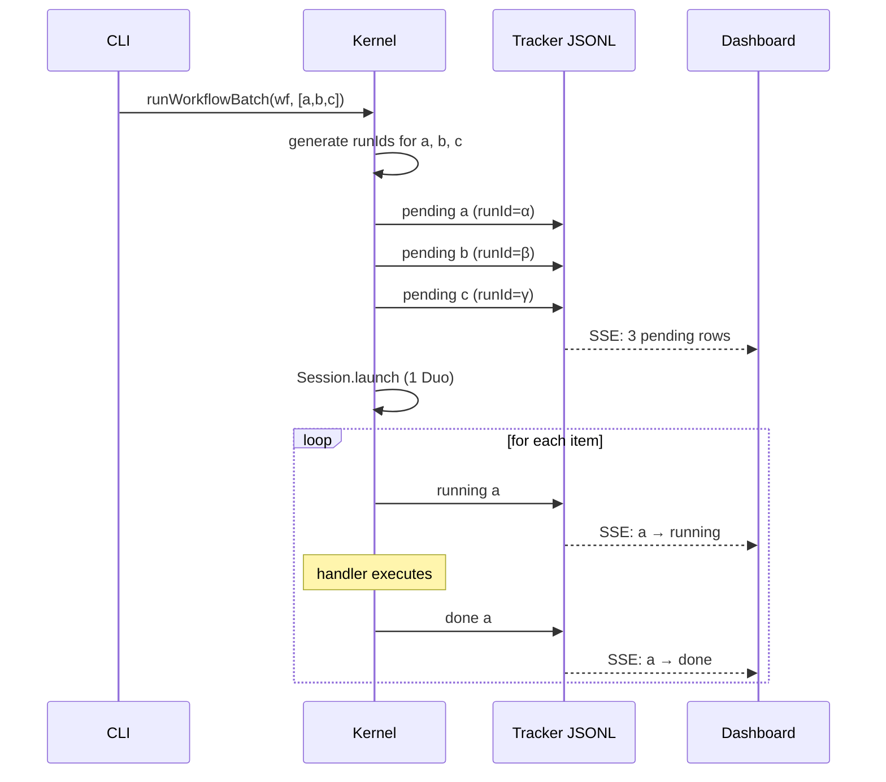

The `withTrackedWorkflow` wrapper checks `preAssignedRunId` — if set, it *skips* the duplicate `pending` emit it would normally write, because the caller already wrote one with the same runId.

---

## 6. Auth chains (sequential vs interleaved)

`Session.launch` supports two strategies for the "many Duos in a row" problem.

**Duo MFA is manual**: the operator approves each push on their phone. Two simultaneous Duo prompts would error, so the kernel serializes them.

### Sequential (`authChain: "sequential"`)

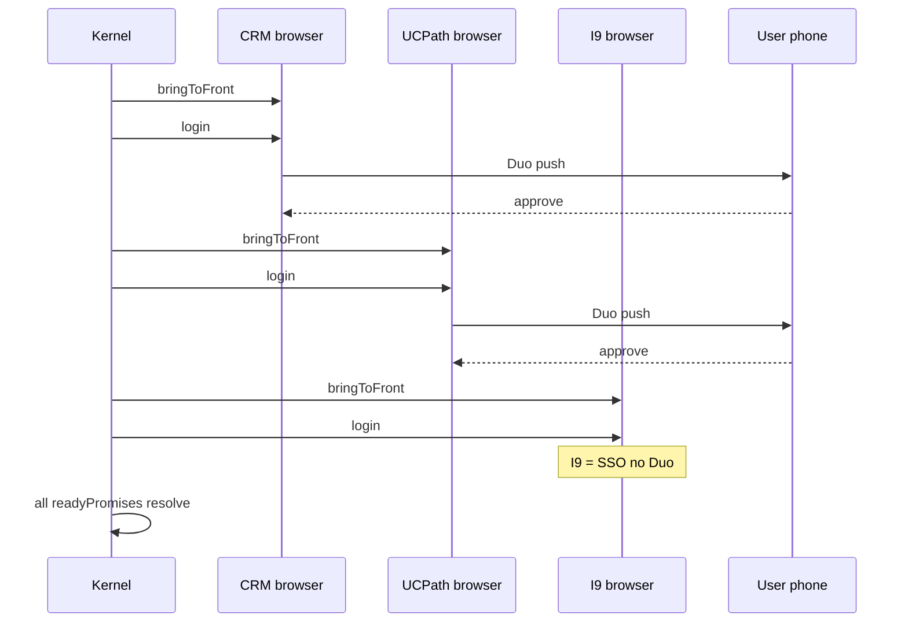

**Used when:** order matters (onboarding — CRM work comes before UCPath, and if it's a rehire we never need UCPath's Duo).

### Interleaved (`authChain: "interleaved"`)

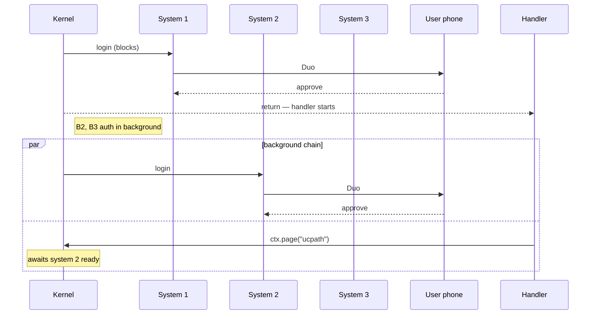

Only system[0] blocks `Session.launch` from returning. Systems 1..N are chained in the background via `.catch(() => {}).then(...)`. The `.catch(() => {})` is deliberate: one bad auth must not block the next system's auth — each chain link swallows its predecessor's failure.

**The implicit gate:** when your handler calls `ctx.page("system-b")`, it `await`s `readyPromises.get("system-b")` first. So if system-b isn't authed yet, `ctx.page("system-b")` blocks. This gives you "start work on system-a while system-b finishes authing" automatically.

**Used when:** multiple systems are independent and the handler can begin work on system-a while system-b is still authing (separations).

### Auth retry

Each `login` is wrapped in `loginWithRetry` — up to 3 attempts, with `page.goto('about:blank')` + 1s wait between tries. A flaky Duo timeout no longer crashes the workflow.

---

## 7. Tracker + Dashboard (observability)

Every kernel workflow emits two append-only JSONL streams:

```
.tracker/
├── onboarding-2026-04-18.jsonl          ← entries: pending/running/done/failed
├── onboarding-2026-04-18-logs.jsonl     ← logs: step/success/warn/error/waiting
├── separations-2026-04-18.jsonl
└── sessions.jsonl                        ← session-level events (browser launch, duo queue)
```

### Write path

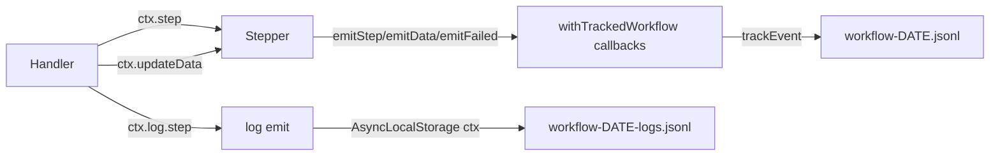

- `appendFileSync` is the write primitive. POSIX `write(2)` with `O_APPEND` is atomic per-line at the OS level — no mutex needed.
- Free-form log messages are PII-scrubbed at write time (`redactPii` replaces SSN/DOB patterns).

### Read path (dashboard)

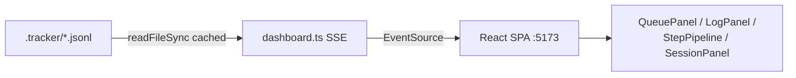

- **SSE server** (`src/tracker/dashboard.ts`) runs on port 3838.
- **Vite dev server** (`npm run dashboard`) runs on port 5173 and proxies `/api` + `/events` to 3838.
- Parsed JSONL is cached keyed by (path, mtime, size) — invalidated on any append.

### SSE enrichment

Each `/events` tick enriches tracker entries with:
- `firstLogTs`, `lastLogTs` — per (itemId, runId) earliest/latest log timestamps
- `lastLogMessage` — most recent log line
- `stepDurations` — per-step wall-clock ms (computed from step transitions)

So the frontend never has to fetch the full log stream to show "started 3m ago, current step took 45s."

### Dashboard panels (all observation-only as of 2026-04-18)

| Panel | Data source | Purpose |
|---|---|---|
| `QueuePanel` | tracker entries | live list of pending/running/done/failed |
| `EntryItem` + `StepPipeline` | `stepDurations` | per-item row with step timing chips |
| `LogPanel` | logs JSONL | log stream for a selected entry |
| `RunSelector` | `/api/runs` | switch between retries of the same itemId |
| `ScreenshotsPanel` / `ScreenshotCard` | `/api/screenshots` | dedicated tab: grid of captured screenshots per entry (superseded the inline `FailureDrillDown` on 2026-04-21) |
| `SessionPanel` | `sessions.jsonl` | live browser/auth/Duo-queue state |
| `SelectorWarningsPanel` | logs (filtered by "selector fallback triggered") | surface stale selectors |
| `SearchBar` | `/api/search` | cross-workflow search across historical JSONL |

### The "⚡ RUN" drawer is gone

The dashboard used to let you launch workflows from the browser. **Removed 2026-04-18.** The replacement launcher is deliberately TBD — workflows launch from npm scripts or whatever lands later. `TopBar.rightSlot` is preserved for future mounting.

---

## 8. Reliability primitives: idempotency & step-cache

Two kernel-level helpers solve complementary "don't redo work" problems.

### `idempotency.ts` — "don't double-submit transactional work"

Problem: a workflow submits a Smart HR transaction to UCPath, then crashes before the tracker can write `done`. Re-running creates a **duplicate transaction**.

Solution: before submitting, hash a stable key and check if the same key succeeded recently.

```ts
const key = hashKey({ workflow: "onboarding", emplId, ssn, effectiveDate })
if (await hasRecentlySucceeded(key, { withinDays: 14 })) {
  log.warn("Idempotency hit — skipping duplicate submit")
  return { status: "Skipped (Duplicate)" }
}
// ... submit transaction ...
await recordSuccess(key, transactionId, "onboarding")
```

Storage: `.tracker/idempotency.jsonl`, one success record per line. Sorted-keys JSON so field order doesn't affect the hash.

Used by: `onboarding` (transaction step), `work-study`.

### `step-cache.ts` — "don't re-do expensive read-only work" (NEW 2026-04-18)

Problem: onboarding's `extraction` step scrapes the CRM record (~1–2 min). If the later `transaction` step fails, re-running pointlessly re-scrapes — the CRM data hasn't changed.

Solution: cache step outputs, keyed by (workflow, itemId, stepName), with a short TTL.

```ts
// At step start:
const cached = stepCacheGet<EmployeeData>(
  "onboarding", email, "extraction",
  { withinHours: 2 }
)
if (cached) {
  data = cached
  ctx.updateData(data)
  return  // skip the expensive scrape
}

// Scrape normally:
data = await extractRawFields(page)

// At step end:
try { stepCacheSet("onboarding", email, "extraction", data) }
catch {} // write failures mustn't fail the step
```

```
.tracker/step-cache/
└── onboarding-jane@ucsd.edu/
    ├── extraction.json      ← { workflow, itemId, stepName, ts, value: EmployeeData }
    └── pdf-download.json
```

- **Default TTL on read: 2h** (opt in via `withinHours`; `0` = no TTL check).
- **Default prune: 7 days** (`pruneOldStepCache(168)`).
- **Atomic write** via rename dance — partial writes never get read.
- **Path safety**: all three segments (workflow, itemId, stepName) sanitized — `/`, `\`, `..`, NUL, ASCII ctrl chars rejected on write/clear.

**Deliberately scoped:** this is a *primitive*, not a full kernel-level "resume from last successful step." A full resume would require handlers to thread state through ctx instead of local closures (onboarding mutates `let data: EmployeeData | null` inside steps). The primitive delivers the actual user-visible savings (~2–3 min on retry) without the handler rewrite.

### How they compose

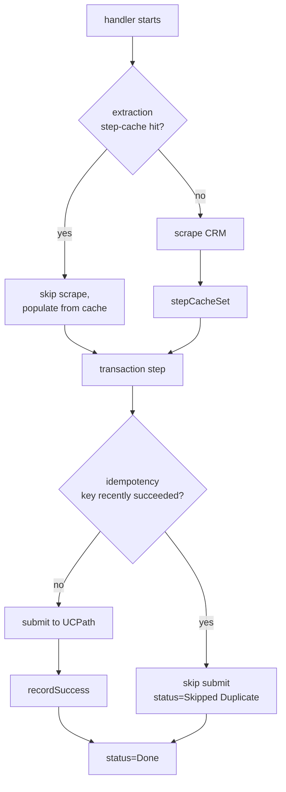

---

## 9. Systems + Selector Intelligence

Each folder under `src/systems/` is a Playwright driver for one external system. They all share a conventional layout.

```
src/systems/ucpath/
├── selectors.ts           ← every page.locator(...) lives here
├── navigate.ts            ← helpers: getContentFrame, dismissModalMask, etc.
├── login.ts               ← login flow (Duo-aware)
├── smartHR.ts             ← Smart HR transaction driver
├── jobSummary.ts          ← Job Summary extract
├── personSearch.ts        ← Person Search by name/SSN
├── SELECTORS.md           ← auto-generated catalog (committed, drift-gated)
├── LESSONS.md             ← append-only failure notes (format-gated)
├── common-intents.txt     ← hand-curated intents for fuzzy search
└── CLAUDE.md              ← per-system doc with the "map a new selector" loop
```

### The selector registry contract

Every Playwright selector lives in `selectors.ts` as a **function** returning `Locator`/`FrameLocator`:

```ts
// src/systems/ucpath/selectors.ts
export const smartHR = {
  /**
   * Save & Submit button on Smart HR transaction page.
   * Often arrives disabled — force-click to bypass.
   * @tags smart-hr, save, submit, button
   */
  // verified 2026-04-16
  saveSubmitButton: (frame: FrameLocator) =>
    frame.getByRole("button", { name: "Save and Submit" })
      .or(frame.locator("input[value='Save']"))  // fallback
      .or(frame.locator("#SAVE_PB")),             // 2nd fallback
  // ...
}
```

**Three conventions enforced by unit tests:**

1. **No inline selectors outside `selectors.ts`** — `tests/unit/systems/inline-selectors.test.ts` rejects `page.locator(...)` calls in any other `src/systems/**/*.ts` file. `row.locator("td").nth(1)` rooted in a registry selector is allowed via `// allow-inline-selector` EOL comment.
2. **Drift gate** — `tests/unit/scripts/selectors-catalog.test.ts` regenerates `SELECTORS.md` and fails if it doesn't match the committed version.
3. **Lesson format gate** — every `LESSONS.md` entry has `**Tried:**`, `**Failed because:**`, `**Fix:**`, `**Tags:**`.

### `safeClick` / `safeFill` — telemetry on fallback matches

```ts
await safeClick(smartHR.saveSubmitButton(frame), "save-submit-button")
```

If the primary selector misses but a `.or(...)` fallback matches, `safeClick` emits `log.warn("selector fallback triggered: save-submit-button")`. The dashboard's `SelectorWarningsPanel` aggregates those warns across N days — so when a fallback starts matching regularly, you know the primary selector is stale before it fully breaks.

### The "before you map a new selector" loop

Enforced in every per-system CLAUDE.md:

```
1. npm run selector:search "<your intent>"
   → does a matching selector exist in any system? If yes, USE IT.
2. Check LESSONS.md for related failure modes
3. Map a new selector via playwright-cli (opens a headed browser, dumps accessibility tree with refs)
4. Add JSDoc + @tags + // verified <today> in selectors.ts
5. npm run selectors:catalog to regen SELECTORS.md
6. If you hit a non-obvious failure — append a lesson to LESSONS.md
```

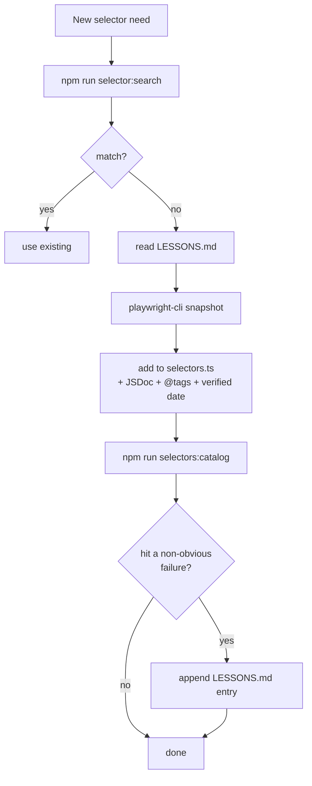

The fuzzy search is a pure in-repo scorer (no Fuse.js, no embeddings, no new deps).

---

## 10. End-to-end: one onboarding, step by step

Let's trace `npm run start-onboarding jane@ucsd.edu` from CLI to completed transaction.

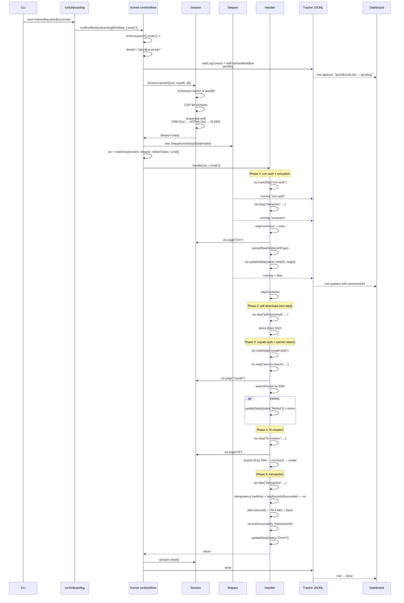

**Total Duos:** 2 (CRM + UCPath). I9 uses UCSD SSO without 2FA.

**What's special about step 1's `stepCacheGet`:** if this onboarding was run within the last 2h and the `extraction` succeeded, the whole CRM scrape phase is replaced with a single `readFileSync` — ~2 min saved on retry-after-failure.

**What's special about step 5's idempotency check:** if the workflow crashed mid-submit last run, but the transaction actually went through on UCPath's side, the hash key catches it — we skip re-submitting and return `status: "Skipped (Duplicate)"`.

---

## 11. Glossary

| Term | Meaning |
|---|---|
| **Kernel** | Code under `src/core/`. Owns browser lifecycle, auth, tracker wrapping, ctx construction. |
| **Handler** | The `async (ctx, data) => {...}` function on `WorkflowConfig.handler`. Your business logic. |
| **`Ctx`** | The façade object the handler receives. Exposes `page/step/markStep/parallel/retry/updateData/…`. |
| **`Session`** | Manages browsers + auth-ready promises, one per system. Created by `Session.launch`. |
| **`Stepper`** | Holds current step + accumulated data; wraps step bodies with screenshot-on-failure emit. |
| **`defineWorkflow`** | Declaration helper. Registers metadata + returns `RegisteredWorkflow` the run fns consume. |
| **`RegisteredWorkflow`** | `{ config, metadata }` — the handle run fns receive. |
| **Run mode** | `runWorkflow` (single) / `runWorkflowBatch` (sequential many) / `runWorkflowPool` (parallel many). |
| **Auth chain** | `sequential` = Duo one-at-a-time blocking; `interleaved` = first blocks, rest chain in background. |
| **Duo** | UCSD's MFA push notification. Manual — operator approves on phone. Two concurrent pushes would error. |
| **Tracker** | Append-only JSONL under `.tracker/` written by the tracker wrapper. Dashboard's source of truth. |
| **SSE** | Server-Sent Events. How the dashboard streams live tracker updates to React. |
| **`runId`** | Unique UUID per workflow run. Appears on every tracker entry + log line. |
| **`itemId`** | Stable per-subject id (emplId/docId/email/UUID). Groups retries of the same subject across runs. |
| **`WF_CONFIG`** | **Obsolete.** Pre-kernel frontend workflow metadata. Now registry-driven. |
| **`defineDashboardMetadata`** | Legacy registry affordance for non-kernel workflows. **No current callers.** |
| **`withTrackedWorkflow`** | Tracker lifecycle wrapper. Kernel-internal — handlers never call it directly. |
| **Idempotency key** | SHA-256 hash of transactional fields. Prevents duplicate submits on crash-retry. |
| **Step-cache** | Per-step output cache under `.tracker/step-cache/`. Prevents re-doing expensive read-only work. |
| **Selector intelligence** | `SELECTORS.md` + `LESSONS.md` + `common-intents.txt` + `selector:search` per system. |
| **`safeClick`/`safeFill`** | Wrappers that log `selector fallback triggered` when `.or(...)` fallbacks match. |
| **`playwright-cli`** | Standalone tool for mapping selectors. `open --headed` + `snapshot` dumps accessibility tree with refs. |

---

## Further reading (in this repo)

- [`CLAUDE.md`](../CLAUDE.md) — root. Architecture overview + kernel primer + writing-a-new-workflow + gotchas.
- [`src/core/CLAUDE.md`](../src/core/CLAUDE.md) — kernel internals.
- [`src/tracker/CLAUDE.md`](../src/tracker/CLAUDE.md) — tracker + dashboard backend.
- [`src/dashboard/CLAUDE.md`](../src/dashboard/CLAUDE.md) — frontend conventions.
- [`src/workflows/*/CLAUDE.md`](../src/workflows/) — per-workflow shape + lessons.
- [`src/systems/*/{LESSONS,SELECTORS}.md`](../src/systems/) — per-system failure notes + catalog.
- [`docs/handoff-2026-04-18.md`](./handoff-2026-04-18.md) — pending-task punch list.
