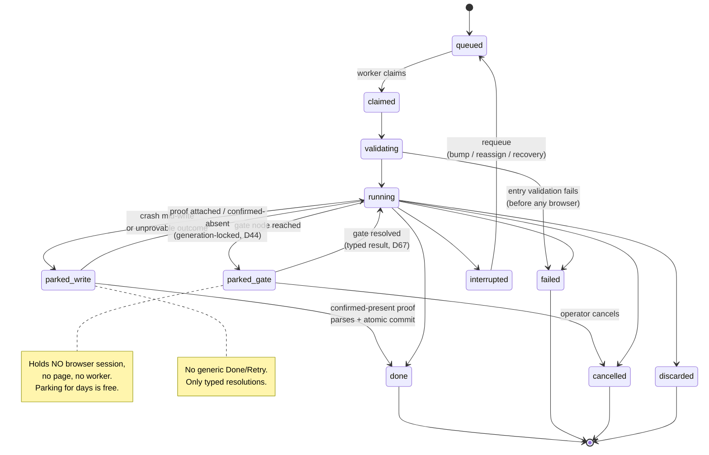

# 02 — Workflow Model: Descriptor SSOT · Constant Input · Run-State Machine · Start-Anywhere Resume

Status: **revised 2026-07-22 after the whole-plan/legacy-code review; amended 2026-07-26 (Round 8)
and 2026-07-31 (Round 10 — native-only envelope and global cutover boundary).**
The abandoned Step-0 spike and skeleton were deleted. The expanded graph, typed delegation/control
seams, and three-effect task API require a new real-scale type proof before code lands in
`temp_src/`. Round-8 amendments: §4 records the two graph-legality rules the identity-approval gate
(doc 09 §14, D77) imposes, and the descriptor's per-run stamp now includes the **app version**
alongside the workflow version + fingerprint (D80 archive-on-bump, owned by doc 03 §10.2).

## Ownership (D1)

| This doc OWNS | Imported from siblings (referenced, never redefined) |
|---|---|
| The ONE workflow builder API — read steps, page-scoped transactions, output-dependent branches, parallel fork/join, typed child runs/delegation policy, gates, decoration/instrumentation, auth | Doc 01: task contracts, three effects, stores, sessions, freshness metadata, subject declarations, decoration |
| Descriptor shape (incl. verdict mappings, gate declarations, derived session union) | Doc 03: native span/event **wire** schema incl. `gate.opened`/`gate.resolved`, notes stream, isolated rebuild storage, SQLite projection, SSE wire shapes, completion (fan-out/approval) union |
| `RunEnvelope` (incl. `dryRun` — D6) | |
| Run-state machine incl. gate nodes and parks (D5) | |
| Checkpoint/resume model: store, freshness (D8), scope (D9), task-authoring rule | |
| Span-id path grammar + attempt semantics (what the engine brackets) | |
| Workflow terminal result schema and child-run result typing | Doc 03: command/action/enqueue policy semantics and durable dependency/command storage |
| | Doc 12: semantic UI registry, scenarios, evidence receipt, explorer/editor projections |

---

## 0. Grounding — what exists today, why it hurts

- `defineWorkflow` (`src/core/kernel/workflow.ts`) is the closest thing to a descriptor, but it
  imports Playwright transitively, so it never ships to the browser. The client re-declares
  metadata by hand: `formatStepName` string-switches (`dashboard/components/shared/types.ts:405`),
  `pipelineStepLabel`'s run-conditional override (`StepPipeline.tsx:127`),
  `workflow-icons.ts`, `INSTANCE_LABELS` (`tracker/session-events.ts:395`).
- ~10 parallel registries keyed by the same string names: `WORKFLOW_LOADERS`,
  `DASHBOARD_INPUT_RUN_WORKFLOWS` + `DASHBOARD_UPLOAD_RUN_WORKFLOWS`, `INPUT_RUN_REGISTRY`,
  `RUN_MODAL_REGISTRY`, `WORKFLOW_ICONS`, `INSTANCE_LABELS` (+ `LEGACY_INSTANCE_LABELS`),
  `E2E stub map`, `queue-row-status-index.ts`, the `:stop` npm scripts. Two have coverage guards
  (`instance-labels-coverage`, `queue-row-kind-coverage`); the rest fail at runtime.
- Timing is inferred, not recorded: `computeStepDurations` (`tracker/dashboard/run-timelines.ts`)
  reconstructs step durations from row-status transitions with anchor heuristics. `step_change`
  session events exist *only* to carry the live step.
- Long waits are faked as steps: a delegated OCR run parks at `running/awaiting-approval` via
  sentinel statuses; oath-upload hand-rolls a wait-signatures polling step; nothing releases the
  browser while a run waits days for an operator.
- Resume exists only as ad-hoc channels: retry replays `tasks.original_input_json`; Edit Data
  rides a `prefilledData` side channel that `splitPrefilled` strips before schema parse; a step
  that needs an upstream value re-reads it from stringified tracker `data`.

The new model replaces all of this with the **descriptor** (one client-safe declaration per
workflow), the **run-state machine** (gates as first-class parks), and the **checkpointed run
context** (typed data flow between tasks). Time lives in doc 03's span stream.

---

## 1. The workflow descriptor

### 1.1 Shape

One module per workflow: `temp_src/workflows/<id>/descriptor.ts`. It imports **only** zod,
`temp_src/domain/**` (which includes the task **contracts** at `temp_src/domain/contracts/<system>/`
— D3's client-safe half), and type-only imports — never a store, never Playwright. Enforced
mechanically (§1.4). "Plain data" means: serializable fields plus pure functions (zod schemas,
input parsers, bind mappings) — the same class of object that already crosses the bundle boundary
in `queue-row-status-index.ts`.

```ts
// temp_src/domain/workflow/descriptor.ts  (client-safe)
import { z } from "zod/v4";
import type {
  AnyCommitContract,
  AnyPrepareContract,
  AnyReadContract,
  AnyTaskContract,
  JsonValue,
} from "../contracts/types.js";   // doc 01 / D3

export interface WorkflowRef<
  InputSchema extends z.ZodType,
  ResultSchema extends z.ZodType,
> {
  readonly id: WorkflowId;
  readonly input: InputSchema;
  /** The schema-valid terminal value a successful child exposes to its parent. */
  readonly result: ResultSchema;
}
export type AnyWorkflowRef = WorkflowRef<z.ZodType, z.ZodType>;

export interface RuntimeScope {
  readonly input: JsonValue;
  readonly outputs: Readonly<Record<string, JsonValue>>;
}

export interface WorkflowGateSource<
  Target extends AnyWorkflowRef,
  EventSchema extends z.ZodType,
> {
  kind: "workflow";
  workflow: Target;
  event: EventSchema;
  correlationKey: string;
  terminal?: readonly string[];
}
export interface ExternalGateSource<EventSchema extends z.ZodType> {
  kind: "external";
  sourceId: string;
  event: EventSchema;
  correlationKey: string;
}
/** Compile-time icon union; the dashboard's icon map is Record<IconName, LucideIcon>
 *  (exhaustive), so a new name without a component FAILS TO COMPILE. */
export const ICON_NAMES = ["Search", "Users", "UserMinus", "FileScan", /* … */] as const;
export type IconName = (typeof ICON_NAMES)[number];

export type GraphNodeKind = "task" | "transaction" | "branch" | "parallel" | "child-run" | "gate";
export interface GraphNodeBase {
  kind: GraphNodeKind;
  id: string;
  dependsOn: readonly string[];
}

/** Runtime discriminant union. The builder retains the descriptor's exact node tuple;
 * this alias is only for exhaustive runtime switching and never feeds type inference. */
export type RuntimeFlowNode =
  | TaskStepNode<RuntimeScope, AnyReadContract>
  | TransactionNode<RuntimeScope, AnyPrepareContract, AnyCommitContract>
  | BranchNode<RuntimeScope, Readonly<Record<string, readonly string[]>>>
  | ParallelNode
  | ChildRunNode<RuntimeScope, AnyWorkflowRef>
  | AnyGateNode;

export interface TaskStepNode<TCtx, C extends AnyReadContract> {
  kind: "task";
  /** Workflow-local step id — the span/label/resume key. Unique per workflow. */
  id: string;
  /** Display label. Defaults to the contract's `title` (D16 — see §1.5 precedence). */
  label?: string;
  uses: C;                             // the CONTRACT object (doc 01 / D3), imported by value
  /** Bind the task's input from workflow input + upstream outputs. Returns z.input<C["input"]>;
   *  the impl's run receives z.output<C["input"]> (doc 01 / D15). Must be PURE. */
  bind: (ctx: TCtx) => z.input<C["input"]>;
  /** Declared graph dependencies; freshness and scheduling use these static edges. */
  dependsOn: readonly string[];
  /** Optional condition may read workflow input AND declared upstream outputs. */
  when?: (scope: TCtx) => boolean;
  /** Resume policy — REQUIRED, no default (§5.3). */
  replay: "checkpoint" | "always-rerun";
  // Prepare and commit contracts are illegal here: they appear only inside one transaction node.
  // NOTE: no `system` field — the system is the contract id's `<system>/` prefix.
}

export interface TransactionNode<TCtx, P extends AnyPrepareContract, C extends AnyCommitContract> {
  kind: "transaction";
  id: string;
  label?: string;
  dependsOn: readonly string[];
  prepare: { uses: P; bind: (scope: TCtx) => z.input<P["input"]> };
  /** Bound and parsed before the live probe or browser launch. It may read only workflow input and
   * declared upstream outputs—never the ephemeral prepare output—so the durable key is stable before
   * any page mutation. The parsed value is later passed unchanged to commit.run on the staged page. */
  commit: { uses: C; bind: (scope: TCtx) => z.input<C["input"]> };
  /** Same context/page lease from prepare start through commit verification; the prewrite probe uses
   * an ordinary read lease before this transaction lease is acquired. */
  leaseScope: "transaction";
  dryRun: "stop-after-prepare" | "unsupported";
  probePolicy: "always" | "retries-and-recovery-only";
  /** If probe→fence exceeds this migration-justified budget, discard staged page state and restart
   * at the probe. A stale preflight may never proceed to a click. */
  probeToFenceMaxMs: number;
  retryBeforeFence?: RetryPolicy; // restarts preflight+prepare on a fresh/reset lease; never commit
}

/** Kernel-owned transaction result. Downstream nodes cannot confuse "this run clicked" with
 * "the permanent key was already satisfied"; both still carry the contract's full typed output. */
export type TransactionOutcome<C extends AnyCommitContract> =
  | { disposition: "committed";
      proofSource: "normal-output" | "recovery-probe" | "operator-attestation";
      output: z.output<C["output"]>; proof: ProofOf<C> }
  | { disposition: "already-present";
      proofSource: "durable-intent" | "live-probe";
      output: z.output<C["output"]>; proof: ProofOf<C> };

export interface BranchNode<
  TCtx,
  Cases extends Readonly<Record<string, readonly string[]>>,
> {
  kind: "branch"; id: string; dependsOn: readonly string[];
  choose: (scope: TCtx) => keyof Cases & string;
  cases: Cases; // node ids, all targets validated
}

export interface ParallelNode {
  kind: "parallel"; id: string; dependsOn: readonly string[];
  branches: readonly { id: string; nodes: readonly string[] }[];
  join: "all" | "all-settled"; // result type follows the selected policy
}

export type ChildFailurePolicy = "fail-parent" | "block-parent" | "allow-partial";
export type ChildCancelPolicy = "cascade" | "independent";
export type ChildRetryPolicy = "resume-parent" | "manual-parent-resume";
export type ChildVisibility = "inline" | "linked" | "hidden-unless-failed";

export type ChildRunOutcome<Target extends AnyWorkflowRef> =
  | { state: "done"; runId: RunId; itemId: ItemId; output: z.output<Target["result"]> }
  | { state: "failed"; runId: RunId; itemId: ItemId; failureId: FailureId }
  | { state: "cancelled"; runId: RunId; itemId: ItemId;
      reason: string; cancelledBy: "operator" | "parent" | "kernel" }
  | { state: "blocked"; runId: RunId; itemId: ItemId;
      failureId: FailureId; reason: string };

export interface DelegationPolicy {
  onChildFailed: ChildFailurePolicy;
  cascadeCancel: ChildCancelPolicy;
  afterChildRetry: ChildRetryPolicy;
  visibility: ChildVisibility;
}

export type ChildRunNode<TCtx, Target extends AnyWorkflowRef> =
  | { kind: "child-run"; id: string; edgeId: DelegationEdgeId;
      dependsOn: readonly string[]; target: Target; cardinality: "one";
      bind: (scope: TCtx) => z.input<Target["input"]>;
      deriveChildItemId: (input: z.output<Target["input"]>) => ItemId;
      await: "terminal"; join: "one"; policy: DelegationPolicy }
  | { kind: "child-run"; id: string; edgeId: DelegationEdgeId;
      dependsOn: readonly string[]; target: Target; cardinality: "many";
      bind: (scope: TCtx) => readonly z.input<Target["input"]>[];
      deriveChildItemId: (input: z.output<Target["input"]>) => ItemId;
      await: "terminal"; join: "all" | "all-settled"; policy: DelegationPolicy }
  | { kind: "child-run"; id: string; edgeId: DelegationEdgeId;
      dependsOn: readonly string[]; target: Target; cardinality: "one" | "many";
      bind: (scope: TCtx) => z.input<Target["input"]> | readonly z.input<Target["input"]>[];
      deriveChildItemId: (input: z.output<Target["input"]>) => ItemId;
      await: "none"; join: "none"; policy: DelegationPolicy };

export interface OperatorGateNode<ResultSchema extends z.ZodType> {
  kind: "gate";
  id: string;                          // e.g. "approval" — doc 03's gate.opened/resolved key
  dependsOn: readonly string[];
  label: string;
  statusKey?: string;                  // e.g. "needsReview" — doc 03's status projection
  resolvedBy: "operator";
  result: ResultSchema;
  subscribes?: never;
  resolve?: never;
}
export interface ChildrenGateNode<
  Source extends WorkflowGateSource<AnyWorkflowRef, z.ZodType>,
  ResultSchema extends z.ZodType,
> {
  kind: "gate";
  id: string;
  dependsOn: readonly string[];
  label: string;
  statusKey?: string;
  resolvedBy: "children-terminal";
  subscribes: Source;
  result: ResultSchema;
  resolve: (event: z.output<Source["event"]>) => z.input<ResultSchema>;
}
export interface ExternalGateNode<
  Source extends ExternalGateSource<z.ZodType>,
  ResultSchema extends z.ZodType,
> {
  kind: "gate";
  id: string;
  dependsOn: readonly string[];
  label: string;
  statusKey?: string;
  resolvedBy: "external";
  subscribes: Source;
  result: ResultSchema;
  resolve: (event: z.output<Source["event"]>) => z.input<ResultSchema>;
}
export type AnyGateNode =
  | OperatorGateNode<z.ZodType>
  | ChildrenGateNode<WorkflowGateSource<AnyWorkflowRef, z.ZodType>, z.ZodType>
  | ExternalGateNode<ExternalGateSource<z.ZodType>, z.ZodType>;

export interface WorkflowDescriptor<
  InputSchema extends z.ZodType,
  ResultSchema extends z.ZodType,
  Nodes extends readonly GraphNodeBase[],
  Completion extends CompletionProgram | undefined = undefined,
  S extends Record<string, AnyNodeEntry> = Record<never, never>,
  D extends readonly (keyof S & string)[] = readonly [],
> {
  id: WorkflowId;                      // "person-lookup"
  /** Bumped for semantic graph/bind/presentation contract changes. */
  version: number;
  /** Build-derived from version + graph + schemas + projection fields; stamped on every run. */
  contractFingerprint: Fingerprint;
  code: string;                        // "pl" — 2-char trace prefix, unique (guarded)
  label: string;                       // "Person Lookup"
  sessionLabel?: string;               // terminal-drawer label when ≠ label (separations → "Kuali")
  icon: IconName;
  category: WorkflowCategory;          // union, not free string
  input: InputSchema;                  // the workflow-constant input schema (§2)
  /** Strict validation-only schema for the canonical z.output snapshot (D62). It has no defaults,
   * coercions, or transforms; every DB/resume read uses it instead of re-running ingress parsing. */
  canonicalInput: CanonicalInputSchema<InputSchema>;
  /** Successful terminal result exposed to typed parent delegations. The exact `dependsOn` tuple
   * narrows `derive` to those terminal outputs; do not annotate away the builder-inferred S/D. */
  result: WorkflowResultSpec<ResultSchema, InputSchema, S, D>;
  inputSubject: InputSubject | ((input: z.output<InputSchema>) => InputSubject); // wire: "by-input"
  surface: { shape: RowShape } | { resolveShape: "by-input" };     // doc 03's field name
  nodes: Nodes;                        // exact tuple — built via the typed DAG builder (§3)
  /** PROJECTIONS (derived at build(), never hand-written):
   *  steps:   task nodes → one entry; transactions → prepare+commit child entries (doc 03 consumes)
   *  gates:   nodes.filter(kind==="gate") → { id, label, statusKey? }[]          (doc 03 consumes)
   *  systems: union of task contracts' browser-system prefixes only (D2/D15—the hand `systems:`
   *           list is DELETED; service and `workflow:<id>` headless stores contribute none)
   *  requires: union of task contracts' declared SecretName requirements (doc 11) */
  surfaces: {
    /** Typed-text start (InputRunPanel). Absent ⇒ no input-run affordance. */
    inputRun?: { placeholder: string; parser: InputParserSpec;
                 supportsDryRun?: boolean; emptyOpensUpload?: boolean };
    /** File-upload start (RunModal). Absent ⇒ no upload-run affordance. */
    uploadRun?: { title: TextTemplate; fields: readonly UploadFieldSpec[];
                  accepts: readonly FileAcceptSpec[]; successMessage: TextTemplate };
  };
  /** Verdict mappings — a closed tuple, not a free string map. Keys are unique/guarded and
   * SpanEnded may emit only this descriptor-derived union. */
  verdicts?: readonly VerdictDefinition[];
  /** Completion (fan-out/approval) contract — SHAPE OWNED BY DOC 03 §4; referenced here only. */
  completion?: Completion; // exact factory-inferred program; never annotate as the broad union
  capabilities?: WorkflowCapabilities;  // doc 03 §3 (review/editData/delegation display rules)
  details: readonly DetailProjectionSpec<Nodes>[];
  /** Semantics/types owned by doc 03: one closed enqueue/action command protocol for every workflow. */
  enqueue: EnqueuePolicy;
  actions: WorkflowActionPolicy;
  presets?: readonly InputPreset<z.input<InputSchema>>[];
  identity: {
    matchKey: MatchKeySpec<z.output<InputSchema>>;
    deriveItemId: ItemIdSpec<z.output<InputSchema>>;
  };
  presentation: WorkflowPresentationSpec<z.output<InputSchema>>;
  coordinator?: CoordinatorPolicy;
  completionConsumes?: readonly CompletionConsumptionSpec[];
  /** Registered behavioral coverage; task scenarios are unioned automatically, while graph-level
   * branch/delegation/gate/control cases are declared here. */
  scenarios: readonly [ScenarioId, ...ScenarioId[]];
  /** Typed node-output → durable local-sink projections (docs 03/06). The builder validates each
   * source path and stable key against the exact node output; no task performs a mutable append. */
  artifactProjections?: readonly DurableArtifactProjectionSpec[];
}
```

`InputParserSpec`, `UploadFieldSpec`, `FileAcceptSpec`, and `TextTemplate` are closed, serializable
domain unions with exhaustive generic server/client interpreters. They contain no workflow callback,
endpoint function, or component reference. A genuinely new run-surface behavior extends that union
and both exhaustive interpreters; it never creates a workflow-id switch or side registry. Server-only
functions (`identity`, per-run presentation resolution, completion derives) stay in the validated
descriptor and project only their resolved policy/data to the client.

**Fingerprint construction is build-manifest based, never `Function.toString()`.** Codegen hashes
canonical relative-path + file-content tuples for the descriptor source and its bundle-safe
transitive contract/domain dependency closure, plus canonical generated schema/projection JSON and
the locked TypeScript/zod toolchain version. Each bound task impl gets the same treatment over its
server-side import closure. Absolute paths, mtimes, build timestamps, object iteration order, and
minified function text are excluded. The checked-in manifest maps workflow/task ids to hashes;
build/CI regenerates and fails on diff. Thus a bind/identity/derive logic edit changes semantic
compatibility even when its output zod schema does not, while identical source in another checkout
gets the same hash.

### 1.2 The bundle crossing

```
temp_src/workflows/person-lookup/
├── descriptor.ts     # bundle-safe: zod + domain (incl. contracts) only
└── module.ts         # server composition value: descriptor + lazy store loaders
```

There is no per-workflow `handler.ts`: step impls live in the **stores** (doc 01 §3; D3 —
`defineTask(contract, impl)` in `temp_src/stores/<system>/tasks/` is the only impl registry). The
descriptor references contract *objects*, so descriptor↔contract renames fail to compile at the
import site. Descriptor↔impl pairing is runtime: the engine resolves each step's contract id in
the store index at daemon boot and **fails loud on any unresolved contract** — plus the §1.4
coverage guard pins it at CI.

```ts
// temp_src/core/workflow-registry.ts — composition root; lower layers never import workflows
import { personLookupModule } from "../workflows/person-lookup/module.js";
import { verifyModule } from "../workflows/verify/module.js";

// The one unavoidable static module tuple. A workflow appears ONCE; every registry/projection below
// derives from it, so adding a workflow is one import+tuple entry rather than synchronized lists.
export const WORKFLOW_MODULES = [personLookupModule, verifyModule /* … */] as const;
export const DESCRIPTORS = WORKFLOW_MODULES.map((m) => m.descriptor);
export const SERVER_REGISTRY = indexModulesByDescriptorId(WORKFLOW_MODULES);
```

The dashboard never imports workflow modules. `core/workflow-registry.ts` validates descriptors at
boot and `/api/workflow-definitions` serves a generated, schema-validated client projection plus
presentation overrides. The build also emits the same projection for dashboard type tests. The
SSE hello carries its fingerprint; a server/client mismatch fails loud. This removes the previous
`domain → workflows → domain` cycle.

### 1.3 Every parallel registry becomes a projection

| Today's hand-list | Becomes | Mechanism |
|---|---|---|
| `WORKFLOW_LOADERS` | one `WORKFLOW_MODULES` tuple | each module pairs one descriptor+loader; `DESCRIPTORS` and `SERVER_REGISTRY` derive from the tuple |
| `DASHBOARD_INPUT_RUN_WORKFLOWS` | client projection filtered by `surfaces.inputRun` | pure derivation — list deleted |
| `DASHBOARD_UPLOAD_RUN_WORKFLOWS` | client projection filtered by `surfaces.uploadRun` | same |
| `INPUT_RUN_REGISTRY` | `d.surfaces.inputRun` | parser lives on the descriptor |
| `RUN_MODAL_REGISTRY` | `d.surfaces.uploadRun` | same |
| `WORKFLOW_ICONS` | `Record<IconName, LucideIcon>` (exhaustive) | compile-time; static imports keep tree-shaking |
| `INSTANCE_LABELS` | `d.sessionLabel ?? d.label` | `LEGACY_INSTANCE_LABELS` kept for on-disk history only |
| e2e stub map | derive the minimal happy path from task examples; load every non-happy path from the registered `ScenarioManifest` corpus (doc 12) | examples are seed data, not behavioral coverage; failure/cancel/parallel/delegation/mismatch cases are named fixtures whose descriptor references are coverage-checked |
| step-label switches (`formatStepName`, `types.ts:405`) | `getDescriptor(wf)` step label (§1.5) | `formatStepName` demoted to legacy-row fallback that `console.warn`s in dev |
| `queue-row-status-index.ts` | `verdicts` + gate status from the client projection | the index file and the `statusExtensions` function registry are deleted; verdict mappings are plain data (doc 03 §1.3/§3) |
| `:stop` npm scripts | one `cli stop <workflow>` reading `DESCRIPTORS` | scripts deleted |

### 1.4 The ONE coverage guard

`tests/unit/architecture/descriptor-coverage.test.ts` — a single table-driven test over
`DESCRIPTORS`:

1. ids unique; codes unique + 2 chars; `icon` ∈ `ICON_NAMES`.
2. Each `WORKFLOW_MODULES` entry has one descriptor+loader; derived registry keys === derived
   descriptor ids (both directions). No second workflow-id literal list exists.
3. Every task/transaction arm resolves in the store impl index; every contract's `example` parses;
   every read declares freshness and provenance; prepare contracts occur only in transaction prepare arms; commit
   contracts occur only in transaction commit arms and carry write safety.
4. Node ids unique per workflow; every contract prefix is a known `SystemId` or a
   `workflow:<descriptor-id>` headless store. The derived browser-only `systems` union is what the
   session planner uses; a workflow mini-store reaching a page/prepare/commit is impossible.
5. Every completion and child-run target retains its concrete
   `WorkflowRef<InputSchema,ResultSchema>`; bind and result consumption typecheck against both.
   `WorkflowRef<unknown,unknown>` and erased results are forbidden.
6. Descriptor modules **value-import** nothing outside `zod` + `temp_src/domain/**` (walks the
   import graph — this is what *keeps* them client-safe forever; type-only imports are exempt).

7. Every graph edge names an existing node and is acyclic; branch cases join explicitly; all
   parallel branches join; external/children gates have a typed subscription+resolver; transaction
   nodes have no checkpoint/gate boundary between arms, bind commit input without prepare output,
   and declare a positive probe-to-fence budget.
8. Descriptor `version` and build-derived `contractFingerprint` are stamped into client projection,
   runs, checkpoints, spans, and completion manifests.
9. Ingress input and canonical-input schemas round-trip every accepted example; stored canonical
   snapshots parse without reapplying defaults/transforms. Result/detail/verdict/action/enqueue
   projections parse through strict runtime schemas;
   detail paths exist in exact node outputs, verdict keys are unique, and the workflow plus every
   used task meets doc 12's scenario obligations.
10. The derived UI dependency projection lists every `ElementId`/`PageStateId`/`ObservationId` used
    by its browser tasks. Each resolves in the same-system driver registry; duplicate aliases and
    raw task-level Page/Locator access fail the build.

The old “object with ≥3 workflow ids” heuristic is retained only as a cheap smell detector. It is
not the exhaustiveness proof: the authoritative proof compares every named current projection and
runtime surface in doc 10's explicit coverage matrix against descriptor-derived outputs, including
one- and two-workflow exceptions.

### 1.5 Labels — exactly two layers (D16, precedence stated once, HERE)

A step's display label resolves, highest precedence first:

1. **Operator presentation override** — the serve-time `config/workflow-presentation/<id>.json`
   layer, visible and editable in Settings. The ONLY override layer.
2. **Descriptor `step.label`, defaulting to the contract's `title`** — one authored source with
   one default; omitting `label` is the normal case.

There is no third source. Doc 01's contract `title` is the default, never a competing layer; doc
03's projections carry the resolved label on the wire and never re-derive it client-side.

---

## 2. Workflow-constant input + the RunEnvelope

**The raw submission is stored immutable for audit, then validated once by `descriptor.input`; the
schema-parsed `z.output` value (defaults/transforms already applied) is stored as the run's canonical
input snapshot with its schema/fingerprint.** Defaults and transforms are never re-applied on resume,
but the stored canonical bytes are **not trusted**: every authority read parses them through the
descriptor's separate strict `canonicalInput` schema, which validates `z.output` without ingress
coercion/transformation (D62). Binds consume that validated snapshot. Descriptor construction proves
`descriptor.input` output round-trips through `canonicalInput`; a changed canonical schema requires
an explicit snapshot migration or a loud refusal. Rerun-with-different-input or under a new input
schema = an explicit *new* run that parses the raw/new submission again; a deploy cannot silently
change defaults on an in-flight run.
Everything a task
learns goes into the run context (§5), never back into input.

| Lives in **input** (constant) | Lives in **run context** (derived) | Lives in the **RunEnvelope** (kernel channel) |
|---|---|---|
| subject identity: name / emplId / docId / email / pdf blob ref | task outputs (resolved EID, CRM record, receipts) | runId, workflowId, itemId, parent `{runId, tracePrefix, edgeId}` |
| operator flags: `keepNonHdh`, `includeCrmDates` | statuses, screenshots refs, warnings | **`dryRun` (D6)**, `shape`, `priority`, `startAt`, `injected`, `freshnessOverride` (§5.5) |
| delegation *display* subject (`parentSubject`) | timing (spans own it — §6) | claim/lease/attempt metadata, `enqueuedAt`, descriptor+config fingerprints |

`dryRun` is **kernel-owned envelope state, never workflow input** (D6): workflow schemas cannot
declare it, and the executor compiles a dry-run graph with transaction commit arms absent. No
TaskCtx exposes a dry-run flag.

```ts
// temp_src/domain/run/envelope.ts   (client-safe shape; kernel is the only writer)
export interface RunEnvelope {
  runId: RunId;
  workflow: WorkflowId;
  itemId: ItemId;                    // logical-item key half: (workflow, itemId) — §5.7
  traceId: TraceId;                  // frozen at enqueue (ported verbatim)
  descriptorVersion: number;
  contractFingerprint: Fingerprint;
  requestedInstance?: Partial<Record<BrowserSystemId, "prod" | "test">>; // request only; resolved at enqueue
  /** Exact browser systems reached by this descriptor, each resolved at enqueue. */
  resolvedInstance: Partial<Record<BrowserSystemId, "prod" | "test">>;
  configFingerprint: Fingerprint;    // doc 11's immutable per-run non-secret config snapshot
  configSnapshotId: ConfigSnapshotId;
  parent?: { runId: RunId; tracePrefix: TraceId; edgeId: DelegationEdgeId };
  shape: "single" | "preview" | "operation" | "operation-member";
  priority: "interactive" | "bulk";  // server-stamped from run surface; children inherit root
  dryRun: boolean;                   // D6 — the ONLY home of this flag
  startAt?: NodeId;                  // resumable graph-node id—never an internal transaction arm
  injected?: readonly CheckpointPatch[];      // field-level edits with provenance (§5.6 #3)
  freshnessOverride?: readonly {
    nodeId: NodeId;
    fieldPaths: readonly [ContractFieldPath, ...ContractFieldPath[]];
    confirmedAt: IsoInstant;
    reason: string;
    validForAttempt: PositiveInt;
  }[]; // explicit field-scoped, single-attempt audit authority—not a checkpoint timestamp rewrite
  retryOf?: RunId;                   // prior runId on cross-run retry (§6)
  attempt: PositiveInt;
  enqueuedAt: IsoInstant;
}
```

The `RunEnvelope` replaces today's `__runtimeOptions`/`prefilledData` smuggling: kernel concerns
ride a typed envelope **beside** the input, so workflow schemas stay `strict()` and
`splitPrefilled` has no successor.
`RunEnvelopeSchema` is a strict runtime zod schema; every enqueue/DB read/SSE projection parses it.
SQLite stores `raw_input_json`, `parsed_input_json`, the ingress schema hash, and canonical-input
schema hash separately; Edit Data cannot patch any of them. The envelope carries identity/
fingerprints, not a second mutable copy of input.

```ts
// temp_src/workflows/person-lookup/descriptor.ts (input half — note: NO dryRun field)
export const PersonLookupInput = z.union([
  z.object({ name: z.string().min(1), keepNonHdh: z.boolean().default(false),
             includeCrmDates: z.boolean().default(false) }).strict(),
  z.object({ emplId: EidSchema, name: z.string().min(1).optional(),
             keepNonHdh: z.boolean().default(false),
             includeCrmDates: z.boolean().default(false) }).strict(),
]);
```

---

## 3. The ONE builder API (absorbs doc 01 §5)

Doc 01 §5's `FlowBuilder` sketch and this doc's earlier `.task({...})` shape are unified here —
this is the single API; doc 01 defers to it. The builder accumulates a **`Steps` generic map**
(step id → contract) so outputs, decoration, and instrumentation are all typeable:

```ts
// temp_src/base/flow.ts
// Every graph kind contributes one typed output entry; the accumulator is not task-only.
// Task output schemas are canonical-JSON schemas (doc 01), so checkpoints and branch results
// cannot hide Page/Date/class instances that SQLite cannot round-trip.
interface NodeEntry<
  Out extends JsonValue,
  Cond extends boolean,
  Contracts extends readonly AnyTaskContract[],
> {
  output: Out;
  conditional: Cond;
  contracts: Contracts; // [] for branch/parallel/child/gate; [C] or [P,C] for task/transaction
}
type AnyNodeEntry = NodeEntry<JsonValue, boolean, readonly AnyTaskContract[]>;
type OutputsOf<S> = { [K in keyof S]: S[K] extends NodeEntry<infer Out, infer Cond, readonly AnyTaskContract[]>
  ? Out | (Cond extends true ? undefined : never) : never };
interface FlowScope<InputSchema extends z.ZodType, S> {
  input: z.output<InputSchema>;
  outputs: OutputsOf<S>;
}
type TerminalWorkflowScope<InputSchema extends z.ZodType, S> =
  FlowScope<InputSchema, S>;

export interface WorkflowResultSpec<
  ResultSchema extends z.ZodType,
  InputSchema extends z.ZodType,
  S,
  D extends readonly (keyof S & string)[],
> {
  /** Strict, canonical-JSON terminal schema. */
  schema: ResultSchema;
  /** Exact terminal dependencies that `derive` is allowed to read. */
  dependsOn: D;
  derive: (scope: TerminalWorkflowScope<InputSchema, Pick<S, D[number]>>) =>
    z.input<ResultSchema>;
}

type HasWhen<O> = "when" extends keyof O ? true : false;
interface StepOpts<
  InputSchema extends z.ZodType,
  S,
  C extends AnyReadContract,
  D extends readonly (keyof S & string)[],
> {
  label?: string;                                        // defaults to contract.title (§1.5)
  dependsOn: D;
  bind: (scope: FlowScope<InputSchema, Pick<S, D[number]>>) => z.input<C["input"]>;
  when?: (scope: FlowScope<InputSchema, Pick<S, D[number]>>) => boolean;
  replay: "checkpoint" | "always-rerun";                 // REQUIRED
}

interface FlowBuilder<
  InputSchema extends z.ZodType,
  S extends Record<string, AnyNodeEntry>,
  Nodes extends readonly GraphNodeBase[],
> {
  meta(m: DescriptorMeta<InputSchema>): this;

  step<Id extends string, C extends AnyReadContract,
    const D extends readonly (keyof S & string)[],
    O extends StepOpts<InputSchema, S, C, D>>(
    id: Id, contract: C, opts: O,
  ): FlowBuilder<
    InputSchema,
    S & { [K in Id]: NodeEntry<z.output<C["output"]>, HasWhen<O>, readonly [C]> },
    AppendTaskNode<Nodes, InputSchema, S, Id, C, O>
  >;

  /** Page-scoped prepare+commit pair; the kernel-owned TransactionOutcome is the node output.
   * TransactionOpts binds both
   * inputs from the same declared upstream scope and does not expose prepare output to commit.bind. */
  transaction<Id extends string, P extends AnyPrepareContract, C extends AnyCommitContract,
    const D extends readonly (keyof S & string)[]>(
    id: Id, pair: TransactionOpts<InputSchema, S, P, C, D>,
  ): FlowBuilder<
    InputSchema,
    S & { [K in Id]: NodeEntry<TransactionOutcome<C>, false, readonly [P, C]> },
    AppendTransactionNode<Nodes, InputSchema, S, Id, P, C>
  >;

  /** Output-dependent control flow. Every case names graph nodes and joins explicitly. */
  branch<Id extends string, Cases extends BranchCases<InputSchema, S>>(
    id: Id, opts: BranchOpts<InputSchema, S, Cases>,
  ): BranchBuilderResult<InputSchema, S, Nodes, Id, Cases>;

  parallel<Id extends string, B extends ParallelBranches<InputSchema, S>>(
    id: Id, branches: B, opts: { join: "all" | "all-settled" },
  ): ParallelBuilderResult<InputSchema, S, Nodes, Id, B>;

  childRun<Id extends string, T extends AnyWorkflowRef,
    const D extends readonly (keyof S & string)[],
    O extends ChildRunOpts<InputSchema, S, T, D>>(
    id: Id, target: T, opts: O,
  ): ChildRunBuilderResult<InputSchema, S, Nodes, Id, T, O>;

  /** Gate result becomes a typed output available to declared downstream dependencies. */
  gate<Id extends string, G extends AnyGateNode>(
    id: Id, decl: Omit<G, "kind" | "id">,
  ): GateBuilderResult<InputSchema, S, Nodes, Id, G>;

  /** Decoration names one actual child contract; branch/gate ids have no legal contract id. */
  decorate<Id extends keyof S & string, ContractId extends ContractIdsOf<S[Id]>>(
    id: Id, contractId: ContractId,
    hooks: TaskHooks<ContractById<S[Id], ContractId>>, label: string): this;
  /** Instrumentation on EVERY step of this workflow. */
  instrument(hooks: TaskHooks<AnyTaskContract>, label: string): this;

  /** Per-system auth override (doc 01 §6.1's mechanism, attached HERE): default is the eager
   *  parallel-staggered Duo chain over the DERIVED session union; "on-first-use" logs in lazily
   *  at the first step whose contract touches that system. Replaces deferAuth + the 15-line
   *  hand-rolled auth step in 5 workflows. Keys are constrained to the derived union. */
  auth(overrides: Partial<Record<DerivedSystemOf<S>, "eager" | "on-first-use">>): this;

  build<ResultSchema extends z.ZodType,
    const D extends readonly (keyof S & string)[],
    Completion extends CompletionProgram | undefined = undefined>(
    result: WorkflowResultSpec<ResultSchema, InputSchema, S, D>,
    completion?: Completion,
  ): WorkflowDescriptor<InputSchema, ResultSchema, Nodes, Completion, S, D>;
}
```

The previously referenced child-run helper types are binding, not placeholders:

```ts
export type ChildRunOpts<
  InputSchema extends z.ZodType, S, Target extends AnyWorkflowRef,
  D extends readonly (keyof S & string)[],
> =
  | { dependsOn: D; edgeId: DelegationEdgeId; cardinality: "one";
      bind: (scope: FlowScope<InputSchema, Pick<S,D[number]>>) => z.input<Target["input"]>;
      deriveChildItemId: (input: z.output<Target["input"]>) => ItemId;
      await: "terminal"; join: "one"; policy: DelegationPolicy }
  | { dependsOn: D; edgeId: DelegationEdgeId; cardinality: "many";
      bind: (scope: FlowScope<InputSchema, Pick<S,D[number]>>) => readonly z.input<Target["input"]>[];
      deriveChildItemId: (input: z.output<Target["input"]>) => ItemId;
      await: "terminal"; join: "all" | "all-settled"; policy: DelegationPolicy }
  | { dependsOn: D; edgeId: DelegationEdgeId; cardinality: "one" | "many";
      bind: (scope: FlowScope<InputSchema, Pick<S,D[number]>>) =>
        z.input<Target["input"]> | readonly z.input<Target["input"]>[];
      deriveChildItemId: (input: z.output<Target["input"]>) => ItemId;
      await: "none"; join: "none"; policy: DelegationPolicy };

type ChildRunOutput<T extends AnyWorkflowRef,
  O extends { await: "none" | "terminal"; cardinality: "one" | "many" }> =
  O["await"] extends "none" ? DelegationManifestRef :
  O["cardinality"] extends "one" ? ChildRunOutcome<T> : readonly ChildRunOutcome<T>[];

export type ChildRunBuilderResult<In extends z.ZodType, S,
  Nodes extends readonly GraphNodeBase[], Id extends string, T extends AnyWorkflowRef,
  O extends ChildRunOpts<In,S,T,readonly (keyof S & string)[]>> = FlowBuilder<
    In,
    S & { [K in Id]: NodeEntry<ChildRunOutput<T,O>, false, readonly []> },
    AppendChildRunNode<Nodes,In,S,Id,T,O>
  >;
```

`BranchBuilderResult`, `ParallelBuilderResult`, and `GateBuilderResult` follow this same fully
expanded pattern in the implementation/type proof: exact output, exact conditionality, exact node
tuple. None may alias to `any`, `unknown`, `RuntimeFlowNode`, or a broad `Record<string,JsonValue>`.

`Append*`/`*BuilderResult` above are named type transforms, not erased placeholders: each appends the
exact node to `Nodes` and one `NodeEntry` to `S`. Item 1e's real-scale type suite must instantiate
every transform, prove gate/branch/child outputs remain concrete at node 20+, and include unused
`@ts-expect-error` controls so a transform collapsing to a broad top type fails the proof itself.
`build()` validates the exact tuple and the composition root derives `RuntimeFlowNode[]` for the
executor; the broad runtime switch union is never fed back into descriptor/bind inference.

- **Compile-time:** `bind` must return exactly `z.input` of the node's contract and can only read
  `input` and declared prior outputs. Rename a
  contract's output field → every consuming workflow fails `tsc`. A conditional output is
  `T | undefined`; branch/parallel/child outputs preserve their concrete schemas. `unknown` target
  refs are forbidden.
- **Static dependencies:** every bind/condition declares a literal `dependsOn`; its contextual scope
  is `Pick<S,D[number]>`, so reading an undeclared output fails `tsc`. Runtime instrumentation is a
  backstop for casts/generated migrations, not the source of the DAG. Freshness and resume use the
  declared edges; they never discover safety dependencies by executing bind functions on proxies.
- **Runtime:** the kernel re-parses the bound value through the contract's input schema before
  `run`, and the output through the output schema after (doc 01's walls; also exactly the resume
  entry validation of §5).
- **Decoration semantics** (hook types, same-task invariant, error attribution `decoratedBy`,
  middleware ordering) are doc 01 §4's, unchanged — this doc only owns *where they attach*:
  `.decorate` for one step, `.instrument` for every step of one workflow, kernel span hooks for
  every task everywhere (doc 03). Hooks are values in the descriptor module but may only
  type-import — the §1.4 import guard keeps the module client-safe.
- Task ids follow doc 01's slash grammar throughout: `ucpath/search-person-org`, never
  `ucpath.searchPersonOrg`. `SystemId` names are the REAL `src/systems/` dirs (D2):
  `new-kronos`/`old-kronos`, not `kronos`. Pure workflow mini-store tasks use the separate
  `workflow:<descriptor-id>/<verb-object>` namespace and never contribute a browser session.

### 3.1 Task-authoring rule — navigation ownership (review 02 #9)

**Every standalone read task owns its navigation and must run from a fresh system page.** A
page-state-coupled write is represented differently:

- A `transaction` node owns navigation and a single uninterrupted page/context lease.
- Its prepare contract fills the form; its commit contract performs only the external write and
  typed verification. Both receive the same leased page and the commit receives the stable input
  that was bound and parsed before preflight. Prepare output is preview/span data only; letting it
  affect commit input would make the durable key unavailable until after page mutation and is
  rejected by the builder. The commit is not independently
  schedulable and cannot be a `startAt` target.
- A real transaction resolves durable same-key history and any policy-required live probe first on
  a separate read lease, then acquires the exclusive transaction lease and prepares. The probe may
  navigate freely without destroying the staged page. After prepare, the driver freshly observes
  the contract's declared person/artifact subject on that retained page; the kernel compares it to
  the parsed commit input and records a `SubjectProof`. Only an exact match proceeds. The kernel then
  checks the required `probeToFenceMaxMs` budget and CAS-fences immediately before commit; if subject
  proof is unknown/mismatched, the budget expired, or the CAS lost, it discards the staged page and
  never clicks.
- There is no checkpoint, gate, retry boundary, cleanup, or neutral-URL reset between prepare and
  commit. Prepare failure may retry the whole transaction before the fence. Once the fence is attempting,
  any crash/error enters doc 09 recovery and never blindly re-fills or re-submits.
- Dry-run executes prepare and stops before creating an intent/fence. Cleanup occurs only after
  the preview is captured and the transaction node terminates.
- Resume grain is graph-node boundaries. A transaction is one resumable node with two named child
  task spans; half-finished page state is never checkpointed.

This resolves the former contradiction between “fill and submit are separate tasks” and “lease
cleanup resets the page”: they are separate contracts/spans but one scheduling and lease scope.

### 3.2 Delegation contract — one standard for every workflow

Delegation is graph composition, distinct from importing another store task. A parent may delegate
to one or many child **workflow runs** only through a `child-run` node. The node makes every policy
that the old dependency store had implicitly or across callers explicit:

- stable `edgeId` and stable `deriveChildItemId` (no array index/run id identity);
- target input **and successful result** schema;
- cardinality and `await`/join mode;
- `onChildFailed: fail-parent | block-parent | allow-partial`;
- `cascadeCancel: cascade | independent`;
- `afterChildRetry: resume-parent | manual-parent-resume`;
- inline/linked/hidden-unless-failed presentation.

The enqueue transaction atomically creates the parent waiting state, validated child inputs, stable
child run/item ids, dependency rows, and an immutable fan-out manifest. If any child input/result
binding or dependency insert fails, **none** of the fan-out exists. Replaying the node uses the
manifest and verifies exact policy/input fingerprints; it never re-evaluates a changed list and
attaches different children silently.

Every child terminal outcome is schema-parsed and stored before the dependency transition. For an
`all` join, a non-done child applies the declared failure policy; for `all-settled`, the parent sees
the complete typed outcome array and must branch explicitly on partials. A parent with two separate
delegations has two manifests/edge ids and joins only the dependencies it names—no global “all
children under parentRunId” shortcut.

Cancel/retry behavior is standard kernel behavior. Cascade cancellation resolves the authoritative
dependency tree from SQLite and fails closed if authority is unavailable or inconsistent; it never
degrades to the caller-provided visible rows. Retrying a child creates a new child run/attempt linked
to the same stable child item and dependency; parent resumption follows `afterChildRetry`. Workflows
may choose the closed policies but may not supply their own cancel/delete/row-update handlers.

The durable tables/command protocol are doc 03's storage/control ownership; this section owns the
graph semantics and typed outputs. Scenario coverage is mandatory for zero/one/many fan-out,
partial failure, cancellation, retry/resume, duplicate replay, and multiple independent edges.

---

## 4. The run-state machine (gates are run-state, not task internals — D5)

Tasks stay run-to-completion with bounded duration (doc 01's retry/timeout policy). Long waits —
OCR approval, oath-upload's child-signature watching, external signals — are **gate nodes** in the
descriptor sequence, owned by this state machine. Doc 03's `gate.opened`/`gate.resolved` events
are their wire form; this doc defines the semantics, doc 03 the encoding.

> **The identity-approval gate is designed in doc 09 §14 (D77, 2026-07-26).** It is a gate node in
> every respect this section defines — park, session release, typed result, resume — so nothing
> here is special-cased for it. What doc 09 owns is *what that particular gate asks and what its
> answer authorizes*: the decision packet, the ALWAYS-GATE policy, the staleness rule that re-opens
> a gate when the approved candidate has changed, and the binding of its result to the commit's
> expected subject. Two placement rules from that design constrain this graph and are restated
> here because this doc owns graph legality: **(1)** a gate node may never sit *inside* a
> `transaction` node — D26 forbids any park between `prepare` and `commit`, and a staged wizard
> page cannot survive an operator wait; **(2)** for a descriptor whose commit consumes an
> operator-approved subject, the commit must be graph-reachable **only** through that gate, which
> doc 10's `identity-gate-before-separation-commit` guard asserts statically.

```
queued → claimed → validating → running(node i) ──────────────→ terminal
  ▲                    │            │        outcomes (doc 03 union): done | failed |
  │                    │            │          cancelled | discarded | interrupted
  │  gate resolved     │            ├─ gate node reached → PARKED(gate)
  ├────────────────────┼────────────┘
  │                    └─ entry validation fails → failed (§5.4 — before any browser)
  └─ requeue (bump / reassign / recovery)          crash-mid-write → recovery probe → done|retry|PARK (§5.6)
```

The same machine as a state diagram — parks are first-class states, not sentinel statuses:



**Park semantics.** Reaching a gate node, the engine:

1. commits a checkpoint barrier (all completed step outputs durable — §5.7 ordering invariant);
2. emits `gate.opened` (doc 03 wire) — projections render the gate's `statusKey`
   (e.g. `approval` → `needsReview`), replacing today's `running/awaiting-approval` sentinels;
3. **RELEASES every browser session the run holds** (kernel policy, D5). A parked run owns no
   page, no context, no worker — the daemon is free or may exit. Parking for days is free.

**Resolution.** Per `resolvedBy`: `operator` (an approve/confirm route), `children-terminal`
(rollup — the i9-check coordinator, operation member rollups), `external` (a kernel watcher — the
oath-upload signature watch becomes a polling watcher that resolves the gate, not a fake step).
Resolution emits `gate.resolved` and re-enqueues the run with `startAt` = the node after the gate.
The fresh claim **reacquires sessions via the store SessionProvider** — login is idempotent
(`"logged-in" | "already-authenticated"`, doc 01/D15), so reacquisition is just the normal auth
path. Duo is cleared hands-off by Duo Autopilot inside the session provider's login for every run,
production included (charter §9) — MFA is not a gate and never parks a run.

---

## 5. Start-anywhere resumability

### 5.1 The tension, stated precisely

Input is constant, but task N's *task input* is usually `f(input, outputs of tasks < N)`.
"Start at task N" is only well-defined if the engine can produce those upstream outputs **or
refuse loudly**. Nothing in between — a guessed or defaulted upstream value is exactly the
silent-fallback class the root CLAUDE.md bans.

### 5.2 Mechanisms compared (honestly)

**A. Checkpoint replay (checkpointed run context, zod-validated at entry).** Persist every task's
schema-parsed output as a checkpoint. "Start at N" loads N's declared ancestor checkpoints,
re-validates each against its current schema/fingerprints, then runs N's bind + input parse.
*Pros:* no re-execution of side effects; works after crash; hand-supplied data validates through
the same schemas; serializability enforced for free (a Page handle can't pass a zod parse).
*Cons:* a checkpoint can go stale against the live system (**mitigated structurally by D8 —
§5.5**); schema evolution invalidates old checkpoints (loud refusal, but a refusal); needs a store.

**B. Re-derivation (recompute the prefix).** *Pros:* always consistent with live truth.
*Cons:* **disqualifying** as the general mechanism — write tasks are not idempotent (re-running a
Save = a duplicate HR transaction), and it forfeits exactly what resume-after-crash needs. Where
it *is* right: volatile read-guards (live-page dupe probes).

**C. Widened entry schemas (every upstream field optional-with-self-lookup).** Rejected outright —
it moves lookup logic into every task, makes every contract field optional (mushy types), and is
structurally a silent fallback: "missing because the pipeline broke" becomes indistinguishable
from "missing by design".

### 5.3 Recommendation: checkpoint replay with explicit per-node policy

Every resumable read node declares `replay` explicitly — **no default**:

- `"checkpoint"` — output is a stable extracted read fact (CRM signed date, resolved EID).
  A transaction checkpoints its full typed output and stores proof on the permanent write intent;
  neither uses a read-node replay policy.
  Read checkpoints replay only after re-validation **and the freshness walk (§5.5)**.
- `"always-rerun"` — output is volatile (live-page dupe probes) or a cheap pure derivation.
  Stored for audit but never replayed.

**Write gating derives from node shape and contract effects.** A commit contract cannot be added by
`.step`; it is accepted only in `transaction.commit`, where `probePolicy` is required. A committed
intent is reused, an unfinished intent enters recovery, and no path resumes directly at commit.

### 5.4 Exact failure behavior

Entry validation runs at claim time, **before any browser launches** (a doomed resume must not
spend a Duo). On failure the run lands terminal `failed` with:

```
ResumeValidationError: person-lookup run pl-104233-9f3e, start at "active-status":
  missing context "searching" (Searching → ucpath/search-person-org) — no checkpoint for this
  item and replay policy is "checkpoint".
  invalid context "cross-verify": output.record.ucpathEmployeeId — Invalid EID "1234"
  (checkpoint descriptor/contract/implementation fingerprint mismatch).
Fix: start from "searching", or supply injected data for the named steps
  (validated against each producing contract's output schema).
```

Every clause names: the entry step, the missing/invalid **field path**, the **task that should
have produced it** (step id + label + contract id), and the remediation. One error lists *all*
problems (no fix-one-refresh-repeat loops).

### 5.5 Checkpoint freshness (D8 — closes the stale-read→live-write hole)

The failure this kills (review 02 #2): separations attempt 1 checkpoints `ucpath-job-summary`; a
next-day retry at `kronos-search` replays it and would proceed automatically into the
`ucpath-transaction` write with yesterday's data. Charter-banned silent substitution.

- Every checkpoint records field-level **fact provenance** (§5.7): source, observed/corrected time,
  and original live capture time. A checkpoint also records its graph/contract fingerprint.
- Every read contract declares output provenance. `live` fields may receive `clock.now()` only when
  that execution observed the authoritative source. `derived` fields carry the union of input fact
  sources and the oldest contributing `observedAt`; a pure transform can never refresh its inputs.
- Every **read** contract declares freshness metadata (`defaultMaxAgeMs`, override policy, plus
  optional field-path overrides)—a
  **mandatory field on ALL read contracts** (doc 01's contract shape, D3/D8). `Infinity` must be
  written explicitly with a justification comment; the §1.4 guard snapshots those.
- **The declared dependency DAG.** Every node names its upstream dependencies. The builder rejects
  missing/forward/cyclic edges, and development instrumentation fails if a bind or condition reads
  an output not declared in `dependsOn`. Resume computes reachability from this static DAG; no
  proxy execution, placeholder truthiness, or data-dependent branch can under-approximate safety
  dependencies. It asks whether a replayed fact can reach a transaction commit scheduled in this
  run, conservatively unioning every reachable branch until its discriminator is a validated value.
- If yes and `now − provenance[field].observedAt > limit`, the kernel **REFUSES loudly**:

```
CheckpointFreshnessError: separations run sp-091210-4c2e, start at "kronos-search":
  checkpoint "ucpath-job-summary" (ucpath/read-job-summary) captured 2026-07-16T17:02:11Z
  (age 18h04m, freshness limit 4h) feeds commit node "ucpath-transaction"
  (ucpath/submit-termination) in this run — via kronos-search → ucpath-transaction.
Fix: re-run "ucpath-job-summary" (start there, or mark it always-rerun for this resume),
  or confirm an operator freshness override (recorded, single-resume scope).
```

- **Operator override path:** only a field explicitly marked `override:"audited"` may be confirmed.
  Identity/person-selection, item/match keys, idempotency-key inputs, and write proof are always
  `forbidden` by guard and must be re-read. For an eligible field the dashboard surfaces the same
  facts (checkpoint, age, limit, consuming write node) and requires explicit confirmation. The override
  rides `RunEnvelope.freshnessOverride` (§2), is scoped to that single resume attempt (never
  persisted onto the item), and is recorded in the span stream as an audited note — provenance,
  not a default. Crash-mid-write runs the recovery idempotency probe first (§5.6 #2 / D17, mechanism
  in doc 09) regardless of overrides — it parks `needs-operator` only when that probe is
  indeterminate (`ambiguous`/`unknown`/throw), never blindly.

### 5.6 The four scenarios

1. **Retry a failed node.** Failure at node k ⇒ retry = new attempt, `startAt = k`. Ancestor
   checkpoints with `replay:"checkpoint"` are validated + freshness-walked + loaded;
   `always-rerun` ancestors re-execute (engine computes the dependency-closed rerun set); k re-runs.
   Input is the pristine stored input. Retrying a transaction with an existing committed or
   observed-present intent reuses its validated proof + reconstructed typed output and never enters
   prepare/commit again; externally observed pre-existing work emits no write-ledger row.
2. **Resume after crash (probe-then-park, D17 — NOT always-park).** Recovery (lease-expiry path)
   finds the last checkpointed node; `startAt` = the first node without a checkpoint. If that node
   is a transaction with an unfinished intent, the kernel does **not** run prepare or commit; it
   runs the commit contract's **recovery idempotency probe FIRST** (doc 09's mechanism, referenced
   not redefined) and routes on the verdict: `present` → backfill schema-valid proof + reconstructed
   commit output inside `TransactionOutcome{disposition:"committed",proofSource:"recovery-probe"}`
   (doc 09 D19) + complete `done`, **no second submit**; `absent` → validate its typed negative
   evidence through doc 09's recovery-absence policy (every counted observation occurs after the
   propagation window + the required consistent authoritative observations). Only a validated
   `safe-to-retry` decision marks the same permanent
   intent row `retryable` and permits a later CAS generation. A bare/early absence, an
   `operator-only` policy, `ambiguous`, `unknown`, or throw → park
   `needs-operator` ("write may have landed; verify in <system>, then attach schema-valid proof or
   record an audited confirmed-absent decision"). A parked write exposes no generic Done/Retry:
   proof resolution parses the same completion proof schema and performs the same atomic intent/
   checkpoint/outbox/run commit; absent resolution records operator, time, reason, and observed
   evidence before the same intent can become `retryable`. Always-park is **retired**: it never
   prevented a double-file, it only deferred everything to manual — evidence-qualified
   probe-then-park auto-resolves only the cases the target can prove, while every unproven absence
   still parks. Read nodes auto-resume. Commit intent, checkpoint, ledger outbox, and
   terminal-span outbox are one SQLite transaction (doc 09); JSONL emission may lag but is repaired.
3. **Operator-forced start-at-N with declared corrections.** Pick a resumable graph node and supply
   patches only for descriptor-allowlisted upstream fields. Missing/noneditable ancestors must rerun;
   no arbitrary substitute-output surface exists. `injected` rides the RunEnvelope
   as `CheckpointPatch[]`; the post-patch value is parsed with the **full output schema of the
   producing contract**. Wrong ⇒ the
   §5.4 error with the zod path; right ⇒ the run proceeds exactly as if the step had run.
   Each changed field receives `{ source:"operator", correctedAt, supersedes }`; untouched fields
   retain their original source and `observedAt`. An edit NEVER refreshes live-source facts.

   **Live Edit Data over checkpoints (operator directive, charter §12).** This is not only a
   start-anywhere affordance: for ANY stopped or parked run, the Edit Data tab shows the run's
   current checkpoint state **live** — every accumulated task output, keyed by step, as it exists
   in SQLite right now. Only descriptor-allowlisted node+field paths are editable; stable identity,
   original input, idempotency, proof/receipt, and provenance remain read-only (doc 06). An edit is
   the `injected` mechanism above (parsed against the producing contract's schema—a bad edit is
   rejected loudly at save time; a good edit becomes a typed patch with field-level operator
   provenance). Editing checkpoint data in this tab is the supported way
   to correct a run's data mid-way; hand-editing SQLite or JSONL is not.
4. **Rerun with different input.** A new logical item ⇒ new `(workflow, item_id)` ⇒ **zero
   checkpoints by construction**. `injected` is rejected on a new-input run — the two affordances
   are separate endpoints so changed input can never silently ride stale context.

### 5.7 The checkpoint store — and resume scope (D9)

SQLite, beside the existing task store (live truth stays SQLite; JSONL stays audit). Reality
check from the as-built schema (`src/tracker/state/schema.ts:191,243,267`): **`tasks.id` is
`TEXT`**, and the logical-item key is **`(workflow, item_id)`** — the earlier
`INTEGER REFERENCES tasks(id)` sketch was wrong.

```sql
CREATE TABLE run_checkpoints (
  workflow     TEXT    NOT NULL,     -- ┐ the LOGICAL item — retries share it,
  item_id      TEXT    NOT NULL,     -- ┘ rerun-with-new-input gets a fresh one
  step_id      TEXT    NOT NULL,     -- descriptor step id
  attempt      INTEGER NOT NULL,
  run_id       TEXT    NOT NULL,     -- which run attempt wrote it (audit)
  output_json  TEXT    NOT NULL,     -- schema-parsed task output
  schema_hash  TEXT    NOT NULL,
  descriptor_version INTEGER NOT NULL,
  contract_fingerprint TEXT NOT NULL,
  impl_fingerprint TEXT NOT NULL,
  provenance_json TEXT NOT NULL,     -- per-field source + observed/corrected timestamps
  PRIMARY KEY (workflow, item_id, step_id, attempt)
);
```

- Latest compatible attempt wins. Any descriptor/contract/implementation fingerprint mismatch
  refuses resume unless a checked-in, version-to-version checkpoint migration parses and records
  the transformed payload. Output-schema equality alone is insufficient: changed selection/bind
  semantics invalidate an otherwise identical schema.
- The loader returns a discriminated `{ found: true, output, provenance } | { found: false,
  reason }` — no default parameter, no `?? {}` possible; the engine must branch.
- Span events carry checkpoint summaries (node, fingerprints, byte size, provenance digest), never payloads.

**Resume scope — explicit (D9).** The checkpoint/resume model covers **rows with a real daemon
task only**: `single` rows and real `operation-member` rows. Explicitly excluded:

- **Operation coordinators** — display rows with no daemon task; they complete by member rollup
  (a `children-terminal` gate, §4), never by resume.
- **Display-only rows** — i9-check's task-less failed members (`data.displayOnly`): nothing to
  resume; delete is their only action, as today.
- **OCR per-page pipeline internals** — the OCR run is ONE task from the workflow model's view;
  its page pool keeps its own internal checkpointing (tiers, per-page retries), surfaced as
  notes (doc 03), never as workflow-level steps or checkpoints.

Resume grain within covered rows is **graph-node boundaries** (§3.1). A transaction is one
resumable boundary with separate child spans but no mid-transaction `startAt`; branch selections,
parallel joins, child-run manifests, and gate results are durable run-state.

---

## 6. Trace + spans — what this doc owns (D10: schema lives in doc 03)

**Doc 03's discriminated-union event stream is THE wire contract** — event shapes, notes stream,
storage, SSE. This section keeps only the engine-side semantics that doc 02 owns:

- **Span identity + path grammar.** The proven trace id is kept byte-for-byte
  (`<code>-<HHMMSS>-<runId4>`, frozen once, root-prefix propagation, retry inherits it). Span
  identity is `(runId, attempt, spanPath)` with readable path-style ids — `pl-104233-9f3e`
  (run) → `pl-104233-9f3e/searching#2` (task, `#attempt`). `/` never appears in trace ids, so
  everything stays greppable.
- **What the engine brackets.** The engine opens/closes a node span around graph execution; a
  transaction contains separate prepare and commit child task spans under one lease. It emits
  `gate.opened`/`gate.resolved` at §4's park
  and resolve points. Engine-owned phases (per-system auth, entry validation) are ordinary task
  spans with reserved keys (`auth:ucpath`) — the pre-first-step gap today's duration code infers
  becomes recorded time. Per-action attribution rides the **notes stream** with span-path
  addressing (D10 — action spans are not span events; doc 03 owns the encoding), so the timeline
  folds task/gate/run spans only.
- **Attempt semantics.** In-run kernel retries (doc 01's `RetryPolicy`) = attempt-suffixed task
  spans within the SAME run (`…/searching#2`). Cross-run retries (operator Retry, recovery) = a
  **new run** carrying `retryOf` on its envelope/`run.queued`, inheriting the trace id. The
  legacy `-N` display suffix is display-only formatting — never parsed, never identity.
- Everything else the old §4 specified (event fields, status folds, label resolution, storage,
  derivations like queue-wait and cancelled-reached-step) is doc 03's, by reference.

---

## 7. Adversarial self-review — how this rots, and the guard for each

| Rot vector | Mechanical guard |
|---|---|
| A new hand-list keyed by workflow ids appears in a component | explicit projection coverage matrix catches every known surface; the ≥3-id grep remains only a smell detector and does not claim completeness |
| Labels drift — a third label layer sneaks in beside §1.5's two | guard asserts every step of every descriptor resolves a label from contract-title/step-label alone; `formatStepName` fallback `console.warn`s in dev; e2e stub run asserts zero fallback hits |
| Resume silently substitutes data (`?? {}` on checkpoint load) | loader returns discriminated `{found}` union (no defaultable shape) + `fail-loud-catch-default` ratchet extended to `temp_src/` from day one |
| Stale checkpoint rides into a live write | read freshness metadata + per-field provenance + declared DAG reachability; no proxy-discovered dependency; overrides are field-scoped, single-resume, audited |
| Checkpoint semantics drift while schema stays equal | descriptor/contract/impl fingerprints are mandatory; only a checked-in version migration can transform a checkpoint |
| Stored parsed input is trusted blindly—or resume reapplies an ingress transform | raw input parses once; every stored canonical snapshot parses on read through the separate validation-only `canonicalInput` schema; round-trip/type tests reject non-canonical ingress output and changed semantics require a migration |
| Descriptor/impl drift (contract with no store impl, or vice versa) | contract objects imported by value (rename = compile error); boot-time impl resolution throws; §1.4 #3 pins it at CI |
| Write gating re-declared per step | commit contracts are accepted only by `transaction.commit`; the builder and descriptor validator reject them everywhere else |
| A gate becomes a fake polling task again (browser held for days) | gates are the only descriptor vocabulary for waits; emit-time validation (doc 03) rejects undeclared gate ids; a task exceeding its bounded duration fails loud instead of parking |
| `replay` mis-set to make resume "convenient" | REQUIRED field (compile error if omitted); `always-rerun` vs `checkpoint` choices are visible in the descriptor diff, not buried in handlers |
| Crash-mid-write auto-resumes straight into a duplicate submit | transaction recovery runs the commit contract's probe first; there is no independently schedulable commit node and the durable intent key covers committed and attempting states |
| Actions bypass the wrapped helpers (attribution goes dark) | inline-selector + raw-page-API ban extended to `temp_src/`; `Page`/`Locator` imports and `page.` members are allowlisted only inside system driver/session internals, never task implementations |
| Span step-id typos | engine accepts only the descriptor-derived step-id union (compile-time); emit-time assert for dynamic paths |
| Stub lane quietly narrows to happy-path only | derived examples cover the minimum happy path; all other behavior comes from doc 12's checked-in `ScenarioManifest` corpus, and deleting a descriptor-referenced scenario fails the coverage guard |
| A workflow claims the right transaction after acting on the wrong open person/page | every write task declares a doc 01 subject binding; the kernel records a fresh driver observation after prepare and refuses before the fence on mismatch or unknown identity |
| Delegated fan-out changes across replay or one failed child disappears from the join | atomic immutable delegation manifests, stable edge/item ids, typed child results, and registered zero/one/many/partial/cancel/retry/replay scenarios |
| Runtime isolation or cutover interlock drifts | import/state/command guards forbid cross-runtime access; `temp_src` accepts only its own native runs; the single global cutover stops legacy enqueues, reconciles all active/uncertain work, verifies backups, and atomically interlocks launchers so exactly one production authority can start |

---

## 8. Worked example — person-lookup (the Phase-2 vertical slice)

The first step **imports doc 01 §9.1's `ucpath/search-person-org` contract verbatim** (D16 — one
definition, this doc consumes it): input is the `by-name`/`by-eid` discriminated union, output is
`{ results: Candidate[], selection: { status, selected, candidateEids, searchName? } }`.

```ts
import { SearchPersonOrg } from "../../domain/contracts/ucpath/search-person-org.js"; // doc 01 §9.1
import { CrmFindOnboardingRecord, CrmReadOnboardingDates } from "../../domain/contracts/crm/…";
import { DeriveActiveCheckOutcome } from "../../domain/contracts/extraction/…";   // service store (D4)

export const personLookupDescriptor = workflow("person-lookup", PersonLookupInput)
  .meta({ code: "pl", label: "Person Lookup", icon: "Search", category: "Search",
          surface: { shape: "single" },
          inputSubject: (i) => ("emplId" in i ? "eid" : "name"),
          enqueue: "reject-active",
          actions: STANDARD_WORKFLOW_ACTIONS,
          verdicts: [
            { key: "not-found", label: "Not found", tone: "warning" },
            { key: "inactive", label: "Inactive", tone: "warning", tag: true },
          ],
          scenarios: ["person-lookup/happy-by-eid", "person-lookup/ambiguous-name",
                      "person-lookup/not-found", "person-lookup/crm-failure-retry"],
          surfaces: { inputRun: {
            placeholder: "Enter EIDs or names, semicolon-separated (e.g. 10873698; Battistessa, Johnnie)",
            parser: PERSON_LOOKUP_INPUT_PARSER } } })
  .step("searching", SearchPersonOrg, {                 // ucpath/search-person-org (doc 01 §9.1)
    dependsOn: [],
    replay: "checkpoint",
    bind: ({ input }) => ("emplId" in input
      ? { kind: "by-eid", emplId: input.emplId }
      : { kind: "by-name", name: input.name, keepNonHdh: input.keepNonHdh }) })
  .step("cross-verify", CrmFindOnboardingRecord, {      // crm/find-onboarding-record
    label: "Cross Verification", dependsOn: ["searching"], replay: "checkpoint",
    bind: ({ input, outputs }) => ({                    // outputs.searching: typed!
      eid: require(outputs.searching.selection.selected, "searching", "selection.selected").emplId,
      name: nameOf(input, outputs.searching) }) })      // require(): fail-loud on null, names the step
  .step("active-status", DeriveActiveCheckOutcome, {    // extraction/derive-active-check-outcome (pure)
    label: "Active Status", dependsOn: ["searching", "cross-verify"], replay: "always-rerun",
    bind: ({ input, outputs }) => ({ person: outputs.searching,
      crm: outputs["cross-verify"], keepNonHdh: input.keepNonHdh }) })
  .step("crm-dates", CrmReadOnboardingDates, {          // crm/read-onboarding-dates
    label: "CRM Dates", dependsOn: ["searching"],
    when: ({ input }) => input.includeCrmDates === true, replay: "checkpoint",
    bind: ({ outputs }) => ({
      eid: require(outputs.searching.selection.selected, "searching", "selection.selected").emplId }) })
  .build({
    schema: PersonLookupResultSchema,
    dependsOn: ["active-status", "crm-dates"],
    derive: ({ input, outputs }) => ({
      activeStatus: outputs["active-status"],
      crmDates: input.includeCrmDates === true
        ? require(outputs["crm-dates"], "crm-dates", "conditional output")
        : { disposition: "not-requested" },
    }),
  });
// Derived, not declared: systems = ["ucpath", "crm"] (contract id prefixes; service systems excluded).
```

Projections that exist with **zero further edits**: rail entry + icon + category, input-run panel
with the parser, session-card label "Person Lookup", pipeline chips Searching → Cross
Verification → Active Status (→ CRM Dates when flagged), verdict-driven `Not found`/`Inactive`
statuses, e2e happy-path stub emitting the contracts' canonical examples, daemon loader.

**Resume scenario, traced end-to-end.** Input `{ name: "Battistessa, Johnnie" }`; run
`pl-104233-9f3e`; `searching` completes (checkpoint: `{ results: […], selection: {
status: "resolved", selected: { emplId: "10873698", … }, candidateEids: ["10873698"] } }`,
hash `h1`, field provenance observed at 10:42:41, spans `…/auth:ucpath#1`, `…/searching#1`
closed `ok`); `cross-verify` throws mid-CRM-search (span `…/cross-verify#1` closed `failed`, run
terminal `failed`).

Operator clicks **Retry**:

1. Engine resolves the logical item `(person-lookup, item)` stored input + `startAt =
   "cross-verify"` (first un-checkpointed step); new run carries `retryOf` (§6).
2. Entry validation (pre-browser): `searching` checkpoint found, `h1` matches the current
   contract's output hash, payload re-parses. **Freshness walk (§5.5):** the replayed checkpoint
   feeds `cross-verify` and `active-status` — no transaction commit exists in this workflow, so
   there is no freshness sink and the walk passes trivially. (In separations the same walk is
   what refuses the stale `ucpath-job-summary` → `ucpath-transaction` path — §5.5's error.)
3. New attempt: spans `…/auth:crm#2`, `…/cross-verify#2` (per-action attribution in the notes
   stream, doc 03). Output checkpoints carry attempt-2 live-source provenance.
4. `active-status` is `always-rerun`: executes fresh over `{ outputs.searching (replayed),
   outputs["cross-verify"] (new) }` — pure, no browser. `crm-dates` skipped (`when` false ⇒
   span end `skipped`).
5. Run terminal `done`. Timeline = fold over task spans; the retry attempt renders as `#2` chips;
   the trace id shown is still `pl-104233-9f3e` (inherited — logical-operation continuity).

**Failure variant**: operator forces `startAt: "active-status"` on a *fresh* item (no
checkpoints), injecting only `{ searching: { results: [], selection: { status: "not-found",
searchName: "Battistessa, Johnnie", selected: null, candidateEids: [] } } }` — entry validation
throws the §5.4 error naming `cross-verify: missing context (no checkpoint, nothing injected)`
and, from `require()`, `searching.selection.selected` null where `cross-verify`'s bind needs an EID.
Nothing launched, no Duo spent, no partial run row.

---

## 9. Open questions for the operator / orchestrator

1. **Checkpoint retention — RESOLVED (D14), consistent with the SQLite role.** Checkpoints are
   pruned **only on logical-item deletion, never on the 7-day JSONL clock**: D14 makes checkpoint
   payloads system-of-record (NOT rebuildable/deletable), so the tracker's 7-day JSONL policy — which
   governs the display/audit spans+notes — must not reach them. Resume across days needs
   item-lifetime retention, and freshness (§5.5) makes an old checkpoint safe-but-refusable rather
   than dangerous, so nothing forces an earlier prune. (Logged to the master-plan deferred-OQ list
   for the operator's confirmation.)
2. **Write-task crash disambiguation — RESOLVED.** Every commit contract ships
   a paired idempotency `probe` (doc 09's `writeSafety.idempotency.probe`), and crash recovery runs
   it FIRST (§5.6 #2): `present`→validate proof + reconstruct typed output + backfill `done`;
   `absent` is only a typed observation and becomes retry-safe after repeated consistent
   authoritative observations whose every timestamp is after the contract-specific propagation
   window; `ambiguous`/`unknown`/
   throw or unsettled negative evidence→park. The earlier "always park `needs-operator`" default is
   retired, but a single negative read never authorizes another click. The remaining §b migration decision is the
   per-workflow *pre-write* `probePolicy` knob (doc 09 §5, on the transaction node), not this
   question.
3. ~~Injected-data surface scope~~ — **resolved 2026-07-21:** engine + explicitly allowlisted
   Edit-Data fields land in Phase 2h; arbitrary checkpoint JSON and internal transaction arms are
   never editable/start targets.
4. ~~Descriptor version~~ — **resolved 2026-07-21:** required and combined with a build-derived
   contract/implementation fingerprint; output schema hash alone is insufficient.
5. ~~In-run parallelism~~ — **resolved 2026-07-21:** first-class typed fork/join nodes are required
   before migrating verify or any workflow using output-dependent concurrency.
