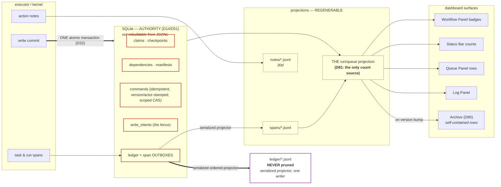

# 03 — Tracker/Event Layer + Dashboard Contract (span rebuild)

Status: **revised 2026-07-22 after the whole-plan/legacy-code review.** The span rebuild now also
owns a closed control-command protocol, durable notifications, strict boundary schemas, and an
explicit backup/restore contract for the non-rebuildable SQLite state. **Amended 2026-07-25:** §9
carries the operator-ratified delegation and presentation decisions (row-model series D6–D20).
**Amended 2026-07-26 (Round 8):** §10 adds the four surviving Round-8 obligations this doc owns — the one projection every
count reads (D81), run versioning + archive-on-version-bump (D80), operator-assigned run display
names (D83), and the slimmed notification model (D79b).
**Amended 2026-07-30:** row-model D8 makes OCR approval Review-only; D19 places screenshot
evidence inside Receipt and run data in Context. Reconciliation D87 removes executor-capacity
projections and chips in favor of concrete worker/browser-session state.
**Amended 2026-07-31 (Round 10):** §5 now owns the isolated-runtime boundary and all-at-once
cutover contract (D88/D89), superseding D73 and the historical live-lift/scoped-flip design.

## Ownership (D1)

| | Concept | Where |
|---|---|---|
| **This doc OWNS** | Span/event wire schema (§1, amended per D10), notes, storage layout, SQLite authority and recovery, enqueue/action/queue command semantics, durable notifications, local artifact outboxes/projectors, SSE wire shapes, the completion union, the isolated-runtime/import boundary and one-time historical-import rules (D88/D89), the ratified delegation/presentation decisions, **the ONE run/queue projection (D81)**, **run versioning + archive-on-bump (D80)**, **run display names (D83)** | §§1–5, §9–10 |
| **Imports from doc 01** | Task contract + `defineTask`, task id grammar (`<system>/<verb-object>` slash ids, per D2), the closed `SystemId` union — real `src/systems/` dir names (`new-kronos`, `old-kronos`) plus the D4 service systems (`extraction`, `normalization`, `ocr`, `roster` — charter §11), error taxonomy | referenced, never redefined |
| **Imports from doc 02** | Workflow descriptor shape + builder, RunEnvelope (`dryRun` home per D6), run-state machine incl. gates/parks (D5), checkpoint store schema, the readable span-path id grammar (`pl-104233-9f3e/searching#2`) | referenced, never redefined |
| **Exports doc 02 adopts** | Verdict/detail semantics, completion program semantics, and wire projections; doc 02's descriptor now carries every consumed field | §3–4 |
| **Imports from doc 12** | `FailureRecord`, evidence receipts/bundles, semantic action targets, scenario ids, knowledge/fix references | referenced, never redefined |

---

## 0. What exists today (and what specifically hurts)

| Today | Mechanism | Pain |
|---|---|---|
| Queue rows | `TrackerEntry` snapshots, latest-wins dedupe, `data: Record<string,string>` bag | Every emit must re-stamp `archetype`/`__traceId`/`parentRunId`/`mode`/… or the latest row *eats* them (≥6 CLAUDE.md lessons are re-stamp bugs: ISS-006, E2E-016, the 2026-06-02 parentRunId lesson, the sweep-step lesson…) |
| Steps/timeline | `step` string on rows + `computeStepDurations` reconstruction + `step_change` session events | Three sources of "where is the run"; durations are *reconstructed*, not recorded; cancelled runs need a sentinel step (`failed`+`step="cancelled"`) that every classifier must special-case |
| Session cards | `sessions/<date>.jsonl` events keyed by mutable `workflowInstance` names + pid heuristics | The 2026-06-25 triple-root-cause dedup saga: instance names are reusable, so attribution needs pid + time-window hacks |
| Status | 5 base statuses + sentinel steps + per-workflow `statusExtensions` + OCR-only predicates (`isPrepareRow` keys on `workflow === "ocr"`) | Status semantics smeared across row fields, sentinels, extensions, and hardcoded branches |
| Approve fan-out | 3 divergent spec shapes (`approveTo`/`approveDocumentTo`/`completeDelegatedRun`) + string-keyed intent gate (`data.operationWorkflow`) + cross-spec borrowing (`onbase-emergency-contact.ts:82`) | Nothing forces coherence; a spec can declare contradictory shapes and only a doc comment objects |
| Dashboard | SSE `entries` (row-ish) + heavy client-side re-projection (queue-surface classifier duplicated client-side, `statusKeyForEntry`, `computeOcrPipelineView`, `workflow === "ocr"` at App.tsx:386/852/976, LogPanel.tsx:249, ocr/types.ts:142–211) | The client re-derives what the server already knows, and re-derivation drifts |

What is **good** and must be kept (charter: port, don't rewrite):
- The **three orthogonal axes** (shape / scope / kind) and the queue-surface collapse algorithm
  (`queue-surfaces.ts`) — battle-tested, including synthetic operation shells and
  `alwaysOperationDelegatedMembers`.
- **Backend-authoritative counts** (`wfCounts`) — the rail never trusts client math.
- Kind-dispatched **title/subtitle** (`queue-row-presentation.ts`) and the **trace id**
  (`<code>-<HHMMSS>-<runId4>`, frozen once).
- JSONL-per-day on disk — the operator greps files. (SQLite's role is split per D14: the
  claim/checkpoint tables are system-of-record; only the *projection* tables are rebuildable — §2.3.)
- Cross-midnight read-layer merge; append-at-now writes.
- The **`ocr_approvals` claim/lease/manifest durability machinery** (2026-07 hardening) — §4.4.

---

## 1. The span event model

### 1.1 Primitives

Everything observable is one append-only stream of **span events**. Three span kinds live in
`spans/` (worker / run / task) plus gate events; **per-action attribution rides the notes stream**
(D10) — an action is a note addressed to its owning task span, not a span of its own. This keeps
the span stream small enough to be the queue/timeline truth while preserving per-action drill-down.

```
worker ──┬─ browser / auth / idle …        (daemon process lifetime; replaces sessions/*)
         │
run ─────┬─ task                           (one descriptor step — doc 02's task chain)
         ├─ task …
         └─ gate events                    (parked-on-operator/system states, D5)
                └─ actions → notes stream  (click/fill/goto/ocr-page/… — addressed by spanPath)
```

```ts
// temp_src/events/types.ts — the wire/at-rest contract. ZERO imports (leaf module).

export type SpanKind = "worker" | "browser" | "run" | "task";

export type RunOutcome =
  | "done" | "failed" | "cancelled" | "discarded" | "skipped" | "interrupted" | "superseded";
// cancelled / discarded / interrupted / superseded are FIRST-CLASS outcomes.
// The `failed + step:"cancelled"` sentinel family does not exist in temp_src.
// An optional versioned one-time historical import may decode it (§5); runtime never does.

/**
 * Run/task identity = (runId, attempt, spanPath); process-lifetime worker/browser identity =
 * (workerId, spanPath). Workers persist across runs, so they never receive a synthetic run id.
 * spanPath uses doc 02's readable path grammar (imported, not redefined):
 *   run span:   pl-104233-9f3e
 *   task span:  pl-104233-9f3e/searching#2        (#N = in-run kernel retry attempt)
 *   worker span: worker/oath-signature/W-88112
 * "Opened and closed exactly once" holds per `(runId, attempt, spanPath)` for run/task spans and
 * per `(workerId, spanPath)` for worker/browser spans. A reassigned or
 * re-pended execution of the same runId is a NEW attempt, so today's same-runId re-pend
 * (`returnTaskToQueued` → row-lifecycle "reassign", VL-004) is representable without violating
 * the invariant. In-run kernel retries are attempt-suffixed task spans; cross-run retries are a
 * NEW run with `retryOf`; the legacy `-N` display suffix stays display-only formatting.
 */
interface SpanPathRef {
  spanPath: string;
  parentSpanPath?: string; // task→run, browser→worker
}
export interface RunSpanRef extends SpanPathRef {
  runId: string;           // full UUID — SQLite/store join key
  attempt: number;         // 1-based execution attempt of this run
  traceId: string;         // frozen `<code>-<HHMMSS>-<runId4>`; root-prefix propagation unchanged
}
export interface WorkerSpanRef extends SpanPathRef {
  workerId: string;
  runId?: never;
  attempt?: never;
  traceId?: never;
}
export type SpanRef = RunSpanRef | WorkerSpanRef;

export type SpanEvent =
  | RunQueued | RunClaimed | RunRequeued | SpanStarted | SpanPatched
  | SubjectObserved | GateOpened | GateResolved | SpanEnded;

interface Base {
  t: string;            // event type discriminant
  ts: string;           // ISO-8601
  workflow: string;     // descriptor id — partition key
  pid: number;
}

/** Run is born at ENQUEUE, not at claim. Carries the validated workflow-constant input or a
 * sensitive-input authority reference—exactly one, proven by `RunQueuedSchema`. */
interface RunQueuedBase extends Base, RunSpanRef {
  t: "run.queued";
  kind: "run";
  itemId: string;                  // stable business key (the completion program's deriveItemId, §4)
  parentRunId?: string;            // SCOPE axis — delegated iff present (unchanged semantics)
  shape: "single" | "preview" | "operation" | "operation-member";  // SHAPE axis, stamped ONCE
  subjectKind: "person" | "file" | "catalog";                      // KIND axis, derived from
                                                                   // descriptor.inputSubject, ONCE
  subject?: QueueSubjectWire;      // closed person/file/catalog union; display-safe fields only
  dryRun: boolean;                 // mirrored from the RunEnvelope (D6) for display
  displayOnly: boolean;            // task-less display row (§4.3, §5) — no claim will ever follow
  priority: "interactive" | "bulk"; // trusted server stamp; children inherit their root
  retryOf?: string;                // prior runId when this is a cross-run retry
  descriptorVersion: number;
  contractFingerprint: Fingerprint;
  resolvedInstance: Partial<Record<BrowserSystemId, SystemInstance>>;
  configFingerprint: Fingerprint;
  configSnapshotId: ConfigSnapshotId;
}
export type RunQueued = RunQueuedBase & (
  | { input: JsonValue; sensitiveInputRef?: never }
  | { input?: never; sensitiveInputRef: SensitiveInputRef }
);

export interface RunClaimed extends Base, RunSpanRef { t: "run.claimed"; workerId: string; }
export interface RunRequeued extends Base, RunSpanRef {
  t: "run.requeued";
  cause: "reassign" | "bump" | "recovery";
  nextAttempt: number;             // the attempt the next claim will run as
}

/** Opens a worker/browser/task span. A run span is born at `run.queued`. */
export type SpanStarted =
  | (Base & WorkerSpanRef & {
      t: "span.started"; kind: "worker" | "browser"; name: string; system?: string;
    })
  | (Base & RunSpanRef & {
      t: "span.started"; kind: "task"; name: string; system?: string;
    });

/**
 * Durable KV updates on the owning RUN (detail fields, resolved names, record snapshots).
 * Patch keys MUST be declared in the descriptor's `details` list (§3.3) — an undeclared key
 * throws at emit. Identity attrs can never ride a patch (§6 guard 4).
 */
export interface SpanPatched extends Base, RunSpanRef {
  t: "span.patched";
  updates: readonly [DetailUpdateWire, ...DetailUpdateWire[]];
}

/** Fresh subject observation. The raw identifier is retained only in the encrypted/local
 * authority record when required; this stream carries a redacted value + comparison outcome. */
export interface SubjectObserved extends Base, RunSpanRef {
  t: "subject.observed";
  taskId: TaskId;
  expected: SubjectEvidenceWire;
  observed: SubjectEvidenceWire;
  observationId: ObservationId;
  result: "match" | "mismatch" | "unknown";
}

/** A run parked on an operator/system decision (D5: gates are run-state, owned by doc 02;
 *  these events are their wire form). Replaces `running/awaiting-approval` + sentinel steps. */
export interface GateOpened extends Base, RunSpanRef { t: "gate.opened"; gate: string; }   // gate ids declared in descriptor
export interface GateResolved extends Base, RunSpanRef {
  t: "gate.resolved"; gate: string;
  /** Descriptor-validated display/audit key, never the gate's decision payload. */
  resolutionKey: GateResolutionKey;
  /** The schema-parsed gate result lives in authority/checkpoint storage (D67). */
  resultRef: GateResultRef;
  resultHash: Sha256;
}

export type SpanEnded = Base & SpanRef & {
  t: "span.ended";
  outcome: RunOutcome;             // task spans use "done" | "failed" | "cancelled" | "skipped"
  failureId?: FailureId;           // full structured failure lives in doc 12's failure store
  errorSummary?: string;           // display-safe, legible summary; never the only failure evidence
  verdict?: VerdictKey;            // validated against the descriptor's closed tuple (§3.2)
  evidenceReceiptId?: EvidenceReceiptId;
};
```

The TypeScript declarations above are readable views, **not validation**. `SpanEventSchema`,
`NoteSchema`, every `*WireSchema`, and the SSE payload schemas are strict discriminated zod unions;
their inferred types are the implementation types. Native JSONL read, SQLite read/write, HTTP
input/output, SSE emission, and fixture load all parse at the boundary. Unknown keys, invalid ISO
instants, unbranded ids, non-canonical JSON, `NaN`, and invalid state combinations fail—never get
cast into the model. An optional offline historical importer owns its own explicit-version parse and
visible quarantine contract; it is not a runtime boundary.

**Notes** (high-volume annotations — log lines, screenshots, per-action records, data points) are a
parallel stream, not span events. Same `SpanRef` addressing, so a note attributes to its exact task
attempt or worker/browser lifetime:

```ts
export type Note = SpanRef & {
  ts: string; workflow: string; pid: number;
  level: "step" | "success" | "error" | "waiting" | "warn" | "debug";
  message: string;
  fields?: readonly NoteFieldWire[];          // closed key/value union; no decision-bearing map
  /** Per-action attribution: task + semantic UI id + page-state transition, never a raw selector. */
  action?: UiActionEvidenceWire;
  attachment?: ScreenshotAttachmentWire | DataPointAttachmentWire | DiagnosticAttachmentWire;
};
```

Notes are evidence, not control state. A new structured field requires a union/schema extension.
High-cardinality exploratory metadata belongs in a schema-versioned diagnostic attachment. No
projector, command handler, retry policy, or workflow bind may branch on note prose or an untyped
attachment payload.

**Volume, honestly (review #8):** today the per-page OCR pipeline emits **zero** tracker rows —
its state rides ~8–12 deduped, 250ms-debounced row snapshots per run (`orchestrator.ts:671-692`).
A naive per-action *span* stream would multiply that by orders of magnitude. Under D10 the split
is: `spans/` carries run + task + gate events — roughly **10–40 events per run** (bounded by the
descriptor's step count × attempts, not by page/click counts) — and everything per-action
(per-page OCR calls, clicks, fills, screenshots) lands in `notes/` at roughly today's **log-line
volume** (hundreds per OCR run). Queue and timeline projections read spans only; notes load lazily
per selected run. Timeline *folds* read spans only; per-action drill-down reads notes by spanPath.

### 1.2 What each of today's surfaces becomes (all are projections)

| Surface | Today | Projection of |
|---|---|---|
| Queue row | latest TrackerEntry snapshot | run span: `run.queued` attrs (immutable identity) ⊕ folded `span.patched` ⊕ open gates ⊕ `span.ended` |
| Status badge | status + sentinel step + statusExtensions | run span state machine: queued→pending, claimed+open→running, open gate→gate status (e.g. `approval` open ⇒ needsReview), ended→outcome verbatim |
| Step pipeline | registered steps + `step` string + reconstructed durations | descriptor.steps ⊕ task spans (a task span IS the duration; a cancelled run's reached step = last open task span — no sentinel recovery) |
| Timeline / log panel | rows + logs + filtered session events (pid heuristics) | run span tree's notes ⊕ the owning worker span's lifecycle events selected **by `workerId`** (recorded at `run.claimed`) — the instance-name/pid/time-window attribution class of bugs is structurally dead |
| Session card | rebuildSessionState over instance-keyed events | worker span + its browser child spans (health notes ride the browser span); subtitle = the in-flight run's traceId (run.claimed links both ways) |
| wfCounts | countSidebarRowsFromTrackerHistory | same collapse algorithm over projected run surfaces — still computed server-side, still authoritative |
| Row-lifecycle debug | replay + cause *guessing* (`reassign` derivation) | free: `run.requeued.cause` + `attempt` are recorded, not derived |

### 1.3 Decision: archetypes survive as vocabulary, die as per-row stamps

The four row shapes (`single | preview | operation | operation-member`) and the three axes are
**kept** — they are the proven queue vocabulary. What changes:

- **Declared on the descriptor** (doc 02's `archetype`, literal or input-resolver), materialized
  **once** on `run.queued.shape`. Member shape is set by the fan-out dispatcher on the child's
  `run.queued` (today's `rowShape` option).
- **Never re-stamped.** Span identity attrs are written once and immutable; patches can't clobber
  them because projections fold `patch` over identity, not the reverse. The entire re-stamp bug
  class (ISS-006 etc.) is unrepresentable.
- No legacy normalization (`batch`→`operation`) in the `temp_src` runtime. An optional versioned
  one-time historical import owns that translation (§5).

Derived statuses stop being per-workflow code where a universal mechanism exists:
- `needsReview` ⇒ any run with an open `approval` gate (universal projection rule; OCR just declares
  the gate).
- `notFound` / `inactive` / secondary tags ⇒ descriptor-declared **verdict mappings** (§3.2) over
  `span.ended.verdict` — plain data, bundle-safe, no `statusExtensions` function registry.

---

## 2. Storage and transport

**The whole layer in one picture.** The load-bearing rule is the split between what is *authority*
(SQLite — not rebuildable, never deleted casually) and what is *projection* (JSONL + the read
model — regenerable). Every arrow below is one-directional; nothing reads back up.



Three things to read off it: a write reaches **authority in one atomic transaction** before any
JSONL exists (so a crash between them is repairable, never a lost filing); the **ledger has exactly
one ordered writer**, with actor-attributed entries reconciled from atomic outboxes; and **every
count in the UI descends from one node** (D81, §10.1) — there is
no second path a badge could take.

### 2.1 On disk — JSONL-per-day stays, two streams

The rebuild owns the distinct `.tracker-rebuild/` state root. Production `src` owns `.tracker/`;
neither runtime reads or writes the other's root.

```
.tracker-rebuild/
├── spans/   <workflow>-<date>.jsonl   span events (low volume — the queue/timeline truth)
├── notes/   <workflow>-<date>.jsonl   notes (high volume — logs, actions, screenshots, data points)
├── evidence/<runId>/                  run receipts + redacted diagnostic bundle manifests (doc 12)
├── artifacts/sha256/<prefix>/<hash>    content-addressed task outputs; atomic, immutable bytes
├── ledger/  <system>-<date>.jsonl     immutable write receipts (D21; shape owned by doc 09 §6) —
│                                      ordered, actor-attributed, append-only, per-SYSTEM+day,
│                                      NEVER pruned (the audit floor; hash chain deferred by D79)
├── backups/state/                     checksummed online backups + restore manifests (§2.5)
└── state.db                           SQLite — claims/checkpoints/intents/outboxes,
                                       commands/dependencies/notifications are system-of-record;
                                       read projections alone are rebuildable
```

Rationale against alternatives:
- **Why not SQLite-only?** The operator greps files. **Debug grep now spans two dirs:**
  `grep ou-1430 .tracker-rebuild/spans/*.jsonl` answers *what happened* (state transitions, outcomes,
  gates); `grep ou-1430 .tracker-rebuild/notes/*.jsonl` answers *what it did* (log lines, per-action
  records, screenshots). One trace id returns the whole operation tree across workflows in both.
  This second grep is a real cost of the D10 split and is documented as such — the `spans/` grep
  alone no longer contains log-line text the way `rows/`+`logs/` greps did.
- **Why split spans/notes?** Queue projection reads spans only (§1.1 volume note); notes load
  lazily per selected run. Mirrors today's proven rows/logs split.
- **Why a separate `ledger/` (D21 — owner = this doc)?** Doc 09's write-safety layer files one
  immutable receipt per real HR mutation. It is partitioned per-**system**+day so
  `grep 10694136 .tracker-rebuild/ledger/ucpath-*.jsonl` answers "what did we file for this person,
  across time." It is ordered, actor-attributed, and **never pruned**. Doc 09 owns
  the entry *shape* (`LedgerEntry`, §6 there); this doc owns that the dir lives in the layout and is
  exempt from `clean-tracker`.
- **Base retention — DECIDED (D86):** `notes/` and `spans/` both prune at **30 days**.
  `ledger/` is exempt from both — its never-pruned floor now sits **above a settled number, not a
  guess** (this is what doc 09 §6 references). Legacy `.tracker/` retention is unchanged and owned
  only by production `src`.
- **Why per-workflow files?** Small greppable files; partition key matches the SSE topic scope.
  Worker spans write to their workflow's file (a daemon serves one workflow).
- **Span/note write discipline (ported):** append-at-now partitioning; cross-midnight solved at the
  read layer with the OPEN-span forward-merge (same algorithm as `cross-midnight.ts`); synchronous
  SIGINT terminal writes; `O_APPEND` single-line writes. **Ledger is different:** executors write
  durable outbox rows and one serialized projector assigns ordered sequence and appends (doc 09).
- **Local artifacts are not hidden task writes (D45).** A read task may create only immutable,
  content-addressed bytes under `artifacts/` through doc 01's writer; the returned `{id,sha256,bytes,
  mediaType}` is canonical JSON and checkpoints reference it without exposing a filesystem path.
  Mutable operator artifacts (for
  example i9's retention workbook) are different: the node checkpoint and a stable-keyed
  `artifact_outbox` row commit atomically in SQLite, then a single sink projector performs
  temp+fsync+atomic-replace and records the projected content hash. Duplicate outboxes/key retries
  are no-ops. A blocking projection failure parks the run; it never reports done while silently
  dropping the workbook update.
- **Evidence is indexed, not scattered.** `evidence/<runId>/receipt.json` points to immutable
  screenshots/artifacts/failures by content hash and records missing capture explicitly. Diagnostic
  bundles redact by schema before writing; they never copy `.env`, cookies, browser storage, raw
  SSNs, or unrestricted input blobs (doc 12 §3).

### 2.2 Projections are computed server-side — the wire carries surfaces, not rows

Today the client re-implements queue-surface classification, status keying, and pipeline math. In
temp_src the SSE stream carries **finished projections**; the client renders and never re-derives.
Descriptor metadata is served as doc 02's validated client projection; the SPA never imports
workflow modules. The SSE hello carries its fingerprint so a stale bundle fails loud.

```ts
// temp_src/server/topics.ts — SSE topic payloads (all change-gated snapshots, as today)
interface EventsHubPayload {
  descriptorHash: string;                  // doc 02's skew tripwire — NOT the descriptors themselves
  queue: { workflow: string; date: string; surfaces: QueueSurfaceWire[] };  // per subscribed panel
  queuePatch?: { workflow: string; date: string; surface: QueueSurfaceWire }[];
  //  ^ after the initial snapshot, a changed surface re-sends ONLY that complete strict surface — a
  //    100-member operation tick re-serializes one member row, never the resolved member tree (D10)
  wfCounts: readonly { workflow: WorkflowId; count: NonNegativeInt }[];
                                             // closed tuples, backend-authoritative rail badges
  sessions: WorkerCardWire[];              // worker-span projections
  notifications: NotificationWire[];       // incl. gate.opened rising edges (kills App.tsx:386)
}

interface QueueSurfaceWire {
  surface: "single" | "preview" | "operation";      // group collapse already applied server-side
  runId: string; itemId: string; workflow: string;
  traceId: string;                                   // review #11 — was missing
  parentRunId?: string;
  attempt: number;
  dryRun?: boolean;                                  // review #11 — RunEnvelope mirror (D6)
  enqueuedAt: string; startedAt?: string; endedAt?: string;   // review #11 — timestamps; queue-wait
                                                              // and elapsed derive from these
  title: string; subtitle?: string;                  // kind dispatch applied server-side
  status: StatusWire;                                // { key, label, tone, secondaryTag? } — final
  pipeline: { step: string; label: string; state: "pending"|"running"|"done"|"failed"|"cancelled"|"skipped"; durationMs?: number; attempt?: number }[];
  gates: { gate: string; open: boolean; resolutionKey?: GateResolutionKey }[];
  actions: ActionDescriptorWire[];                   // ported from the standard command projection;
                                                     // display-only rows get Hide only (§4.3)
  memberRunIds?: string[];                           // operation only — ids, NEVER nested trees (D10);
  memberRollup?: readonly { status: StatusKey; count: NonNegativeInt }[];
                                                     // closed status/count tuples for the mini-badge
  //  members are ordinary flat surfaces in the same queue payload (joined client-side by
  //  parentRunId); each is change-gated individually via queuePatch
  detailSurfaces: ("logs"|"review"|"receipt"|"people"|"data")[]; // panel-kind tabs + Context Data section
  links?: { review?: { workflow: string; runId: string } };  // "Open OCR review" jump
  evidence: { receiptId?: EvidenceReceiptId; failureId?: FailureId;
              confidence: "verified" | "partial" | "unknown" };
}
```

For a run parked on an unfinished write intent, the server replaces ordinary retry/done actions
with the closed kernel actions `resolve-write-present` and `resolve-write-absent` (doc 09 §4.1),
including intent generation+version tokens and the proof/evidence form spec. The descriptor cannot
re-enable generic Done/Retry for that state. These actions derive from durable intent state, not a
workflow-id registry; stale tokens fail with a conflict and trigger a fresh projection.

Per-run detail (timeline, notes, screenshots) stays request/response + a per-run SSE topic, as
today — but the payload is the span tree + notes, already merged and ordered; `LogStream` stops
owning merge/dedup heuristics (`mergeDisplayItems` collapse survives as a server-side fold).

### 2.3 SQLite (role per D14)

`state.db` has **two classes of table with different authority**:

- **System-of-record (NOT rebuildable and never deleted by projection/runtime row maintenance):**
  the task/claim store (tasks, leases,
  dependencies, delegation manifests, commands, notifications, capture sessions/photo order/
  finalization outboxes — doc 02 §5.7's checkpoint payloads,
  §4.4's `ocr_approvals` manifests, and
  doc 09's permanent-key `write_intents`, `write_attempts`, and durable outbox, plus
  stable-keyed local `artifact_outbox`/sink-head rows). The system-of-record set is
  "claims + checkpoint payloads + write authority/outboxes + local artifact projection
  authority + in-progress capture/handoff authority."
  Losing any of these loses claims, checkpoints, in-flight write fences, or accepted capture work — they have no JSONL
  double.
- **Projection tables (rebuildable):** span-shaped read models (`spans`, `gates`, `notes`,
  `runs_view`) fed by one projector consuming only native `temp_src` spans.
  These — and only these — can be deleted and rebuilt from JSONL, with today's operational rules:
  JSONL writes first, projection applies after, projection failures schedule guarded rebuilds and
  never block workflows; source identity is `resolve(path)`; deletion tombstones and offline
  compaction port as-is.

The system-of-record class includes a singleton `authority_meta(schema_version,
authority_generation,updated_at)`. The infra adapter exposes separate authority and projection
transaction APIs; repositories cannot execute arbitrary SQL or receive the raw connection. Every
top-level committed transaction that mutates at least one authority table increments
`authority_generation` exactly once inside that same transaction; projection-only rebuilds do not.
Nested authority operations share the outer transaction/generation increment. The table-class
registry generates coverage tests that mutate each authority repository and prove the generation
advances, then mutate each projection repository and prove it does not. A newly added authority
table without a registered mutator test fails. This makes D72 backup RPO comparison an actual
monotonic authority fact rather than a timestamp guess.

Any sentence in this doc that says "rebuildable" means the projection tables only. The sole
authority-removal exception is the explicit stopped-system, exact-id, backup-gated Purge procedure
in §2.4; ordinary cleanup, Hide, projection rebuild, and runtime code cannot reach authority rows.

### 2.4 One command protocol with strict target families

The dashboard, CLI, recovery code, workflow editor, notification inbox, gate resolvers, and capture
UI all issue the same idempotent command **envelope**, then one strict target-family arm (D67). They
do not update queue rows, JSONL, or authority records directly. Workflow descriptors select from
closed policies; workflows never own cancel/delete/retry/bump/update implementations.

```ts
export type EnqueuePolicy = "reject-active" | "supersede-active" | "allow-parallel";
export type CommandActionId =
  | "retry" | "cancel" | "bump" | "hide" | "unhide"
  | "edit-checkpoint" | "resolve-write-present" | "resolve-write-absent";
export type NavigationActionId = "open-review" | "open-evidence";
export type WorkflowActionId = CommandActionId | NavigationActionId;

export interface WorkflowActionPolicy {
  enabled: readonly WorkflowActionId[];
  /** Optional descriptor conditions are closed rules over projected state, not callbacks. */
  conditions?: readonly ActionConditionRule[];
}

interface CommandEnvelope {
  commandId: CommandId;                 // client-generated idempotency key
  requestedAt: IsoInstant;
  reason?: OperatorReason;
}
export type RunCommandRequest = CommandEnvelope & (
  | {
      target: { runId: RunId; expectedVersion: PositiveInt };
      type: "retry" | "cancel" | "bump" | "hide" | "unhide";
      payload?: never;
    }
  | { target: { runId: RunId; expectedVersion: PositiveInt };
      type: "edit-checkpoint"; payload: EditCheckpointCommand }
  | {
      target: { runId: RunId; expectedVersion: PositiveInt };
      type: "resolve-write-present" | "resolve-write-absent";
      payload: ResolveWriteCommand;
    });
export type GateCommandRequest = CommandEnvelope & {
  type: "resolve-gate";
  target: { runId: RunId; gateId: GateId; expectedVersion: PositiveInt };
  /** Generic only on the wire; the handler resolves the descriptor and parses the exact gate schema
   * before atomically storing the result checkpoint + resolved event outbox. */
  payload: { result: CanonicalJsonValue };
};
export type NotificationCommandRequest = CommandEnvelope & (
  | { type: "notification-read" | "notification-unread";
      target: { notificationId: NotificationId; expectedVersion: PositiveInt }; payload?: never }
  | { type: "notification-snooze";
      target: { notificationId: NotificationId; expectedVersion: PositiveInt };
      payload: { until: IsoInstant } }
);
export type CommandRequest =
  | RunCommandRequest | GateCommandRequest | NotificationCommandRequest | CaptureCommandRequest;
// CaptureCommandRequest is owned by doc 06 and uses this envelope's idempotency, version-stamp,
// and transactional current-state validation; it is not a blanket CAS arm.

/** Multi-select never means "loop and hope". Targets and versions are frozen at confirmation. */
export interface BulkCommandRequest {
  bulkCommandId: CommandId;
  type: "retry" | "cancel" | "bump" | "hide" | "unhide";
  targets: readonly [
    { runId: RunId; expectedVersion: PositiveInt },
    ...{ runId: RunId; expectedVersion: PositiveInt }[],
  ];
  mode: "all-or-none" | "best-effort";
  requestedAt: IsoInstant;
  reason?: OperatorReason;
}
export type CommandResult =
  | { state: "applied" | "already-applied"; commandId: CommandId; affectedRunIds: RunId[] }
  | { state: "conflict"; commandId: CommandId; currentVersion: PositiveInt; message: string }
  | { state: "rejected"; commandId: CommandId; code: CommandRejectionCode; message: string };

export type ActionDescriptorWire =
  | {
      kind: "command";
      id: CommandActionId;
      label: string;
      tone: "neutral" | "warning" | "destructive";
      target: { runId: RunId; expectedVersion: PositiveInt };
      form?: ActionFormWire;
    }
  | {
      kind: "navigation";
      id: NavigationActionId;
      label: string;
      tone: "neutral";
      target: { runId: RunId };
    };
```

Command semantics are binding:

| Operation | Standard behavior |
|---|---|
| Enqueue | Validate raw input once, derive stable item id, then apply descriptor policy in one transaction. `reject-active` returns the existing active run; `supersede-active` terminalizes the exact active generation and creates the new run atomically; `allow-parallel` still requires a distinct stable item/variant key. An authority read error aborts—never “continue and enqueue anyway.” |
| Retry | Creates a new run linked by `retryOf`, reuses immutable parsed input/config, validates checkpoints/freshness, and preserves the logical item. A parked unknown write uses resolution actions, never generic retry. |
| Cancel | Resolves the full dependency tree from authoritative SQLite, applies every edge's doc 02 cancel policy, and commits state transitions together. If the tree is unavailable/inconsistent, no target is cancelled. Visible queue roots are never an authority fallback. |
| Bump | Changes priority/claim order through an idempotent transactional command; it does not fabricate a requeue or mutate business input. Running work returns a typed rejection unless the scheduler explicitly supports cooperative yield. Version drift alone does not conflict. |
| Hide / Unhide | A reversible presentation tombstone only. It changes no run outcome, task, dependency, checkpoint, intent, or evidence. The UI label is **Hide**, never Delete. |
| Purge | Not a row action. `cli purge-run <exact-run-id> --backup <path>` is an offline maintenance command requiring a fresh verified backup and refusing any active/dependency/write-authority reference. It writes a purge receipt. |
| Edit checkpoint | Uses doc 06's field-level patch/provenance model, creates a new run/attempt as specified there, and never mutates original input or a completed proof. |

Every command is inserted durably before application and records the target's monotonic `version`.
Re-delivery returns `already-applied`. CAS is enforced only for real race families: cancel-tree,
edit-vs-resume, gate resolution, and write recovery; a stale projection conflicts and forces refresh
only for those arms. Other arms retain the version seam for audit/future concurrency but validate
current authority without rejecting solely because the observed version changed. The command audit
records requester (`local-operator` for now), source surface, reason, before/after versions, affected
dependency ids, and outcome. API routes are thin schema parsers over this service—there are no
workflow-specific mutation endpoints except domain gates whose handlers themselves issue commands.

Bulk commands first resolve the union of all authoritative dependency targets. `all-or-none` locks,
validates every policy plus expected versions for CAS-enforced arms, and applies one transaction or
none. `best-effort` writes a child command/result per requested target and returns the complete
applied/conflict/rejected vector; the UI may never collapse a partial result into “Done.” Bulk cancel
defaults to `all-or-none`; bulk hide defaults to `best-effort`. There is no client loop whose last
response overwrites earlier errors.

### 2.5 Non-rebuildable SQLite recovery contract

Calling `state.db` authoritative without a recovery path would make a single corrupt file capable
of erasing claim, delegation, checkpoint, and write-fence truth. The base therefore includes:

1. SQLite runs with WAL, foreign keys on, a busy timeout, and `synchronous=FULL` for authority
   transactions. Schema migrations run only under an exclusive migration lease.
2. Boot runs `PRAGMA quick_check`, schema-version validation, foreign-key checks, and invariant
   queries (one active claim per run, manifest children match dependencies, every attempting write
   has an attempt, every outbox references authority, every finalizing capture has exactly one live
   bundle/handoff outbox, and every finalized capture references one intake handoff). Any failure starts the dashboard read-only
   and blocks enqueue/claim/commit/control commands with one durable/console-visible health error.
3. One infra-owned `AuthorityDatabase` retains the private native `DatabaseSync`; task/command/
   projection consumers receive only narrow repositories and never the raw handle. Its async,
   single-flight `backupToTemp` calls `node:sqlite.backup`—the rebuild does not inherit the current
   compatibility wrapper's erased backup capability and does not file-copy a live WAL database.
   After backup completes, verification opens the **backup itself** read-only, runs full integrity/
   foreign-key/invariant checks, and reads schema version/page count/`authority_generation` from
   that copy. Only those self-observed values enter the manifest with SHA-256/created-at; the service
   then fsyncs and atomically renames. A pre/post read of the live DB cannot label a different
   snapshot. `VACUUM INTO` and raw file-copy are not online-backup fallbacks (D72).
   Retain 14 verified daily backups, the latest 8 coalesced critical/interval backups, and the last
   5 pre-migration backups; expose age/health in
   Settings. A configurable path may point at another local volume.
4. A dirty authority store gets a coalesced verified online backup at least every 15 minutes and
   immediately after schema migration, external-write durable commit, capture final handoff, and
   graceful drain. Critical triggers may join one already-running backup, but cannot be silently
   dropped: if the completed copy's self-read generation predates a trigger's required generation,
   one coalesced follow-up backup is scheduled. Backup health reports both last verified time and
   the verified copy's authority generation/RPO gap.
5. `cli storage doctor` is read-only and reports checks, backup freshness, pending commands,
   unresolved writes, leases, outboxes, and restore candidates. `cli storage restore --from
   <exact-backup>` first preserves the suspect DB, restores into a temp path, repeats all checks,
   and atomically swaps only while workers/server are stopped.
6. Restore reconciliation replays JSONL into **projection tables only**. It never invents lost
   authority from spans. Runs/events newer than the restored authority generation are surfaced as
   `authority-unknown`; any possible external write is parked for doc 09's live probe/operator
   resolution before execution continues.

Phase 1 cannot exit until an automated restore drill copies a real-shaped fixture DB, corrupts the
copy, detects it, restores the newest verified backup, rebuilds projections, and proves pending
commands/delegations/write intents and capture handoffs remain consistent. Backups are useful
recovery state, so they
are excluded from ordinary tracker cleanup and covered by disk-space warnings.

### 2.6 Durable single-operator notifications

Desktop notifications are delivery conveniences, not the record. A `notifications` authority
table stores a strict event with `notificationId`, dedupe key, severity, run/workflow/failure refs,
created time, message template+arguments, read state (`unread|read`), and optional snooze expiry.
Triggers are closed and base-owned: run failure, subject mismatch, open operator gate, unknown write
outcome, storage degradation, stalled lease/outbox, and failed backup. Repeated identical triggers
update count/lastSeen instead of spamming.

The dashboard inbox and per-run timeline always render durable state. OS notification delivery is
best-effort; a failed toast never loses the unread inbox item. Snooze suppresses delivery until its
expiry without changing read state. Notification text uses redacted arguments and links to the
evidence/failure/run—not raw secrets or captured form contents.

```ts
export interface NotificationWire {
  notificationId: NotificationId;
  dedupeKey: NotificationDedupeKey;
  trigger: NotificationTrigger;
  severity: "info" | "warning" | "error" | "critical";
  state: "unread" | "read";
  title: string;
  message: string;
  count: PositiveInt;
  createdAt: IsoInstant;
  lastSeenAt: IsoInstant;
  snoozedUntil?: IsoInstant;
  link?: { kind: "run" | "failure" | "storage"; id: string };
}
```

---

## 3. Descriptor fields this layer consumes (shape owned by doc 02)

**Doc 02 owns the `WorkflowDescriptor` shape and builder** (D1). This section does not define a
descriptor interface; it names the fields this layer *reads*, and the fields it *contributes* for
doc 02 to adopt. The tracker enforces its half at the emit boundary: **emitting a task span whose
`name` is not a descriptor step key, a gate not in the descriptor's gate list, a verdict not in its
verdict map, or a patch key not in its detail-field list, throws at emit time.**

### 3.1 Read from doc 02's descriptor
`id`, `code` (2-char trace prefix), `label`, `icon`, `category`, `surface.shape` /
`surface.resolveShape`,
`inputSubject`, graph-node keys/labels, `surfaces`, `details`, `actions`, `presets`, `identity`,
`presentation`, `coordinator`, `completionConsumes`, `artifactProjections`, `enqueue`, `scenarios`,
version/fingerprint, and
override layering. There is no second `archetype` declaration.

### 3.2 Contributed by this doc, adopted into doc 02's descriptor
These are plain-data fields; doc 02's descriptor carries them, this doc defines their semantics:

```ts
steps display rules: readonly StepDisplayRule[]               // computeOcrPipelineView's fold/hide
gates: readonly GateProjectionDefinition[]                    // descriptor-derived from gate nodes
verdicts: readonly VerdictDefinition[]
//  ^ REPLACES statusExtensions (review #5 / D1): person-lookup's `notFound` becomes
//    { key:"not-found", label:"Not found", tone:"warning" } over span.ended.verdict; the
//    identity-approval badge (§5.4) becomes a gate statusKey. The statusExtensions function
//    registry does not exist in temp_src.
details: readonly DetailProjectionSpec<Nodes>[]
//  ^ the SpanPatched validation set (review #11): every patch key must be declared here.
//    Successor of today's detailFields incl. the "declared but never populated" warn.
capabilities: WorkflowCapabilities
completion?: CompletionProgram                                // §4 — OCR-backed workflows only
enqueue / actions / scenarios / presets / identity / presentation / coordinator /
completionConsumes / artifactProjections
// artifact projection specs name an exact producing node+field, sink id, stable key fields,
// blocking policy, and canonical record schema; the client receives status only, never sink paths
```

The bundle-safe artifact spec is a closed infrastructure contract, not an arbitrary callback:

```ts
export type ArtifactSinkId = "xlsx-retention"; // extend with a sink implementation + guard fixture
export interface DurableArtifactProjectionSpec<RecordSchema extends z.ZodType> {
  id: string;
  source: { nodeId: string; fieldPath: string };
  record: CanonicalJsonSchema<RecordSchema>;
  keyFields: readonly [string, ...string[]];
  sink: ArtifactSinkId;
  blocking: true;
}
```

The builder factory receives the exact node accumulator and constrains `nodeId`, `fieldPath`, and
`keyFields` to real paths in that node's output/record schema; the broad wire form above is runtime
only. `blocking:false`, a free-form sink id, positional keys, and function-valued projectors are not
legal. Sink implementations live in one exhaustive `Record<ArtifactSinkId,Projector>` owned by
infrastructure—deliberately a sink-kind registry, never keyed by workflow.

Every hand-maintained parallel list in today's dashboard (icons, INSTANCE_LABELS, step-label
switches, stub map) becomes a projection of the descriptor set with a coverage guard — that
mechanism and its guard are doc 02's (§1.3/§1.4 there).

---

## 4. Unified completion contract (replaces approveTo / approveDocumentTo / completeDelegatedRun)

**Re-derived from `tracker/dashboard/ocr/approve.ts` + `prepare.ts` as-built (D11), not the OCR
happy path.** The as-built route is a *staged program with durable state*, and the contract must
express five things the previous draft missed: intent-derived child shape, `deriveItemId`, ordered
stages (per-document consumes per-record's *actually-enqueued* itemIds), oath-upload's
sibling-subscriber shape with NO coordinator, and i9's prepare-route enqueue + task-less
display-only failed rows.

### 4.1 The typed staged completion program

```ts
// temp_src/descriptor/completion.ts
import { z } from "zod/v4";
import type { AnyWorkflowRef } from "./ref.js";
// WorkflowRef<InputSchema,ResultSchema> carries both concrete schemas (docs 01/02).

export type CompletionProgram =
  | StagedFanOut<readonly [PerRecordStage<AnyWorkflowRef>, ...AnyFanOutStage[]]>
  | CompleteThenEnqueue<AnyWorkflowRef>;
// oath-upload deliberately has NO CompletionProgram — see §4.5 (sibling subscriber).
// verify deliberately has NO CompletionProgram — see §4.6 (in-run enrichment, not completion).

export interface StagedFanOut<Stages extends readonly [PerRecordStage<AnyWorkflowRef>, ...AnyFanOutStage[]]> {
  mode: "staged-fanout";
  gate: "approval";                          // the gate this program resolves
  /** ORDERED. Stage N+1's derive receives stage N's ACTUALLY-ENQUEUED itemIds — as-built:
   *  oath's per-document ticket gets `perRecordItemIds` = the ids the record stage really
   *  enqueued after `eligible` filtering (approve.ts:306, oath.ts:455), never the selected set. */
  stages: Stages;
}

export type AnyFanOutStage =
  | PerRecordStage<AnyWorkflowRef>
  | PerDocumentStage<AnyWorkflowRef>;

export interface PerRecordStage<Target extends AnyWorkflowRef> {
  per: "record";
  to: Target;
  derive: (record: PreviewRecord, ctx: ApproveContext) => z.input<Target["input"]>;
  /** As-built canFanOut: oath = signed + 5-digit EID (`hasOathSignerInput`); EC = EID-complete.
   *  Shared, named, exported predicates only (§4.2). Skipped records are NOT enqueued and their
   *  itemIds do NOT reach later stages. */
  eligible?: NamedPredicate;
  /** PreviewRecord carries a StableRecordId derived when extraction admits the record from
   * source-artifact digest + stable page/form identity. Item identity may use that id and validated
   * subject/business fields, never array index or run id. IDs are minted into the durable manifest
   * BEFORE dispatch. The enqueue-side resolver keys on the LOGICAL (runtime-options-stripped)
   * input and FAILS LOUD on a miss (buildFanOutItemIdResolver); the E2E-015 shared-id/index fallback
   * is banned. */
  deriveItemId: (record: PreviewRecord, ctx: ApproveContext) => ItemId;
}

export interface PerDocumentStage<Target extends AnyWorkflowRef> {
  per: "document";
  to: Target;
  derive: (doc: ApprovedDocument) => z.input<Target["input"]>; // gets prior enqueued ids
  deriveItemId: (doc: ApprovedDocument) => string;
}

export interface CompleteThenEnqueue<TTarget extends AnyWorkflowRef> {
  mode: "complete-then-enqueue";             // i9: no approval gate exists — nothing to approve
  then: {
    per: "person";
    to: TTarget;                             // concrete input schema retained end to end
    /** Runs at the PREPARE seam (as-built: /api/ocr/prepare after the delegated run completes,
     *  gated on the coordinator existing — prepare.ts:476-505), NOT at an approve route. */
    derive: (plan: MemberPlanEntry) => z.input<TTarget["input"]>;
    /** Pages that can never be searched become TASK-LESS display-only failed member rows
     *  (`run.queued { displayOnly: true }` + immediate `span.ended("failed")`; no run.claimed,
     *  no worker span, Hide-only actions) — as-built i9-check-results.ts displayFailures. */
    displayFailures: true;
  };
}
```

`defineCompletionProgram(...)` infers and returns the concrete heterogeneous stage tuple; workflow
descriptors are inferred values and are never annotated as broad `CompletionProgram`. A type-level
fixture renames a target input field and requires every `derive` site—including i9—to fail `tsc`.
Broad target erasure, untyped `derive` results, or exported erased stage arrays are forbidden.

### 4.2 Cross-spec borrowing becomes impossible

Today: `onbase-emergency-contact.ts:82` reaches into `emergencyContactOcrFormSpec.approveTo!.canFanOut`.
Two mechanisms close this:

1. **Predicates are first-class named exports in a shared home**, not properties fished out of
   another spec's config:

```ts
// temp_src/forms/shared/eligibility.ts
export const hasResolvedEid: NamedPredicate = definePredicate("has-resolved-eid",
  (r) => /^\d{5,}$/.test(normalizeUcpathEmployeeId(readEid(r))));
// onbase-ec and ec BOTH import hasResolvedEid. Neither imports the other's config.
```

2. **Specs are sealed at definition.** `defineFormSpec(...)` returns a branded opaque type whose
   completion config is not structurally reachable (`unique symbol` brand + no exported property
   types). `otherSpec.completion.stages[0].eligible` is a type error — the only composition
   surface is the shared-predicate module and explicit `extendFormSpec(base, overrides)` which
   re-validates the result. The architecture guard (§6) additionally bans importing one spec
   module from another spec module (registry + shared modules only).

### 4.3 Intent-derived child shape and stage consumption — declarative, coordinator-owned

As-built, TWO things are derived at approve time from the *launching intent*
(`data.operationWorkflow`, a string stamped on the OCR row at prepare):

- **Child shape** (approve.ts:236-239, recovery :882-884): fan-out children are stamped
  `operation-member` iff the intent is an operation coordinator (`oath-signature` /
  `emergency-contact` / `onbase` / `i9-check` — `ocr/shared.ts:25-34`). **oath-upload is
  deliberately NOT a coordinator** — its children keep the natural archetype, and the ticket is a
  real `single` task, not a display row.
- **Stage suppression** (approve.ts:224-227): the per-document stage is suppressed when the intent
  is `oath-signature` (signs only, no ticket) or `oath-upload` (the born-at-upload task files its
  own ticket).

In temp_src both move onto the **launching coordinator's descriptor**, resolved via
`parentRunId → run.queued.workflow` — no string-keyed `data` field:

```ts
// oath-signature descriptor:  completionConsumes: { memberShape: "operation-member", suppress: ["document"] }
// emergency-contact / onbase: completionConsumes: { memberShape: "operation-member" }
// oath-upload descriptor:     completionConsumes: { memberShape: "natural", suppress: ["document"] }
// i9-check descriptor:        completionConsumes: { memberShape: "operation-member" }   (used by §4.1's then)
```

A **display-only coordinator** (operation shape, no daemon task) declares
`coordinator: "display"` — its `run.queued` carries `displayOnly: true`, no `run.claimed` ever
follows, and completion is the members-terminal rollup (`rollupOperationStatus`, ported as a
projection rule). The as-built subtlety that dependency edges are simply *not created* when the
parent has no task (approve.ts:1389-1429) becomes structural: display coordinators are not in the
task store, and the dependency step of the program skips them by type, not by a missing-row probe.

Standalone approve stays rejected loud (approval ≡ delegation, ported rule — approve.ts:162-171).

### 4.4 Durability: the approval manifest is part of the contract's execution, ported as-is

The `ocr_approvals` machinery (2026-07 hardening) is transport-level idempotency and orthogonal to
the contract *shape* — it ports as-is, with its manifest now referencing span identity: stable
child `runIds` minted into the manifest before dispatch; claim/lease with heartbeat renewal;
conflict/stale/failed claim outcomes; a recovery path (`resumeRecoverableOcrApprovals`) that
re-dispatches **from SQLite alone** (never re-reads JSONL state that may be missing post-crash);
child-input schema validation *before* the claim is accepted (a bad derive is a durable failed
approval, not a stuck review); terminal presentation (`gate.resolved("approval","approved")` +
`span.ended("done")` with `fannedOutItemIds`) written only after the SQLite commit, so
presentation failure can never turn enqueued children into a failed approval. Dispatch failure →
`gate.resolved("approval","failed")` + `span.ended("failed")` (today's `approve-failed`), emitted
with inherited identity (ISS-006 rule, now structural — identity lives on `run.queued`).

### 4.5 oath-upload — owner-consumes via a sibling born-at-upload task (no coordinator)

**What cannot be expressed as a CompletionProgram is stated here explicitly rather than
mis-modeled (D11).** oath-upload has **no OCR form spec at all** (`forms/registry.ts:8-14` lists
oath/ec/onbase-ec/verify/i9 — oath-upload is a fan-out *target*, not a form). Its as-built shape
(`oath-upload/handler.ts:114-181`, prepare.ts:356-419):

- The real `single` ticket task is **born at upload** at the prepare seam, BEFORE OCR; the OCR run
  is delegated *under it* (`parentRunId` = the ticket run). If the born task cannot be created,
  prepare fails loud and aborts the OCR run (`ocr-prep-failed`) — OCR must never run with no
  consumer.
- The oath spec's per-record signer stage **still runs** at approve (the ticket's coordinator
  descriptor suppresses only the `document` stage, §4.3).
- The ticket task consumes the approval as a **sibling subscriber**: its `wait-approval` step
  (a gate in the new model, per D5) calls `subscribeToApproval({ workflow:"ocr", sessionId })` and
  learns the signer set from the approval payload's `fannedOutItemIds` — cross-process, JSONL/
  SQLite-backed, not an in-memory wake.
- Declared on the oath-upload descriptor as a gate wired to an approval subscription:
  `gates: [{ id:"await-approval", subscribes: { workflow:"ocr", key:"sessionId" } }, { id:"await-signatures", … }]`.
- The zero-signer refusal is an output-dependent branch to a typed failure node; discard is a gate
  resolution mapped to cancelled; signature waiting is a typed children-terminal gate; ticket fill
  and submit form a transaction node. The submit idempotency window is doc 09's write intent. None
  of these hides in a handler side channel.

### 4.6 verify — in-run enrichment, not completion

verify has **no completion contract**: no approve targets, no `completeDelegatedRun`. Its
fan-outs (`verify.ts:523-660`) happen during the run: doc 02 models two typed child-run branches in
a first-class parallel `all-settled` node, followed by a typed join/enrichment step. Child inputs,
results, cancellation, and joins are descriptor-visible and checkpointed. This doc still does not
model them as completion. i9 is §4.1's post-completion enqueue; verify is mid-run enrichment.

---

## 5. Isolated runtime coexistence and one cutover (D88/D89, 2026-07-31)

The legacy and rebuilt event worlds coexist only as **two fully isolated runtimes**:

- Production `src` continues to own its existing `.tracker`, state, processes, ports, locks, and
  browser profiles/sessions. It remains live and maintainable for the whole rebuild.
- `temp_src` uses distinct commands/entrypoints, state and artifact roots, ports, process locks,
  and browser profiles/sessions. The rebuild cannot import or invoke legacy runtime modules, read
  or mutate legacy live state, or attach to legacy browsers. The same bans apply legacy→rebuild.
- The D88 guard enforces a deliberately finite syntax normal form during coexistence, not an
  optimistic whole-language data-flow guess. Dynamic loaders and bridge-capable filesystem,
  process, network, route, state, and browser/profile sinks must consume statically exact
  literal/`const` values or properties of the current side's exact runtime-isolation binding;
  unresolved/computed operands fail in the sink's owning bridge class. Imported or namespace
  bridge capabilities may only be direct audited callees — aliasing, binding, wrapping, returning,
  passing, computed selection, and re-export are forbidden. This intentionally rejects generic
  wrappers at the runtime boundary; a reviewed side-local facade is the escape hatch, not a looser
  scanner.
- Live-verified selectors, parsers, and behavioral knowledge may be copied/ported into `temp_src`
  only with source/provenance evidence and rebuild tests. This is knowledge transfer, not a runtime
  dependency.
- Legacy tracker rows never enter the rebuilt BFF during development. There is no continuous lift,
  compatibility API, legacy proxy, dual projection, per-run engine/generation authority, or
  workflow-scoped dashboard flip.
- A historical import is optional and **one-time only**. If built, it accepts an explicit source
  schema version, reads a backed-up immutable legacy snapshot (never the live legacy root), writes
  self-contained archive records into a fresh/import transaction, records source digest + importer
  version + result counts, quarantines unknown rows visibly, and is idempotent by import manifest.
  It leaves no runtime adapter or cross-tree import behind.

Production authority changes exactly once, after the entire rebuild is ready. Cutover stops new
legacy enqueues, enumerates and drains/parks/reconciles active or uncertain legacy runs, backs up
both runtimes' state/config, runs any approved one-time import, then atomically switches the normal
launcher to `temp_src`. `src` and its commands/tests remain rollback code. After native writes,
rollback requires explicit ledger/intent reconciliation and dedupe proof before the launcher can
switch back. At no point may both runtimes accept production work.

<details>
<summary>Historical D12/D13 coexistence design — superseded by D88/D89; do not implement</summary>

The following subsections are preserved only to explain why continuous lift, engine generations,
and a scoped dashboard flip were rejected. They are not current requirements and may not be used
as an implementation contract.

### 5.1 The seam: one direction, one place

**Decision: a read-side lift adapter in the new server — legacy events are lifted into span form;
there is exactly one projection pipeline.** Rejected alternatives (unchanged): dual projection
paths (two codebases in visual parity for months), dual-write from old src (destabilizes it),
down-emit shim (unneeded once the scoped flip lands first).

```ts
// temp_src/tracker/compat/lift-legacy.ts — PURE, deleted at end of migration.
// Reads legacy state via the OLD validators (imported from src/tracker — the one sanctioned
// old→new import, quarantined to this module) and lifts each legacy run into spans.
export function liftLegacyRun(
  schemaVersion: LegacyEmitSchemaVersion,
  entries: TrackerEntry[], logs: LogEntry[], sessions: SessionEvent[],
): LiftResult;
// LiftResult = { spans: SpanEvent[]; notes: Note[] } | { quarantined: QuarantinedRow }
```

Legacy emit shapes are **versioned, not frozen**. Central legacy emitters stamp one reviewed
`LegacyEmitSchemaVersion` covering row/log/session channels; records predating the field are explicit
`v0`. The lifter dispatches through a closed version→adapter map. A guard snapshots the legacy wire
schemas: changing a source schema without bumping the version, adding its adapter, and adding
old+new golden fixtures fails CI. Production `src` can therefore receive necessary fixes during the
multi-quarter migration without silently changing the meaning of already-stored rows.

**Lift inputs come from the visible-entries layer, never raw files (review #9):** the lifter reads
through `readVisibleEntries*` / the tombstone-filtered SQLite views (`deletions/visible.ts`), so an
operator-deleted run stays deleted — raw-file reads would resurrect it. Session-event lifting
applies the same tombstone filter.

**Lift policy is quarantine, NEVER throw (D12) — for invalid rows.** A row the lifter cannot
classify — an invalid `data.archetype` (which
`resolveRowArchetype` throws on today, `row-archetype.ts:96-99`; the lifter catches at the row
boundary) or an unknown status/step combination — produces a
`quarantined` diagnostic: a loud queue card carrying a schema-redacted excerpt + reason, a warn
note, and a
count on the SSE hub (`quarantine` topic, §2.2). One bad row degrades to a visible quarantine card; it can never take down
the projection read path for every workflow, which a throw would.

### 5.2 The mapping — enumerated from the kernel terminal contract (D12)

Re-derived from `tracked-workflow.ts` / `jsonl-core.ts` / the route emitters — not the OCR happy
path. Legacy statuses are `pending | running | done | failed | skipped`; everything else is step
sentinels and read-time reclassification. The lift decodes each exactly once:

| Legacy state (source) | Lifted form |
|---|---|
| `pending` row (pre-emit) | `run.queued` — shape via `resolveRowArchetype` incl. `batch`→`operation` normalization (legacy normalization lives HERE ONLY); identity attrs from the pending row's data |
| first `running` row / step transitions | `run.claimed` + `span.started(task)` per step change; `attempt` starts at 1 |
| same-runId re-pend after progress (`returnTaskToQueued` — row-lifecycle "reassign", VL-004) | `run.requeued(cause:"reassign", nextAttempt: n+1)`; the next running row opens attempt n+1 task spans — span identity `(runId, attempt, spanPath)` keeps "once per attempt" true (review #10) |
| re-pend under a NEW runId | new run with `retryOf` = prior runId |
| `running` with pseudo-step `` `<step>:failed:<err>` `` (`tracked-workflow.ts:365-370`) | NOT a step named that string: parsed at the first `:failed:` → `span.ended(task <step>, "failed", error)`; the run stays open until its terminal row |
| plain `done`, no step (`:420` — the MOST COMMON terminal) | `span.ended(run, "done")` |
| `done` + `step="approved"` (+ `fannedOutItemIds`) | `gate.resolved("approval","approved")` + `span.ended(run,"done")` |
| `done` + `data.eidApproval="pending"` (identity-approval pause, `domain/identity-approval.ts:12-40`) | **NOT a completed run**: `gate.opened("identity-approval")`, run stays open/parked — the legacy `done` here is a browser-release artifact, and lifting it as done loses an operator gate (review #10). `"dismissed"` → `gate.resolved("identity-approval","dismissed")` + `span.ended(run,"done", verdict:"dismissed")`; an approve re-queue is a new run (`retryOf`) that resolves the gate `"approved"` |
| `failed` + real step (`:493`) | `span.ended(run,"failed", error)`; reached step = the step (already closed failed by the pseudo-step row above) |
| `failed` + `step="cancelled"` / `"discarded"` (cancel sentinels, ISS-007) | `span.ended(run,"cancelled")` / `span.ended(run,"discarded")` — sentinel decoded at the seam |
| `failed` + `step="superseded"` (re-upload, `ocr/prepare.ts:309-332`) | `span.ended(run,"superseded")` — first-class outcome |
| `failed` + `step="approve-failed"` (approve dispatch failure) | `gate.resolved("approval","failed")` + `span.ended(run,"failed", error)` |
| `failed` + `step="ocr-prep-failed"` (oath-upload born-task failure, `prepare.ts:392-417`) | `span.ended(run,"failed", error)` |
| `skipped` row (`:377-380` — a per-STEP marker, not a run terminal) | `span.ended(task <step>, "skipped")`; the run continues |
| older non-terminal run + a newer run for the same itemId (read-time reclassification, `jsonl-core.ts:447-503`) | `span.ended(run,"interrupted")` — mirrored EXACTLY: only `pending`/`running` reclassify, only non-newest runs; reached step preserved (`step ?? "interrupted"`), no fabricated duration |
| SIGINT synchronous terminal (`failed`, lastStep, archetype re-stamp) | `span.ended(run,"failed"|"interrupted")` per the message; identity still from the pending row |
| `running` + `step="awaiting-approval"` **with** `parentRunId` (delegated OCR, `prep-rows.ts:29-41`) | `gate.opened("approval")`, statusKey `needsReview` |
| `running` + `step="awaiting-approval"` **without** `parentRunId` (standalone OCR — review #10) | `gate.opened("approval")` STILL opens (the run IS parked on the operator); only the projected status key differs (`in-review`, mirroring today's delegated-only `needsReview` scoping) — the gate is keyed on row state, not on delegation |
| `running` + `step="wait-approval"` / `"wait-signatures"` (oath-upload waits) | `gate.opened("await-approval")` / `gate.opened("await-signatures")` (§4.5 gates) |
| operation coordinator rows (display-only, stamped at prepare) & i9 `data.displayOnly==="true"` members | `run.queued { displayOnly: true }` (+ `span.ended` for the failed members) — **NO fabricated `run.claimed`, NO worker span** (review #9); actions project Hide only |
| session events | worker/browser spans keyed by (instance, pid) — the pid heuristics live here and ONLY here |
| data diffs on re-emits | `span.patched` (identity keys excluded — a legacy re-stamp folds into details, never identity) |
| anything else — invalid archetype or unknown status/step | **quarantine (§5.1), never throw, never a silent default** |

**Pinned by versioned real-tracker fixtures (D12):** a test corpus of copied real `.tracker`
days for every supported legacy schema version (plus seeded operation/preview/cross-midnight fixtures) replays through the lift asserting
**zero quarantines** and asserting the invariants above (every attempt's spans open/close exactly
once; no claimed/worker spans on display-only rows; tombstoned runs absent). An unstamped/unregistered
shape is quarantined visibly; the source-schema/version guard is what prevents shipping one knowingly.

### 5.3 Source authority — immutable per run

Every enqueue stamps `(engine:"legacy"|"native", cutoverGeneration)` in the authoritative run
record; the lift assigns the registered legacy generation to already-running tasks. All later
events inherit authority by `runId`, never by timestamp. Starting generation N+1 routes new runs
to native while the enumerated generation-N legacy run set drains normally. A duplicate event for
one run from the wrong engine quarantines; a legitimate late legacy terminal does not.

Cutover is transactional: increment generation, atomically switch enqueue routing, record the
legacy drain set, and reject new legacy enqueues. Rollback creates another generation; it never
rewrites an existing run. Cross-generation delegation still joins by runId/parentRunId/traceId.

### 5.4 The flip is SCOPED (D13), then per-workflow migration

Review #7 sized the wholesale flip honestly: ~103 endpoints across 23 route files, ~122
components, 5 SSE topics, 5 hard derived-state clusters — an unacceptable pre-Phase-2
mega-milestone that also strains "old system keeps working". So the flip covers the **four parity
surfaces only**:

1. **Phase 1:** build `temp_src/events` + projections + SQLite projector + new SSE server + lift
   adapter + the replay fixture (§5.2). All workflows are legacy; the new server renders
   everything via lift.
2. **Parity gate — queue rows + log panel/timeline + session cards + wfCounts, nothing more:**
   golden-payload tests serve the same fixture tracker dirs (including the real-day corpus)
   from both servers; those four surfaces are diffed field-by-field. The e2e stub lane
   (`HRAUTO_E2E_STUBS`) runs against the new dashboard.
3. **Flip:** `npm run dashboard` boots the new server + new SPA **for the four surfaces**.
   Everything else — **Capture, the Workflow Modifier, Settings, the AI-assist endpoints** (and
   the rest of the ~103-endpoint long tail: exports, screenshot/blob serving…) — is
   **proxied/re-mounted onto the old route handlers** inside the new server, each with its own
   later migration milestone. **Exception — OCR's review/approve mutation routes are NOT in the
   proxied long tail:** they are part of the OCR workflow's own scoped-flip surface set and
   migrate *with* the OCR workflow at master-plan order 3–4 (§5.3 / Phase 2+ per-workflow
   migration), exercising the native completion union + approval gates — not left proxied to the
   old `/api/ocr/approve-batch`. The old SPA stays runnable for one week **against a compatibility
   API projected from the unified native/lifted read model**. It does not read legacy files directly,
   so native runs remain visible during rollback. No native event is down-written to legacy storage.
4. **Phase 2+ (per-workflow migration):** each cutover increments the workflow generation; new
   runs switch to native spans while the registered legacy drain set continues through the lift. The dashboard cannot tell the
   difference — that is the definition of the seam holding.
5. **Deletion:** when the last workflow migrates, delete `lift-legacy.ts`, the legacy validators
   it imported, and the `rows|logs|sessions` readers; when the last proxied surface migrates,
   delete the old route handlers. A ratchet guard fails if `compat/` survives with zero legacy
   workflows registered.

**Honest milestone estimate:** the scoped flip is still the largest single pre-Phase-2 item —
the four surfaces are exactly the five-cluster derived-state core (queue collapse, status keying,
pipeline math, session attribution, counts) — but it is bounded by the lift mapping table (§5.2)
plus four wire shapes, not by 122 components; the proxied long tail migrates per-surface behind
its own milestones with no parity deadline coupling.

</details>

---

## 6. Adversarial self-review — how this rots, and the guard for each

| # | Rot vector | Mechanical guard |
|---|---|---|
| 1 | Per-component status/icon/label maps reappear (a new `STATUS_CONFIG` branching on workflow) | Architecture test: `temp_src/dashboard` components may not contain `workflow ===` comparisons or workflow-id string literals (allowlist: the registry plumbing file only) |
| 2 | Client-side re-projection creeps back (someone recomputes status from spans in React) | Raw `SpanEvent`/`Note` types are not exported from the client lib; the SPA's server-types module exposes only `*Wire` types. Import-boundary guard fails on `temp_src/events/types` imported under `dashboard/` |
| 3 | Silent projection fallbacks (`?? "running"`, catch→default) violating fail-loud | The existing `fail-loud-catch-default` + `nullish-literal-data-fallback` ratchets extended to `temp_src/` from day one (charter: same quality umbrella). Projection code has zero allowlist entries |
| 4 | Re-stamp culture returns via `span.patched` clobbering identity | Projector folds patches into a `details` namespace only; identity attrs (`shape`, `subjectKind`, `parentRunId`, `traceId`, `itemId`) are read exclusively from `run.queued`. A patch carrying an identity key OR an undeclared detail key **throws at emit**. Unit-pinned |
| 5 | Undeclared vocabulary (ad-hoc gate names, step keys, verdicts, patch keys) | Emit-time validation against the descriptor (task name ∈ steps, gate ∈ gates, verdict ∈ verdicts, patch key ∈ details) — throws. Coverage test walks every descriptor and asserts the sets are non-empty where capabilities require them |
| 6 | A runtime crosses the isolation boundary and creates two sources of authority | import/runtime/state-path guards reject every `src`↔`temp_src` edge; state roots, ports, locks, and browser profiles are distinct; cutover tests prove only one launcher accepts production work |
| 7 | Open spans leak on crash and show "running" forever | Projection derives `interrupted` for an open run span whose worker pid is dead AND a newer run for the same itemId started (mirrors `readRunsForId` exactly — pending/running only, non-newest only); worker liveness rides SQLite heartbeats as today. No fabricated durations |
| 8 | The completion union grows a fourth ad-hoc arm as an object literal side-channel | Programs constructible only via `defineFormSpec` (sealed brand, §4.2); spec-to-spec imports banned by guard; `extendFormSpec` is the sole composition path and re-validates. The two declared non-arms (oath-upload, verify — §4.5/§4.6) are pinned by tests asserting they have NO CompletionProgram |
| 9 | A one-time historical importer becomes a runtime compatibility adapter | dependency guards ban the importer from production composition roots; it accepts only an immutable backup + explicit version, records an idempotent import manifest, and leaves no route/proxy/reader registered |
| 10 | Notes stream abused as a data channel (parsing log text for state — today's forbidden pattern) | Notes are render-only in projections; any projection reading `note.message` content (vs. structured `fields`/`action`) fails a grep guard. Data that drives state must be a span event |
| 11 | A historical import silently drops unknown legacy records | One-time importer fixtures require source/result/quarantine counts to reconcile and render quarantines in the imported archive; import commits only with a signed-off manifest, never against live state |
| 12 | Resolved member trees creep back onto the wire (the 5-8k-field re-serialization) | `QueueSurfaceWire` has `memberRunIds: string[]` only — no recursive member field exists to populate; a type-level test pins that the wire type is non-recursive; the SSE tick test asserts a 100-member operation patch serializes one surface |
| 13 | Attempt discipline erodes (a re-pend reuses attempt 1 and re-opens closed spans) | The replay fixture asserts open/close-once per `(runId, attempt, spanPath)` across days containing real reassign/bump traffic; `run.requeued.nextAttempt` is emit-validated as monotonic |
| 14 | The `ledger/` dir gets pruned, or `write_intents` treated as a rebuildable projection (D21/D79/D86) | `.tracker-rebuild/ledger/` is exempt from cleanup; `write_intents` remains system-of-record; ordered actor-attributed ledger projection reconciles from atomic outboxes. Notes/spans are both 30d. Hash-chain/tail-anchor is explicitly deferred until multi-user |
| 15 | Cancel/deletion targets fall back to whatever roots the caller can currently see | command integration tests make SQLite authority unavailable/inconsistent and assert zero transitions; source scan bans caller-supplied root fallback in target resolution |
| 16 | Two active runs appear because active-run lookup failed and enqueue continued | transactional enqueue-policy tests inject lookup/constraint failures; every result is reject/no-op/one new generation, never two active generations |
| 17 | A dashboard retry races a newer state and mutates the wrong attempt | every action carries the observed version for audit; the idempotent command resolves the stable run from current authority and transactionally rejects an inapplicable state rather than mutating a caller-selected attempt. Version drift alone is not a Retry conflict |
| 18 | `state.db` corrupts and the app silently starts an empty authority store | boot corruption fixture must enter read-only degraded mode; restore-drill test proves a checksummed backup restores commands, dependencies, checkpoints, and write intents before claims resume |
| 19 | OS notification fails, so a critical unknown write is invisible | notification trigger and durable inbox commit in the authority transaction; delivery failure never clears or removes the unread inbox item, and no per-attempt delivery state is required |

---

## 7. Worked example — operation coordinator flow, end to end in spans

Operator uploads `Oath_Packet.pdf` targeting oath-signature (dry-run off, 2 signers on the paper).
Span ids shown in doc 02's path grammar; `attempt` omitted where 1.

```jsonc
// Abridged for readability. Checked fixtures are generated through RunQueuedSchema and include
// every required Base/envelope/config field; these snippets are not accepted as standalone events.
// spans/oath-signature-2026-07-17.jsonl        (coordinator — operation shape, file kind)
{"t":"run.queued","workflow":"oath-signature","runId":"R-op","spanPath":"os-141002-9f3e",
 "traceId":"os-141002-9f3e","itemId":"op-9f3e","shape":"operation","subjectKind":"file",
 "displayOnly":true,"input":{"pdfFileId":"F1","pdfOriginalName":"Oath_Packet.pdf"},"pid":88}
// display coordinator: NO run.claimed ever — it completes by member rollup (projection rule)

// spans/ocr-2026-07-17.jsonl                   (delegated OCR run under the coordinator)
{"t":"run.queued","workflow":"ocr","runId":"R-ocr","spanPath":"os-141002-11ab",
 "traceId":"os-141002-11ab","parentRunId":"R-op","itemId":"ocr-9f3e","shape":"preview",
 "subjectKind":"file","input":{"formType":"oath","pdfFileId":"F1"}}
{"t":"run.claimed","runId":"R-ocr","spanPath":"os-141002-11ab","workerId":"W-dash"}
{"t":"span.started","kind":"task","name":"render-pages","spanPath":"os-141002-11ab/render-pages#1"}
{"t":"span.ended","spanPath":"os-141002-11ab/render-pages#1","outcome":"done"}
{"t":"span.started","kind":"task","name":"ocr","spanPath":"os-141002-11ab/ocr#1"}
// per-page provider calls are NOTES (D10), not spans — notes/ocr-2026-07-17.jsonl:
//   {"spanPath":"os-141002-11ab/ocr#1","level":"step","message":"page 1 … 1 record",
//    "action":{"task":"ocr/extract-page","type":"ocr"},
//    "fields":[{"key":"page","value":"1"},{"key":"tier","value":"1"}]}
{"t":"span.ended","spanPath":"os-141002-11ab/ocr#1","outcome":"done"}
{"t":"span.started","kind":"task","name":"person-lookup","spanPath":"os-141002-11ab/person-lookup#1"}
{"t":"span.patched","spanPath":"os-141002-11ab","updates":[{"key":"records","value":[/* preview records v2 */]}]}
{"t":"span.ended","spanPath":"os-141002-11ab/person-lookup#1","outcome":"done"}
{"t":"gate.opened","spanPath":"os-141002-11ab","gate":"approval"}   // parked — NOT a fake "running" step
```

**Queue render now** (all server-projected): OCR panel shows one `preview` surface — title
`Oath_Packet.pdf` (file-kind dispatch), status `needsReview` (open approval gate → descriptor
`gates[approval].statusKey`), pipeline chips render-pages ✓ / ocr ✓ / person-lookup ✓ with real
span durations, Review tab present. oath-signature panel shows the `operation` surface for `R-op`
with `gates:[{gate:"approval",open:true}]` mirrored from its delegated child (projection join over
`parentRunId` — no denormalized `data.ocrStatus` copy to keep fresh) and the `links.review` jump.
The rail badge counts one surface per panel — same collapse algorithm, computed once, server-side.

Operator approves 2 records. The approve engine runs oath's `StagedFanOut` (record stage →
document stage); the launching coordinator is plain oath-signature, whose `completionConsumes`
suppresses `document` (§4.3), so only the record stage dispatches — with stable itemIds/runIds
from the durable manifest (§4.4):

```jsonc
{"t":"gate.resolved","spanPath":"os-141002-11ab","gate":"approval",
 "resolutionKey":"approved","resultRef":"gate-result:R-ocr:approval","resultHash":"sha256:…"}
{"t":"span.ended","spanPath":"os-141002-11ab","outcome":"done"}

// spans/oath-signature-2026-07-17.jsonl        (member fan-out — children of the COORDINATOR)
{"t":"run.queued","workflow":"oath-signature","runId":"R-m1","spanPath":"os-141002-c001",
 "traceId":"os-141002-c001","parentRunId":"R-op","itemId":"ocr-oath-rec-7b12a9",
 "shape":"operation-member","subjectKind":"person","input":{"employeeId":"12345678","name":"Lopez, Maria"}}
{"t":"run.queued","workflow":"oath-signature","runId":"R-m2", /* … rec-c84d31 … */}
{"t":"run.claimed","runId":"R-m1","spanPath":"os-141002-c001","workerId":"W-oath-1"}
{"t":"span.started","kind":"task","name":"navigation","spanPath":"os-141002-c001/navigation#1"} 
{"t":"span.ended","spanPath":"os-141002-c001","outcome":"done"}
{"t":"span.ended","spanPath":"os-141002-c9b2","outcome":"cancelled"}   // operator cancelled — a real outcome
```

**Queue render after:** the operation surface's members render inline (flat member surfaces
joined by `parentRunId`; the operation row itself carries only `memberRunIds` + `memberRollup` —
1 done · 1 cancelled, cancelled a first-class bucket, no `step==="cancelled"` decoding anywhere).
The coordinator completes to `done` when all members are terminal (`rollupOperationStatus` ported
into the projection). The coordinator's timeline shows its own notes ⊕ each member's
`run.claimed`/`span.ended` boundary events (selected by `parentRunId` — structurally, not via the
memberRunIds SQL widening workaround). Grep debug: `grep os-141002 .tracker-rebuild/spans/*.jsonl` returns
the operation's state history across all three files; `grep os-141002 .tracker-rebuild/notes/*.jsonl`
returns its log/action detail (§2.1 — two greps, by design).

---

## 8. Settled design questions and one volume monitor

1. **Notes retention & volume — RESOLVED (D86), no longer open.** Base retention is **decided**
   (§2.1): `notes/` and `spans/` both prune at **30 days**. The
   `ledger/` dir is **never pruned** and sits above both floors (doc 09 §6 depends on this settled
   number). Only the *volume* question—whether 30-day notes strain disk in practice—remains a
   monitor-and-revisit, not an open design decision.
2. ~~Worker-span ownership~~ — **resolved 2026-07-21; amended by D87 on 2026-07-30:** one worker
   span per workflow-scoped worker process, with worker-owned per-system browser/session child spans
   and linked run spans. A worker owns at most one active run; distinct workflows never share its
   authenticated sessions.
3. ~~Descriptor `verdicts` expressiveness~~ — **resolved 2026-07-21:** use a closed serializable
   `tag: { fromDetail, map }` rule interpreted exhaustively on the server/client projection. No
   pure-function escape is sent to the browser and no workflow-id switch is introduced.
4. ~~Historical-import quarantine operations~~ — **amended 2026-07-31:** an optional one-time
   importer emits visible redacted raw/reason records and reconciled counts; there is no Re-lift
   runtime action or “mark valid/done” shortcut.

*(Resolved since the first draft: SQLite's role — D14, §2.3; isolated coexistence + one cutover —
D88/D89, §5. End of the design body; §9 carries the ratified presentation decisions. Review order:
§1.1 span identity → §4 completion union → §5 isolation/cutover → §6 guards → §9 decisions.)*

---

## 9. Ratified delegation and presentation decisions (D6–D24)

Status: **ratified by the operator 2026-07-25.** These continue the **row-model decision series**
ratified 2026-07-24 (`reviews/second-look-2026-07-22.md` §6.6 — D1: three row types Run/Group/Member
with review-as-status and eight statuses; D2: a PDF upload is always a Group; D3: unrunnable items
are typed Rejected Member Rows, delete-only; D4: a delegated OCR run keeps its own Run Row in the
OCR panel plus a link from the parent; D5: groups default collapsed, auto-expand on a member
`Waiting on you` or `Failed`). **This series is not the reconciliation memo's D-numbers**
(`04-reconciliation.md` D1–D87) — cite these as *row-model D6…D24*.

D6–D17 close the twelve delegation questions in `reviews/delegation-layouts-2026-07-25.md` §7;
D18–D20 close three build-gating decisions in `reviews/demo-feature-plan-2026-07-25.md` §6. The
vocabulary is that ledger's: **`containment`** = `member | linked | rejected` (§3), Group Row anatomy
+ presentation ladder + rollup precedence (§4), delegation shapes S0–S7 (§5).

**Amended 2026-07-27 by the demo redesign** (`?view=rebuild-demo`, commits `1d656f76`..`a380406c`):
**D11** loses its 41+ status-matrix rung, **D19** moves Data off the tab set without changing one of
its semantics, and **D21** is added — the step timeline is equal-width. The as-built shell and
layout those waves settled are recorded at the end of this section; they are not separately
numbered, because none of them re-opens a question the D-series answered.

**Amended again 2026-07-28 by the redesign's later waves** (commits `d1530a1f`..`fa6c251c`):
row-model **D5** gains a close-on-settle arm, **D11** loses the rest of its ladder (one member
presentation at every count), **D12** is touched but not overridden, the gate banner that expressed
**D18**'s loudness principle at run-detail level is overridden (the decision moves inline into the
stream), **D19**(d) is re-amended (the `Edit & re-run` dialog is removed — editing happens in
place in the rail), **D20** is reinforced structurally, **D21** is extended (the wait renders on
the step's own bar; a queued run draws its shape), and **D22–D24** are new. Several of these
**reverse earlier operator-directed decisions**; each entry says so and records the reason, so a
future agent does not restore the old behaviour on principle.

### Row-model D5 — amended 2026-07-28: a settled group collapses shut

D5 (ratified 2026-07-24: groups default collapsed, auto-expand on a member `Waiting on you` or
`Failed`) gains the symmetric arm: **a group that settles collapses back shut**, and a settled row
stops re-explaining its own composition — the prose count line, the checked counter and the
member-name preview are all dropped on terminal rows. Attention rows and live rows keep
everything.

Rationale: the auto-expand exists because an open group is a demand; a group with nothing left to
demand holding the space of an open one is the same defect inverted. And a terminal row restating
its member count in prose beside the count strip that already shows it is the duplication D24
names — the row's expansion state and its explanatory chrome are both projections of settlement,
derived in one place (`visibleMemberIds` branches on settlement and nothing else), never authored
per fixture.

### D6 — oath-upload's signers are `linked`, not `member`; shape S4 is deleted

Oath Upload stays **one Run Row** for the PDF being uploaded. The signer rows live in the **Oath
Signature panel** as their own rows; the upload row carries a chip (`6 signers · 3 done ↗`) that
jumps there. Containment is **`linked`** — signers are never counted as members, never render nested
under the upload row, and are never removed from their own panel.

Rationale: a signer run is independently meaningful and independently viewable; the upload row's job
is the ticket, not the roster.

**Supersedes `reviews/delegation-layouts-2026-07-25.md` §7 Q1, which recommended the opposite**
(signers as `member`, delisted from the Oath Signature panel), **and deletes that ledger's §5 S4
layout ("Packet that ends in one filing")** — oath-upload is a Run Row that waits on linked children
and then performs its one final act. It has no Group Row anatomy, no member ladder, no member
rollup. This restores the as-built production model recorded in the root `CLAUDE.md` and in §4.5
here: the ticket is a real `single` daemon task born at upload that walks `OCR prep → awaiting
approval → wait signatures → submit` as one row. §4.5's sibling-subscriber gates and §4.3's
`completionConsumes: { memberShape: "natural", suppress: ["document"] }` are unchanged — the
presentation now matches the contract instead of contradicting it.

### D7 — a packet still at OCR review shows its extracted count

The count badge reads `6 people extracted` while the delegated OCR run is open, and flips to
`6 people` at fan-out. Rationale: "how big is this" is answerable before the members exist, and a
blank group before approval reads as broken.

### D8 — record approval exists only after the operator works through Review

Neither the packet Group Row nor the OCR row's Logs gate offers `Approve N of M`. Both route the
operator into the OCR **Review** surface, where every person is shown beside the scanned page they
were read from. The approval action exists only on that surface and remains disabled until the
operator has visited every record. `N of M` may still exclude records that genuinely cannot be
submitted, but it is never a shortcut around the review. Rationale: approval is the operator's
attestation that the extraction was checked against its source, so the source and the complete set
must have been presented before approval becomes possible.

### D9 — rejected members never count toward done

A packet carrying rejections is `Done with warnings` until every rejection is deleted or explicitly
acknowledged. Rejected members stay excluded from the rollup and counted separately
(`50 people · 3 rejected`). Rationale: an unrun person is not a finished person. This pins the
ledger §4 rollup rule to its ratified form — `Verified done` requires zero unacknowledged
rejections.

### D10 — depth-2 delegated lookups are visible only from the OCR review row

Person-lookup / i9-lookup children of a delegated OCR run surface on that OCR row (and in their own
panel, per row-model D4) — **never on the packet group**. From the packet, "why is this person
blank" is answered on the **record card**, not by walking a delegation tree. Rationale: maximum real
depth is 2; surfacing it twice buys nothing and doubles the count surface.

### D11 — one member presentation at every count; the density ladder is deleted

**Amended 2026-07-27, amended again 2026-07-28.** There is no ladder. A group's expanded body is
**one rung at every member count**: count strip → compact member lines in a capped scroll well →
`Open all N people` drill-in. The same shape at 3 people and at 50 — scale changes the container's
**overflow** and nothing else. Member count is continuous, presentation is never a row type, and
the drill-in is part of the one shape, not a route to a different one.

**What this replaces, in two stages — both reversals of ratified, operator-directed designs.**
The ratified-2026-07-25 D11 was a four-rung ladder (1–3 full inline Member Rows · 4–12 compact
list · 13–40 scroll well · **41+ status matrix** with a matrix-only attention strip). The
2026-07-27 amendment deleted the 41+ matrix: the operator saw the 50-member I-9 group render as a
grid of status cells where the 18-person work-study group renders named lines, read the matrix as
a *different kind of row*, and said *"we also don't need a new row type for i9 quarterly
retention"* while pointing at that work-study group. The 2026-07-28 amendment deleted the rest:
shown a 2-member group rendering full inline row cards beside a 6-member group rendering compact
lines, the operator said *"why are some like this and some like that? keep the design like above.
ditch the bottom design completely."* — so the 1–3 inline-card rung went the same way the matrix
did, and compact/well merged into the one surviving shape. Note the earlier amendment recorded the
operator confirming "4 is good" for the 1–3 / 4–12 boundary; **that ratification is spent** — the
later, more general instruction supersedes it, and it must not be quoted to restore the rung.

**The principle, which is why neither deletion may be undone piecemeal:** a second visual language
for *the same thing but more of it* makes the product read as having more concepts than it has —
the exact cost the three-row-type model exists to avoid. D14 already holds this from the other end
(a group of one still renders as a Group Row); the matrix broke it at 41+, the inline cards broke
it at 3. **`densityRung` / `DensityRung` / `DENSITY_RUNGS` were deleted, not reduced to a function
that ignores its argument** — a per-count switch that currently maps every count to the same rung
is a per-count switch waiting to grow rungs back. `PersonWell` + `PersonLine` make the one shape
mechanical rather than a convention two call sites keep.

**The two numbers behind the well.** `--ds-h-member-well` = **136px ≈ 5.67 rows**. The half-cut
sixth row IS the depth cue, which is why it is deliberately **not** 144px / 6 whole rows — a well
that ends on a clean row edge reads as a complete list, and the operator then has no reason to
scroll it. Members are ordered **attention-first**, so the top of the well IS the attention list
the 41+ rung used to draw as a separate strip.

**Nothing was lost.** The per-status information the matrix carried survives as the count strip's
status counts plus the separate waiting / rejected tallies (D9's `50 people · 3 rejected`); the
detail an inline card carried survives on the member's own drill-in and the group's People tab;
and `Open all N people` is still the route into the full member list at every size.

**Supersedes** the original D11 ladder in full, `reviews/delegation-layouts-2026-07-25.md` §4's
four-rung ladder and its "at 41+ the attention strip renders **above** the matrix" rule, and the
2026-07-27 three-rung amendment this entry previously recorded.

### D12 — the collapsed row shows the gate's age

`Waiting on you · 10m`. Rationale: an aging gate is the most actionable fact in the queue.

**Touched 2026-07-28, not overridden.** On the run detail the gate's age now renders in three
places — the panel header's status pill (`Waiting on you · 33m 50s`), the inline decision in the
log stream, and the corner notice that appears while the decision is scrolled out of view (see the
D18 amendment). **The queue row's gate age is unchanged** — this entry's contract stands as
ratified.

### D13 — a failed `linked` child makes the parent `Failed`, with `Re-upload`

When a linked OCR child fails, the parent goes **`Failed`**, mirrors the child's error verbatim
(never "Unknown error"), and offers a **`Re-upload`** action. **`Waiting on you` is reserved for a
pending decision and is never used for a breakage.** Rationale: the two states demand different
operator actions, and a breakage disguised as a decision is a gate that will never resolve.

### D14 — a group of one still renders as a Group Row

Consistent with row-model D2. Rationale: a group of one that looks like a Run Row makes the next
fan-out look like a new object.

### D15 — Person Lookup carries Search and Match as modes

Person Lookup owns one Workflow Panel entry and one queue surface. **Search** asks Person
Organizational Summary for identity/employment status by EID or name; **Match** asks HR-Tasks
Search/Match whether UCPath already knows a legal-name + DOB/SSN identity. The operator chooses
the question at start time, like choosing an OCR form spec, rather than navigating to a second
workflow identity for the same person-check domain.

This supersedes the earlier D15 decision to keep a standalone `person-match` entry and
`reviews/delegation-layouts-2026-07-25.md` §7 Q10's recommendation to hide that entry. The two
UCPath surfaces remain distinct; only their workflow/panel identity is unified.

### D16 — cancelling a group is tree-scoped, final, with no dialog and no undo

The only scope is the **tree** — group + all members + linked children. There is **no confirmation
dialog and no undo window**; cancel commits immediately. Recovery is re-running from the row's
history.

**Tradeoff, stated plainly: this deliberately accepts misclick risk to avoid a dialog on every
intentional cancel.** Cancel is used deliberately and often; a confirm on each one costs more than
the occasional re-run.

**Supersedes the "with a confirm naming the casualties" half of `reviews/delegation-layouts-2026-07-25.md`
§7 Q11**; the tree-scope half is ratified as recommended. Mechanically this is §2.4's `Cancel`
semantics unchanged — full dependency tree resolved from SQLite authority, every edge's doc 02
cancel policy applied, all-or-none, visible queue roots never an authority fallback. What D16
decides is scope and the absence of ceremony, not a new command.

### D17 — per-member confirmation numbers are inline on the packet receipt

Listed inline in the Receipt rollup table, not one link per member. Rationale: the Q8 acceptance
test is "the operator completes their double-check without opening UCPath", and a link per member
re-introduces N clicks.

### D18 — Status Bar pills: `All`, a composite `Needs you`, then the individual statuses

One row: an **`All`** pill, then a composite **`Needs you`** pill (= `Waiting on you` +
`Write parked` — the two statuses that mean a human is blocking), then each individual status.
**No status is hidden.** Rationale: the bar answers "is anything on me?" first and "what is
everything doing?" second. Counts are the same server-side projection that feeds `wfCounts` and the
queue rows (§2.2); the composite pill is a sum of projected buckets, never a second count path.

**Amended 2026-07-28 — the gate banner this loudness principle produced is overridden.** The pill
model above is untouched. What is overridden is the run-detail expression of "the decision is the
loudest thing": the **tall gate banner above the tabs** (ratified as-built through D19 and pinned
in this section's shell notes as "the gate banner … never moves into the rail") is **deleted**.
The decision now lives **inline in the log stream at the point it was reached** (`InlineDecision` —
title, age, note, candidates, staged writes, both park resolutions); the panel header keeps a
**one-line state plus its action**; and a small **dismissable notice** in the panel's corner
(`DecisionNotice`) appears only while a decision is outstanding **and not visible** (an
IntersectionObserver on the decision's anchor; dismissal is per row+tab and re-arms on either
change, so a dismissed reminder can never become an unreachable decision).

**Why this is not a loss of loudness, stated so the banner is not restored on principle:** the
decision was being rendered **twice** — the banner above the tabs and, at the moment it occurred,
the same title, the same copy and the same buttons inline in the stream. Removing the banner
removed a **duplicate**, not information. Verified on both the write-parked and identity-approval
runs before the deletion. Two bands saying the same thing is how a dense panel teaches an operator
to skim past both — the duplication was itself the defect.

Recorded with it, because they close the same "can the record hide?" question: a **failed run now
opens on Logs** rather than Review (`defaultTabFor` puts logs ahead of every other default), so
the failure record cannot hide behind a tab; and the failure's **write-state sentence** ("what
this run left behind" — the difference between a safe retry and a duplicate termination) renders
**unconditionally in the stream, never behind a disclosure**. Only diagnosis (progress ledger,
cause chain, fingerprint) may sit behind a disclosure.

### D19 — run-detail tabs derive from panel kind; screenshot evidence lives in Receipt; Data lives in Context

Ratifies the tab model **as built in the rebuild demo**:

- **(a) Tabs derive from the panel kind**, not a fixed set. **Amended 2026-07-27:** the sets are
  **Run 2 · Review 3 · Group 3 · Member 2** — `Logs · Review · Receipt`, plus `People` on a group —
  where they were Run 3 · Review 4 · Group 4 · Member 3.
- **(b) Screenshots is not a tab.** Captures are evidence and render inside the Receipt tab,
  beside the outcome they qualify. This applies to both a full `RunEvidenceReceipt` and the honest
  short receipt shown before a full receipt exists.
- **(c) Data and Edit Data are ONE merged surface** — every value the run touched. Reads are editable
  in place; **writes are shown but not editable**; the footer offers `Load a prior run` and
  `Start a run from this data`.
- **(d) Amended 2026-07-27, re-amended 2026-07-28 — Data is not a tab, and not a dialog either.**
  It is a section of the run's **context rail**, edited **in place**. The separate `Edit & re-run`
  Dialog that briefly carried the editing half was introduced and then **removed at operator
  instruction** (*"we also need the edit data and data tab to be together so i can have a feel of
  how its like to edit the data"*); the rail section **widens** while editing
  (`--ds-w-context-rail-wide`, 520px) instead of opening a modal. `DemoTab` and `tabsFor` drop
  `"data"` entirely, so no dead tab id is reachable. The panel tab list derives from `tabsFor`,
  while `detailSurfaces` separately carries the `data` capability for the Context rail section.

**(c) is preserved byte-for-byte by (d), through both amendments.** Reads stay editable, writes
stay shown and never editable, staged writes still render as staged, unconfirmed still says
unconfirmed, nothing gains success styling it has not earned, and the `Load a prior run` /
`Start a run from this data` footer survives intact. The unlock rules (`editPolicyFor` with the
reason always shown), the CAS on the checkpoint generation, and the audited freshness override all
carry over into the rail section unchanged (the freshness *confirm* stays a dialog — it is a
question with a typed answer and two mutually exclusive exits, which is what a dialog is for).
**Only the home changed** — the ledger is read AND corrected in one place, because the operator's
stated need was to *feel* the editing in the context of the data, not to be handed a task surface.
Gating is still `actions[]` descriptors at the `data` placement, so a run that may not be edited
is simply not sent a Save.

**Why the move.** Logs and Data were mutually exclusive tabs, so the operator could not watch a
run's log stream and see what that run read and wrote at the same time. That mutual exclusion was a
significant part of the reported clutter — the panel appeared to hold more than it did because
half of what it held was behind the other half. The split is by **reading pattern**, not by
importance: live state (what the run is doing, what it needs from you) stays in the centre column,
reference data (what it read and wrote, who asked for it) moves to the rail. Screenshot evidence
moves to Receipt, beside the outcome it qualifies. Nothing is deleted and nothing hides behind a
hover.

**(b) is now honoured by putting the proof with the verdict.** D19b said Screenshots is not a tab;
captures first moved from a 52px strip into Context, but that still separated evidence from the
receipt it qualifies. The Receipt tab now owns the real capture tiles — kind, label, workflow step,
and clock — under both full and short receipt states. The failure capture keeps its red frame in the
tile and lightbox; the filter chips and Export menu carry over unchanged.

**Supersedes the "Log Panel tabs are therefore FIVE: Logs / Data / Review / Receipt / Screenshots"
wording in `reviews/second-look-2026-07-22.md` §6.6.** Unchanged from that decision sheet: the step
timeline is **not** a tab (persistent strip + hover detail — see D21 for its width rule), and tab
defaults stay state-driven (`Waiting on you` / `Write parked` → Review, terminal → Receipt, running
→ Logs; a group with a member needing attention → People).

Consequence for §2.2's wire: `QueueSurfaceWire.detailSurfaces` stays server-declared and
capability-driven — the panel kind selects from what the server declares — but `"screenshots"` no
longer projects a tab (it projects capture evidence inside Receipt), and `"edit-data"` / `"view-data"`
collapse into one `data` surface — which, as of (d), projects a **rail section edited in place**,
not a tab and not a dialog, with its write fields still rendering read-only.

### D20 — `Write parked` means an unknown write outcome, and nothing else

`Write parked` is only for a write whose outcome is genuinely **UNKNOWN**, and it has exactly two
typed resolutions: **confirmed-present** and **confirmed-absent** (§2.2's `resolve-write-present` /
`resolve-write-absent` over doc 09's durable intent state). **A pre-submit hold is NOT parked — it
is a gate, and its status is `Waiting on you`.**

Consequence: the rebuild demo's `sep-rosa` fixture, which labels a pre-submit hold as `Write parked`
with a "Resume & submit" action, is wrong and must be re-authored as a gate. Rationale: parked is the
one status that means "we may have already filed something"; diluting it with holds we know the
state of destroys the only signal that warrants a live probe.

**Reinforced 2026-07-28 — a parked row is structurally sent no data-mutating command.** The prior
action policy offered `rerun-with-existing-data` ("Start a run from this data") on a parked row —
i.e. a fresh run seeded from a write whose outcome is unknown, which is exactly the
duplicate-termination path this decision exists to prevent. `deriveActions` now sends a parked row
**no** `data`-placement command at all; its only exits remain the two typed park resolutions.
Because every control is derived from the served `actions[]`, the hazardous command is
unreachable, not merely hidden.

### D21 — every step segment on the timeline is the same width; the duration is printed

**Ratified 2026-07-27.** The step timeline (D19's persistent strip, not a tab) draws **equal-width
segments regardless of duration**. Each segment prints its duration as a label beneath it, and the
working / waiting totals sit on the axis below. The **gate/wait segment is hatched and equal-width
like every other**, with the **TRUE age printed as text** beside it. The `×N` retry marker and its
hover-card row carry over, as does the dashed treatment for a step the run has not reached.

**This reverses a prior operator-directed design.** The timeline was **proportional** — segment
width ∝ elapsed time — chosen deliberately on the grounds that the width WAS the data, and later
hardened by clamping the gate wedge to ≤1.5× the step total while printing the real age beside it.
Both the proportional maths and the clamp are gone: `MIN_SLOT_SEC`, `slot()`, `stepTotal`,
`gateSlot`/`gateClamped`, the per-step inline width and the wedge clamp were all removed.

**Why the reversal.** A genuinely proportional 34-minute gate beside three minutes of work is a
true 91% of the track, and at 91% the step labels crush to `3.¹2 4..`. A timeline whose labels
cannot be read tells you nothing about where the time went either — the literal encoding destroyed
the thing it was encoding. Equal widths make the track legible at every duration spread, including
the ones this product actually produces (a gate is usually an order of magnitude longer than the
work around it, so the pathological case is the common case).

**Why this is NOT a no-fabrication violation, stated so a future agent does not "restore honesty".**
Equal widths **make no claim about duration**, precisely BECAUSE the duration is printed as a
number beside every single segment and the totals are on the axis. Nothing implies a length it does
not also state in words. The no-fabrication rule forbids *inventing* a number or drawing a quantity
the data does not support; it does not require that every visual dimension be a data channel. A
bar chart that clamps a bar while printing the real value is a standard convention; inventing the
value was the bug the clamp era fixed, and that fix (`now − gate.openedAt`, never `max(active, 90)`)
is retained here in full.

**This is an explicit legibility-over-literalism call the operator made**, verbatim: *"all the
timeline elements should have equal sizes doesnt matter the time."* **A future agent must not
restore proportional widths on no-fabrication grounds.** If proportionality is ever wanted again it
needs a fresh operator decision, not a correctness argument — the correctness argument has been
made and answered.

**Extended 2026-07-28** — two further moves, superseding this entry's "gate/wait segment" and
"dashed treatment" wording above:

- **The waiting state renders on the current step's own bar** — hatched, with the true elapsed age
  printed beneath it — rather than as a separate trailing gate segment. A wait is a **state of a
  step**, not a step of its own: the old trailing segment meant `Your review` occupied two of six
  slots and read as two separate things, one of them apparently finished, and deleting it gave the
  track a sixth of its width back. "Working" and "waiting on you" are told apart by the bar's
  fill, not by a slot count. Fail-safe kept deliberately: a gate whose run records no waiting step
  still draws the old trailing segment — a true fact is never dropped because the shape did not
  line up.
- **A queued run draws every segment outlined and empty**, so the track states the run's *shape*
  before it starts. The old dashed hairlines read as one dashed rule across the panel with labels
  floating over it — the surface that exists to say what a run will do said nothing until it
  started, which is an information defect, not a visual one. The outline is **continuous, not
  dashed**: the dash is spoken for (`Write parked` is the one thing in this product that dashes,
  and nothing else may borrow the cue).

The track therefore has exactly **three legible states**: **outlined-empty** (not reached) ·
**solid** (done, or being worked now) · **hatched** (the run is stopped here, on you).

### D22 — the status vocabulary shortens: `Verified done` renders as `Done`

**Ratified 2026-07-28.** The quietest status renders as a green **`Done`** with **no icon** on the
pill. The qualifier was doing two jobs badly: it made the quietest status the longest label in the
vocabulary, and beside `Done with warnings` it asked the operator to work out whether *that* one
was verified too. `Done` / `Done with warnings` is the coherent pair — one word plus its
qualifier — and the sibling deliberately did **not** shorten, because the qualifier IS the
difference between them. The pill is green rather than muted (a muted `Done` beside a muted
`Cancelled` is two greys) — safe, because **the word remains**: this is not colour-only encoding.

**The guarantee is structural, not textual, and the shortening must not be read as a weakening:**
the verdict is still reachable **only via read-back** (doc 12's completion contract), and the
receipt still shows its read-back checks — only the *label* shortens. The wire/status key stays
`verified-done`.

**Reconciliation debt, recorded rather than silently fixed:**
`docs/rebuild/12-operator-trust-and-authoring.md:284` and this doc's D9 (…"`Verified done`
requires zero unacknowledged rejections") still use the long label. They describe the same verdict
under its pre-D22 name and need reconciling when next touched — the semantics they state are
unchanged.

### D23 — the motion rule is narrowed on purpose

**Ratified 2026-07-28.** From *never animate status changes* to **never animate ambient status
churn; a run that starts needing you may announce itself** — once, on the edge.

**The reasoning, so the narrower form is applied and not merely quoted:** a dashboard where
everything that updates also moves is unreadable exactly when it is busiest, and this one updates
constantly. So elapsed timers, incrementing counts, background settling and self-initiated
re-sorts stay **still** — if all of that moved, movement would be unavailable for the one thing
that needs it. But the two states allowed to shout (`Waiting on you`, `Failed`) mark the moment a
run stops being background and becomes work, and that is precisely the moment the operator is
looking somewhere else; a row that turns amber silently between glances is a row that gets found
late.

**Four constraints keep the exception from becoming a licence:** (1) **edge, never state** — it
fires on the *transition into* an attention status; a row already waiting when scrolled to does
nothing; (2) **never on mount** — first sight of a row is not a change; (3) **once, then still**
(`ATTENTION_ANNOUNCE_MS`) — nothing pulses, repeats, or waits to be acknowledged; (4) **only the
two loud statuses** — reaching for this on a third status is the drift, and the answer is no.
Implemented once (`useAttentionAnnounce`); never re-derive it at a second call site. **The
narrower form must not become a licence** — this entry is authority for exactly the attention edge
and nothing more.

### D24 — a professional dashboard does not explain itself

**Ratified 2026-07-28.** Explanatory prose on a surface is a **defect** unless it lives inside an
**ⓘ** (a click-to-open Popover — reachable by pointer, touch and keyboard, costing the surface
nothing until asked for). Two exemptions, and only two, because neither is explanation: a
**refusal**, which must state what was *not* done and why or the operator cannot act on it; and a
genuine **hazard** about the run in front of you (a stale checkpoint, a staged write, an
unresolved park) — those are outcomes, not teaching.

**The test:** a sentence on a surface must be a fact about the RUN in front of you. A sentence
that would be equally true of every run in the product is a rule of the product, and a rule of the
product is not information — it is teaching, and it costs the same pixels every time it is drawn
whether or not anyone needed it. Operator, verbatim: *"i feel like the dashboard right now is
bloated with extra information like explanations and descriptions that we dont need."*

This decision drove the removal of dozens of strings (control descriptions restating the
control's label, captions repeating icons, the UI describing its own mechanics, the product
asserting its own correctness) and the relocation of the rest into ⓘs. An **empty state** still
owes three things and no more: what would be here, why it is not, and what to do — it does not owe
a defence of the design. The full deletion criteria live in the demo's `DESIGN.md` ("The product
does not explain itself"), which is binding on every surface built against this contract.

---

### Shell and layout as rebuilt (2026-07-27, updated 2026-07-28)

Not numbered — none of this re-opens a D-series question, and the D-series is for decisions that
were *asked*. It is recorded here because the presentation decisions above (D11, D18–D21) were
made inside this layout and read wrong outside it.

**The detail region is three columns**: **queue · centre · context rail**. The rail is **348px**
(`--ds-w-context-rail`), collapsible to a labelled spine that says what is inside it
(`Context · 9 data · 6 captures`), with the collapsed preference applied only above the
three-column threshold. The split is by reading pattern (§D19): **live state in the centre** — the
run header, the timeline, the tabs and the tab body, with the log stream carrying the inline
decision and the failure record (D18 amendment) — and **reference in the rail**: Data, Evidence,
provenance and delegation links. **A decision and a failure never sit behind a collapse control or
a lone tab** — `Waiting on you` and `Failed` are the only two states allowed to shout. As of
2026-07-28 that invariant is honoured by the inline decision + one-line header state + corner
notice (not by a banner, which is deleted — see D18), by a failed run opening on Logs, and by the
write-state sentence rendering unconditionally in the stream.

**Measured effect of the split, at 1280×720:** chrome above the panels **190px → 117px**; each
panel **469px → 542px** tall; the tab body **123–215px → 213–335px**.

**Three breakpoints, and they are deliberately different numbers:**

| Width | Layout |
|---|---|
| **< 1180** | one scrolling stack — shape, then detail, then context. The rail degrades to a section, never to nothing. |
| **1180–1479** | queue **400px** + a three-column detail cell, with the run's *shape* (timeline) spanning the full region width. |
| **≥ 1480** | queue **470px**; the centre is wide enough to hold the shape on its own, so the rail rises beside it full-height. |

Both numbers are **measured, not chosen**. 1480 = 470 queue + 348 rail + gaps + padding, which
leaves the centre ~590px — the width at which a six-segment equal-width timeline still prints
readable labels. 400 is the **largest** queue that keeps the review's page-beside-fields layout side
by side below 1480: the review's floor is a **464px centre** (label + value + provenance chip +
confidence on one line) and centre = 884 − queue at 1280, so 470 gave 414 and stacked it. **The
cost is real and is stated rather than hidden:** at 1280 no queue width satisfies both — a queue
that renders `Oath_Packet_Summer.pdf` whole needs ~475px, which puts the centre back under the
review's floor.

**A consequence worth pinning: inside the detail region, a layout switch keys on the COLUMN, not
the window.** The same 1280px viewport gives the centre 414px with the rail open and 728px with it
collapsed, so a viewport media query fires at the wrong moment in both directions. Container
queries, not `min-[Npx]:`, for anything inside the region. (Caught in the act: the two `Write
parked` resolutions were being forced side by side into a 414px column, each a ~200px box holding a
two-line sentence about whether a real UCPath termination exists.)

**The Workflow Panel has three modes**, persisted, cycled with `w`: **floating** (default — a
window over the panel region, costing no column; Escape or an outside click dismisses it to
`icon`), **icon** (nothing drawn over the content; the launcher carries the current workflow's
2-char code and the day's whole `Needs you` count across *every* panel), and **sidebar** (docked,
200px, always visible). Which panel you are in stays readable in all three because the Queue Panel
is titled by its workflow.

**`All workflows` is retired, and rail grouping is the descriptor's own `category`.** The
cross-panel rail entry, `ALL_WORKFLOWS`, is deleted; `rowsForWorkflow` always filters and the app
opens on a real panel (`DEFAULT_WORKFLOW`, read from the registry so a rename cannot point it at
nothing). An operator works one workflow at a time, and a queue mixing fourteen workflows forced
every row title to carry a workflow label to stay legible — which is the same redundancy that made
the per-row workflow chip worth deleting. Grouping in the panel comes from **each descriptor's own
`category`** (the eight real categories the registry serves), never a frontend list: the frontend
hardcodes only the display order, membership is the descriptor's, an unlisted category appends,
and an empty category drops. §10.1's one counting path (`countRows`) is untouched by all of this.

**One composed action bar** replaces the two stacked bars above the queue. The status filters are
one *group* inside it, not a band of their own; the two composites (`All` / `Needs you`) are a
segmented control — a different shape for a different kind of thing — and a **zero-count status
pill recedes**: it drops its border, its fill and its label down to an icon and a faint `0`,
keeping its slot, its click target and its full accessible name (`Done with warnings` is 130px of
bar at rest; at zero it is 34px). The **collapsed launcher shows the attention count only**, with
its scope stated in its accessible name: a rule separates the current panel's code from the count,
and the count carries the `Needs you` composite's own eye glyph — the same one the Status Bar pill
wears — because the number is the day's whole `Needs you` across *every* panel, which is the point
of a control that is on screen when no per-workflow badge is.

**Row commands moved to a right-click context menu** (`ContextMenu`, opened by the platform's
Menu / Shift+F10 key and by `m` through `openContextMenuFor()`); the per-row `⋯` overflow button is
gone — a control whose only job is to admit there are more controls, costing a slot on every row.
The menu's items come from the object's served `actions[]` at the `menu` placement, so a command
the surface did not send is unreachable rather than hidden.

**One scrolling region per panel.** A panel's scroll track runs the panel's full height; a header,
an outcome line or a tab bar that must stay put is a *sticky* block inside the one region, never a
band stacked outside it that leaves the track a mid-panel segment. Queue rows are fixed at
`--ds-h-row` — no surface invents a row height.

**The catalog derives its tab lists from the panel's own source.** The row-and-panel catalog's
per-kind tab lists are computed from `tabsForPanelKind` — the same function the panel itself
calls — so the catalog can never again describe a tab set the panel does not render.

---

## 10. Round-8 obligations this doc owns (2026-07-26)

Four operator ratifications from 2026-07-24 land here. Each is stated as a contract, not a
preference, because each has a guard.

### 10.1 ONE projection owns every count (D81)

**The recorded bug.** The operator reports that in the legacy dashboard the per-workflow badges
"always error out" — matching the audit's bug class #7, count/badge divergence, with ≥4 separate
fixes over the project's life. The root cause is structural, not arithmetic: badges, the status
strip, and the queue list were each free to derive their own counts, so any two could disagree and
each had to be fixed independently.

**The contract.** There is exactly **one** server-side run/queue projection. **Workflow Panel
badges, Status Bar pills, and Queue Panel rows are three renderings of that one payload.** A count
is never computed a second time — not in React, not in a second endpoint, not in a "just for the
badge" aggregate. If a surface needs a number the projection does not yet expose, the projection
gains a field; it does not gain a sibling.

Consequences that follow and must not be re-litigated per surface: **collapse rules, hidden rows,
archived runs (§10.2), and delegated-member containment are applied once, inside the projection.**
A member counted in a group is not also counted at top level because there is no second place that
could count it.

**Guard (doc 10).** `one-projection-counts` — any count/aggregate in a surface path that does not
originate from the projection payload fails. Backed by a fixture asserting Workflow Panel total,
Status Bar sum, and rendered Queue Row count are equal by construction for a seeded world that
includes hidden, archived, delegated, and rejected rows. *(The `?view=rebuild-demo` replica already
proves this shape: one `countRows()` feeds rail badges, Status Bar, and queue — divergence is
structurally unrepresentable there.)*

### 10.2 Versioning and archive-on-version-bump (D80)

**No archive folders, no compat shims — git is the archive.** Descriptors carry a version + content
fingerprint; a guard forces a bump on behavior change; **every run permanently stamps the workflow
version and the app version it ran with, at enqueue.**

**On a version bump, all runs of prior versions leave the dashboard.** Active surfaces, counts, and
filters only ever contain current-version runs; prior runs move to a read-only **Archive** (a
browsable view + on-disk store). A **dashboard/app update bumps the effective version of every
workflow**, because old runs may not be interpretable against new dashboard state.

The rule that makes this pay for itself: **an archived run is stored as self-contained data** — its
final projected row, its receipt, and evidence pointers — so rendering it requires **zero
old-version code**. No compat shims, no version fallbacks, exactly one rendering path in the
dashboard forever. That is the whole point; an archive that needed old code to read would recreate
the coupling the rebuild exists to remove.

Four hard rules:

1. **The write ledger is never archived.** What was filed in a real HR system stays forever,
   independent of run archival. Archiving is a *display* lifecycle; the ledger is an *audit* one.
2. **Relaunch from archive starts a fresh run on the current version** from the archived immutable
   input. It is never a resume of the old run — resume across a fingerprint change is exactly what
   D35 forbids.
3. **A bump cannot archive a non-terminal run.** Queued/parked runs must be terminalized first
   (cancelled, or for a parked write RESOLVED present/absent per §parked-intent resolution), and
   the bump flow lists them. **An unresolved possible-submit is never buried in an archive** — this
   is the write-safety carve-out and it is not negotiable for convenience.
4. **Hide/Unhide still exists** for same-version runs (reversible presentation tombstone, D49).
   Archive-on-bump is the automatic path; Hide is the manual one.

The scope of a bump is declared by whoever makes the change — single-workflow, multi-workflow, or
dashboard — and recorded in that update's change record (same store as fix records: what, why,
version, commit).

### 10.3 Operator-assigned run display names (D83)

Any run can be renamed by the operator. The label rides the **row and the receipt**; the trace id is
preserved underneath and remains the join key for spans, notes, and the ledger. A rename is a
command arm (D67), is actor-attributed (D75), and never mutates identity — it is presentation over
a stable id, exactly like the presentation-override layer (D16).

### 10.4 Notification model (D79b + D86)

**Slimmed from the five-state lifecycle** (unread/read/acknowledged/snoozed/resolved + per-attempt
delivery records — that was multi-user incident tooling) **to read/unread + optional snooze.** The
inbox is **actor-keyed from day one** (D75 seam) even though there is one actor today.

Routing, ratified: **failed · gate-waiting · write-parked · repeating · storage** → **Ping**;
**verified-done** → **Inbox only**. Pings are silent. Retention: notes 30d, spans 30d, **ledger
forever**, artifacts + checkpoints until purge.

Unchanged and load-bearing: durability. A notification is a durable record first and a desktop
delivery second — **failed OS delivery still leaves an unread inbox item.** Desktop delivery may
never be the only alert.
