# 07 — Master Plan: the single phased build order for `temp_src`

Status: **Phase 0 whole-plan revision complete 2026-07-22; amended 2026-07-30 through the
frontend/backend integration audit. No `temp_src` implementation exists.**
This is the ONE plan the charter demands (§"One master plan"): every design doc converges here,
and there must never be a competing plan. It awaits operator approval before Phase 1 begins.

**Round-8 amendment summary (what changed on 2026-07-26 and why).** Four ratified decisions
restructure this plan rather than adding to it:

- **D73 pause-until-done** — the old system no longer runs during the rebuild. §4 stops being
  "coexistence mechanics" and becomes an enumeration of the machinery this *deletes*.
- **D74 Phase-1 spine** — Phase 1 is cut to what can carry one workflow end to end, and
  person-lookup running live becomes its exit test instead of a later phase.
- **D76 build speed as tie-breaker + D73's corollary** — every week of build is a week of manual
  HR work, so §3.7 adds an explicit size model and a MUST/SHOULD/LATER tier. This plan previously
  contained no sizing of any kind, which under pause-until-done is a safety omission, not a
  project-management one.
- **D84 order optimizes total time-to-resume** — no per-workflow weighting exists (every workflow
  costs the operator real manual time), so §3.3 optimizes reuse leverage and states the trade it
  makes.

**What this doc is.** It *sequences* and *indexes* the build. It states the order phases run in, the
dependencies between them, and the hard exit criteria for each. For every work item it names the
**owning doc** — the binding detail lives there, and this plan never redefines it.

**What this doc is NOT.** It is not a design doc. It owns no contract. If this plan and an owning doc
disagree on a contract's shape, the owning doc wins and this plan is stale (and must be corrected —
see governance §0.3).

---

## 0. Program overview + governance

### 0.1 The one-plan rule

Per charter §"One master plan": the design docs (01–12) are the binding detail; THIS doc is the
authoritative build order. No second plan, no per-workflow "alt plan," no execution doc that
re-sequences phases. Per-workflow *migration plan docs* (Phase 3+) are **children** of this plan —
they answer the §b questionnaire (§3.4) and record what a workflow reuses/adds; they never re-order
the program.

### 0.2 D1 ownership map — the quick index (concept → owning doc)

Every concept has exactly one owner (reconciliation `04` D1). Reference the owner; never redefine.

| Concept | Owner |
|---|---|
| Task contract (`defineTaskContract`/`defineTask`), contract/impl split (D3), task-namespace grammar + closed `SystemId` union (D2), error taxonomy, three effects/dry-run mechanics, retry, decoration, system/service stores + pure workflow mini-stores, session providers + login signature, `stores/common/` leaf homes | **Doc 01** |
| Workflow builder API (single), descriptor shape, `RunEnvelope`, run-state machine incl. gates/parks (D5), checkpoint/resume + freshness walk (D8), label precedence (D16) | **Doc 02** |
| Span/event wire schema (D10), notes stream, storage layout, SQLite projection role (D14), SSE wire shapes, completion (fan-out/approval) union (D11), the ONE run/queue projection every count reads (D81), run versioning + archive-on-bump (D80), run display names (D83) — *the D12/D13 lift adapter + flip plan are deleted by D73, §4* | **Doc 03** |
| Binding cross-doc reconciliation (D1–D87, through 2026-07-30 Round 9) | **Doc 04** |
| One-item workers, queue dispatch/backpressure, explicit browser-session boundaries + driver leases, speed/sleep-tax contract, page/subject-isolation invariant | **Doc 05** |
| Data-service systems: CSV/PDF extraction, typed contact/address normalization, roster matching, durable mobile capture, operator column mapping, immutable intake manifest/rerun, Edit Data checkpoint UI | **Doc 06** |
| Cross-cutting gap findings memo (owns nothing — a design input) | **Doc 08** |
| Write-safety contract, permanent-key intents, typed proof, atomic outboxes/recovery, serialized anchored ledger | **Doc 09** |
| Guard/test architecture suite: ratchet port map, safety guards, descriptor-coverage crosswalk, guard-of-guards manifest, TDD tiers, stub + live lanes | **Doc 10** |
| The Clock (sole time source), config resolver (env>settings>default), per-run prod/test instance (D6-adjacent), fiscal-year rollover, secrets accessor, environment/preflight registry | **Doc 11** |
| Semantic UI vocabulary + typed drivers, failures/diagnostic bundles/evidence receipts, scenario corpus, structured knowledge/fix history, durable trust/explain surfaces, workflow explorer/editor, local-first seams/safety floor, base capability inventory | **Doc 12** |
| Production dashboard composition boundary: bootstrap/day/detail resources, one typed client, cursor-based SSE, product command-family coverage, surface-to-authority matrix, visual-parity harness | **Doc 13** |

### 0.3 Standing rule — each completed phase documents itself

Charter §"One master plan": *the foundation's documentation is part of the foundation.* When a phase
completes, its owning docs are updated to describe **as-built** reality (not just design intent), and
this plan's phase table is checked off. A phase is not "done" until its doc delta is written. New
sub-systems get new docs or amend existing ones; stale prose is corrected, never layered.

---

## 1. Dependency graph of the base

The base/kernel is built along one critical path. Guard plumbing lands before the tree; the first
real `temp_src` leaf and every applicable type/lint/architecture arm activate in the same commit
(charter: "same quality umbrella from day one").

```mermaid
flowchart TD
  A["<b>1a</b> guard scaffold<br/><i>lands before the tree exists</i>"]
  B["<b>1b</b> strict domain + canonical input<br/>+ clock / config / secrets / dependency registry"]
  C["<b>1c</b> authority DB + backup / restore / doctor<br/>+ command &amp; write TYPE SHELL"]
  D["<b>1d</b> semantic UI registry + typed drivers<br/>+ task / provider contracts, stores, sessions"]
  E["<b>1e</b> typed workflow DAG<br/>+ results / delegation / completion / gates / scenarios"]
  F["<b>1f</b> core registry (composition root)<br/>+ executor / checkpoints / commands / write sequencer"]
  G["<b>1g-spine</b> spans + THE one projection"]
  H["<b>1i-spine</b> the four parity surfaces"]
  EXIT{{"<b>PHASE 1 EXIT</b><br/>person-lookup runs LIVE"}}

  TX["<b>Phase 2</b> controlled transaction proof<br/>dry-run · subject mismatch · commit · crash · recovery"]
  T1["<b>2g</b> evidence · failures · notifications · knowledge · ledger services"]
  T2["<b>2h</b> data services · intake mapping · manifests · capture · Edit Data"]
  T3["<b>2i</b> explorer · AI advisories · storage health · catalog UI"]
  T4["<b>2j</b> soak · restore drill · capability inventory · doc gate"]
  M(["<b>Phase 3+</b> per-workflow migration<br/>orders 0-9"])

  A --> B --> C --> D --> E --> F
  F --> G --> H --> EXIT
  EXIT --> TX --> T1 --> T2 --> T3 --> T4 --> M

  G -.->|"D81: every count reads<br/>this one projection"| H

  classDef spine stroke:#2980b9,stroke-width:2px,fill:#00000000;
  classDef tail stroke:#7f8c8d,stroke-dasharray:4 3,fill:#00000000;
  classDef gate stroke:#27ae60,stroke-width:2px,fill:#00000000;
  class A,B,C,D,E,F,G,H spine;
  class T1,T2,T3,T4 tail;
  class EXIT,TX gate;
```

**Blue = the spine** (Phase 1, D74): the minimum that can carry one workflow. **Green = the two
proofs** that falsify the design against reality — a live read, then a controlled write. **Grey
dashed = the tails**, deferred behind the first live proof so they are built against a proven base
and a real consumer rather than against fixtures.

**Critical path: guard → strict domain/config → authority/recovery → semantic driver/task store →
workflow graph/delegation → registry/executor/commands/events → trust services/dashboard.**
Justification:

- **11 (clock/config/secrets) is the root.** Every timestamp (spans, checkpoints, trace ids, fence),
  every URL/timeout/fiscal date, and every credential reads through it. Building 01+ on raw
  `new Date()`/`process.env` would require re-threading later; the `clock-single-source` and
  `secrets-single-source` guards must be green from the first `temp_src` file.
- **Write-safety types/storage precede commit task contracts.** `CommitTaskContract` cannot refer to
  a later-owned placeholder. The dependency-free `WriteSafety`/proof types and SQLite authority/
  outbox schema land first; sequencing behavior lands with the executor later.
- **Authority recovery precedes authority use.** Claims/checkpoints/dependencies/write intents are
  not rebuildable; creating them before backup/doctor/degraded-mode contracts would make Phase 1
  green on a database it cannot safely recover.
- **Semantic UI ids and typed drivers precede browser tasks.** Tasks must be authored against one
  canonical element/page-state/observation vocabulary from their first line; raw Page/selector debt
  is not ported into task implementations and “cleaned up later.”
- **01 before 02** — the descriptor (02) composes task contracts; the
  builder's `Steps` type map (D15) is typed against contracts.
- **The 02/03 completion seam lands together in 1e.** Doc 03 owns the bundle-safe completion-program
  union while doc 02 owns the descriptor/gate graph that contains it; both domain types land in the
  same work item. Doc 03's event/storage/projection implementation waits until 1g, so neither side
  forward-declares a later contract.
- **Registry is above workflows.** `core/workflow-registry.ts` imports descriptors/stores; domain
  never imports workflows. The dashboard receives generated/server projections, never workflow modules.
- **Executor, command service, and events co-evolve after the graph.** The executor emits events and
  owns transaction sequencing; the command service owns every queue mutation/dependency target;
  durable authority/outbox contracts already exist, so no layer forward-declares another.
- **Trust records are base data, not dashboard decoration.** Failure/evidence/scenario/notification/
  knowledge schemas land before the UI that projects them. The read-only Workflow Explorer is a
  descriptor projection and lands in Phase 1; constrained editing waits until the compiler/runtime
  contracts are proven in Phase 2.
- **10 is orthogonal, not sequential** — it is built alongside every step (guards land as their
  target concepts appear), never "at the end." Its own meta-guard (`guard-manifest`) is what stops
  the umbrella silently shrinking.

The **data-service stores** (doc 06's `extraction`/`normalization`/`ocr`/`roster` contract+impl, D4)
land in Phase-2 tail `2h`, after the live spine and controlled transaction proof. Their column
mapping, durable mobile capture, intake manifest/rerun, progressive Review, and Edit Data surfaces
land in the same end-to-end slice, so Phase 3 workflows consume a proven ingest contract rather
than inventing one mid-migration.

---

## 2. Phase table (at a glance)

| Phase | Headline deliverable | Gate to exit | Size |
|---|---|---|---|
| **0** | Corrected foundation design approved; empty rebuild tree | Decisions reconciled through Round 9; executable feasibility + honest gate baseline recorded; write-proof probes carry explicit later milestone gates (§3.8) | **M** |
| **1** | **The SPINE** — the minimum base that can carry one workflow end to end (1a–1f + the span/projection slice + the queue-surface slice) | **person-lookup runs LIVE on it** (D74 — a fixture cannot falsify a contract the way a real run can); full gates green; strict/subject/control/delegation/recovery/scenario fixtures pinned | **XL** |
| **2** | **Transaction proof, then the deferred base tails** — controlled real commit + crash/recovery, *then* trust tails, data services/intake/capture, explorer | subject-bound dry-run and controlled commit/crash/outbox/ledger proof green; then evidence/notification/knowledge, intake/capture/Edit-Data, and read-only explorer land against a proven spine | **XL** |
| **3+** | Per-workflow migration, one at a time (order §3.3), plus explicit non-workflow capability closure (§3.6) | each: §b questionnaire answered; live dry-run + controlled write evidence where applicable; every capability inventory entry advances to native/replaced/retired; docs updated | **XL** |

**Reading the Size column.** These are relative build sizes, not calendar — the calendar depends
on session cadence, which the plan does not own. The unit is *work sessions of the kind this
program actually runs in*: **S** ≈ 1, **M** ≈ 2–4, **L** ≈ 5–10, **XL** ≈ 10+. They exist because
under pause-until-done (D73) program duration is manual HR work the operator personally absorbs,
so an unsized plan hides a real operational cost. Per-item sizes are in §3.7; they are estimates
offered for correction, not commitments.

---

## 3. Phased plan (detail)

### Phase 0 — foundation design

**Goal.** Every foundational contract is designed, adversarially reviewed, and operator-approved
before any `temp_src` code is built (charter §Process: nothing is built before its design part is
approved).

**Status (2026-07-22 revision).** Docs 00–12 have been reconciled through Round 7 (D46–D72) after
the entire design and relevant legacy code were reread. The abandoned skeleton and spike remain
deleted; Phase 1 has not started. This corrected design now awaits operator approval as one set.

**What remains.** Operator approval of this revised document set and explicit acceptance that the
system-specific questions below block only their named migrations, not Phase 1. No foundational
design document remains unwritten.

**Deferred decisions (logged, resolved at the named point).** Kuali `save-verify` and OnBase
`upload-verify` vs always-park (doc 09 OQ1/OQ2—before their first migration); per-workflow prewrite
probe policy/elapsed budget and pending-termination sweep modeling (09 OQ4/OQ5—each §b questionnaire).
Canonical EID is now settled as `/^10\d{6}$/` with a legacy-fixture audit; roster-match freshness is
settled at a 24h base maximum over immutable artifact observation time (doc 06 §1/§4). Checkpoint
retention is settled by D14—logical-item deletion only, never JSONL age. Ledger altitude, config
snapshots, one active item per worker, explicit fresh-session boundaries, and context-exclusive transactions are also settled defaults, not open
Phase-1 dependencies.

**Executable feasibility evidence (not implementation).** Disposable files outside the repository
were compiled/run with the project's actual Node 26, TypeScript 5.9, and Zod 4 dependencies. The
spike proved effect-specific contract overloads and negative type controls, provider-client
narrowing, canonical-input transform-once/revalidate-many behavior, strict command arms, target-
field mappings, typed child results, proof unions, a 40-node typed chain, post-write settlement,
SQLite permanent-key/atomic-outbox behavior, and native online backup/read-only verification. The
40-node compile completed in 0.68s at about 212 MB. This establishes feasibility only: D71 requires
the same controls against the real API as committed Phase-1 tests. One adversarial case initially
failed—pre-propagation negative evidence could contribute a vote—and is now closed by D69.

**Measured existing gate baseline (2026-07-31).** `typecheck:all`, source lint, dashboard build,
479 unit files / 4,619 tests, 11 serial files / 20 tests, and 23 architecture files / 129 tests all
pass. Test lint remains red at 1,344 errors + 2 warnings. D70/doc 10 §1.1 makes this explicit: new
rebuild source/tests are zero-warning from their first file; legacy test diagnostics are
fingerprinted, shrink-only coexistence debt and must reach zero before final cutover. No plan
milestone may report `npm run lint:tests` green until it actually is.

**Exit criteria.** Docs 00–12 and this build order approved; every deferred question has an owner,
evidence needed, and resolution point. No `temp_src` code before this gate.

---

### Phase 1 — the SPINE (D74)

**Goal.** Build the minimum of the dependency graph (§1) that can carry **one real workflow end to
end**, as `temp_src`, inside the same tsconfig project + unit tests + `test:architecture` ratchets
extended to cover it (charter non-negotiable: no ungated parallel tree).

**What changed and why (D74, operator ACCEPTED 2026-07-23).** The prior plan built ten base work
items — including the whole trust layer, all data services, mobile capture, Edit Data, the
explorer, and the AI adapters — against **synthetic fixtures with no consumer**, and only then ran
a workflow. Two problems: a live run falsifies contracts a fixture cannot, and this plan's own
stop-loss trigger (b) — "a base contract flaw surfaces after ≥2 consumers depend on it" — is far
cheaper to hit with six work items built than with ten. So Phase 1 is now **1a–1f plus two thin
slices**, and its exit test is a live workflow. Everything cut from Phase 1 is *deferred, not
deleted*: it reappears in Phase 2 §"deferred base tails", where it is built against a proven spine
and a real consumer. **No contract in docs 01–06 changed — only delivery order.**

| In the spine | Deferred to the Phase-2 tails |
|---|---|
| 1a guard plumbing · 1b strict domain/clock/config/secrets · 1c authority storage + recovery + command/write type shell · 1d semantic UI registry + drivers + task/store/session contracts · 1e workflow DAG + delegation + completion + scenarios · 1f registry + workers + command service + write sequencer | Phase-2 tails: 2g (evidence receipts, failure records, diagnostic bundles, notifications, knowledge/fix records, ledger services) · 2h (extraction/normalization/ocr/roster stores, provider infra, column mapping, intake manifests, durable capture, Edit Data) · 2i (explorer, AI advisories, storage-health UI, generated catalog UI) · 2j soak/restore/doc gate |
| **1g-spine** — spans/notes emission + the run/queue projection only (what the queue surface reads) | |
| **1i-spine** — the four parity surfaces only: Queue Panel rows, Log Panel, Session Cards, Workflow Panel counts | |

**Ordered work items** (each cites its owning doc; each lands with its guards):

| # | Work item | Owner | Key guards that must be green at this step |
|---|---|---|---|
| 1a | **Pre-tree guard plumbing + honest legacy baselines.** With `temp_src` still absent, first extract shared walk/allowlist helpers as a zero-count-change commit; add the reviewed guard inventory, D58 capability baseline, and exact path-exemption tests; repair the 2-error/1-warning source-lint baseline without suppressions; generate D70's diagnostic-fingerprinted shrink-only legacy-test lint manifest and zero-debt/non-vacuous rebuild lint commands. Do not add unmatched CLI globs or pretend an absent tree was scanned | **Docs 07/10** | helper-refactor preserves measured architecture file/test count; `npm run lint` green before 1b; legacy diagnostic fingerprints reproduce exactly then only shrink; new-tree lint commands reject warnings and unmatched paths; guard/capability inventories self-validate; every workflow/service/route/UI/CLI/tool family classified; nested-`scripts` fixture |
| 1b | **First strict domain leaf + full coverage activation, atomically.** Add closed/branded ids, canonical JSON/absence/error types, Clock/config/secrets/redaction classifications, exhaustive runtime-dependency + environment/preflight registries, and base failure/evidence/scenario/knowledge schemas; activate `temp_src` typecheck, ESLint CLI+config, whole-tree ratchets, and layer matrix in the same commit | **Docs 01/10/11/12** | strict-boundary schema inventory; typecheck/lint non-vacuity; clock/secrets/config/preflight/redaction canaries; defaults parse; resolver return types; bidirectional system/provider/endpoint/secret prerequisite coverage; no open decision maps |
| 1c | **Authority storage + recovery + command/write type shell.** Create the infra-owned native authority adapter, versioned authority/projection table classes, self-describing `node:sqlite` online-backup manifest/doctor/degraded-mode/restore APIs, full command-family types, `ProbeVerdict`/negative-settlement policy, typed write-binding proof union, permanent intent/attempt, dependency/manifest, gate-result, notification, outbox and ledger-head schemas before consumers refer to them | **Docs 03/09/11** | DDL/invariants; raw `DatabaseSync` private; authority vs projection enumeration; boot corruption fixture; native backup opens/read-checks its own generation + follow-up trigger; restore skeleton; committed key cannot reinsert; pre-window/single negative cannot unlock retry; no untyped command/proof/gate/notification arm |
| 1d | **Semantic UI registry, typed drivers, task + provider contracts and stores/sessions.** Inventory legacy selector keys into one canonical id/alias migration map; implement the server-only recipe registry, safe generated `UI-CATALOG.md` projection, driver boundary, then read/prepare/commit overloads, subject specs, mutation capability, freshness/provenance, artifact writer, declared provider capabilities with narrowed injected clients, store/session providers and exclusivity. Fully typed recipes populate as tasks migrate; no task may port first and bypass this step | **Docs 01/05/12** | semantic-id uniqueness/dependencies/catalog; catalog omits recipes; commit UI actions require mutation capability; raw Page/Locator absent outside driver/session internals; remote I/O requires provider declaration and infra adapter; effect/capability/subject/contract/impl/example/error/store/no-any/artifact/OnBase guards; every new observation/recipe has fixture plus live/read-only verification evidence |
| 1e | **Complete workflow DAG + result/delegation/scenario descriptor.** Real-scale type spike first; then ingress parser plus transform-free canonical-input validator, read/transaction/branch/fork-join/typed child result/gate nodes, complete delegation policies/manifests, enqueue/actions, completion, fingerprints, checkpoints/migrations and registered scenarios | **Docs 02/03/12** | realistic graph type suite; ingress→canonical round-trip and corrupted-authority rejection; strict terminal/gate result; delegation matrix; transaction pairing; descriptor projection matrix; no erased target; every branch/gate/policy has an executable scenario |
| 1f | **Core registry + workers/checkpoints/command service/write sequencer.** Composition root above workflows; one-item claims, explicit browser-session boundaries, provider budgets; standard run/gate/notification/capture commands; authority-only target resolution; context-exclusive transactions; probe→prepare→binding proof→fence→commit→proof→atomic outbox; evidence-qualified negative recovery and parked-intent resolution | **Docs 02/03/05/09** | command idempotency/CAS; one-active-item-per-worker; authored fresh-session close→start proof; lookup failure creates no duplicate; no visible-root fallback; dry-run commit-free; binding mismatch/unknown creates zero fence/click; a bare/early negative cannot retry; provider admission, probe-age/settlement/CAS/dedupe/crash/context tests |
| 1g-spine | **Span emission + the ONE projection (slice only).** Strict spans/notes on the executor's paths, and the single server-side run/queue projection that every surface reads. **D81: counts have exactly one code path** — Workflow Panel badges, Status Bar, and Queue Panel rows all read this projection; a second count path is a guard failure, not a bug to fix later. Evidence receipts, failure records, diagnostic bundles, notifications, knowledge, and the ledger *services* defer to Phase 2 (the ledger *tables + atomic outbox* already landed in 1c, so no write is unrecorded) | **Docs 03/09** | boundary corruption; redaction canaries; atomic projection tests; **one-projection guard: no count computed off a second path**; span identity `(runId, attempt, spanPath)` |
| 1i-spine | **The exact Person Lookup capability slice in the approved shell.** Queue Panel rows (three row types, eight statuses); run/member `Logs · Receipt`; persistent timeline; Context rail; typed Start Run; Session Cards; Workflow Panel/Status Bar/day counts. Rendered from the 1g-spine BFF. Review/People tabs, full trust/data surfaces, Archive/Explorer/Activity/Settings tails defer | **Docs 03/12/13** | one typed transport client; finished wires only; no workflow-id switches; both-theme headless a11y + screenshot parity at reference viewports |

**Item 1e begins with a new real-scale type-inference proof.** The deleted spike covered only two
effects and three linear steps. The replacement must compile a representative 15–25-node graph with
read/prepare/commit, transaction pairing, output-dependent branch, fork/join, typed child runs,
external/children gates, heterogeneous completion stages, decorations, errors, and schema changes
that deliberately fail their consumers. No production builder or skeleton lands until the positive
and negative controls pass under the real toolchain with no `any`/`unknown` target erasure.
The D71 disposable 40-node simplified chain is a feasibility floor, not a substitute. The real
suite records `tsc --extendedDiagnostics` and fails if the representative file exceeds 5 seconds or
1 GiB on the same baseline machine; a regression outside that budget stops builder work for type-
shape simplification rather than being normalized as editor lag.

**Hard exit criteria (Phase 1).**

- **THE exit test — person-lookup runs LIVE on the spine (D74).** A submit-free live run against
  real UCPath + CRM (Duo cleared hands-off by Autopilot, charter §9) produces a correct
  person-lookup result on the new executor, and every projected surface (Queue Row, Log Panel,
  Session Card, Workflow Panel count) renders from the descriptor via the single 1g-spine
  projection — verified headless with the `playwright-cli` seed→boot→assert loop (root
  `CLAUDE.md`). This criterion is not satisfiable by fixtures; that is the point of moving it here.
  Its `descriptor-coverage` guard is green, and speed sanity is recorded (`sleepMs` per task span;
  the person-org read path materially below the old ~24s sleep budget, doc 05 §4.1).
- `npm run typecheck:all` (both tsc programs), `npm run lint`, `npm run lint:rebuild`,
  `npm run lint:rebuild-tests`, `npm run lint:legacy-tests-ratchet`, `npm run test`, and
  `npm run test:architecture` are **all green**, with every guard inventoried and covering
  `temp_src`. The fingerprinted legacy-test ratchet is the honest gate while the frozen legacy
  tests still exist; `npm run lint:tests` becomes mandatory once its D70 manifest reaches zero and
  is deleted. **D73 note:** with `src` frozen, that manifest no longer churns — it only shrinks as
  legacy tests are deleted.
- Write-safety fixtures pin simultaneous and later sequential same-key dedupe, proof validation for
  every completion arm, fresh subject binding, crash injection across atomic commit, and ledger
  projector concurrency/tail loss. Alternating-EID/file-digest mismatch produces zero fence/click.
- Command/delegation fixtures prove transactional enqueue policies, CAS/idempotent actions,
  authority-only cancel targets, zero/one/many/partial/cancel/retry/replay/multi-edge child behavior,
  and no duplicate active runs when authority lookup fails.
- Strict schema mutation tests cover every durable/wire/config/intake/evidence boundary recursively;
  raw Page/Locator/selector access exists only in driver/session internals; generated UI catalog has
  no duplicate ids/aliases or unresolved dependencies.
- A real-shaped copied authority DB passes corruption detection → read-only degraded mode → newest
  checksummed-backup restore → projection rebuild, preserving commands/dependencies/checkpoints/
  write intents/outboxes. Backup age/health is visible.
- Every task/workflow/UI dependency in the spine references executed scenarios (every branch, gate,
  delegation policy, and control path has one). *Evidence receipts, diagnostic bundles, and the
  notification inbox move to the Phase-2 tails — the spine emits spans and the ONE projection.*
- **D81 one-projection guard is green:** no count anywhere is computed by a second path.
- Zero new-code allowlist entries in any extended ratchet (ported leaves shrink-only, argued).
- Every activated guard arm resolves a non-empty file set; ESLint's CLI target and typed config block
  both cover `temp_src`. Missing paths and unmatched patterns are failures, not skips.
- **No external HR WRITE yet.** The exit test is a submit-free live read; existing selector
  knowledge maps from the frozen legacy registry, and newly introduced page-state/observation
  recipes receive read-only live verification as they enter the catalog. All external-write proof
  begins in Phase 2.

**Program invariant Phase 1 establishes — a frozen reference, not a maintained parallel tree
(D73, REPLACES the prior "versioned legacy compatibility" invariant).** On the day 1a lands, `src`
is frozen: no feature work, no selector fixes, no legacy enqueues, no dual maintenance. Three
things follow, and all three are simplifications:

- **No legacy wire-schema versioning.** The prior invariant required every legacy row/log/session
  shape change to ship a version bump + lift adapter + golden fixtures in the same commit. A
  frozen tree emits no new shapes, so this whole mechanism is deleted (§4).
- **No dual-maintenance windows.** The prior plan owed an explicit, honestly program-length
  UCPath/CRM window and a per-system close-out. There is nothing to keep in sync.
- **The D70 lint-debt manifest stops being a tax.** Frozen tests generate no new diagnostics; the
  manifest only shrinks, as legacy tests are deleted.

The old tree stays readable — it is the port source for live-verified leaf knowledge (charter:
"port, don't rewrite") and the reference for behavior questions. It just does not run.

---

### Phase 2 — the transaction proof, then the deferred base tails

**Goal.** Prove the half the spine could not: a page-scoped external-write transaction with fresh
subject binding, crash recovery, and durable dedupe. **Then**, and only then, build the base tails
that Phase 1 deferred — now against a proven spine and a real consumer instead of synthetic
fixtures.

**Order matters here.** The transaction proof comes FIRST, before the tails. It is the cheapest
possible falsification of the write-safety contract, and every tail (evidence receipts, Edit Data
over checkpoints, intake manifests) is shaped by what the write path actually turns out to need. A
tail built before the transaction proof is a tail built against a guess.

**The read half already happened.** Person-lookup was Phase 1's exit test (D74), so the spine
arrives here already proven end to end: descriptor → contracts → one-item worker → worker-owned
browser session → spans → the one projection → the four surfaces. Its worked example
is in doc 02 §8; mark it as-built when the exit test passes.

**Transactional work items.** Choose the smallest controlled test-instance or sacrificial test
record whose prepare and commit paths are real and whose outcome is independently queryable. Build
its transaction pair. First run dry-run and prove staged preview plus subject observation capability
with zero intent/commit. Inject a wrong displayed subject and prove zero fence/click. Then, only
under the explicit Phase-2 test protocol, perform one controlled commit, inject process crashes at
the supported seams in repeatable fixtures, and prove permanent-key dedupe, typed recovery proof,
atomic outboxes, serialized ledger projection, and context cleanup. The crash matrix includes an
early `absent`, repeated but not-yet-aged absence, conflicting observations, stabilized absence,
positive proof, malformed proof, and unavailable target; only the policy-qualified stabilized arm
may create a new intent generation, while every indeterminate arm parks. If no safe independently
verifiable target exists, Phase 2 is blocked; write-heavy workflow migration may not begin.
**Target status (§3.8):** Kuali is settled — docs 4444–4453 are operator-authorized and the
2026-07-23 probe proved a save round-trip is verifiable (D78). UCPath and ServiceNow targets are
being named by the operator; OnBase is gated on the next real upload.

**Then: the deferred base tails.** Each was a Phase-1 work item that D74 moved behind the first
live proof. They land in this order, because each is a consumer of the one before:

| Tail | Content | Owner |
|---|---|---|
| **2g** | Rest of the event/trust layer: structured `FailureRecord`s, redacted diagnostic bundles, terminal run evidence receipts + `explain run`, durable actor-keyed notification inbox (read/unread + snooze per D79b), knowledge/fix records, ledger projector + tail verification. **D82 acceptance test applies here:** the receipt must let the operator complete their double-check without opening UCPath | Docs 03/09/11/12 |
| **2h** | Data-service/intake foundation: extraction/normalization/ocr/roster stores; shared provider admission infra; generic/duplicate-safe column mapping; strict validation/rejection; immutable intake manifests + rerun diff; durable capture sessions/photo artifacts/finalize outbox (crash matrix slimmed per D79d); Edit Data core; stable-keyed local artifact projector | Docs 01/03/06/12 |
| **2i** | Rest of the operator surface: evidence/failure/notification/run-explain views, storage health/backups, Edit Data + intake + capture UI, generated UI catalog, optional read-only AI advisories, and the **read-only Workflow Explorer** over tasks/delegation/scenarios/source links | Docs 03/06/12 |
| **2j** | Base integration/restore/soak + documentation gate: full scenario corpus, corruption→restore drill, dependency/control/capture concurrency matrix, worker teardown/multi-worker soak, redaction scan, capability-inventory validation, then update every owning doc to as-built | Docs 03/05/10/12 + this plan |

**Workflow editor scope (D79a — DSL mode TRIMMED).** The read-only explorer is 2i. Editing is
limited to presentation overrides (hot-applied through their strict atomic file) plus a closed set
of safe typed policy fields, each passing compile + scenario + diff + version-bump +
restart-gated atomic apply + rollback. **The DSL graph-authoring mode is cut entirely** — no
second authoring pipeline, no codegen, no exclusive source-vs-DSL mode, no synthetic workflow
built to prove it. §b Q12's own phrasing expected everything real to stay source-authored, and no
concrete DSL-authored workflow was ever named. Selectors, driver operations, schemas, bind
functions, and write-proof/subject rules stay code-only; anything the closed editor cannot express
generates a **code-change brief**, never partial config. Reinstate the mode only if a migration
questionnaire names a real workflow that wants it.

**Hard exit criteria (Phase 2).**
- *(Live person-lookup, `descriptor-coverage`, surface rendering, and speed sanity all moved to
  Phase 1's exit — see D74. The **D13 golden-payload parity gate is deleted**, not moved: under
  D73 there is no running legacy dashboard to be byte-parity with. The new surfaces are validated
  by their own fixtures + the live run, per §4.)*
- Docs updated: doc 02 §8 marked as-built; any contract flaw found is fixed in the owning doc first.
- Transaction dry-run shows prepare preview and zero commit span/intent. Controlled write proof
  records a fresh matching subject proof; the forced mismatch/unknown variants produce no intent or
  click. The controlled match yields one external transaction, one committed intent, one typed transaction-output checkpoint
  plus validated proof, one ledger entry,
  one terminal span; a later fresh same-key run performs no second click.
- Crash/outbox/projector fixtures and context-exclusive UCPath/OnBase lease tests remain green under
  multiple workers. Recovery demonstrates that one `absent` observation cannot retry, durable
  `not_before` scheduling occupies no worker, and only contract-qualified negative
  settlement may increment the generation.
- Read-only explorer accurately renders the as-built person-lookup graph/task/UI/scenario/result
  dependencies and exact source links. Every supported constrained edit passes compile+scenario+
  diff+version+restart-gated atomic apply+rollback; every prohibited code/selector/proof edit
  refuses loudly and generates a code-change brief. (No DSL authoring mode exists to test — D79a.)
- **Tail criteria** (formerly Phase-1 exits, now due here): every terminal fixture emits a complete
  evidence receipt/confidence or a structured failure + redacted diagnostic bundle, and **D82 is
  demonstrated on a real receipt** — the operator completes a double-check from the row alone.
  Failed OS notification delivery still leaves a durable unread inbox item. Capture fixtures prove
  open/finalizing sessions survive restart and that duplicate/reordered requests do not duplicate
  photos or handoffs; the phone origin cannot reach a non-capture route. AI-advisory fixtures prove
  redaction, strict output, explicit provider exhaustion, and zero authority edge. A real-shaped
  copied authority DB passes corruption → read-only degraded mode → checksummed-backup restore →
  projection rebuild with claims/dependencies/checkpoints/intents/outboxes/capture handoffs intact.
- **Archive model (D80) proven:** a version bump moves prior-version runs out of every active
  surface into the read-only Archive; an archived run renders from self-contained data with **zero
  old-version code paths**; the ledger is untouched by archiving; relaunch-from-archive starts a
  fresh current-version run; and a bump **refuses** while any prior-version run is non-terminal,
  listing them.

**What Phase 2 still does not prove.** Workflow-specific gates and each production system's receipt/
verify quality remain migration-specific. The foundation write sequence itself is no longer deferred
to order 6. One later checkpoint remains:
- **First-gate live checkpoint — order 4** (oath-signature/emergency-contact): the first live exercise
  of the completion union + an approval gate (park/resolve) end to end on the new base.
- **First workflow-specific production write checkpoint — order 6** validates that workflow's
  receipt/probe policy on top of the already-proven transaction kernel.

---

### Phase 3+ — per-workflow migration (one at a time)

**Goal.** Migrate the remaining workflows onto the new base, **one at a time**, slowly populating the
task stores with what each needs. Every workflow gets its own migration plan doc (a child of this
plan) answering the §b questionnaire and recording its reuse/additions. Per-system old code is
deleted the moment that system's workflows are fully migrated (charter §Migration).

#### 3.1 Migration loop (per workflow)

1. **§b operator questionnaire** (§3.4) — asked and answered BEFORE building (charter §b: "cover
   everything for each workflow as we migrate").
2. **Author** — reuse store tasks (peer-to-peer, charter §1); add new tasks as reusable bases +
   name the workflow-specific customization (charter §3/§8); reuse/add canonical UI ids and driver
   operations first; write strict contracts + scenarios → impls → pure-logic unit tests (`fakeCtx`)
   → descriptor/result/delegation policies (doc 10 §6 red→green order).
3. **Safety guards fire** — strict schemas, driver boundary, scenario coverage, transaction pairing,
   subject-before-fence, dry-run commit-free, write safety/capability, permanent-key dedupe,
   command/delegation, provenance, graph/result typing, evidence, and stable identity all green.
4. **Live dry-run** reads the real path and asserts prepare previews exist while commit spans,
   write intents, and mutation helpers are absent.
5. **Controlled commit proof for write workflows.** Exercise each new commit/probe/verify against a
   configured test instance or a deliberately harmless, operator-approved canary. If neither exists,
   cutover is blocked—dry-run alone cannot prove landing, recovery, or dedupe. The §b questionnaire
   records target, cleanup/reversibility, expected proof, and stop condition before this test.
6. **Go-live (D73 — replaces "generation cutover").** There is no drain, no generation increment,
   and no mixed-engine period: `src` has been frozen since 1a and has enqueued nothing. The
   workflow simply becomes available, and **the operator decides when to resume using it** — per
   workflow as each lands, or all at once at the end. That is a runtime choice with no plan
   machinery behind it either way. The old workflow directory is deleted when its systems have no
   remaining un-migrated consumer (§3.2).
7. **Close the learning loop.** Any failure discovered produces a regression scenario + structured
   knowledge/fix record; stale knowledge is superseded rather than appended beside the correction.
   Update affected D58 capability entries, delete old code only when every named consumer is gone,
   and update the nearest CLAUDE.md + owning docs.

#### 3.2 Exit criteria (per workflow)

- §b questionnaire answered + recorded in the workflow's migration doc.
- `typecheck:all` + `lint` + `test` + `test:architecture` green; the workflow's descriptor passes
  `descriptor-coverage`; every commit contract passes `write-safety-contract` (its completion arm +
  probe + probe-policy) and transaction pairing.
- Workflow/task inputs, outputs, results, commands, details, and evidence parse strict; every UI id,
  scenario id, child result/policy, and subject observation resolves. No raw Page/Locator/selector
  appears outside the system driver.
- **Live dry-run** green against every real system it touches (submit-free).
- Every commit/probe/verify has controlled live evidence on the configured target; unavailable safe
  evidence blocks go-live rather than converting dry-run success into a write-safety claim.
- Old per-system `src` code is **deletable** once that system has no remaining un-migrated consumer
  (the actual deletion is an operator command, D73). No dual-maintenance window exists to bound —
  the frozen tree is a read-only port source, so a shared UCPath/CRM directory simply stays
  readable until its last consumer migrates, with nothing to keep in sync.
- Every old service/route/dashboard/CLI/tool capability touched by the workflow has an updated D58
  disposition; every removed source path has zero remaining imports.

#### 3.3 Recommended migration order (by risk / complexity / reuse)

**The ordering objective, made explicit (D84, operator 2026-07-26).** Asked which workflows cost
the most manual time under pause-until-done, the operator answered **all of them** — no workflow
dominates. So there is no per-workflow priority to weight by, and the order optimizes a different
thing: **total time until all automation is back**. That means maximizing reuse leverage — each
migration must make the next cheaper — which is what the risk-ordered sequence below already does
(reads populate the stores every later workflow draws from; the OCR service pipeline unblocks four
consumers; the write-heavy workflows land last on top of everything).

**The trade this makes, stated plainly.** Onboarding and separations migrate last (orders 8–9), so
they stay **manual the longest** — and they are also the two whose incidents motivated the whole
program. That is deliberate: they are the highest-stakes writes, they reuse the most, and doing
them early would mean proving the write-safety contract on the two workflows least able to absorb
a contract flaw. Two things make the cost bearable: the operator may **resume each workflow as it
lands** rather than waiting for the whole program, and the separations identity-approval gate (doc
09 §14) is designed in Phase 0 rather than at order 8, so nothing about that workflow is
discovered late. If the manual burden of one specific workflow becomes the binding constraint,
this order is the thing to revisit — say so and it moves.

Read-only and simple first (populate the read stores, low blast radius); OCR/approval flows next
(exercise the completion union + gates); write-heavy last (the write-safety contract's real test),
with the two **incident** workflows (onboarding duplicate-person, separations wrong-person) dead
last as the highest-stakes proofs.

| Order | Workflow(s) | Class | One-line justification |
|---|---|---|---|
| 0 | **person-lookup** | read | Phase 1 spine proof; runs live before any later migration |
| 1 | **person-lookup** (Search + Match modes), **i9-lookup** | read | Both Person Lookup questions and the signer lookup are pure UCPath reads; the two modes prove one workflow descriptor can preserve distinct system surfaces without a second workflow identity |
| 2 | **crm-doc-download**, **sharepoint-download**, **old-kronos-reports** | read/download | Single-system reads/downloads; stand up crm/sharepoint/old-kronos stores at low risk |
| 3 | **ocr** pipeline workflow (consumes the Phase-2h service stores) | service | No browser, no submit; the `extraction`/`normalization`/`ocr`/`roster` service stores are already built in **Phase 2h** (§3.5) — this order migrates the pipeline *workflow* on top of them, unblocking every OCR/contact/roster-dependent workflow below |
| 4 | **oath-signature**, **emergency-contact** | OCR fan-out + light write | Exercise the completion union (D11) + approval gates (D5) + operation-member fan-out; the write is a bounded UCPath enter/fill |
| 5 | **i9-check** | UCPath read + durable roster projection | Operation coordinator + member enqueue + display-only rows, but **no external submit**; its stable-keyed SQLite outbox + serialized workbook projector must prove retry-safe local materialization |
| 6 | **work-study**, **kronos-pay-rule** | single write | First workflow-specific production commits—small, isolated; validate receipt/save proof on the proven transaction kernel |
| 7 | **oath-upload**, **onbase** | write-heavy (ServiceNow + OnBase) | ServiceNow `receipt` + OnBase `upload-verify`/`unverifiableByPage`; oath-upload ports the born-at-upload fence (the write-ahead pattern the kernel generalizes); resolve OQ1/OQ2 here |
| 8 | **separations** | write-heavy (UCPath term + Kuali) | Wrong-person incident (`T002173685`); needs UCPath `receipt` probe + pending-sweep + Kuali `save-verify` + identity-approval gate — the deepest write-safety proof |
| 9 | **onboarding** | write-heavy (UCPath hire) | Duplicate-person incident; the hire probe (no-EID key, `ProbeVerdict`-widened) + roster ingest — last, highest-stakes, most reuse of everything below it |

**OCR review UI lands WITH the OCR workflow (orders 3–4).** The OCR review/approve surface belongs
to the OCR workflow's own surface set and is built native together with the OCR pipeline (order 3)
and its first approval consumers (order 4), so the completion union + approval gates are exercised
by the real review UI. Per the 2026-07-24 layout ratification it renders as an **expanded page ↔
extracted-text pair** — each PDF page beside the fields extracted from it, never a collapsed
table. (Under D73 there is no proxied legacy alternative to fall back to; this is simply when it
gets built.)

**Order-8 prerequisite — RESOLVED, and pulled into Phase 0 (D77).** This slot previously read "the
separations identity-approval GATE-NODE has no design yet." That was the sharpest priority
inversion in the plan: the single control that actually defends against the `T002173685`
**wrong-person** incident was undesigned and deferred to order 8, while the fence — which by its
own admission prevents a double-**file** and never a wrong-**person** (risk #4, D20) — had a full
design doc. The operator ratified the policy on 2026-07-24 (**ALWAYS-GATE**: manual approval on
every separation, both separation types, no auto-approve-on-match), and the gate is now designed
in **doc 09 §14** during Phase 0, with its node mechanism owned by doc 02 §4. Order 8 inherits a
designed gate instead of owing one.

**Order-6 canonical-EID audit gate.** The base decision is already made: `Eid` is
`/^10\d{6}$/`; there is no `legacyEid`. Before work-study/separations cutover, replay their real
stored/fixture inputs through the canonical schema and surface every rejection. If evidence reveals
a genuinely different source identifier, model it under a specific domain name/brand with an
explicit verified conversion to `Eid`; do not widen the canonical type. This is an evidence gate,
not an unresolved architecture choice.

#### 3.4 The §b migration questionnaire (reusable template)

Embed in **every** workflow's migration plan doc; answer with the operator BEFORE building
(charter §b). Grounded in docs 09 (write-safety) + 11 (freshness/instance) + 02 (gates).

1. **Real commits** — which actions mutate the external system? For each, define a prepare contract,
   commit contract, one transaction lease scope, stable idempotency key, expected subject,
   post-prepare semantic observation, normalizer/matcher, and mismatch/unknown evidence.
2. **Completion check per submit** — receipt (UCPath/ServiceNow: source of the confirmation/ticket
   number + its schema) | save-verify (Kuali: the read-back task) | upload-verify (OnBase: the
   positive read-back, OR an argued `unverifiableByPage`→always-park)? (Doc 09 §2.)
3. **Double-submit probe policy and age budget per transaction** — `"always"` or
   `"retries-and-recovery-only"` (may miss only an older external write on an unseen durable key)? Required, no default
   (doc 09 §5 / D17). What justified `probeToFenceMaxMs` bounds preparation after the live probe?
4. **Dry-run preview** — confirm what prepare evidence is shown and whether the run stops there;
   commit is structurally absent.
5. **Freshness maxAges — justify the *value*, not just its presence.** For each read whose output
   feeds a write, state default/field freshness limits, whether each non-identity field is
   `forbidden|audited` for override, and **why each is right**
   for this data's staleness risk — the guard only checks the field is *present*, never that the
   value is *correct*, so the operator owns justifying it (a too-large window silently reuses stale
   data into a live write). Identity, match/item, idempotency, and proof fields are never overridable;
   `Infinity` must be argued in a comment.
6. **Workflow-specific gates/data** — identity-approval gate? OCR approval gate? EID re-match?
   roster column mapping/intake manifest, mobile capture, or normalization approval (doc 06)?
   per-run test/prod instance need (doc 11 §4)?
7. **Reuse map** — which store tasks reused (peer-to-peer), which new, and for each new task: its
   reusable-base design + the workflow-specific customization (charter §3/§8). Which canonical
   UI element/page-state/observation ids and typed driver methods are reused or added? Are any names
   aliases/migrations rather than new concepts?
8. **Local artifact effects** — does a read download immutable bytes (content-addressed writer), or
   does the workflow update a mutable local file? Mutable targets require a stable-keyed blocking
   outbox projection, idempotent upsert semantics, and concurrent-edit/head-hash policy—not a task
   append.
9. **Scenario inventory** — enumerate happy, no-match/empty, ambiguous, schema error, transient,
   permanent, every branch/gate/delegation/control path, subject mismatch, proof unknown, crash,
   retry, and discovered real-world variants that apply. Name truly impossible variants and why.
10. **Delegation and queue policy** — enqueue policy; standard actions; for every child edge: stable
    item id, typed result, cardinality/join, child failure, cancel, child retry/parent resume, and
    visibility. Include two-edge behavior when the workflow delegates more than once.
11. **Trust contract** — what evidence makes each terminal outcome `verified|partial|unknown`? What
    artifacts/screenshots/proofs are required, what is redacted, which failures/notifications fire,
    and how does `explain run` answer “what happened?”
12. **Authoring mode** — does this workflow remain source-authored (normal for complex/custom bind
    logic) or is its entire graph representable in the closed DSL and deliberately converted? Never
    retain handwritten and DSL graph authorities together. Which routine edits should the explorer
    expose directly versus generate as a code-change brief?

#### 3.5 Where the data systems slot

- **Service stores** (`extraction`/`normalization`/`ocr`/`roster` contract+impl) — **Phase 2h** (they need 01+11+12)
  so they exist before consumers; the **ocr pipeline workflow** migrates at **order 3** (before its
  OCR/roster consumers at orders 4–5, 9).
- **Provider infrastructure + advisory AI.** Shared model/key/rate-limit clients land in 2h for OCR
  and normalization. Operator triage/sanity/selector/summary adapters land in 2i against redacted
  structured evidence but stay disabled for authority and cut over after Phase 2 proves the receipt/
  failure surfaces. Provider absence is an explicit advisory-unavailable result.
- **Column mapping + intake manifest + Edit-Data UI** (doc 06) — land in **Phase 2h/2i** as base
  capabilities over synthetic fixtures, even though their first production workflow consumer is
  work-study (order 6). This avoids inventing data/rerun/edit contracts during a high-risk write
  migration. Note **i9-check (order 5) does not exercise operator mapping**—it matches against a
  fixed retention roster—but it does exercise the same stable artifact/outbox/evidence machinery.
  Work-study and onboarding therefore validate an already-built mapping surface rather than owning it.
- **Mobile capture** backend/session recovery/bundle outbox lands in **2h** and its dashboard/phone UI
  in **2i** over synthetic handoffs. It remains frozen-reference-only until the native OCR workflow cutover
  at order 3, then flips with OCR so finalized PDFs cannot cross old/new authority implicitly.

#### 3.6 Non-workflow capability closure inventory (D58)

Workflow directories are only part of the old program. `config/rebuild/legacy-capabilities.json`
is created in 1a from a source inventory and maintained through deletion. Every entry has a stable
capability id, non-empty source paths, kind (`service|route|dashboard|cli|export|codegen|maintenance|
dev-tool`), known consumers, one strict disposition, owner milestone, verification evidence, and
status. Dispositions are a discriminated union:

- `native { milestone, targetIds }` — equivalent/improved native capability exists;
- `replaced { milestone, replacement, differencesAccepted }` — intentionally solved another way;
- `retired { milestone, evidence, reason }` — proven unused/unwanted; “seems dead” is insufficient;
- `proxy { removeBy, nativeDisposition }` — temporary only, with the closing milestone embedded.

**D73 note — `proxy` is now nearly empty.** A proxy meant "the new dashboard calls the old
endpoint until its native replacement lands." With `src` frozen and not running, there is nothing
to proxy *to*: a capability is either built native, deliberately replaced, or retired, and the
gap in between is simply a capability the operator does without until it lands. The disposition
stays in the union for the rare case where a **read-only offline tool** (an exporter, a one-time
importer) is legitimately run by hand against frozen data, but every dashboard/API proxy entry in
the §3.6 table below collapses to `native` with a milestone. Anything that would have been proxied
is instead an explicit "not available until milestone X" line the operator can see.

The initial grouped decisions are:

| Legacy capability family | Binding disposition and milestone |
|---|---|
| `services/capture` + capture routes/components/ngrok | native durable capture foundation in 2h/2i; frozen reference remains until OCR order 3, then old route/service/UI delete together |
| `services/address` + `llm/normalize-contact` | replaced by `normalization` service contracts in 2h; OCR order 3 proves real contact normalization/approval parity |
| OCR vision provider pool/rate limits/key status | native shared provider infra + OCR store in 2h; OCR workflow/order 3 closes legacy provider consumers |
| LLM triage/sanity/selector/summarize routes + ops scripts | native optional advisory adapters in 2i after trust surfaces; deterministic explain/rules/catalog remain primary; no authority edge |
| `services/matching` | roster/domain identity contracts in 2h; each real consumer closes during orders 3–9; no hardcoded header matcher survives |
| `services/timecard` | pure Clock-injected domain range logic + semantic common driver helper in 1d; Old Kronos adapter closes at order 2, New Kronos at order 8 after its last separations consumer |
| queue/task/dependency/worker/browser/daemon control routes | native command/worker/session protocol in 1f and operator UI in 2i; workflow-specific aliases disappear as each workflow cuts over |
| files, screenshots, search/failures, SSE/projection routes | native projection spine in 1g, then artifact/evidence/query UI in 2g/2i; compatibility aliases disappear with the frozen tree |
| settings, preflight, credentials reference | native strict config/secrets foundation in 1b and storage-health UI in 2i; no legacy proxy ships during pause-until-done |
| workflow presentation/design/data-bank/modifier | read-only explorer and constrained editor/replacement in 2i; old generated design briefs are migrated as history or retired, never runtime authority |
| OCR review/approve/retry/research/discard routes | native OCR workflow/gates/commands at orders 3–4; no compatibility mutation route remains afterward |
| oath-upload/sharepoint and other workflow-special routes | absorbed into descriptor start surfaces and standard commands at that workflow's migration; route removal is part of its exit gate |
| export to xlsx, setup, test-login, tracker clean/compact, schema/catalog/search codegen | native CLI/maintenance work items attached to 1b/1d/1g/2i as appropriate; behavioral CLI fixtures and help output required before old-tree deletion |
| one-off debug/dev helpers (for example Kronos debug and dashboard dev components) | port only if a named supported diagnostic remains; otherwise retire with zero-consumer search plus accepted replacement/evidence |
| general `utils`/infra helpers | no bulk copy; each consumer-driven port maps to domain/infra/store ownership, and the capability guard blocks an orphan at final deletion |

At every workflow go-live, the migration commit updates affected capability entries and proves no
remaining legacy path imports a removed source. Before deleting `src`, the guard requires: zero
`proxy`, zero undecided/missing entries, every `retired` entry has evidence, every native/replaced
target resolves, every old route/service/script/component path is covered exactly once, and the
final operator CLI/help and dashboard navigation inventories match the accepted replacement set.

---

### 3.7 Size model and delivery tiers (added 2026-07-26 per D76)

This plan previously contained **no sizing of any kind**. Under D73 that is not a project-
management omission but a safety one: program duration *is* manual HR work the operator personally
absorbs, so a plan that cannot say how big it is cannot be traded off against that cost.

**Sizes are relative build sizes, not calendar** (unit and scale defined under the §2 phase
table: S ≈ 1 session, M ≈ 2–4, L ≈ 5–10, XL ≈ 10+). They are estimates offered for correction.

| Item | Size | What dominates it |
|---|---|---|
| 1a guard plumbing + honest baselines | **L** | not the guards — the **D58 capability inventory** over the whole legacy tree (every service/route/UI/CLI/tool classified exactly once) and the D70 diagnostic-fingerprinted manifest over 1,325 test-lint errors |
| 1b strict domain leaf + coverage activation | **L** | the exhaustive **bidirectional** runtime-dependency registry (D68 — every system endpoint, provider key, secret, feature flag, legacy env name, in both directions) |
| 1c authority storage + recovery + type shell | **XL** | backup/doctor/degraded-mode/**restore drill** is a subsystem, not a table; plus the full command family + proof union types |
| 1d semantic UI registry + drivers + task contracts | **XL** | inventorying every legacy selector key into one canonical id/alias map, then the driver boundary + effect overloads + capability + provider narrowing |
| 1e workflow DAG + delegation + completion | **XL** | starts with the real-scale type proof (below); delegation policy matrix + completion program are each substantial on their own |
| 1f registry + workers + commands + write sequencer | **XL** | the write sequence (probe→prepare→binding proof→fence→commit→proof→atomic outbox) plus one-item worker/session ownership and evidence-qualified negative recovery |
| 1g-spine spans + the one projection | **M** | thin by design — emission + one projection, no services |
| 1i-spine exact Person Lookup surface slice | **M** | thin by capability, exact by presentation — the target is already ratified and demoed (`?view=rebuild-demo`) |
| **Phase 1 total** | **XL** | four XL items on the critical path; this is the program's centre of mass |
| Phase 2 transaction proof | **L** | mostly protocol + crash matrix; needs a named live target (§3.8) |
| Phase 2 tails 2g / 2h / 2i / 2j | **L / XL / L / M** | 2h is the largest tail (four service stores + mapping + manifests + capture + Edit Data) |
| Migration orders 0–3 (reads, downloads, OCR pipeline) | **M** each | store population; high reuse payoff, low risk |
| Migration orders 4–7 (OCR fan-out, i9, single writes, ServiceNow/OnBase) | **L** each | first gates, first workflow-specific commits, first upload-verify |
| Migration orders 8–9 (separations, onboarding) | **XL** each | deepest write-safety proofs + the identity gate + roster ingest |

**Delivery tiers — what may slip without invalidating the base.** The charter lists 27
non-negotiables and every one is currently mandatory, with no articulated reduced-scope fallback
behind the stop-loss (§5.1). These tiers give the freeze a defined shape:

- **MUST (the spine — never cut).** Write-safety contract and the transaction sequence; authority
  storage + recovery; fail-loud/strict schemas; task/descriptor contracts; executor + command
  protocol; spans + the one projection; the four parity surfaces; the identity-approval gate. These
  are what the program exists for; cutting any of them makes the rebuild pointless or unsafe.
- **SHOULD (Phase-2 tails — build before the first migration, may reorder).** Evidence receipts +
  `explain run`; structured failures + diagnostic bundles; notification inbox; intake mapping +
  manifests; Edit Data; durable capture. Slipping one of these past order 0–2 costs operator
  convenience, not correctness.
- **LATER (may slip past several migrations without harm).** Read-only Workflow Explorer;
  AI advisories; generated UI catalog UI; knowledge/fix-record tooling; activity-report demo.
  Nothing in the write path depends on any of them.

**Already-ratified trims folded in (D79).** DSL graph-authoring mode — cut (§Phase 2). Notification
lifecycle — read/unread + snooze, actor-keyed inbox, not a five-state lifecycle. Commands — keep
`version` + `actor` wire fields everywhere (multi-user seam, D75), enforce CAS only where a real
race exists (cancel-tree, edit-vs-resume, gate resolution, write-recovery). Capture crash-proofing
— durable sessions + one durable finalize outbox, not a restart-between-every-state matrix. Ledger
hash-chain — deferred until multi-user is real; the never-pruned ledger, atomic outbox, single
projector, and actor attribution all stay. Task authoring — a **lightweight tier** exists
(**doc 01 §2.7** owns the three tiers, and the tier is *derived* from effect + store kind, never
self-declared): a `workflow:` mini-store pure read needs schemas + example only; browser reads add
freshness/provenance/subject; commits pay full fare. A **`scaffold new-task` / `scaffold new-workflow`
generator** is part of the base — the declaration toil is only acceptable if it is generated.

### 3.8 Live probe status (the design assumptions still unproven)

Doc 09's write-safety contract requires each system to produce a typed completion proof. For two
of four systems that is still an *assumption*. The Kuali probe showed how cheap it is to settle:
half a day of pre-authorized live access resolved a years-deep open question **and** produced four
design constraints (save is UI-silent so reload read-back is mandatory; date values render as
child text nodes; DOM refs change every reload so anchor on role + exact label; ~8–10s per
fill→save→reload→verify cycle) that would otherwise have been discovered mid-migration.

| System | Completion arm | Status | Gate |
|---|---|---|---|
| **Kuali** | `save-verify` | ✅ **RESOLVED buildable** (live probe 2026-07-23, docs 4444/4453; read-only + a full write round-trip restored byte-identically) | — |
| **UCPath** | `receipt` (`T…` transaction number) | ⏳ operator naming a target | before Phase 2's controlled commit |
| **ServiceNow** | `receipt` (`HRC0…` from the post-submit redirect) | ⏳ operator naming a target | before order 7 |
| **OnBase** | `upload-verify` or `unverifiableByPage`→always-park | ⏸ **blocked — no probe target exists today**; gated on the next real document upload | before order 7 |

Each probe is read-only-plus-restorable in the Kuali shape: read the completion surface, confirm a
deterministic anchor, and where a write is authorized, write → verify → restore. If OnBase lands
on `unverifiableByPage`, order-7 automation degrades to "operator manually confirms every upload"
— which changes the operator's daily workload, so it is worth knowing before plan approval rather
than at order 7.

---

## 4. What pause-until-done DELETES (was: coexistence / migration mechanics)

**This section used to design coexistence. D73 deleted the problem.** Old `src` no longer runs
during the rebuild — it is frozen on the day 1a lands and enqueues nothing — so there is no
concurrent second authority to reconcile with, no drift to guard, and no compatibility surface to
build and then remove. This is the single largest scope reduction available to the program, and it
is cashed here explicitly rather than left to decay into contradiction.

**Deleted outright** (do not build these; if you find a doc still specifying one, it is stale):

| Machinery | Why it existed | Why it's gone |
|---|---|---|
| **Lift adapter as a live compatibility layer (D12)** | decode old terminal contracts into the new span model continuously while both trees ran | nothing emits old-shaped rows any more. Survives only as an **optional one-time historical import** of existing `.tracker` data, run by hand if the operator wants old runs visible — no version keying, no per-version adapters, no zero-quarantine gate on every commit |
| **Version-keyed legacy wire schemas + per-version adapters + golden fixtures** | a legacy shape change mid-program could mis-lift | a frozen tree produces no new shapes |
| **Golden-payload parity gate + scoped-flip harness (D13)** | prove the new dashboard matches the old one byte-for-relevant-field | there is no running old dashboard to compare against. Surfaces are validated by their own fixtures + the Phase-1 live run instead — which is a *better* test: parity with a legacy surface would have pinned the new dashboard to bugs the rebuild exists to remove (e.g. the count divergence D81 fixes) |
| **One-week legacy-SPA fallback + compatibility API** | de-risk the flip by keeping the old UI readable | nothing to fall back *to* |
| **Per-run `(engine, cutoverGeneration)` authority (D37)** | keep native and legacy runs from claiming the same run | no mixed-engine period exists |
| **In-flight drain sets + hand-migration of parked legacy runs** | let legacy work finish after cutover | there is no in-flight legacy work |
| **Dual-maintenance windows + per-system close-out** | keep a selector fixed in one tree from rotting the other | one tree is read-only |
| **Calendar stop-loss on the coexistence window (§5.1c)** | bound the drift risk above | replaced by operator-controlled go-live (§5.1) |

**What replaces all of it — three rules, no machinery:**

- **`src` is frozen at 1a.** No feature work, no selector fixes, no enqueues. It remains the port
  source for live-verified leaf knowledge (charter: "port, don't rewrite") and the reference for
  behavior questions. A guard asserts no new commits touch it once frozen.
- **Go-live is an operator command.** "I will let you know when to go live, when to test, when to
  delete." A workflow becomes available when it passes its exit gate; whether the operator resumes
  it immediately or waits for the whole set is theirs to choose, per workflow, with no plan
  machinery either way.
- **Deletion is an operator command too**, subject to the D58 capability guard (§3.6) — the guard
  says when it is *safe* to delete; the operator says when it *happens*.

**The cost this buys, stated honestly.** Pause-until-done trades operator manual work for program
simplicity and speed. That is why build speed became the tie-breaker (D76) and why §3.7 sizes the
work: the plan's duration is now a bill the operator pays directly, so it must be visible.

---

## 5. Risk register (top sequencing risks)

| # | Risk | Why it bites | Mitigation |
|---|---|---|---|
| 1 | **A contract flaw surfaces late** | a fixture-proven base can be wrong in ways only a real run reveals | **D74 is the mitigation**: person-lookup runs live as Phase 1's *exit*, so the spine is falsified by reality before the tails are built on it; Phase 2 then adds the controlled transaction proof with crash/outbox/dedupe evidence |
| 2 | **Phase 1 (XL) overruns and the manual-work bill grows** | replaces the old "dashboard flip slips" risk, which D73 deleted. Under pause-until-done every extra week is manual HR work | Phase 1 is cut to the spine (D74); §3.7 sizes each item and defines MUST/SHOULD/LATER so a freeze has a shape; D79 trims are already taken; build speed is the standing tie-breaker (D76); the operator can resume workflows individually as they land rather than waiting for the whole program |
| 3 | **The frozen tree turns out to be needed** | an urgent HR need arrives mid-rebuild that only the old automation can serve | D73 is the operator's own decision with eyes open — the fallback is manual HR work, which is the accepted baseline for the whole program, not an incident. `src` stays readable and runnable-in-principle; unfreezing is an operator call, not a plan mechanism. *(This replaces the old dual-maintenance/legacy-wire-drift risk, which cannot occur while one tree is read-only.)* |
| 4 | **A target can make settlement unknowable** (write-safety residual) | UI-only systems may expose neither an idempotent API nor a trustworthy immediate negative read after a click; early absence can be eventual-consistency lag, and a positive match can still be for the wrong subject | D48/D64/D69/doc 09: permanent key fence; fresh binding proof; typed positive proof; every counted negative observation must occur after the target-specific propagation window and repeated authoritative checks must agree; unsettled/ambiguous evidence parks; per-probe live verification at migration. The guarantee is at most one unattended commit attempt per intent generation plus verified convergence—not unconditional distributed exactly-once |
| 5 | **Build context + operator-attention limits** | The program is long (16 workflow directories across 10 migration orders, plus shared capability closure); high WIP and oversized sessions cause ownership drift | One-at-a-time Phase 3, coherent local commits, explicit handoffs/checkpoints when needed, Phase-2 gates before scale, machine inventories/guards so review concentrates on live evidence; §3.7 sizes the work so attention is spent where the mass actually is |
| 11 | **Decisions drift ahead of the docs that own them** | *Observed 2026-07-26*: the 07-23/24 operator ratifications sat in a review file for four days while docs 00/07/09 still specified the world they replaced — the master plan would have had Phase 1 build a lift adapter, a parity harness, and a generation-authority stamp that the operator had already deleted | Charter standing rule: **a decision is not ratified until it lands in its owning doc, in the same commit that records the answer.** Doc 04 is a changelog with pointers, never a second spec; review files are history. A doc's amendment date must be ≥ the latest round that touched it |
| 6 | **Canonical UI registry becomes a second stale selector list** | Drivers change selectors but forget ids/catalog/scenarios, or aliases multiply | registry is driver authority, generated catalog only, same-system dependency guard, selector verification metadata, alias uniqueness/supersession, migration scenario before removal |
| 7 | **Authority backup exists but has never been restored** | Corruption is discovered during a real run and the “backup” is unusable | Phase-1 automated corruption/restore drill and recurring doctor/backup-health surface; degraded mode blocks mutations instead of creating an empty DB |
| 8 | **Evidence volume recreates an unreadable log pile** | screenshots/notes/bundles consume disk and hide the decisive facts | structured failure/receipt index, confidence and required-evidence rules, on-demand bundles, 7d notes/30d spans, content-addressed dedupe, explicit missing capture, disk warnings/redaction |
| 9 | **Constrained editor expands into unsafe code generation or dual graph authority** | a UI edit changes bind/selector/proof semantics without review, or handwritten and DSL graphs diverge | per-workflow source-vs-DSL authoring mode is exclusive; closed editable union, deterministic codegen, compile+scenario+diff+version+restart-gated atomic apply/rollback; prohibited fields generate a code-change brief, with no arbitrary TypeScript/selector/proof edits |
| 10 | **All workflows migrate but a shared old capability is forgotten** | capture, AI assist, exports, settings, maintenance, or a special route remains an undeclared dependency and blocks/degrades final deletion | D58 machine-readable capability inventory covers old services/routes/UI/CLI/tools exactly once; proxies have removal milestones; final-delete mode rejects proxy/undecided/unproven retirement entries |

### 5.1 Program stop-loss / abort gate

The migration is reversible until the old `src` is deleted (§6). Rather than sink cost into a base
that is not holding, the program has **objective STOP-AND-REASSESS triggers**. Hitting any one
freezes migration — no new workflow goes live — and the reassessment happens before proceeding:

- **(a) The Phase-1 live exit test fails twice.** Person-lookup fails to run correctly on the
  spine, is fixed, and fails again — the spine is not actually stable, and every tail built on it
  compounds the problem.
- **(b) A base contract needs a breaking change after 2+ migrations.** The task/span/write contract
  has to change shape once ≥2 workflows already depend on it — the "coupled by contract" thesis is
  not holding and the churn will compound downstream.
- **(c) Phase 1 exceeds twice its estimated size** (§3.7). Not a calendar date — a *size* overrun
  against the estimate this plan now publishes. Because pause-until-done bills program duration
  directly to the operator as manual work, an overrun of that magnitude means the sizing was wrong
  and the scope, not the schedule, needs revisiting.

*(The former trigger (c) — a 60-day coexistence calendar budget — is deleted with the coexistence
model itself (D73, §4). It was also incoherent as written: the charter conceded UCPath/CRM windows
were "honestly program-length" across ~10 migration orders, so a 60-day budget fired by
construction and would have been waived on first contact, which neuters a stop-loss.)*

**Defined fallback when a trigger fires:** freeze the build in place and reassess **scope**, using
§3.7's tiers as the instrument — cut LATER, then SHOULD, and never MUST. The operator's baseline
during any freeze is the same one pause-until-done already accepted: manual HR work, with `src`
available as a readable reference. A freeze strands no in-flight automation, because under D73
there is none.

---

## 6. Definition of done (whole program)

The rebuild is complete when **all** hold:

1. **Every workflow migrated** (§3.3 orders 0–9) and **live-verified** by a submit-free dry-run
   against every real system it touches; every commit/probe/verification path also has the controlled
   live evidence required by its migration exit gate.
2. **Old `src` deleted** — on the operator's command (D73), once the D58 capability inventory has
   zero proxy/undecided entries and every old workflow/service/route/dashboard/CLI/tool path is
   covered exactly once. No dual-maintenance window has to be closed because none was ever opened.
3. **No compat layer was ever built** — under D73 the lift adapter (as a live layer), the
   golden-payload parity harness, the legacy-SPA fallback, and per-run generation authority were
   deleted from the plan rather than built and removed (§4). The dashboard serves entirely from the
   descriptor + span contract, all surfaces native. If a one-time historical import of old
   `.tracker` data was run, it is a script that ran once and left no runtime surface.
4. **All guards green with no inherited debt** — guard inventory shows every applicable guard
   covering `temp_src`; `lint:rebuild`, `lint:rebuild-tests`, ordinary source lint, full
   `lint:tests`, typecheck, and tests pass; D70's legacy-test diagnostic manifest has reached zero
   and is deleted; retired parity guards are gone; graph/transaction/write/outbox/provenance
   fixtures pass; ratchet allowlists hold no new-code entries.
5. **The docs match what is built** — every owning doc updated to as-built (charter: the foundation's
   documentation is part of the foundation), and this master plan's phase table fully checked off.
6. **The immutable ledger is live** — every real commit writes an atomic outbox projected into one
   never-pruned serialized hash chain; DB tail-anchor verification passes, including truncation tests.
7. **Authority is recoverable** — current backup health is green; a restore drill has recovered the
   as-built DB schema while preserving claims/dependencies/checkpoints/commands/write intents/
   outboxes/capture handoffs; projection rebuild and unknown-post-backup handling pass.
8. **Runs are explainable and trustworthy** — every terminal run has a schema-valid evidence receipt
   with honest confidence; every failure has a structured redacted diagnostic bundle; durable
   notifications remain visible when desktop delivery fails; `explain run` needs no tracker-blob
   archaeology.
9. **Workflow knowledge is canonical** — UI ids/catalog, task/workflow results, scenario corpus,
   knowledge records, and fix records have no unresolved duplicates/orphans/stale references. Every
   migrated production bug has a regression scenario and supersedes conflicting lessons.
10. **Authoring tools respect their boundary** — the explorer renders the exact as-built graph and
    source links; presentation-only changes use the strict atomic override; graph/policy edits emit
    a reviewed patch scaffold; code-only selector/schema/subject/proof changes cannot be emitted by
    the editor, and no workflow has dual graph authority.
11. **Local-first scope remains true** — the operator server currently binds loopback and retains
    the actor/auth-checkpoint/credential-set/per-actor-notification seams without dormant RBAC or
    LAN mode. Diagnostic/backup/evidence permissions + redaction tests pass; the only remote
    listener is a live-session-scoped mobile-capture ingress whose deny-by-default route tests pass.

---

## 7. Frontend/backend integration amendment (2026-07-30)

`docs/rebuild/13-frontend-backend-integration.md` is now the owning companion for the composition
boundary between the approved rebuild frontend and docs 02/03/06/09/11/12's backend contracts. It
does **not** introduce another sequence; the delivery slices below amend the existing work items in
this plan.

### 7.1 Reconciled phase boundaries

- The approved target has panel-kind tabs: run/member `Logs · Receipt`, review
  `Review · Logs · Receipt`, group `People · Logs · Receipt`; Data is in the permanent Context rail
  and captures are inside Receipt/Review. Gate and Failure remain always visible in the centre.
- “Four parity surfaces” means the **exact Person Lookup capability slice inside the approved full
  shell**, not four approximate legacy components. It includes the typed Start Run surface,
  day/count/navigation shell, Context rail, Receipt placeholder, and live/reconnecting Session
  Panel states needed to operate that workflow.
- Data-service contract/impl work and its mapping/capture/Edit Data UI are deferred to `2h` under
  D74; only their boundary primitives and command type shells land earlier where required.
- Product Settings, Archive, Explorer, Activity, full evidence/failure, intake/capture, and
  progressive Review remain Phase-2 tails; their wire primitives and command-family type shells
  land earlier only where `1b`/`1c`/`1e` need them to prevent later protocol breakage.

### 7.2 Required additions to existing work items

| Existing item | Integration addition | Exit evidence |
|---|---|---|
| **1b** | strict bootstrap/day/detail/subscription/artifact primitives, schema versions, revisions, projection cursors and explicit absence/error unions | every boundary schema parses fixtures and rejects unknown/invalid combinations |
| **1c** | durable command type shells for start, intake, worker/browser, atomic settings and version/archive targets in addition to the existing run/gate/notification/capture arms | every product mutation has one idempotent actor-stamped command family before a route can exist |
| **1e** | one complete client descriptor projection: start methods, dry-run/instance absence reasons, panel kind/sections, actions, graph summary and capability availability | no workflow/start/panel registry exists outside the descriptor projection |
| **1g-spine** | in-process typed dashboard BFF; bootstrap/day/run-detail queries; one transport client; resumable cursor-based SSE; Phase-1 start/run command route | snapshot + any valid patch sequence equals a fresh snapshot; gaps/hash/generation changes reset visibly |
| **1i-spine** | port the approved tokens/primitives and exact Person Lookup shell composition; wire Start, Queue, Detail/Context/Receipt, counts and Session Panel end to end | live Person Lookup plus both-theme Playwright a11y/screenshot parity at the reference viewports |
| **Phase-2 transaction proof** | wire preview, binding, fenced write, read-back, receipt/failure, write-parked resolution and command conflict through the same production client | the trust UI is backed by real intent/proof/ledger state, never fixture prose |
| **2g** | Receipt/Failure/captures, rerun diff, notifications/search, archive snapshot generation and lazy detail resources | terminal and archived runs remain explainable without live-system or old-code access |
| **2h** | descriptor upload/capture/spreadsheet starts, intake mapping/manifests, progressive Review records and Edit Data | complete upload→review→manifest/fan-out and correction→same-run/new-run flows |
| **2i** | Settings/doctor/storage, Archive/version bump, Explorer overlay, Activity, worker/session controls and remaining product shell states | every product surface in doc 13 §5 has query/patch/command/authority coverage |

### 7.3 Integration execution rule

Every surface lands as one vertical slice: strict schema → server query/projector → subscription
invalidation/patch → command path (when interactive) → production component → schema fixture →
Playwright a11y/screenshot proof. Building the whole React tree against mocks and wiring it later,
or building backend routes with no production surface consumer, does not satisfy a work item.

The demo remains the visual oracle but never becomes runtime infrastructure. Production code may
not import `src/dashboard/components/dev/rebuild-demo/**`; approved design-system and surface code
is ported into `temp_src/dashboard/`, while strict schema-valid fixture adapters remain test-only.

### 7.4 Added program-wide exit criteria

Before definition-of-done item 2 (old `src` deletion), all of doc 13 §10 must pass. In particular:

- production React has one typed transport client and no direct component `fetch`/`EventSource`;
- no raw legacy tracker/session/log row crosses the rebuilt API boundary;
- all authoritative counts and Activity aggregates come from the one run-projection family;
- every visible action is a served command/navigation descriptor or clearly local UI state;
- reconnect, cursor gap/reset, command conflict/idempotency and degraded read-only behavior are
  proven in the real built app;
- the complete reference route matrix matches the approved frontend in both themes; and
- deleting the dev demo/mock wires removes no production capability or primitive.
