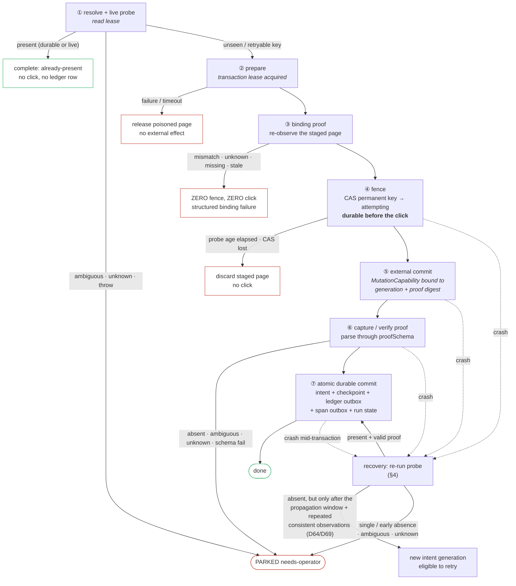

# 09 — Write-Safety: Fenced, Fail-Closed Real HR Mutations

Status: **revised 2026-07-22 after the whole-plan/legacy-code review; amended 2026-07-26
(Round 8), and 2026-07-31 (Round 10 — ordered actor-attributed ledger now; hash/tail tamper evidence
deferred by D79).** Round-8 amendments: **§13 OQ1 is RESOLVED** — the 2026-07-23 live probe proved Kuali
`save-verify` is buildable and produced four binding constraints on it — **OQ2 (OnBase) is restated
as blocked on a real upload target**, and **§14 designs the identity-approval gate** (D77
ALWAYS-GATE), the control that guards the wrong-**person** class this doc's fence explicitly cannot.
The write sequence includes
a fresh expected↔observed binding proof on the staged page before the fence, and crash recovery now
requires stabilized typed negative evidence before another generation may submit. The guarantee is
stated at the boundary the UI targets can actually support; this doc does not claim unconditional
distributed exactly-once from a browser probe.

This is the highest-stakes doc in the rebuild. It governs whether a real, sometimes irreversible HR
transaction (a UCPath termination, a ServiceNow ticket, a Kuali save, an OnBase filing) is protected
from duplicate unattended attempts and reported **done only when we are sure it landed**. The operator's non-negotiable
(charter §13, 2026-07-18): *"you have to be very sure they were completed"* — completion is
**FAIL-CLOSED everywhere**: an unknown or unverifiable result is **never** treated as done.

## Ownership (D1 — this doc owns / this doc references)

| This doc **owns** (siblings reference, never redefine) |
|---|
| The **write-safety contract** — the required `WriteSafety` field on a commit task, typed proof schema for every completion kind, idempotency probe/key, and fail-closed verdict protocol |
| The **kernel write sequence** — resolve/probe → prepare → subject bind → fence → external commit → proof → durable commit, and its ordering invariant |
| Fresh write-binding enforcement at the write seam and the subject-match/unscoped proof retained with the intent/ledger |
| The **crash-window fence** (`write_intents` SQLite table) and the **crash-recovery replay** (positive proof or stabilized negative-proof branching) |
| Typed, intent-generation-locked operator resolution for parked writes (confirmed present/absent; no generic Done/Retry) |
| **Double-submit prevention** — idempotency key derivation + the per-workflow probe-policy knob (§b) |
| The **immutable receipt/transaction ledger** — schema, location, ordered actor-attributed projection, never-pruned guarantee, what one entry records; hash-chain/tail-anchor is deferred by D79 |
| The **identity-approval gate** (§14) — the operator-confirmed subject selection that guards the wrong-**person** class, its resolver payload, staleness rule, and composition with the subject proof. *(Gate NODE mechanics — park/resume, subscriptions, command arm — are doc 02/03's; this doc owns what this particular gate asks and what its answer authorizes.)* |

| This doc **references** (owner) |
|---|
| `PrepareTaskContract`/`CommitTaskContract`, transaction-scoped dry-run composition, `MutationCapability`, error taxonomy, freshness, stores → **doc 01** |
| Transaction nodes, gates + `PARKED(needs-operator)`, checkpoint provenance/fingerprints, declared dependency DAG, `RunEnvelope` → **doc 02** |
| Span/note wire schema, isolated `.tracker-rebuild/` layout, SQLite system-of-record vs projection split (D14), completion fan-out union → **doc 03** |
| The injectable Clock (all timestamps), per-run test/prod instance selection, the config/secrets domain → **doc 11 (clock/config/secrets)** |
| The fill↔submit pairing guard + dry-run composition guard → **doc 10 (guard-architecture)** |
| Subject declarations, semantic `ObservationId`, driver evidence/bundles → **docs 01 and 12** |

Amendments at sibling seams (each is a one-owner-per-concept addition, not a redefinition):
- **Doc 01 §2.2** — `CommitTaskContract` requires `writeSafety`; its shape is owned here.
- **Doc 01 §6.2** — the mutation primitive requires both `CommitTaskCtx.mutation` and an open fence.
- **Doc 02 §5.6 #2 / §OQ2 (per D17 — doc 02 OWNS and adds these).** "Crash-mid-write always parks"
  becomes **probe-then-park**, and the transaction node gains required `probePolicy` and
  `probeToFenceMaxMs` fields.
  Doc 02 owns those fields; this doc owns only the recovery-probe *mechanism* they invoke.
- **Doc 03 §2.1 / §2.3 (per D21 — doc 03 OWNS and adds these).** The `ledger/` dir (never-pruned
  retention floor) and the `write_intents` **system-of-record** table live in doc 03's storage
  layout; this doc owns their *shape/semantics*, not their placement in the rebuild state tree.

---

## 0. Grounding — what exists today (the port inventory, real code)

Every row below is live-verified leaf knowledge the charter forbids re-deriving. It ports, wrapped.

| System | Confirmation today | Grounding (file:line) | Verdict |
|---|---|---|---|
| **UCPath** | Strong. `waitForTransactionOutcome` polls {error banner} vs {success marker}, error wins ties, and **RETURNS `"timeout"`** when neither appears; its caller **`clickSaveAndSubmit` then throws** *"…PeopleSoft's outcome is unknown, refusing to report success."* (`transaction.ts:855-859` — the throw is the caller's, not the poller's). T-number scraped by a second nav that re-finds the row **by EID (Person ID), not name**, and parses `Transaction ID: T…`; readback failure returns `""` which callers MUST treat as "couldn't read back," never "no transaction." | `ucpath/transaction.ts:42-66, 835-861, 919-985`; oath sibling `oath-signature/enter.ts:281-284` | Ports → `receipt` capture |
| **ServiceNow** | Medium. Only truly-positive receipt: `waitForURL` for a changed URL containing `number=`, parse `/^HRC\d{6,}$/`; **throws** *"no number= param in post-submit URL"* if absent. | `oath-upload/fill-form.ts:140-173` | Ports → `receipt` capture |
| **Kuali** | **NONE.** `clickSave` = click + `networkidle(15s)` + 2s sleep + `log.success`. Error detection was **deliberately removed** as false-positive-prone (matched benign DOM). Weakest of all. | `kuali/navigate.ts:634-652`; `kuali/CLAUDE.md` gotchas + 2026-04-10 lesson | **Must EARN a `save-verify` read-back** |
| **OnBase** | **NONE (negative only).** Success = the import postback landed on a page that is *not* a recognized ASP.NET error (`authenticated` OR `unknown` both pass). No positive "filed" signal. One-app-session-per-identity: never two logins at once. | `onbase/handler.ts:208-217`; `onbase/page-state.ts:149`; `onbase/LESSONS.md:137-176` | **Must EARN an `upload-verify` read-back, or allowlist unverifiable→always-park** |
| **Idempotency** | No keys, live-page probes, biased **fail-open→SUBMIT**. Onboarding `findExistingHireTransaction` (by name, hires have no EID) skips only on a high-confidence HIR/REH+effdt match; *"a false skip would silently never hire the real person, which is worse than the probe-guarded double-submit."* Separations `findExistingTerminationTransaction` (EID+effdt+"Terminatn"); the REAL guard is the **date-agnostic** `deletePendingTransaction` sweep that clears ALL in-progress Terminat rows for the EID. | onboarding `workflow.ts:488-521`; separations `steps/ucpath-transaction.ts:83-104`, `transaction.ts:1167`; `control/CLAUDE.md:36` ("no idempotency cache") | Ports → probes, **verdict widened to 3-valued** |
| **Crash window** | **oath-upload ONLY.** `submitAttempted:"true"` marker stamped **before** the POST (durable via the next `step=submit` emit); `hasUnverifiedPriorSubmit` refuses+escalates on recovery; `findPriorTicketForSession` (recorded ticket wins). SQLite fast-path + JSONL fallback so a retry's own rows can't mask a prior crash. | `oath-upload/handler.ts:249,273,309,388-454` | **Generalized into the kernel fence + recovery probe** |

**The two incidents this layer exists to make impossible:**
- **Duplicate person** (`ucpath/LESSONS.md:209-216`, 2026-07-01): a single dialog probe read too
  early classified a rehire as a new hire ⇒ onboarding created a duplicate person.
- **Wrong-person termination `T002173685`** (`separations/CLAUDE.md`, 2026-06-29): a name-search
  override date-matched a *different* career employee and filed a real termination against him —
  still needing manual reversal. **Honest scope:** that was a *wrong-data* error, not a duplicate.
  Idempotency prevents **double-filing**. Two distinct wrong-person paths now have distinct guards:
  upstream source/selection ambiguity is blocked by doc 02 freshness + the identity-approval gate;
  stale browser state showing a different person after correct selection is blocked here by a fresh
  subject observation on the exact staged page before fencing. The immutable ledger then makes any
  residual wrong-data filing attributable and reversible instead of burying it in row snapshots.

---

## 1. The one-sentence thesis + the fail-closed guarantee boundary

> **Every `effect:"commit"` task declares typed proof-of-landing (a receipt, saved-state proof, or
> uploaded-artifact proof)
> and an idempotency probe; the kernel drives a fixed resolve/probe → prepare → **binding proof** →
> fence → external commit → proof → durable-commit
> sequence around it; and every "is it done / is it already there?" question is answered by a
> FOUR-state verdict where both positive and negative claims carry evidence and `unknown` blocks —
> never a boolean that lets uncertainty read as success.**

The single mechanism that makes fail-closed structural is the **`ProbeVerdict`**: a probe or verify
read cannot return `true/false`. It returns `present | absent | ambiguous | unknown`. `present`
requires landing proof; `absent` requires typed observation evidence. `unknown` and `ambiguous`
route to `PARKED(needs-operator)` — never to a submit and never to a "done." After a fence, even an
evidenced `absent` must satisfy §4's propagation/consistency policy before retry authority exists. This
directly dissolves today's fail-open dichotomy (onboarding: *"skip and never hire" vs "blind
double-submit"*): the third answer is **park and let the operator decide**, which is strictly safer
than both.

**Guarantee boundary (D64).** The permanent key/CAS guarantees at most one unattended commit
attempt per intent generation. The kernel automatically converges to done from valid positive proof
or to a new generation from contract-valid stabilized negative proof. If the external UI cannot
authoritatively prove absence after its propagation window, recovery parks for operator resolution.
That is enforceable. “Exactly once against every remote UI regardless of consistency” is not.

---

## 2. The write-safety contract

### 2.1 The `WriteSafety` field (owned here; attached to doc 01's `CommitTaskContract`)

```ts
// temp_src/domain/contracts/write-safety.ts — bundle-safe: imports zod + TaskId ONLY (D3 guard)
import { z } from "zod";
import type { TaskId } from "./base.js";

/** Fail-closed verdict factory. `present` cannot exist without proof of the exact schema
 * required by the commit's completion arm; `absent` cannot exist without typed evidence of the
 * exact key/query/state observed. There is deliberately no untyped/boolean form. */
export const AbsentEvidenceSchema = z.strictObject({
  idempotencyKeyDigest: Sha256Schema,
  source: ObservationIdSchema,
  sourceState: PageStateIdSchema,
  observedAt: IsoInstantSchema,
  queryDigest: Sha256Schema,
  evidenceRef: EvidenceRefSchema,
});
export function probeVerdictSchema<Proof extends z.ZodType>(proofSchema: Proof) {
  return z.discriminatedUnion("state", [
    z.strictObject({ state: z.literal("present"), proof: proofSchema }),
    z.strictObject({ state: z.literal("absent"), evidence: AbsentEvidenceSchema }),
    z.strictObject({ state: z.literal("ambiguous"), matches: z.number().int().min(2) }),
    z.strictObject({ state: z.literal("unknown"), reason: z.string().min(1) }),
  ]);
}
export type ProbeVerdict<Proof extends z.ZodType> =
  z.output<ReturnType<typeof probeVerdictSchema<Proof>>>;

interface ProofCheck<Out extends z.ZodType, Proof extends z.ZodType> {
  /** The same parser validates normal commit output and recovery-probe backfill. */
  proofSchema: CanonicalJsonSchema<Proof>;
  proofFromOutput: (output: z.output<Out>) => z.input<Proof>;
  proofFromPresentProbe: (
    verdict: Extract<ProbeVerdict<Proof>, { state:"present" }>,
  ) => z.input<Proof>;
  /** Recovery/preflight-present must reconstruct the transaction node's full typed output; proof
   * alone is not a substitute for fields downstream nodes consume. Both schemas are parsed. */
  outputFromProof: (proof: z.output<Proof>) => z.input<Out>;
}

/** UCPath / CRM / ServiceNow — irreversible submits capture a verifiable receipt. */
export interface ReceiptCheck<Out extends z.ZodType, Proof extends z.ZodType>
  extends ProofCheck<Out, Proof> {
  kind: "receipt";
}
/** Kuali — typed saved-state proof, not merely a boolean/present verdict. */
export interface SaveVerifyCheck<Out extends z.ZodType, Proof extends z.ZodType>
  extends ProofCheck<Out, Proof> {
  kind: "save-verify"; verify: TaskId;
}
/** OnBase — typed artifact proof from a positive read-back. */
export interface UploadVerifyCheck<Out extends z.ZodType, Proof extends z.ZodType>
  extends ProofCheck<Out, Proof> {
  kind: "upload-verify"; verify: TaskId;
  /** Escape hatch (allowlisted + argued in doc 10): the page genuinely cannot prove landing. Then the
   *  submit ALWAYS parks needs-operator for manual confirmation — it never auto-reports done. */
  unverifiableByPage?: {
    reason: string;
    /** Must parse through proofSchema and exercise its operator-attestation discriminant. The
     * runtime replaces example values with the authenticated operator/Clock/evidence form. */
    operatorAttestationExample: z.input<Proof>;
  };
}
export type CompletionCheck<Out extends z.ZodType, Proof extends z.ZodType> =
  | ReceiptCheck<Out, Proof>
  | SaveVerifyCheck<Out, Proof>
  | UploadVerifyCheck<Out, Proof>;

export interface Idempotency<In extends z.ZodType> {
  /** A read task answering "is THIS exact transaction already present?" → ProbeVerdict. Runs
   *  pre-write AND on crash recovery. Declared with zero-age freshness (always live, never a stale
   *  checkpoint). Must resolve to a real effect:"read" task in the SAME store (guard §8). */
  probe: TaskId;
  /** The natural idempotency KEY — derived from STABLE business identity, NEVER row/position/index
   *  (the doc1/doc2 fix, §5). e.g. `${eid}|termination|${effectiveDate}`. Pure. */
  key: (input: z.output<In>) => string;
  /** What may turn a post-fence absence into retry authority (D64). Waiting is scheduler requeue,
   * never a sleeping task/worker. `operator-only` is mandatory when the target has no trustworthy
   * negative read or bounded propagation behavior. */
  recoveryAbsence:
    | { kind: "stabilized"; minSinceFenceMs: number;
        consistentReads: 2 | 3; minBetweenReadsMs: number;
        requireSameSourceState: true }
    | { kind: "operator-only"; reason: string };
}

export interface WriteSafety<
  In extends z.ZodType,
  Out extends z.ZodType,
  Proof extends z.ZodType,
> {
  completion: CompletionCheck<Out, Proof>;
  idempotency: Idempotency<In>;
}
```

`CommitTaskContract<Id, In, Out, Proof, Codes>` requires
**`writeSafety: WriteSafety<In, Out, Proof>`**. There is
no optional escape hatch: even a naturally idempotent external write must declare its key, proof,
and probe. All three completion arms carry a nontrivial `proofSchema`; recovery and normal commit
use the same parser, and `outputFromProof` must reconstruct a value accepted by the commit output
schema for preflight-present/recovery paths. The kernel then wraps it in doc 02's discriminated
`TransactionOutcome`, so downstream code sees whether this run committed or found prior work.
Probe/verify tasks are separate reads in the same store. An
`unverifiableByPage` proof schema is a discriminated union with an `operator-attestation` arm
containing operator, confirmedAt, exact artifact/business identity, and a non-empty evidence note;
its example is guard-parsed. It may never be a bare boolean or generic “mark done.”

Every prepare/commit pair must also carry compatible doc 01 `SubjectBindingSpec`s. The kernel
materializes the following strict proof; raw sensitive identifiers are not duplicated into event
or ledger files—the normalized comparison happens in memory and evidence keeps a digest plus the
minimum display-safe suffix/name needed to diagnose a mismatch.

```ts
export const SubjectProofSchema = z.strictObject({
  kind: z.literal("subject-match"),
  version: z.literal(1),
  runId: RunIdSchema,
  attempt: PositiveIntSchema,
  leaseId: LeaseIdSchema,
  taskId: TaskIdSchema,
  observationId: ObservationIdSchema,
  pageStateId: PageStateIdSchema,
  expected: SubjectEvidenceSchema,
  observed: SubjectEvidenceSchema,
  match: z.literal("match"),
  observedAt: IsoInstantSchema,
  afterPrepareSpanPath: SpanPathSchema,
});
export type SubjectProof = z.output<typeof SubjectProofSchema>;

/** D65: a commit with an explicitly reviewed `subject.kind:"none"` does not fabricate a subject
 * match. It still proves the exact staged page/lease and reviewed contract reason. */
export const UnscopedBindingProofSchema = z.strictObject({
  kind: z.literal("unscoped"),
  runId: RunIdSchema,
  attempt: PositiveIntSchema,
  leaseId: LeaseIdSchema,
  taskId: TaskIdSchema,
  pageStateId: PageStateIdSchema,
  reviewedReasonId: UnscopedCommitReasonIdSchema,
  observedAt: IsoInstantSchema,
  afterPrepareSpanPath: SpanPathSchema,
});
export const WriteBindingProofSchema = z.discriminatedUnion("kind", [
  SubjectProofSchema,
  UnscopedBindingProofSchema,
]);
export type WriteBindingProof = z.output<typeof WriteBindingProofSchema>;
```

The proof is valid only for the same run, attempt, lease, task, and prepared page state, and only
until the configured probe-to-fence budget. It cannot be reused after navigation, page reset,
retry, or lease transfer. A file write binds the artifact digest/document id; a person write binds
the system's displayed EID or another contract-declared strong identifier; a catalog/global write
must explicitly declare `subject.kind:"none"` with a reviewed, allowlisted reason and produces the
unscoped arm above. Name-only identity is not a
strong write binding unless that system truly exposes no stronger value, in which case the task
requires an operator gate and a dedicated scenario.

### 2.2 Per-system instantiation (three shapes, one mechanism)

```ts
// UCPath termination — receipt-bearing (ports transaction.ts:919-985 into ucpath/read-transaction-number)
writeSafety: {
  completion: { kind: "receipt",
    proofFromOutput: (o) => o.receipt,
    proofFromPresentProbe: (v) => v.proof,
    outputFromProof: (p) => ({ receipt: p }),
    proofSchema: z.strictObject({ transactionNumber: z.string().regex(/^T\d{6,}$/) }) },
  idempotency: {
    probe: "ucpath/find-existing-termination",                 // by EID + effdt + "Terminatn"
    key:   (i) => `${i.emplId}|termination|${i.effectiveDate}`,
    // Worked-example values only; migration must live-justify the real UCPath propagation policy.
    recoveryAbsence: { kind:"stabilized", minSinceFenceMs:30_000,
      consistentReads:2, minBetweenReadsMs:5_000, requireSameSourceState:true } },
}
// ServiceNow ticket — receipt-bearing (ports fill-form.ts:140-173)
completion: { kind: "receipt", proofFromOutput: (o) => o.ticketNumber,
  proofFromPresentProbe: (v) => v.proof, outputFromProof,
  proofSchema: z.string().regex(/^HRC\d{6,}$/) }
// Kuali save — save-verify, NO receipt (operator §13)
completion: { kind: "save-verify", verify: "kuali/read-saved-document",
  proofFromOutput, proofFromPresentProbe, outputFromProof, proofSchema: KualiSavedStateProof }
// OnBase upload — upload-verify, positive read-back OR allowlisted unverifiable→always-park
completion: { kind: "upload-verify", verify: "onbase/read-filed-document",
  proofFromOutput, proofFromPresentProbe, outputFromProof, proofSchema: OnBaseArtifactProof }
```

Kuali and OnBase are the one place the port is a **genuine addition** (§10): their submit tasks
cannot instantiate a passing `completion` without a new post-write read-back, because today they have
none. That is by design — the contract *forces* proof to exist.

---

## 3. The kernel write sequence

The kernel drives a fixed seven-beat sequence. It binds/parses the commit input first from workflow
input plus declared upstream outputs; commit input cannot depend on ephemeral prepare output. Beat ①
uses an ordinary read lease and releases it. Beats ②–⑥ use one uninterrupted exclusive transaction
lease, so a navigating probe can never destroy a staged form. Beat ③ is kernel-owned identity
binding on the exact staged page—no task callback can skip it. Dry-run composes beat ② only and has
no executable preflight/subject/fence/commit path or mutation capability. The impl author cannot
reorder the real-write beats.

```
① RESOLVE/PROBE → ② PREPARE → ③ BINDING PROOF → ④ FENCE → ⑤ EXTERNAL COMMIT → ⑥ PROOF → ⑦ DURABLE COMMIT
   read lease      transaction lease ──────────────────────────────────────────────────┘    DB + outboxes
```

**The same sequence with its crash seams and fail-closed exits.** Every ✗ is a park or a refusal,
never a fall-through; the only path to `done` runs the full spine. The seam that matters is between
④ and ⑦: a crash anywhere in there leaves a durable `attempting` intent, which is exactly what
recovery (§4) keys off.



| Beat | What runs | What is DURABLE at end of beat | Fail-closed exit |
|---|---|---|---|
| **① Resolve + live probe** | From the already parsed stable commit input, derive the key and read the permanent `write_intents` row regardless of status/originating run. `committed` or `observed-present` ⇒ validate/reuse proof+typed output; `attempting` ⇒ recovery/owner check; `retryable` ⇒ eligible generation. Only an eligible unseen/retryable key may run the policy-controlled live probe, on a separate read lease. Record probe completion monotonic time. | one SQLite transaction records an unseen live `present` permanently as `observed-present`, checkpoints `TransactionOutcome{disposition:"already-present",proofSource:"live-probe"}`, advances run state, and enqueues its audit span—but **no write-ledger row** | invalid stored proof/output ⇒ corruption/park; attempting owner live ⇒ wait/fail loud; stale owner ⇒ recovery first; live `present` ⇒ typed no-click completion; ambiguous/unknown/throw parks |
| **② Prepare** | Acquire the context-exclusive transaction lease and run the prepare contract. The parsed commit input is already frozen; prepare output is preview/span data only. Retry may restart from beat ① on a fresh/reset lease before any fence. | no write intent | prepare failure/timeout ⇒ release poisoned/clean page; no external side effect to recover |
| **③ Binding proof** | Resolve the commit contract's required `SubjectBindingSpec`. Person/artifact scope executes its semantic observation after preparation on this exact page and builds `SubjectProof`; explicitly unscoped scope validates the allowlisted reason plus exact staged page state and builds `UnscopedBindingProof`. Both parse as `WriteBindingProof`. | proof is not yet authority, but is held for the fence transaction and evidence bundle | mismatch, unknown, missing/stale observation, unregistered unscoped reason, wrong system/page state, or schema failure ⇒ no fence/no click; close/poison page and emit a structured binding failure |
| **④ Fence** | Check `probeToFenceMaxMs` **and** that `WriteBindingProof` was created after prepare for this run/attempt/lease. INSERT the unseen key or CAS its `retryable` row to `attempting`, incrementing generation. Store the parsed binding proof and enqueue `write.attempting` in the same SQLite transaction. The permanent primary key is the same-key mutex. | durable intent + binding proof + span outbox | elapsed proof or binding mismatch ⇒ no click; CAS conflict ⇒ discard staged page/no click; no generic retry after a won fence |
| **⑤ External commit** | The external-write helper requires the unforgeable `MutationCapability` bound to the open intent generation **and binding-proof digest**. | live HR side effect | missing/mismatched fence capability or binding digest ⇒ throw before click |
| **⑥ Capture / verify** | Extract `proofFromOutput` or run the verify read on the retained transaction page; every completion kind parses through its `proofSchema`. | proof remains in memory | absent/ambiguous/unknown/throw/schema failure parks; no arm can return unvalidated proof |
| **⑦ Atomic durable commit** | ONE SQLite transaction marks the intent committed and writes the schema-valid `TransactionOutcome` checkpoint, immutable ledger outbox row (including binding-proof digest), terminal-span outbox row, evidence receipt ref, and run state. JSONL ledger/span projectors run afterward. | all authorities/outboxes durable together | transaction failure leaves intent attempting and enters recovery; projector lag is repairable and never changes write outcome |

**Ordering invariant:** stable commit input and live probe exist before page preparation; a fresh
binding proof follows successful preparation on the same lease; the fence transaction in ④
stores that proof and happens-before the click; the click happens-before landing-proof validation;
proof validation happens-before the single ⑦ transaction. Ledger and span JSONL
are projections of durable outboxes, not additional commit beats. This generalizes oath-upload's
"marker durable before the POST" (`handler.ts:306-309`) into the kernel.

```sql
-- temp_src state.db — SYSTEM-OF-RECORD (D14: not rebuildable, not deletable). The crash-window fence.
CREATE TABLE write_intents (
  system          TEXT NOT NULL,   -- SystemId
  idempotency_key TEXT NOT NULL,
  workflow        TEXT NOT NULL,
  item_id         TEXT NOT NULL,
  node_id         TEXT NOT NULL,
  owner_run_id    TEXT NOT NULL,
  owner_attempt   INTEGER NOT NULL,
  generation      INTEGER NOT NULL DEFAULT 1,
  status          TEXT NOT NULL CHECK(status IN
                    ('attempting','retryable','committed','observed-present')),
  origin          TEXT NOT NULL CHECK(origin IN
                    ('automation-attempt','external-observed')),
  fenced_at       TEXT,
  committed_at    TEXT,
  binding_proof_json TEXT,               -- required for origin='automation-attempt'; live-probe
  binding_proof_schema_hash TEXT,        -- observed-present rows instead retain probe evidence
  binding_proof_digest TEXT,
  proof_json      TEXT,
  proof_schema_hash TEXT NOT NULL,
  output_json     TEXT,
  output_schema_hash TEXT NOT NULL,
  PRIMARY KEY (system, idempotency_key),
  CHECK(origin='external-observed' OR
        (binding_proof_json IS NOT NULL AND binding_proof_schema_hash IS NOT NULL
         AND binding_proof_digest IS NOT NULL))
);

CREATE TABLE write_attempts (
  system TEXT NOT NULL, idempotency_key TEXT NOT NULL, generation INTEGER NOT NULL,
  run_id TEXT NOT NULL, attempt INTEGER NOT NULL,
  status TEXT NOT NULL CHECK(status IN ('attempting','retryable','committed')),
  started_at TEXT NOT NULL, ended_at TEXT,
  binding_proof_json TEXT,         -- immutable proof for THIS generation; the intent holds latest
  binding_proof_schema_hash TEXT,
  binding_proof_digest TEXT,
  resolution_json TEXT,             -- typed operator/recovery evidence; never overwrites history
  PRIMARY KEY (system, idempotency_key, generation),
  CHECK(binding_proof_json IS NOT NULL AND binding_proof_schema_hash IS NOT NULL
        AND binding_proof_digest IS NOT NULL)
);

CREATE TABLE durable_outbox (
  id TEXT PRIMARY KEY, kind TEXT NOT NULL, aggregate_key TEXT NOT NULL,
  payload_json TEXT NOT NULL, created_at TEXT NOT NULL, projected_at TEXT
);
```

`write_attempts` contains only generations in which this automation crossed a fence; a live probe
that discovers an externally present transaction creates no attempt row. Committed and externally-
observed-present keys remain in the primary-key table forever. A later run with the same business key
parses and reuses the stored proof; it cannot create a second fence merely because the earlier row
is already satisfied. `observed-present` blocks a click but writes no ledger entry: discovering a
transaction is not evidence this automation filed it. There is no operator action that reopens a committed key. Normal recovery from a
proven-absent click changes the same row to `retryable` and increments its generation on the next
fence rather than deleting history. If an externally reversed transaction must legitimately be
filed again, its input carries a distinct audited correction/revision identity that derives a new
natural key; "void the fence and click again" is not an operation.

---

## 4. Crash-window recovery (positive proof or stabilized negative proof)

**The guarantee, stated precisely:** for any real commit, after a crash at *any* point recovery
selects exactly one of three outcomes and never retries from a single unproven UI miss:

1. **The write landed** (crash anywhere after ⑤) → recovery's probe returns `present` → the kernel
   runs `completion.proofSchema.parse(completion.proofFromPresentProbe(verdict))`, then
   `commit.output.parse(completion.outputFromProof(proof))` — the SAME validation
   beat ⑥ parsers run; a `present` proof is never trusted blind. On parse **success** it **backfills** the
   full typed `TransactionOutcome{disposition:"committed",proofSource:"recovery-probe"}`, marks the existing attempted intent committed, atomically
   enqueues ledger/span outboxes, and completes `done` (no second
   submit). On parse **failure** it **parks `needs-operator`** (a `present` we cannot validate is
   indeterminate, not done). There is **NO path to `done` with unvalidated proof—recovery
   included.**
2. **The write is proven absent.** One `absent` result is only an observation, not retry authority.
   The kernel validates its `AbsentEvidence` and schedules the **first qualifying** probe no earlier
   than `fencedAt + minSinceFenceMs` using a `not_before` requeue (no sleeping worker). It then obtains
   the configured 2–3 consistent observations separated by `minBetweenReadsMs`. Every counted
   observation—not merely the final one—must have `observedAt >= fencedAt + minSinceFenceMs` and
   bind the same key/query/authoritative source state. Earlier observations remain diagnostic only
   and contribute zero settlement votes (D69). Only then does
   the kernel record a strict `safe-to-retry` resolution and change the same intent to `retryable`;
   history is retained and the next attempt CAS-fences a new generation. A contract whose target
   cannot earn this proof declares `recoveryAbsence.kind:"operator-only"`.
3. **Indeterminate** (probe returns `ambiguous`/`unknown`, throws, returns malformed/different-key
   negative evidence, has not cleared its propagation window, disagrees across reads, or uses an
   `operator-only` policy) → `PARKED(needs-operator)` with
   a legible message naming the key, the system, and the match count — the operator verifies in the
   target system and uses one of the typed resolutions below. Never a guess.

**Recovery replay (resolves doc 02 §OQ2 — replaces "always park"):** on resume, the kernel first
scans `write_intents` for the resuming `(workflow,item_id,step_id)`. If it finds a row with
`status:"attempting"` and no `committed`, it **re-runs `idempotency.probe(key)` FIRST** (before any
`startAt` node logic) and routes on the evidence-qualified protocol above. Only after the probe resolves does
normal resume proceed. A read node with no fence auto-resumes as today (worst case: a repeated
read). This reads durable state from SQLite (system-of-record), never post-crash JSONL, mirroring
oath-upload's SQLite-fast-path recovery (`handler.ts:427-429`).

### 4.1 Parked-write resolution is typed and intent-scoped

A parked write does not inherit the queue's ordinary Done/Retry actions. The kernel exposes exactly
two intent-scoped resolutions, both requiring the current intent generation and an optimistic-lock
version so a stale browser action cannot race recovery:

1. **Confirmed present.** The operator supplies the exact business/artifact identity and proof. It
   parses through the same `completion.proofSchema`; `unverifiableByPage` uses the schema's typed
   `operator-attestation` arm. Success runs the same atomic beat ⑦ (intent committed + proof
   checkpoint + ledger/span outboxes + run state). Parse failure changes nothing.
2. **Confirmed absent.** The operator supplies a non-empty evidence note after checking the target
   system. SQLite records `{operator, confirmedAt, evidence, priorGeneration}` in `write_attempts`
   and changes the same permanent intent to `retryable`; only the next CAS may create a generation.
   The next generation must perform a fresh prepare+subject observation and writes a new immutable
   attempt proof; no prior `WriteBindingProof` is reused. It never deletes/reopens committed history and
   does not itself click.

Cancel or Hide may change the run/presentation but cannot alter the intent. There is no third “force
done” or “retry anyway” endpoint. Every resolution emits an audited note and is covered by strict
command schema, stale-generation, and double-click tests.

---

## 5. Double-submit prevention

**Idempotency key from stable identity, never position.** The `key` function takes the parsed
workflow-derived input and returns a natural business key: `${eid}|termination|${effectiveDate}`,
`${sessionId}|${pdfHash}` (oath-upload today), `${eid}|hire|${jobCode}|${effdt}` (onboarding — note
hires have no EID pre-hire, so the key uses name+effdt+jobCode, the same fields
`findExistingHireTransaction` matches on). It **never** incorporates run position, attempt number,
array index, or the OCR fan-out index — that is the doc1/doc2 (E2E-015) shared-id fallback, banned in
the fan-out (`buildFanOutItemIdResolver`) and banned here (§8). Two runs for the same
person+type+date derive the same key, so beat ① sees the first run's committed intent and refuses to
double-file.

**Two probe kinds are distinct and both port** (separations taught us the difference):
- The **idempotency probe** reads *processed/filed* transactions (a committed `T…` exists) —
  `findExistingTerminationTransaction` keyed EID+effdt+"Terminatn".
- The **date-agnostic pending sweep** (`deletePendingTransaction`, `transaction.ts:1167`) is a
  *commit cleanup* that deletes ALL in-progress unprocessed Terminat rows for the EID regardless of
  effdt — it catches a stale prior attempt carrying a *different* computed effdt that the date-keyed
  probe misses. It ports as its own `ucpath/clear-pending-terminations` transaction composed BEFORE
  termination (it has its own durable key and typed proof: deleting nothing is a validated no-op;
  deleted row identities are its proof).

**The per-workflow probe-policy knob (charter §b — decided at migration, NOT defaulted here).** Beat
① (the *pre-write* probe) is governed by a per-workflow knob; the *recovery* probe (§4) is always on
regardless.

```ts
// on the transaction node (doc 02 owns the field; semantics owned here)
probePolicy: "always" | "retries-and-recovery-only";   // REQUIRED — no default
probeToFenceMaxMs: number;                              // REQUIRED, >0 — migration-justified
```

- `"always"` — probe before every submit (one extra live read per submit; safest; closes the crash
  window even on the first attempt).
- `"retries-and-recovery-only"` — may skip only the live-page probe when the durable key has never
  existed. Durable lookup is never skipped, committed keys are never exempt, and retries/recovery
  always probe. The trade-off is failure to notice an older external transaction absent from this
  automation's ledger, not permission to repeat one already committed here.

Both fields are **required** (compile error if omitted on a transaction), which forces the §b
migration question to answer policy and maximum preflight age per workflow. There is **no hardcoded
default**. The Clock's monotonic time measures probe completion → fence; expiration discards the
prepared page and restarts at preflight, never clicks on an over-age result.

---

## 6. The immutable receipt / transaction ledger

**Purpose (operator §13):** an immutable record of what real transactions were actually filed, **never
pruned** — it outlives doc 03's decided base retention (spans 30d / notes 30d, D86) and the
`clean-tracker` sweep.

```ts
// temp_src/domain/ledger.ts — the append-only at-rest entry shape.
// Beat ⑦ writes its unsequenced payload to durable_outbox; the projector adds ordered seq.
export interface LedgerEntry {
  outboxId: OutboxId;             // immutable DB identity; projector idempotency key
  seq: NonNegativeInt;            // assigned transactionally by the serialized projector
  workflow: WorkflowId;
  itemId: ItemId;
  system: BrowserSystemId;        // ucpath | crm | servicenow | kuali | onbase
  idempotencyKey: IdempotencyKey; // the natural key (§5) — dedupe + audit join
  proof: CanonicalJsonValue;      // already parsed by the referenced completion proof schema
  proofSchemaHash: Fingerprint;
  completionKind: "receipt" | "save-verify" | "upload-verify";
  proofSource: "normal-output" | "recovery-probe" | "operator-attestation";
  bindingProofDigest: Sha256;       // exact subject-match or unscoped proof stored on the intent
  subject?: SubjectEvidenceWire;    // present only for subject/artifact-scoped commits
  runId: RunId; traceId: TraceId; attempt: PositiveInt;
  operator: OperatorId;           // from the config domain (doc 11), never fabricated
  instance: "prod" | "test";      // resolved run snapshot (doc 11)
  configFingerprint: Fingerprint;
  dryRun: false;                  // real writes only; a dry run composes no submit, so writes NO ledger entry
  fencedAt: IsoInstant;           // durable instant before the click
  confirmedAt: IsoInstant;        // proof accepted; may be later after recovery/manual confirmation
  externalOccurredAt?: IsoInstant;// only when the external proof itself supplies a trustworthy time
}
```

`LedgerEntrySchema` is a strict discriminated/runtime schema and verifies the proof again by
`proofSchemaHash` during projection/read. The interface is shown only for readability; persisted
code uses its inferred type. There is no unchecked cast from the generic canonical proof envelope.

- **Location:** `.tracker-rebuild/ledger/<system>-<YYYY-MM-DD>.jsonl` (doc 03 §2.1). JSONL so the
  operator greps it; per-system+day partition so `grep 10694136 .tracker-rebuild/ledger/ucpath-*.jsonl`
  answers "what did we file for this person?" across time.
- **Never pruned (retention floor):** rebuild cleanup (which prunes `spans/` and `notes/` at
  30d—D86) skips `ledger/` unconditionally—a ratchet guard fails
  if any prune path can reach `ledger/`. This is the "immutable transaction ledger, never pruned" of
  operator §13. The never-pruned floor sits above a *settled* number (D21), not a guessed one.
- **Serialized ordered projection.** Executors never append the ledger file. Beat ⑦ writes a
  unique ledger outbox row. One projector holds a SQLite lease for `(system,date)`, assigns the next
  sequence, appends one canonical actor-attributed line, fsyncs, and marks that outbox projected.
  Restart reconciles committed intents/outboxes against `outboxId` + sequence and appends only
  missing entries; duplicate, gap, malformed-tail, or order conflicts stop projection and surface
  degraded health rather than silently rewriting history.
- **Hash-chain/tail-anchor deferred (D79).** `prevHash`, `ledger_heads`, and tamper-evident tail
  verification are not initial single-operator requirements. They return only with the multi-user
  phase or a separately ratified compliance requirement. Never-pruned retention, strict schemas,
  atomic outboxes, one ordered projector, actor attribution, backups, and reconciliation remain.
- **Projection is idempotent** by `outboxId`. Recovery audits committed intents against ledger and
  terminal-span outboxes, creates only missing outboxes in SQLite, then lets projectors catch up.
- **One entry = one filed transaction.** The ledger is the durable superset of the `write.committed`
  span events (gap-audit gap 5: "receipts ARE the ledger"). It records a confirmed automation
  attempt, not a claim that `confirmedAt` equals the external filing instant. A preflight probe that
  merely discovers an existing external transaction produces `write.skipped-existing` audit state
  and no ledger entry.

---

## 7. Fail-closed everywhere — every place `unknown` could leak into `done`, and its exit

The operator's core requirement. Exhaustive:

| # | Where "unknown" could become "done" | Fail-closed exit |
|---|---|---|
| 1 | Pre-write probe (①) can't determine presence | `unknown` verdict ⇒ `PARKED(needs-operator)` — never submit |
| 2 | Pre-write probe finds >1 match | `ambiguous` ⇒ `PARKED` — never guess which is "the" transaction |
| 3 | Probe read **throws** (page/net error) | wrapped as `unknown` (a failed check ≠ "found nothing" — the charter catch-swallow ban) ⇒ `PARKED` |
| 4 | Receipt read-back returns `""` (UCPath) / no `number=` (ServiceNow) | missing/empty receipt ⇒ `PARKED("clicked, cannot prove it landed")` — mirrors today's "refusing to report success" throw |
| 5 | Captured proof fails its `proofSchema` | schema-fail ⇒ `PARKED`, never `done{committed:true}` |
| 6 | Kuali `save-verify` can't confirm the save | any verdict ≠ `present` ⇒ `PARKED` |
| 7 | OnBase `upload-verify` can't confirm the filing | any verdict ≠ `present` ⇒ `PARKED`; `unverifiableByPage` allowlist ⇒ **always** `PARKED` for manual confirm (never auto-done) |
| 8 | Crash mid-write, recovery probe indeterminate | `ambiguous`/`unknown`/throw/malformed absence ⇒ `PARKED`; `present` ⇒ backfill-done only after the arm's `proofSchema`; `absent` becomes retry authority only after every counted observation was captured after the propagation window and clears the repeated-observation policy, otherwise parks (D64/D69) |
| 9 | A commit `run` returns success with no proof | kernel rejects at ⑥ ⇒ `PARKED` |
| 10 | The mutation primitive fired without a fence (a mis-authored submit) | primitive throws (⑤) — corruption, loud |
| 11 | dry-run: no submit composed at all (charter §1a) | write-safety never engages; nothing to make done — clean, no leak |
| 12 | Live probe aged while the form was prepared | `probeToFenceMaxMs` expires ⇒ discard page and restart at preflight; no fence/click |
| 13 | Operator clicks a stale/generic Done or Retry on a parked write | those actions do not exist; present proof/absent evidence endpoints require intent generation+version and fail on conflict |
| 14 | Staged page shows another person/file, or the identity cannot be read | beat ③ returns mismatch/unknown ⇒ zero fence, zero mutation capability, poisoned/closed lease, structured failure + diagnostic bundle |
| 15 | A commit declares no subject and therefore has nothing to bind to the fence | `subject.kind:"none"` requires an allowlisted reason and a schema-valid unscoped page-state proof; otherwise zero fence. The capability always binds to a `WriteBindingProof` digest (D65) |

The unifying rule: **only schema-valid landing proof plus schema-valid reconstructed/normal
transaction output yields `done`; only an actual fenced automation attempt yields a write-ledger
entry. An absence after a click retries only after schema-valid negative evidence satisfies the
recovery-settlement policy; every other ambiguous, unknown, thrown, empty, early, or inconsistent
outcome parks.** A boolean probe would
collapse #1/#3/#8 into "false ⇒ proceed"; the `ProbeVerdict` type makes that collapse
*unrepresentable*.

---

## 8. Mechanical guards (fail-loud ratchets, `npm run test:architecture`)

- **`write-safety-contract.test.ts`** — every `effect:"commit"` contract MUST declare write safety;
  no allowlisted escape hatch. Every completion arm has nontrivial `proofSchema`, normal-output and
  recovery-probe extractors, `outputFromProof`, and fixtures proving normal/recovery/preflight-
  present paths parse the same proof and commit-output schemas and yield the correct discriminated
  `TransactionOutcome`.
- **Probe/verify resolution** — `idempotency.probe` and any `save-verify`/`upload-verify` `verify`
  TaskId resolve to a real `effect:"read"` task in the **same store**, whose output is (or extends)
  `ProbeVerdict`, whose contract declares zero-age freshness. Table-driven over the store index.
- **Fence-before-click** — a unit fixture asserts the `write_intents` SQLite commit is observed
  before the mutation primitive is invoked; the primitive throws when invoked with no open fence
  or when its capability's binding-proof digest does not match the fenced intent.
- **Subject-before-fence** — every commit contract has a strong/explicit-none subject declaration;
  prepare/commit subjects are compatible; the driver observation resolves in the same system.
  Ordering tests assert prepare-end < subject-observed < fence-commit < mutation-call. Registered
  scenarios cover match, mismatch, unknown/missing element, stale proof after navigation, stale
  proof after retry, and two EIDs alternating through one pooled page.
- **Unscoped binding allowlist** — every commit with `subject.kind:"none"` has one reviewed reason
  and builds the D65 unscoped proof on a registered page state; stale entries fail in reverse. A
  fixture proves no empty/fabricated subject evidence is accepted and the mutation capability is
  bound to the unscoped proof digest.
- **Same-key sequential + concurrent dedupe** — fixtures cover two simultaneous starters and a
  later fresh run after the first committed. Both reuse/block on the permanent primary-key intent;
  neither can create a second fence/click. An unseen live `present` becomes `observed-present`,
  produces typed output but no ledger outbox, and remains permanently click-blocking.
- **Crash-recovery** — a fixture injects a `write_intents{status:"attempting"}` with no `committed`
  and asserts the recovery probe runs FIRST and routes present→(schema-parse then)backfill /
  present-with-receipt-failing-schema→park (D19) / one early absent→requeue-or-park / stabilized
  same-key negative evidence→retry / inconsistent or malformed absence→park / operator-only→park /
  unknown→park. Manual Clock fixtures cross the exact propagation/read-spacing boundaries without
  sleeping.
- **Atomic outbox + ledger integrity** — crash injection at every subpoint of beat ⑦ proves the
  intent/checkpoint/ledger-outbox/span-outbox commit is all-or-none. Concurrent projector fixtures
  prove one ordered stream, actor attribution, idempotence by outbox id, and loud failure on
  sequence gaps, malformed tails, duplicates, or missing files. Hash-chain/tail-anchor tests wait
  for the deferred multi-user upgrade.
- **Idempotency key hygiene** — a grep/AST guard flags an `idempotency.key` body referencing
  `attempt`, `index`, `runId`, or array position (the doc1/doc2 ban); keys must read input fields.
- **Transaction pairing** — every prepare and commit contract is paired in a transaction node;
  neither is legal standalone, the lease scope is transaction-wide, and a dry-run executable plan
  contains the prepare arm but zero commit arms or mutation capabilities (doc 10).

---

## 9. Composition with the existing docs (no redefinition)

- **Charter §1a (fill/submit split).** Fill is `effect:"prepare"`, submit/save/upload is
  `effect:"commit"`, and one transaction node retains the page lease across both. A dry-run plan
  includes prepare and excludes commit, so no fence/probe/ledger work begins.
- **Doc 01 §6.2 (mutation primitive).** `stores/common/mutation.ts` accepts only the commit ctx's
  capability bound to the open intent generation + `WriteBindingProof` digest; no boolean dry-run
  branch exists.
- **Doc 02 §5.6/§5.7 (checkpoints/resume).** Transaction nodes checkpoint their full typed
  `TransactionOutcome`
  and retain the validated proof on the permanent intent; a transaction
  whose committed/satisfied key exists reuses its validated proof+output. Beat ⑦'s transaction-output checkpoint and
  the `write_intents` row share the `(workflow,item_id,step_id,attempt)` key. §5.6 #2 is upgraded per
  §4. The freshness walk (D8) is orthogonal and upstream: it keeps *stale read data* out of the fill;
  write-safety keeps duplicate writes out of commit — two different holes, two different guards.
- **Doc 02 gates (D5).** `PARKED(needs-operator)` is doc 02's park state; write-safety is one of the
  producers of it. Parking closes browser contexts before releasing exclusive leases; resume reacquires and
  re-enters at the recovery probe.
- **Doc 03 (spans/storage/ledger dir).** `write.attempting` and `write.committed` are two new span
  events (the fence + the commit); subject observation is `subject.observed`, and proof/evidence
  refs ride strict run-detail updates. Per **D21**,
  doc 03 OWNS and adds the `ledger/` dir (never-pruned retention floor) and the `write_intents`
  SQLite **system-of-record** table (added to the D14 set) in its storage layout — this doc
  references them, it does not place them in the `.tracker/` tree.
- **Clock/instance (doc 11).** Every timestamp (`fenced_at`, `committed_at`, ledger `fencedAt` /
  `confirmedAt` / optional `externalOccurredAt`) comes from the
  injectable Clock; `operator` and `instance` (prod/test) come from the config/secrets domain and
  RunEnvelope — all owned by **doc 11** — so the ledger never fabricates a time or lets a test read
  look like a prod filing.

---

## 10. Port inventory (verbatim-wrapped vs newly built)

**Ports verbatim, wrapped in the contract:**
- UCPath `waitForTransactionOutcome` (polls, RETURNS `"timeout"` on neither-signal) + its caller
  `clickSaveAndSubmit`'s "outcome unknown, refusing to report success" throw (`transaction.ts:855-859`)
  + `readLatestTransactionNumber` (`transaction.ts:919-985`) → UCPath submit tasks' `receipt`
  capture (beat ⑥) and the `""`-means-unknown rule (fail-closed #4). The by-EID (not name) row
  re-find ports as-is.
- ServiceNow `submitAndCaptureTicketNumber` + `parseTicketNumberFromUrl` (`fill-form.ts:140-173`) →
  ServiceNow `receipt` capture.
- oath-upload `submitAttempted` + `hasUnverifiedPriorSubmit` + `findPriorTicketForSession` +
  SQLite-fast-path recovery (`handler.ts:249,273,309,388-454`) → the generalized `write_intents`
  fence + the recovery-probe replay (§4).
- Separations `findExistingTerminationTransaction` (`steps/ucpath-transaction.ts:83-104`) → the
  `ucpath/find-existing-termination` probe; `deletePendingTransaction` (`transaction.ts:1167`) → the
  `ucpath/clear-pending-terminations` cleanup transaction (§5).
- Onboarding `findExistingHireTransaction` + `decideHireDuplicateSkip` (`workflow.ts:488-521`) → the
  hire probe — its verdict widened from boolean fail-open to `ProbeVerdict` (its high-confidence skip
  becomes `present`; its low-confidence "fail open→submit" becomes `absent`; its genuinely-ambiguous
  case becomes `ambiguous`→park, which is the safety upgrade).

**Newly built (mostly the write-ahead layer — the gap audit's "mostly new"):**
- The permanent-key intent table, atomic outboxes, fixed sequencer, `ProbeVerdict`, serialized
  ordered ledger projector, and recovery reconciliation.
- **Kuali `kuali/read-saved-document`** — a positive `save-verify` read-back that does NOT exist today
  (Kuali removed its error detection as false-positive-prone). Must be built and live-verified before
  Kuali submit tasks can instantiate a passing `completion`.
- **OnBase `onbase/read-filed-document`** — a positive `upload-verify` read-back replacing today's
  negative "not an error page" (`handler.ts:208-217`). If a reliable positive read proves infeasible,
  the documented `unverifiableByPage` allowlist makes the OnBase submit **always** park for the
  operator's manual confirmation (which the operator already does — §13).

---

## 11. Adversarial self-review — how this could still fail, and residual risk

- **Same-key sequential/concurrent dedupe and positive recovery backfill are closed.** The permanent
  `(system,idempotency_key)` primary key covers attempting and committed states, so a later pristine
  run cannot fence again. Recovery no longer trusts a present proof blind: the completion arm's
  `proofSchema` parses it, parse-fail →
  park, so there is no unvalidated path to `done`. **Honest scope (D20):** this closes
  two unattended generations from arising from one early post-fence miss. It does not create
  distributed exactly-once when a target cannot supply authoritative positive/negative evidence;
  those cases park. Duplicate-*person* remains a separate racy-selection residual (next bullet).
- **The probe/verify read is itself a read that can lie.** A false `present` skips a needed write; a
  false `absent` before a first submit can still permit a duplicate of external work, and no UI
  read can prove distributed exactly-once absolutely. *Guards:* zero-age freshness (never a
  checkpoint); exact-match on the stable key; typed negative evidence; post-fence propagation +
  repeated-read stabilization; `ambiguous`/`unknown` park; a throwing probe is `unknown`, not
  `absent` (charter catch-swallow ban). **Residual:** a
  probe that reads too early (the duplicate-person root cause) could report `absent` on a
  still-rendering page — mitigated only by porting the race-based classifiers
  (`raceNewHireVsRehireSignal`) into the probe impls, a review+live-verify discipline, not a
  mechanical guard. **This is the deepest residual and must be live-verified per probe at migration.**
- **Kuali/OnBase have no machine receipt.** `save-verify`/`upload-verify` reads may themselves be
  weak (Kuali's deleted error-detection was false-positive-prone). **Residual, stated honestly:** if
  a reliable positive read-back can't be built, OnBase falls to `unverifiableByPage`→always-park and
  Kuali's `save-verify` may over-park on benign pages. Over-parking is fail-*closed* (safe but noisy);
  the real risk is a `save-verify` that returns a false `present` and reports a save that didn't land.
  This is the one place the fail-closed guarantee rests on read quality we cannot fully mechanize.
- **Wrong-DATA is only partly covered here.** Fresh subject binding structurally blocks one critical
  subtype: the staged browser page belongs to someone/something other than the expected commit
  subject. It does **not** prove that upstream rules selected the correct real-world person, action,
  effective date, pay data, or document content. Those remain doc 02 freshness, typed validation,
  scenario coverage, and identity/operator gates. The ledger makes residual wrong filings
  attributable. Exactly-once plus subject-match is still not correctness of every field.
- **Fence bypass.** A future submit task could fire a raw click outside the mutation primitive.
  *Guard:* tasks have no raw Page/Locator/selector access (docs 01/12); submit-capable driver methods
  require the mutation capability, and that primitive validates the fence + subject digest. Per
  **D22** doc 10's
  `commit-routes-through-mutation` ratchet is an import/capability check that every `effect:"commit"`
  impl routes its submit click through `stores/common/mutation.ts` — so "fence-before-click is
  unbypassable" is now structural, not grep-hopeful. **Residual:** a leaf that reaches a submit via a
  novel un-wrapped helper the import walk doesn't recognize as a click — narrowed to review, not
  wide open.
- **Probe-policy misconfig.** `"retries-and-recovery-only"` can miss a transaction created outside
  this ledger on a pristine key; it cannot bypass durable committed history. The choice remains a
  required migration decision and should default by review preference to `always`.
- **Ledger damage/loss.** Strict entry parsing, ordered outbox reconciliation, backups, and degraded
  health catch malformed/gapped projection state; hash-chain/tail-anchor tamper evidence is deferred
  to multi-user work (D79), so malicious coherent local rewriting remains out of current scope.

---

## 12. Worked example — a separations termination, with a crash

Input `{ emplId:"10694136", action:"termination", effectiveDate:"08/01/2026" }`, dry-run **off**,
`instance:"prod"`. Composed nodes: cleanup transaction → termination transaction whose prepare arm
is `ucpath/fill-termination`, commit arm is `ucpath/submit-termination`, and probe policy is always.

**Happy path (seven beats):**
```
bind stable commit input + key="10694136|termination|08/01/2026"
① durable lookup → unseen; separate read lease runs find-existing-termination →
   { state:"absent", evidence:{idempotencyKeyDigest,source,sourceState,observedAt,queryDigest,evidenceRef} }
   release read lease; record monotonic probe completion
② acquire exclusive transaction lease; fill-termination stages the form
③ driver observes ucpath.smart-hr.subject-eid="10694136" on the staged page;
   kernel matches expected EID and constructs WriteBindingProof{kind:"subject-match",leaseId,
     pageStateId,observedAt,digest}
④ probe/subject age < probeToFenceMaxMs; fence
   write_intents{key,status:"attempting",binding_proof_digest} COMMITTED (SQLite)
   → span write.attempting
⑤ commit mutation primitive: Save+Submit click (matching fence+subject capability → fires)
⑥ capture readLatestTransactionNumber (re-nav on retained transaction page) → "T002173999"
         pick(o)=o.receipt; schema z.strictObject({transactionNumber:/^T\d{6,}$/}).parse → ok
⑦ atomic DB commit: typed TransactionOutcome{disposition:"committed",proofSource:"normal-output"}
                        checkpoint + write_intents{status:"committed",
                           proof_json, output_json, binding_proof_json}
         + ledger/span outboxes { system:"ucpath", idempotencyKey:"10694136|termination|08/01/2026",
                           proof:{transactionNumber:"T002173999"}, operator, instance:"prod",
                           dryRun:false, proofSource:"normal-output", bindingProofDigest,
                           fencedAt, confirmedAt:clock.now() }
           // ledger projector assigns seq/prevHash only after claiming this outbox
         + span write.committed + span.ended(done)
```

**Crash AFTER the click (⑤) but BEFORE capture (⑥).** The executor dies; the Save landed in PeopleSoft
but no receipt was recorded. Lease expiry re-enqueues the run; recovery (§4) runs FIRST:
```
scan write_intents (separations, 10694136-item, ucpath-submit) → status:"attempting", no committed
re-run ucpath/find-existing-termination key="10694136|termination|08/01/2026"
  → { state:"present", proof:{transactionNumber:"T002173999"} }   // the row PeopleSoft now shows
⇒ BACKFILL in one DB transaction: committed proof + ledger/span outboxes + done
⇒ NO second Save. The permanent fence and typed positive proof establish convergence without a
second unattended commit attempt.
```
Had an early recovery probe returned `absent`, it would be retained only as diagnostic evidence.
The kernel would requeue without occupying a worker, take its first qualifying observation at least
30s after the fence, then require a second same-key/same-state absence at least 5s
later before marking the intent retryable. An early, malformed, or disagreeing absence would park.
Had it returned `ambiguous` (two "Terminatn" rows for that EID+date) or
`unknown` (grid didn't render) → `PARKED(needs-operator)`: *"termination for EID 10694136 effdt
08/01/2026: probe found 2 matches / probe indeterminate — verify in UCPath, then retry or mark
done."* Had the present proof failed `proofSchema` → `PARKED`, never `done`.
Never a guess, never a duplicate `T…`.

**Two runs, same key (D18).** Suppose a second run for the same
`{10694136, termination, 08/01/2026}` starts while the first is mid-submit. Its beat ① consults
`write_intents` FIRST, finds the first run's `attempting` row on
`idempotency_key="10694136|termination|08/01/2026"`, and **fails loud without fencing or clicking** —
*"another run is mid-submit for key 10694136|termination|08/01/2026 — refusing to double-fence."*
Even if two starters race, one permanent-key INSERT/CAS wins. After commit, any future run finds and
reuses the proof. Concurrent and sequential duplicates are both blocked.

**Honest scope (D20/D64).** This is how the known double-**FILE** paths are controlled: the permanent
fence + same-key mutex (D18), plus the pre-Save `present` probe and evidence-qualified recovery,
prevent a second unattended click unless a new generation first earns typed stabilized-negative
authority. Every uncertain state parks instead of fail-open→SUBMIT. This is deliberately not a
claim of unconditional distributed exactly-once for a UI-only target.
The duplicate-**PERSON** class (the too-early racy read that classified a rehire as a new hire — §0)
is **NOT** structurally closed by subject binding: the selected record and staged page could agree
while the selection itself was wrong. That remains a disclosed residual mitigated by porting race
classifiers, typed ambiguity, per-probe live verification, identity gates, and the conditional
create-path pending-termination sweep (§11). The fenced-generation guarantee controls duplicate
attempts; subject binding means no commit on an observably different open record; neither alone
proves every business choice.

---

## 13. Open questions for the operator / orchestrator

1. ~~**Kuali `save-verify` reliability**~~ — **RESOLVED 2026-07-23 by live probe (D78): BUILDABLE.**
   Run under operator authorization on Action List docs 4444/4453 (RRSS Separation Request Forms,
   new/unworked). Doc 4453 **read-only**: every separations-relevant field (name, EID, last day
   worked, separation date, termination type, timekeeper, status) read deterministically by
   **role + exact label** from the accessibility tree, byte-identical across reload. Doc 4444
   **write round-trip**: the timekeeper field (the benign field the legacy flow fills on drafts)
   written `PROBE-DELETE-ME` → Save → reload → value persisted; cleared → Save → reload → empty;
   full-form normalized diff before/after clean, doc restored byte-identically, no workflow buttons
   touched. Evidence: `.screenshots/kuali-probe/` (6 PNGs + 5 a11y dumps).
   **Four design constraints this produced — they are requirements on the `save-verify` arm, not
   trivia:** (a) **save success is UI-silent** — no toast, no banner — so a **reload read-back is
   mandatory** and "clicked without error" may never count as proof (this independently confirms
   the 2026-04-10 lesson that killed Kuali error detection as false-positive-prone); (b) date
   values render as **child text nodes**, so the reader must descend, not read the labelled node's
   own text; (c) **DOM refs change on every reload**, so the verifier anchors on role + exact label
   (literal `*` included) and never on a captured ref; (d) a full fill→save→reload→verify cycle
   costs **~8–10s/doc**, which is the budget the transaction node must carry. The doc URL is a
   stable reload-safe deep link but carries an opaque `actionId` — capture it at open.
2. **OnBase positive read-back vs always-park — BLOCKED, not deferred (D78).** The question is
   unchanged (is a live-verifiable "document filed" read achievable, or does OnBase take the
   `unverifiableByPage` allowlist → always-park for manual confirm, aligned with "operator tracks
   completion manually"?), but it cannot be answered without a target: **no uploadable probe
   document exists today**, so the probe is gated on the next real document upload (operator,
   2026-07-24). Consequence to be explicit about before order 7: if OnBase lands on always-park,
   its automation degrades to "the operator manually confirms every upload," which changes the
   daily workload rather than the safety story. Owner: this doc; gate: doc 07 §3.8.
3. ~~Ledger tamper-evidence altitude~~ — **amended by D79:** hash chain + independent tail anchor
   are deferred until multi-user or a separately ratified compliance need. The initial ledger is
   never-pruned, ordered, actor-attributed, strict, backed up, and reconciled from atomic outboxes.
4. **Probe policy + elapsed budget per workflow (§b).** For each migrating workflow: `"always"`
   (safe, +1 round-trip) or `"retries-and-recovery-only"` (cannot detect a prior external write on
   an unseen key), and what justified `probeToFenceMaxMs` bounds preparation after that probe?
   Asked per workflow at migration — this doc sets the mechanism, not the values.
5. **Pending-sweep as write-safety.** Should `ucpath/clear-pending-terminations` (the date-agnostic
   sweep — the real duplicate guard today) be a first-class write-safety pre-step on every UCPath
   create path, or only on separations? It mutates (deletes rows), so it needs its own fence/ledger
   treatment — confirm the modeling.

---

## 14. The identity-approval gate — the wrong-PERSON control

Status: **designed 2026-07-26 (D77).** Policy ratified by the operator 2026-07-24: **ALWAYS-GATE**
— manual approval on every separation, for both separation types the operator distinguishes
(**Kuali separations** and **I-9 separations**), with **no auto-approve-on-match mode**.

### 14.1 Why this section exists at all

Everything else in this doc guards the *double-file* class. It cannot guard the *wrong-person*
class, and §0 says so: incident `T002173685` was a **wrong-data** error — a name-search override
date-matched a different career employee and filed a real termination against him. A permanent-key
fence would have fenced that write perfectly and filed it anyway, because the key was derived from
the wrong person. The probe would have found no prior termination for that person, correctly, and
authorized the click.

Until this pass the program's design effort was inverted: ~60KB specified the fence that admittedly
cannot prevent the incident, while the control that *can* was one line in doc 07 saying it "has no
design yet," deferred to migration order 8 — the very last workflow. The operator's ALWAYS-GATE
ratification made the policy cheap to design, so it is designed here, in Phase 0.

**Two layers, two different questions — both required, neither substitutes for the other:**

| Layer | Question it answers | Failure it catches | Owner |
|---|---|---|---|
| **Identity-approval gate** (this section) | *Is this the right person to act on?* | wrong business selection — a name match that resolved a different real employee | operator decision |
| **Fresh subject binding** (§ binding proof) | *Is the page I am about to click on showing that person?* | correct selection, stale/switched page state | machine observation |

A run must pass both. The gate produces an **approved subject**; the binding proof asserts the
staged page equals that approved subject at the instant of the fence. Neither is inferable from the
other, and the gate's answer is what the binding proof's `expected` side is bound to.

### 14.2 What ports, and what deliberately changes

The legacy implementation is live-verified and ports nearly whole (`src/domain/identity-approval.ts`
+ `src/control/ops/eid-approval.ts` + the dashboard `EidApprovalBanner`): the two-candidate
side-by-side presentation, the per-candidate "Use this EID", the manual 8-digit entry, dismiss, and
the re-queue-with-approved-EID resume are all proven operator UX and stay.

**One thing changes, deliberately: the trigger.** The legacy gate is **mismatch-only** — it fires
only when `classifyNameSimilarity` returns the `different` tier, and `same`/`similar` proceed
silently. ALWAYS-GATE fires on **every** separation regardless of match quality. That is a policy
widening, not a port, and it must be recorded as such because it changes the operator's daily load
and introduces a new failure mode (§14.6).

Three legacy mechanics do **not** port, because the rebuild has real gate nodes:

- the row ending `done` with `data.eidApproval="pending"` (a browser-release artifact that made a
  paused run look completed — doc 03 already lifts this shape as a gate, not a completion);
- `data`-bag string state (`Record<string,string>`) — replaced by a typed gate result (D46/D67);
- the re-queue-as-a-new-run resume — replaced by a real park/resume on one run, so the approval and
  the write live in one trace with one identity.

### 14.3 Where the gate sits in the graph

```
  read: resolve candidates ─► GATE identity-approval ─► transaction[ prepare ─► bind ─► fence ─► commit ─► proof ]
        (UCPath search +            (operator)               ▲
         roster/input record)                                └─ expected subject := gate result
```

**Before the transaction node, never inside it.** Two reasons, both structural: a gate is a long
wait and D26 forbids any park, checkpoint, or interruption between `prepare` and `commit`; and a
staged wizard page cannot survive an operator lunch break. So the run parks *before* acquiring the
transaction lease, releases its browser sessions (D5), and on resume reacquires and stages fresh.

### 14.4 The resolver — what the operator is actually asked

The gate's result schema is strict and typed (doc 02 owns gate-result plumbing; this is the payload
this gate declares):

```ts
IdentityApprovalResult = z.discriminatedUnion("decision", [
  { decision: "approved",  eid: Eid, chosenFrom: "proposed" | "original" | "manual",
    approvedBy: ActorId, approvedAt: Instant, evidenceDigest: Digest },
  { decision: "rejected",  reason: z.string().min(1), rejectedBy: ActorId, rejectedAt: Instant },
])
```

The gate opens carrying a **decision packet** — everything needed to decide *without leaving the
dashboard*, which is the same acceptance standard as the receipt (D82):

- **the input record** as submitted: name, EID if supplied, department, last day worked, source
  (typed / roster row + file digest / OCR record + page);
- **each candidate** UCPath resolved: EID, legal name, department, payroll title, job/appointment
  status, and — decisively for `T002173685` — **whether more than one candidate matched**;
- **why the system proposes this one**: match source, similarity tier, confidence, and the fields
  that agreed vs disagreed;
- **disconfirming evidence first** (§14.6): the fields where input and candidate *differ*, rendered
  before the fields that agree.

Actions: **approve this candidate** · **enter an EID manually** (8-digit, re-validated against a
live read before it can be approved — a typed EID is an assertion, not evidence) · **reject** with
a reason. `rejected` terminalizes the run `cancelled` with the reason on the receipt; it never
falls through to a write.

**Nothing else can resolve it.** Not a retry, not a bump, not a cascade from a parent, not AI
(charter §23 / D60 — AI may not resolve a gate), and not a generic "Done" action (D44's rule for
parked writes applies identically here). The command arm is the typed gate-resolution arm (D67).

### 14.5 Staleness — an approval is an observation, not a permanent fact

An approval made against candidate data read at `t` asserts nothing about the world at `t + 3 days`.
So the gate result carries `approvedAt` and the **`evidenceDigest` of the exact candidate packet
shown**, and the transaction node declares a freshness limit on both (D8/D34 — this is field
provenance, not a special case). On resume the kernel re-reads the candidate and:

- **identical digest, within limit** → proceed to prepare with `expected := approved subject`;
- **within limit but the candidate changed** (new job status, new department, now-ambiguous) →
  **re-open the gate** with the diff highlighted — an approval never survives the disappearance of
  what it approved;
- **outside the limit** → re-open the gate. `Infinity` is illegal here (D8 forbids it for identity
  facts) and there is no field-scoped override arm: identity is on the never-overridable list.

### 14.6 Adversarial self-review — how this control rots

| # | How it fails | Guard |
|---|---|---|
| 1 | **Rubber-stamping — the dominant risk of ALWAYS-GATE.** A gate that fires on every run, and is almost always obviously correct, trains the operator to click approve without reading. The legacy mismatch-only gate was *rare*, so it carried signal; an always-gate carries none by default and could end up strictly worse than the old behaviour | The packet leads with **disconfirming evidence** (differing fields first), and the approve control is **not uniform**: a single unambiguous high-similarity candidate is a one-click approve, while **any** ambiguity — 2+ candidates, a `different` similarity tier, an EID conflict, a manual EID — requires an explicit distinct action (choose-a-candidate, or type the EID). The shape of the decision changes with its risk, so a risky one cannot be dispatched by muscle memory |
| 2 | **The gate is bypassed by a resume/retry path** | Gate resolution is a typed run-state transition owned by doc 02, not a `data` flag. A resumed run whose gate result is missing/expired/digest-mismatched re-opens the gate; a commit whose `expected` subject has no backing approved gate result **cannot fence** — the binding proof has nothing to bind to. Guard: `identity-gate-before-separation-commit` asserts every separation descriptor's commit is graph-reachable only through the gate node |
| 3 | **Approval drifts from the thing approved** | `evidenceDigest` + `approvedAt` + the re-read on resume (§14.5) |
| 4 | **The approved person and the staged page diverge** | not this gate's job — §binding proof re-observes at the fence. The two-layer split is the guard |
| 5 | **Gate result becomes free-form control state** | D67: the span event carries a validated resolution key + payload hash; the payload itself lives in SQLite/checkpoint under this schema |
| 6 | **Who approved is lost** | `approvedBy: ActorId` is a D75 multi-user seam — required from day one, never trimmed, and carried onto the receipt (D82) so the double-check shows the human in the loop |

**Honest residual.** This gate makes a wrong-person termination require a *human* to approve the
wrong person while looking at the disconfirming evidence. It does not make the class impossible —
no local control can, because the operator is the authority on which person is correct. What it
does eliminate is the class of wrong-person write that happened *with no human ever seeing the
candidate*, which is exactly what `T002173685` was.

### 14.7 Open question deliberately left to migration

The gate is designed here; two values belong to the separations §b questionnaire: the **freshness
limit** on the approval (how long may an approval sit before re-gating — hours, not days), and
whether **I-9 separations** show a different candidate packet than Kuali separations (the operator
distinguishes the two types; the resolver schema is shared either way).
