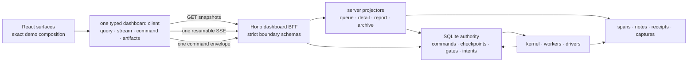

# 13 — Production frontend/backend integration contract

Status: **integration design ratified through Round 10 on 2026-07-31; Phase 1a is next.**

This document is the production-wiring companion for the rebuild demo. It answers one question:
**how do we make the rebuilt product render the approved frontend exactly, while ensuring every
visible state and action is backed by durable, honest backend behavior?**

This is **not a second build order**. Doc 07 remains the only sequencer. The slices here map onto
`1g-spine`, `1i-spine`, and the Phase-2 tails in that plan. Contract ownership remains with docs
02/03/06/09/11/12; this document owns the composition boundary between those contracts and the
production React application. If a wire shape below needs to change, its owning document must be
amended before implementation.

Visual authority:

- `src/dashboard/components/dev/rebuild-demo/DESIGN.md` — design language and interaction rules;
- `src/dashboard/components/dev/rebuild-demo/ds/` — tokens and primitive behavior;
- `src/dashboard/components/dev/rebuild-demo/` — the rendered product target;
- `docs/rebuild/03-tracker-dashboard.md` §9 — ratified presentation decisions;
- `docs/rebuild/reviews/backend-capabilities-from-the-demo-2026-07-28.md` — backend discoveries
  made while building the target.

The demo is a **visual specification and contract fixture**, not production infrastructure. The
production app must not import `src/dashboard/components/dev/rebuild-demo/**`. Approved surfaces
and primitives are ported into `temp_src/dashboard/`; mock wire factories stay test-only and are
deleted when every production surface has replaced them.

---

## 0. Outcome and non-negotiable decisions

The optimal foundation is a **typed dashboard backend-for-frontend (BFF) inside the `temp_src`
runtime's own Hono process**, backed by rebuilt authoritative SQLite state and server-side
projections (doc 03). It is not a separate rebuild service and never shares the legacy Hono
process, routes, middleware, state, port, lock, or browser sessions.



The following are settled:

1. **The frontend renders finished read models.** It does not classify raw tracker rows, infer
   statuses, reconstruct timelines, merge logs, calculate authoritative counts, or decide which
   commands are safe.
2. **One strict client owns all transport.** Components do not call `fetch` or construct
   `EventSource` directly. Query, subscription, command, upload, error normalization, schema
   parsing, reconnect, and cancellation live behind one client boundary.
3. **REST snapshots + one resumable SSE stream + one command route.** This fits the local,
   single-operator product and the current append/project architecture better than GraphQL,
   WebSockets, or a client database. Large immutable bytes use dedicated artifact routes.
4. **Server facts, client composition.** The server owns facts, state, availability, policy,
   counts, capabilities, and actions. React owns exact layout, focus, responsive behavior,
   animation, local drafts, and the fixed visual mapping from closed wire enums to the approved
   design system.
5. **No optimistic authority.** After a command, the UI may show “request submitted,” but it does
   not locally turn Running into Done, remove a row, resolve a gate, or invent a receipt. The next
   server projection or an authoritative replacement returned with the command result does that.
6. **Build end-to-end slices.** A surface is not complete when its JSX exists. It is complete when
   its schema, projector/query, stream invalidation, command path, degraded/error state, fixture,
   and Playwright visual proof all exist.
7. **The demo remains the visual oracle until parity is complete.** We port its visual language;
   we do not redesign while wiring production data.
8. **The product does not explain itself.** General teaching copy lives in an accessible ⓘ
   popover; only a refusal, a genuine hazard, or a fact about the selected run may consume standing
   surface space (doc 03 D24).
9. **Isolated coexistence and one cutover (D88/D89).** The legacy dashboard remains the production
   UI throughout construction. `temp_src` runs on distinct commands, ports, roots, locks, and
   browser profiles/sessions; neither side proxies, imports, invokes, or reads the other's live
   state. No workflow or surface flips individually. After the complete integration matrix passes,
   the normal launcher switches once; the legacy app remains rollback code.

---

## 1. What the audit found

### 1.1 The production target is a complete product, not four panels

The current demo contains all of these production surfaces:

| Product area | Approved surface/state coverage |
|---|---|
| Shell | Graphite Warm/Paper Ink themes, history, Dashboard/Archive/Explorer/Activity switcher, search, day navigation, notifications, doctor, Settings, responsive Workflow Panel, Session Panel |
| Queue | one workflow at a time, eight statuses, Needs-you composite, three row types, server action placement, bulk selection, group/member/rejected/linked containment, run facts, row explanations |
| Detail | panel-kind tabs (`Logs · Receipt`, `Review · Logs · Receipt`, or `People · Logs · Receipt`), persistent equal-width timeline, Context rail, gates, outcomes, write-parked resolution, attempts and lineage |
| Review | progressive OCR records, page evidence, field provenance/confidence, operator corrections, candidate identity captures, approve/reject gates, retry/research/relookup actions |
| Evidence | receipts for every terminal outcome, staged/verified/unconfirmed writes, failure `writeState`, remediation, diagnostic bundles, capture kinds and dimensions, rerun diffs |
| Start | descriptor-driven typed/bare/upload/capture/spreadsheet methods, presets/options, dry-run truth, per-system prod/test hosts, capability absence reasons, preflight and enqueue refusals |
| Intake | upload, header-row choice, explicit column mapping, suggestions-only matching, validation, row correction/exclusion, immutable manifest, fan-out preview, same-data rerun diff |
| Workers | one-item worker cards, browser health/recovery, lease waits, spawn-count planning, per-worker spawn results, stop/recovery commands |
| Settings | sparse overrides with provenance, atomic multi-leaf save, environment facts, system URLs, performance budgets, preflight/doctor, storage health and recovery |
| Archive/versioning | searchable self-contained historical runs, old receipts/captures/timelines, integrity state, major/minor version planning, archive blockers and relaunch |
| Explorer | exact descriptor DAG, systems/tasks/gates/delegation, optional dry-run boundary, live-run overlay, checkpoints/failures/evidence and source links |
| Activity | day/range aggregates, workflow/category/status/outcome totals, durations and failure breakdowns |

The row/panel catalog and design-system kit behind the flask control are development scaffolding.
They become fixture routes or Storybook-like test pages, not product navigation.

### 1.2 The existing frontend shows why the rebuild needs a BFF boundary

The existing legacy dashboard currently has **271 frontend files, 30 hook modules, 59 direct `fetch(` call
sites, and 21 Hono route modules**. Those numbers are not defects by themselves; the coupling is:

- components and hooks know route paths and response quirks;
- multiple polling and SSE resources describe overlapping run state;
- the browser receives tracker-shaped data and owns merge/dedup/classification work;
- startability is split across workflow metadata, `INPUT_RUN_REGISTRY`, `RUN_MODAL_REGISTRY`, and
  workflow-specific routes;
- counts, selected-run snapshots, live entries, logs, screenshots, and failures can arrive from
  different freshness points;
- some backend reads still fall back from SQLite to JSONL, and `/api/entry-data` chooses a
  “richest” row instead of exposing one authoritative detail projection;
- the current SSE hub transports permissive payloads and relies on client JSON parsing/ignoring;
- several product mutations still have one-off route families instead of one audited command
  protocol.

The rebuild must not reproduce this as cleaner folder names. The replacement boundary is one
server-authored product model and one client that parses it.

### 1.3 Existing rebuild contracts are strong but not yet sufficient for the current target

Docs 02/03/06/09/11/12 already settle the hard backend foundation: descriptors, spans/notes,
authority vs projection storage, checkpoint edits, intake manifests, write fences, evidence,
archive-on-version-bump, explorer, notifications, and config provenance. The current target adds
or clarifies these integration requirements:

- a bootstrap document rather than several startup registries and requests;
- a resumable, sequenced subscription protocol rather than change-gated payloads without cursor
  semantics;
- panel-kind and available-section projection matching the approved tab/Context/Receipt layout;
- strict start planning and enqueue contracts for every descriptor method;
- command families for settings, workers, version changes, and intake—not route-local mutations;
- progressive per-record Review patches;
- month day-counts and Activity aggregates produced by the same projection family as queue counts;
- exact archive snapshots that never need old runtime code;
- per-candidate and per-capture evidence metadata;
- contextual command results keyed to the affected run/member/record, especially in bulk flows.

These are amendments for the owning documents, not reasons to introduce frontend workarounds.

---

## 2. Production module boundaries

The production tree should make the desired dependency direction obvious:

```text
temp_src/
├── domain/
│   └── dashboard/
│       ├── bootstrap.ts          # strict wire schemas; zero React/Node imports
│       ├── projection.ts         # dashboard/day/queue/session/status schemas
│       ├── run-detail.ts         # panel kind + section schemas
│       ├── commands.ts           # envelope/result/target-family schemas
│       ├── subscription.ts       # hello/snapshot/patch/reset/cursor schemas
│       └── artifacts.ts          # refs/manifests, never local paths
├── server/
│   └── dashboard/
│       ├── routes/               # thin parse/auth/dispatch boundary
│       ├── queries/              # bootstrap, day, run detail, archive, explorer, report
│       ├── projectors/           # authority/events -> finished read models
│       ├── commands/             # target-family handlers over authority services
│       └── subscriptions/        # cursor/outbox -> SSE envelopes
└── dashboard/
    ├── app/                      # routes, providers, error/degraded boundaries
    ├── client/                   # the only fetch/EventSource/upload implementation
    ├── state/                    # normalized server cache + client-only UI state
    ├── ds/                       # production port of approved tokens/primitives
    ├── surfaces/                 # shell, queue, detail, start, intake, etc.
    └── fixtures/                 # schema-valid test data; never product imports
```

Rules:

- `domain/dashboard/**` exports strict zod schemas and inferred types. There is no handwritten
  duplicate frontend interface.
- Route handlers parse input, call a query/command service, parse output, and return it. They do
  not contain workflow switches or projection logic.
- Projectors never import React. React never imports workflow modules, stores, SQLite, tracker
  readers, or server registries.
- `dashboard/client/**` is the only frontend folder allowed to use `fetch`, `EventSource`, or
  upload streams. An architecture guard enforces this.
- Product surfaces may import only strict wire types, the client facade, design-system primitives,
  and pure presentation helpers.
- The BFF remains in-process. Splitting it into a network service adds failure modes and gives this
  local-first tool no benefit.

---

## 3. Canonical transport contracts

The names below are integration roles. Docs 02/03/06/09/11/12 own the final strict shapes.

### 3.1 `FrontendBootstrapWire`

Fetched once at app boot and refetched when the subscription declares descriptor/config skew.

```ts
interface FrontendBootstrapWire {
  wireVersion: 1;
  appVersion: string;
  descriptorHash: Fingerprint;
  settingsSchemaHash: Fingerprint;
  projectionGeneration: number;
  actor: { id: ActorId; label: string };
  serverClock: { now: IsoInstant; zone: "America/Los_Angeles" };
  storage: StorageHealthSummaryWire;
  workflows: WorkflowClientProjection[];
  workflowCategories: WorkflowCategoryProjection[];
  systemInstances: SystemInstanceProjection[];
  settingsSections: SettingsSectionProjection[];
  featureAvailability: FeatureAvailabilityWire[];
}
```

The workflow projection includes label/icon/category/code/version, panel kind, graph summary,
systems, start methods/options/presets, dry-run support or explicit absence reason, input subject,
status/verdict vocabulary, detail capabilities, action policy summary, and source availability.
The client derives navigation from this list; no parallel workflow registry survives.

### 3.2 `DashboardDayWire`

One query provides the selected day’s coherent shell and queue state:

```ts
interface DashboardDayWire {
  day: LocalDate;
  descriptorHash: Fingerprint;
  projectionGeneration: number;
  snapshotCursor: ProjectionCursor;
  monthCounts: readonly DayCountWire[];
  workflowCounts: readonly WorkflowCountWire[];
  statusCounts: readonly StatusCountWire[];
  queueSurfaces: readonly QueueSurfaceWire[];
  workerCards: readonly WorkerCardWire[];
  notifications: readonly NotificationWire[];
}
```

`QueueSurfaceWire` remains flat. Group/member relationships use ids and `parentRunId`; the client
may join those ids for layout but may not reinterpret containment or status. Counts and rows are
folded from the same projection transaction/generation. The calendar, Workflow Panel, Status Bar,
queue header, and Activity query can therefore never disagree because of different source paths.

The approved queue contract must include:

- immutable identity, attempt/lineage, actor, descriptor/app/config versions and resolved instance;
- server-resolved title/subtitle/status/live message/run facts;
- final pipeline and open gates;
- member ids/rollups/containment and streamed-record rollups;
- server-authored action descriptors with placement and CAS tokens;
- `panelKind` plus closed available-section keys;
- evidence/failure/receipt confidence pointers;
- a monotonic `rowRevision` used by commands and patches.

### 3.3 `RunDetailWire` and lazy sections

Opening a row fetches one small header plus only the selected panel section. A terminal 50-person
packet must not ship every note, capture, and facsimile in the day payload.

```ts
interface RunDetailWire {
  runId: RunId;
  rowRevision: number;
  panelKind: "run" | "member" | "review" | "group";
  header: RunIdentityWire;
  timeline: TimelineWire;
  gate?: GateDecisionWire;
  outcome?: OutcomeWire;
  context: ContextSummaryWire;
  availableSections: readonly RunDetailSection[];
}

type RunDetailSection =
  | "logs" | "receipt" | "review" | "people"
  | "context-data" | "context-evidence" | "context-attempts"
  | "failure" | "captures";
```

The fixed frontend mapping is:

| `panelKind` | Tabs | Always-visible adjacent content |
|---|---|---|
| `run` / `member` | Logs · Receipt | timeline, gate/outcome/failure, Context rail |
| `review` | Review · Logs · Receipt | timeline, gate/outcome/failure, Context rail |
| `group` | People · Logs · Receipt | timeline, gate/outcome/failure, Context rail |

Data lives in the Context rail. Captures live in Receipt and Review where relevant. A backend
capability may make a section empty/absent; it may not silently change the approved composition.

Logs/notes use cursor pagination and a per-run subscription. Review records use stable record ids
and record revisions so one page result can stream without replacing the whole run. People use
stable member ids and pagination/virtualization metadata for large groups. Receipt, failure, and
archive evidence are immutable once finalized.

### 3.4 One command protocol

All JSON mutations enter one route and one durable command journal:

```ts
interface DashboardCommandEnvelope<TTarget, TPayload> {
  wireVersion: 1;
  commandId: CommandId;
  type: DashboardCommandType;
  requestedAt: IsoInstant;
  requestedBy: ActorId;
  sourceSurface: SourceSurfaceId;
  target: TTarget;
  payload: TPayload;
}

type DashboardCommandResult =
  | { state: "applied" | "already-applied"; commandId: CommandId;
      projectionCursor?: ProjectionCursor; replacements?: readonly ProjectionReplacementWire[] }
  | { state: "conflict"; commandId: CommandId; message: string;
      currentRevision: number; replacement?: ProjectionReplacementWire }
  | { state: "rejected"; commandId: CommandId; code: CommandRejectionCode;
      message: string; fieldIssues?: readonly FieldIssueWire[] };
```

`requestedBy` is not a client-chosen identity. The client echoes the actor from bootstrap and the
server requires it to match the request’s identity checkpoint, then stamps the authoritative actor
and acceptance time on the durable command record. A mismatch rejects; request-body identity is
never trusted.

Target-family arms are closed and strict:

- run, gate, notification, capture, and checkpoint/write-resolution arms from doc 03;
- **start** — consumes a server-issued start-plan token and immutable input/artifact refs;
- **intake** — mapping confirmation, row correction/exclusion, validate, and manifest enqueue;
- **worker/browser** — plan/spawn count, stop, refresh, reopen, pause/resume recovery;
- **settings** — atomic N-leaf update against a settings revision;
- **version/archive** — validate/apply major or minor bump against a version-plan revision.

This requires doc 03’s command union to adopt the additional target families before `1c`. Dedicated
legacy mutation endpoints are not recreated. Multipart bytes are the sole exception to the JSON
command route: the upload endpoint validates and stores immutable bytes, then the command references
the returned `ArtifactRef`.

Bulk commands return one complete per-target vector. A partial result can never collapse to one
success toast. Server action descriptors are the only source for command availability, labels,
placement, confirmation copy, required forms, and revision tokens.

### 3.5 Resumable subscription protocol

One EventSource carries closed envelopes:

```ts
type DashboardStreamEnvelope =
  | { type: "hello"; wireVersion: 1; descriptorHash: Fingerprint;
      projectionGeneration: number; cursor: ProjectionCursor }
  | { type: "snapshot"; topic: TopicKey; cursor: ProjectionCursor;
      payload: DashboardTopicSnapshot }
  | { type: "patch"; topic: TopicKey; cursor: ProjectionCursor;
      payload: DashboardTopicPatch }
  | { type: "reset-required"; reason: "cursor-expired" | "generation-changed" |
      "descriptor-changed"; cursor: ProjectionCursor }
  | { type: "health"; state: "live" | "reconnecting" | "degraded" };
```

Rules:

- every envelope parses before entering client state; malformed payload is a visible protocol
  failure, never `console.warn` + ignore;
- cursors are monotonic and delivered as SSE ids; reconnect sends `Last-Event-ID`;
- duplicate cursors are idempotent, gaps force a snapshot, and an expired cursor gets
  `reset-required`;
- a descriptor hash or projection-generation change invalidates affected cached projections;
- queue patches replace one complete surface by `(runId,rowRevision)`; Review patches replace one
  complete record by `(recordId,recordRevision)`; note pages append by stable note id;
- stream payloads signal authoritative changes. They do not carry local UI state or draft edits;
- the server bounds subscriber buffers and tells the client to reset rather than silently dropping
  state-bearing messages.

### 3.6 Query and artifact surface

Concrete route layout (fresh rebuild API; no legacy compatibility layer):

```text
GET  /api/v1/bootstrap
GET  /api/v1/dashboard?day=YYYY-MM-DD
GET  /api/v1/calendar?month=YYYY-MM
GET  /api/v1/runs/:runId
GET  /api/v1/runs/:runId/{logs,receipt,review,people,failure,captures}
GET  /api/v1/archive
GET  /api/v1/archive/:runId
GET  /api/v1/workflows/:workflowId/explorer?runId=
GET  /api/v1/reports/activity?from=&to=
GET  /api/v1/settings
GET  /api/v1/storage/health
GET  /api/v1/search?q=
POST /api/v1/start-plans
POST /api/v1/intake-plans
POST /api/v1/uploads
POST /api/v1/commands
GET  /events/v1?topics=...&cursor=...
GET  /artifacts/v1/:artifactId
```

Route count is not the goal; coherent resources are. The exact split may be adjusted for lazy
loading, but there must be only one route per fact/command family and no workflow-specific API path
when a descriptor/schema can express the behavior.

Artifacts are fetched through opaque ids with media type, byte length, digest, dimensions/page
metadata, redaction/sensitivity policy, and explicit missing/purged state. The frontend never
receives a local filesystem path and never guesses capture aspect ratio.

---

## 4. State ownership

| State | Owner | Frontend rule |
|---|---|---|
| run/worker/capture/intake/settings/archive state | SQLite authority | never mutated locally |
| queue rows, status, counts, pipeline, gates, rollups | server projection | render verbatim; format only |
| actions and capability absence reasons | server policy projection | no status/workflow switches that re-enable actions |
| workflow metadata/start methods/system instances | descriptor/config projection | no parallel registries |
| receipts/failures/captures/provenance | evidence services | fetch by stable id; never synthesize missing proof |
| reports/month counts/search results | server query over projection family | do not scan browser caches to recreate them |
| selected page/workflow/row/tab, panel sizes, open dialogs | client URL/UI state | safe to update immediately |
| theme and Workflow Panel display mode | client preference | persist locally unless later promoted to actor settings |
| form/mapping/review edits before submit | client draft | retain across section switches; submit atomically with base revision |
| notification read/snooze | authority, actor-keyed | command-driven even though it feels presentational |
| elapsed time between server timestamps | client Clock calibrated from bootstrap | display-only; terminal durations remain server facts |

Pure presentation helpers may map a closed enum to an icon, token, tab order, or explanatory copy.
They may not decide whether a run is safe, complete, startable, reviewable, or actionable.

---

## 5. Surface-to-backend wiring matrix

This matrix is the completeness checklist. A production surface is not ready until every cell in
its row has an implementation and a test.

| Surface | Initial query/read model | Live patch/invalidation | Commands | Backend authority/owner |
|---|---|---|---|---|
| Top Bar + app shell | bootstrap, search, calendar month counts, notification summary, storage/preflight summary | descriptor/config/storage/notification patches | notification lifecycle; doctor rerun | descriptor registry, projection queries, notification/config/storage services |
| Workflow Panel + Status Bar | `DashboardDayWire` counts from the queue projection | changed count tuples in the same dashboard cursor | none; filters/navigation are local | doc 03 one run/queue projection |
| Queue Panel + rows | flat `QueueSurfaceWire[]` for selected day/workflow | complete row replacements and removals/tombstones | served row/bulk action descriptors | authority command state + span projection |
| Log Panel + Context rail | `RunDetailWire`, paged notes, context/evidence/attempt summaries | run/timeline/gate/outcome/note patches | gate, retry/cancel/hide/bump, checkpoint and write resolution | spans/notes, checkpoints, commands, write intents, evidence |
| Group People | paged members + rollup + containment | per-member replacement and rollup patch | contextual member and bulk commands | delegation manifests + run projection |
| OCR Review | record/page/capture projections with provenance and revision | progressive record replacements and OCR child state | approve/reject, retry page, re-research, relookup; one atomic correction list | OCR checkpoints/gates, evidence, commands |
| Receipt/Failure/Captures | immutable receipt/failure/capture refs | pending receipt becomes finalized; capture availability/purge state | remediation actions only when served | doc 12 evidence/failure store + doc 09 ledger/proof |
| Start Run | descriptor start capability + server start plan + preflight | descriptor/config/preflight invalidation | start command referencing plan token/artifact ids | descriptor parser, config resolver, enqueue authority |
| Spreadsheet Intake | artifact inspection, detected headers/samples, saved exact-fingerprint mapping, validation/manifest draft | parse/validation/finalize progress | confirm mapping, correct/exclude, validate, enqueue manifest | doc 06 artifact/mapping/intake authority |
| Mobile Capture | capture session + ordered immutable photo refs | session/photo/finalize/handoff patches | upload/replace/reorder/delete/finalize/retry/discard | doc 06 capture authority + artifact/finalize outbox |
| Session Panel | worker cards, browser health, current run, queue/wait reasons | worker/browser/run patches | plan/spawn/stop/refresh/reopen/pause/resume | worker/session authority and browser health services |
| Settings + doctor/storage | schema-driven sections, effective/default/override provenance, revision, health/backups | config/storage/preflight patches | atomic settings update; recovery actions when explicitly served | doc 11 config/preflight + doc 03 authority recovery |
| Archive + version bump | paged archive index, self-contained archived detail, integrity, version plan | version/archive job progress | plan/apply bump, relaunch as new run | doc 03 archive snapshots + descriptor/version service |
| Explorer | descriptor graph projection; optional run overlay | selected run overlay patches | navigation only in Phase A; safe edit commands later | docs 02/12 exact descriptor + spans/checkpoints |
| Activity | server aggregate by range/category/workflow/status/outcome | explicit refresh or range invalidation; no per-row stream required | export if later served | aggregation query over the same run projection/receipts |

### 5.1 Critical user flows

**Open and follow a run**

1. Bootstrap validates hashes and renders shell vocabulary.
2. Day snapshot paints counts, rows, worker cards, and notification summary from one cursor.
3. Selecting a row fetches the detail header and default panel section.
4. The client subscribes to that run’s detail topics only while relevant.
5. Row/timeline/record patches replace strict units by revision; local selection and scroll survive.
6. A disconnect displays Reconnecting. Cursor resume either catches up or requests a new snapshot.

**Start a run**

1. The descriptor projection determines which start doors exist; absence includes the reason.
2. Upload bytes, when present, become immutable artifact refs before planning.
3. `start-plans` parses input, resolves prod/test hosts, evaluates dry-run support, preflight,
   identity/item id/enqueue policy, and returns the exact proposed run(s), warnings, refusals, and a
   short-lived plan token bound to all fingerprints.
4. The operator confirms. `start` command consumes that token idempotently.
5. The command atomically creates authority records, then returns applied/conflict/rejected.
6. The queue changes only from the authoritative projection replacement/patch.

**Resolve a Review gate**

1. Review records stream independently with provenance, confidence, page/candidate capture ids,
   and record revisions.
2. Field changes remain a draft and record the machine value they supersede.
3. Approval sends one gate command containing the full correction set and expected gate/review
   revision—not one request per field/member.
4. The backend reparses corrections, stores evidence and gate result atomically, and enqueues any
   descriptor-declared children/manifests in that same authority transaction.
5. Conflict returns the fresh record/gate projection; the client keeps the draft for comparison.

**Resolve an unknown write**

1. Durable intent state projects `Write parked`, its mandatory `writeState`, proof requirements,
   and only the two safe resolution actions.
2. The operator submits proof/presence or confirmed absence against intent generation + row
   revision.
3. The write-safety service validates evidence and either records proof, creates the permitted new
   generation, or rejects/keeps the run parked.
4. Generic retry is never reintroduced by the frontend.

**Intake and fan-out**

1. Upload returns an artifact ref; inspect returns columns and bounded samples.
2. Exact fingerprint reuse is visible; suggestions remain unbound until accepted.
3. Validate creates a revisioned plan with every row exactly valid/rejected/excluded.
4. Corrections/exclusions update that plan through commands; no source artifact is rewritten.
5. Final command atomically stores the immutable manifest, coordinator, members, and dependencies.
6. Group/member queue patches then follow the ordinary projection path.

---

## 6. Delivery sequence mapped to doc 07

These are **vertical-slice acceptance units**, not new phases.

### 6.1 Before `1g-spine`: contract and visual foundation

Land with the earliest owning work items:

- `1b`: strict dashboard wire primitives, ids, versions, cursor and error/absence unions;
- `1c`: all command target-family type shells and durable command records;
- `1e`: complete `WorkflowClientProjection`, including start, panel, graph, action, dry-run and
  capability-absence fields;
- port the approved design tokens/primitives into `temp_src/dashboard/ds/` without importing the
  dev demo;
- create schema-valid fixture builders from the strict production schemas;
- capture the approved reference viewport matrix before component porting begins.

### 6.2 `1g-spine`: BFF spine

Build:

1. `FrontendBootstrapWire` query;
2. the one day/run projection and `DashboardDayWire` query;
3. `RunDetailWire` header + logs/context slices needed by Person Lookup;
4. the typed client query/cache/error boundary;
5. sequenced hello/snapshot/patch/reset SSE with cursor resume;
6. the command route with the Phase-1 run actions/start arm;
7. architecture guards forbidding direct transport and client authority derivation.

Exit with contract tests proving a snapshot plus any valid patch sequence equals a fresh snapshot.

### 6.3 `1i-spine`: exact shell + Person Lookup vertical slice

Port and wire the approved production shell, Workflow Panel, Status Bar, Queue Panel, run/member
Log Panel, Context rail, Receipt placeholder, Start Run, and Session Panel. The target is not “four
rough parity surfaces”: it is the exact demo composition for the Person Lookup capability set.

The Phase-1 live exit must prove:

- a typed Person Lookup start plan and enqueue;
- live Queue Row/status/timeline/log/Context updates over reconnectable SSE;
- one count source across calendar/Workflow Panel/Status Bar/queue;
- server-served actions and honest no-write/dry-run facts;
- worker/session health and current trace linkage;
- pixel/interaction parity in both themes at the reference viewports.

### 6.4 Phase 2 transaction proof

Before broad UI tails, wire one write-capable workflow through the same client:

- prepare preview and dry-run boundary;
- fresh subject-binding evidence;
- fenced commit, read-back, receipt, and ledger link;
- structured failure with mandatory `writeState`;
- crash recovery and Write parked resolution;
- conflict/idempotency/reconnect behavior during commands.

This validates that the visual trust model is backed by real write authority, not fixture prose.

### 6.5 `2g`: trust surfaces

Complete Receipt, Failure, captures, rerun lineage/diff, durable notifications, search links,
archive snapshot generation, and `explain run` projections. Receipt-owned screenshot placement and
the Context data ledger are part of this slice, not optional polish.

### 6.6 `2h`: data acquisition

Wire descriptor-driven upload/capture/spreadsheet starts, the full mapping/validation/manifest flow,
progressive OCR Review records, operator correction evidence, Edit Data checkpoint commands, and
mobile capture authority/outbox recovery.

### 6.7 `2i`: complete product shell

Wire Settings/doctor/storage health, Archive/version bump, Explorer/run overlay, Activity report,
generated safe catalog/help surfaces, worker/session controls, and the remaining notification and
search states. Development row/panel catalog and design-system kit remain fixture-only.

### 6.8 Phase 3+ workflow migrations

Each workflow migration uses the same integration checklist:

1. descriptor projection has complete start/panel/action/capability absence data;
2. every run shape/status/gate/outcome used by the workflow has a schema-valid scenario fixture;
3. every system read/write appears in Context and Receipt with provenance;
4. every operator decision has one strict command and conflict state;
5. group/member/rejected/linked containment is projected, never inferred from workflow id;
6. live dry-run and controlled-write evidence satisfy the owning migration gate;
7. screenshots at the reference viewports match the target composition.

---

## 7. Exact visual-parity and contract verification

### 7.1 Reference route matrix

Freeze deterministic target screenshots and accessibility snapshots for at least:

- queue: each of the eight statuses and three row types;
- group density rungs: 1–3, 4–12, and 13+ members;
- run/member/review/group panel kinds;
- open gate, failed, unknown-write parked, running, terminal receipt, and empty states;
- Start Run methods and refusals;
- intake header choice, mapping, validation/rejection, and fan-out preview;
- Session Panel browser-health states, N-worker spawn, and authored fresh-session transitions;
- Settings healthy/degraded, Archive old version, Explorer overlay, and Activity report;
- Graphite Warm and Paper Ink at 1280×720, 1440×900, and one narrow supported width;
- keyboard-only and reduced-motion variants.

The stored reference includes viewport, theme, fixture id, descriptor hash, app version, and
capture date. A screenshot without the matching a11y snapshot is incomplete.

### 7.2 Dual-adapter parity harness during construction

Use the same production components with two **test-only** data sources:

1. deterministic fixture adapter, generated from strict production schemas;
2. real HTTP/SSE client against an isolated seeded backend.

The dev demo itself remains independent visual reference; production never imports it. For each
ported state, both production adapters must produce the same DOM/a11y contract and screenshot.
This catches wire gaps while preserving the strict runtime isolation required by D88.

### 7.3 Required test layers

| Layer | Required proof |
|---|---|
| schema | every HTTP/SSE/fixture/artifact boundary strictly parses; unknown keys and invalid combinations fail |
| projector | event fold, count conservation, group collapse, action policy, panel capability and archive self-containment invariants |
| subscription | duplicate/gap/reconnect/reset/generation/hash cases; snapshot + patches = fresh snapshot |
| command | idempotency, conflict, rejection, actor/source audit, bulk result vectors and fail-closed authority lookup |
| component | closed enum exhaustiveness, draft preservation, no hidden load-bearing info, keyboard/focus/reduced-motion behavior |
| end-to-end | seeded Hono + built React + Playwright a11y assertions and screenshots |
| live | Person Lookup in Phase 1; controlled write/recovery in Phase 2; each workflow migration thereafter |

### 7.4 Performance and resilience budgets

Budgets are measured on the local production build with a realistic large fixture:

- one global EventSource plus only the selected-run topic set; no connection-per-component;
- day snapshot excludes note/capture bytes and detailed member trees;
- opening a row lazily fetches only its header/default section;
- a single Review record or member update replaces only that record/surface;
- queue, member well, logs, and archive results virtualize or page before DOM size becomes the
  bottleneck;
- a 50-member operation update does not rebuild every member or reset selection/scroll;
- stream backpressure causes explicit reset, never silent loss;
- disconnected/degraded/read-only state remains navigable and evidence stays readable while
  mutation controls are visibly refused.

Concrete latency/size thresholds are recorded from the first Person Lookup vertical slice rather
than invented in planning; they then become non-regression gates for later workflows.

---

## 8. Mechanical guards

Add these to doc 10’s inventory when their owning code lands:

1. **Transport boundary:** `fetch`, `EventSource`, and upload-stream construction appear only in
   `temp_src/dashboard/client/**`.
2. **No duplicate wire types:** dashboard code imports schema-inferred types; handwritten mirrors
   of `*Wire` interfaces fail.
3. **No workflow switches:** production dashboard/server projectors cannot branch on workflow id
   except the one descriptor registry composition root.
4. **One projection counts:** calendar, Workflow Panel, Status Bar, Queue Panel, and Activity
   aggregates trace to registered projection queries; no raw JSONL/client-cache counting path.
5. **Actions from descriptors only:** interactive run controls require an
   `ActionDescriptorWire`; status-key-to-command branches fail.
6. **No raw tracker transport:** legacy `TrackerEntry`/log/session row types cannot cross a v1
   route or enter production React.
7. **Strict stream exhaustiveness:** every envelope/topic/patch discriminant is exhaustively
   handled; malformed/gapped payload tests must reach a visible reset/error state.
8. **Panel composition coverage:** every descriptor panel kind resolves to the approved tab/Context
   mapping; every advertised section has a query and renderer.
9. **Start coverage:** every descriptor start method has both server and client interpreters;
   unsupported prod/test or dry-run combinations return a served absence/refusal.
10. **Evidence honesty:** the `verified-done` verdict requires a verified receipt (and renders as
    `Done` per doc 03 D22); failures require `writeState`;
    every capture pointer carries dimensions or explicit missing metadata.
11. **Archive self-containment:** archived detail tests run with the originating descriptor/runtime
    absent.
12. **Demo isolation:** no production import path reaches `components/dev/rebuild-demo/**` or its
    mock wire modules.

---

## 9. Decisions rejected

| Alternative | Why it is rejected |
|---|---|
| Port the current dashboard hooks/routes and restyle them | preserves overlapping freshness, raw-row knowledge, registry duplication and one-off mutation paths |
| Make the demo mock store the production state layer | demo state intentionally fakes time and outcomes; importing it makes fixtures runtime authority |
| Let React fold spans/notes directly | recreates queue/status/timeline divergence and makes reconnect correctness a UI concern |
| GraphQL | adds schema/cache/stream machinery without solving command authority or evidence consistency; the resource graph is small and purpose-built |
| WebSockets | bidirectional transport is unnecessary; commands are request/response and SSE already matches ordered server events |
| One giant initial payload | blocks first render on logs/captures/member trees and makes every small patch expensive |
| Poll everything | wastes work, creates skew across resources, and makes progressive Review/worker state feel stale |
| Optimistically apply run actions | can show a cancellation/approval/write resolution the authority rejected or conflicted |
| Backend-authored JSX/layout descriptions | couples presentation iteration to server releases and turns the descriptor into an unsafe UI DSL |
| Client-authored safety decisions | hides capability absences and can expose commands the server deliberately withdrew |

---

## 10. Integration definition of done

Frontend/backend integration is complete only when:

1. every production product surface in §1.1 is served by the matrix in §5;
2. the production app contains no workflow-specific registry, route switch, raw tracker model,
   direct component transport, or client-authored command policy;
3. bootstrap, snapshots, detail sections, stream envelopes, commands, and artifacts all parse
   strict runtime schemas;
4. reconnect/gap/reset and command conflict/idempotency paths are visibly and mechanically proven;
5. all authoritative counts and reports reconcile from the one projection family;
6. every visible action is backed by a durable command or is clearly local navigation;
7. every terminal run can render an honest receipt/failure/capture state without opening a live
   system, and an old archived run renders without old code;
8. Person Lookup and the controlled write slice pass their live gates;
9. the complete reference route matrix passes a11y, keyboard, reduced-motion, responsive, and
   screenshot comparison in both themes;
10. the dev demo/mock wire modules can be deleted without removing any production capability or
   design-system primitive; and
11. cutover rehearsal proves the legacy and rebuild servers cannot share a port/root/lock/browser
   profile, every normal launch target switches atomically as one unit, rollback assets remain
   intact, and no production route proxies/remounts the other runtime.
