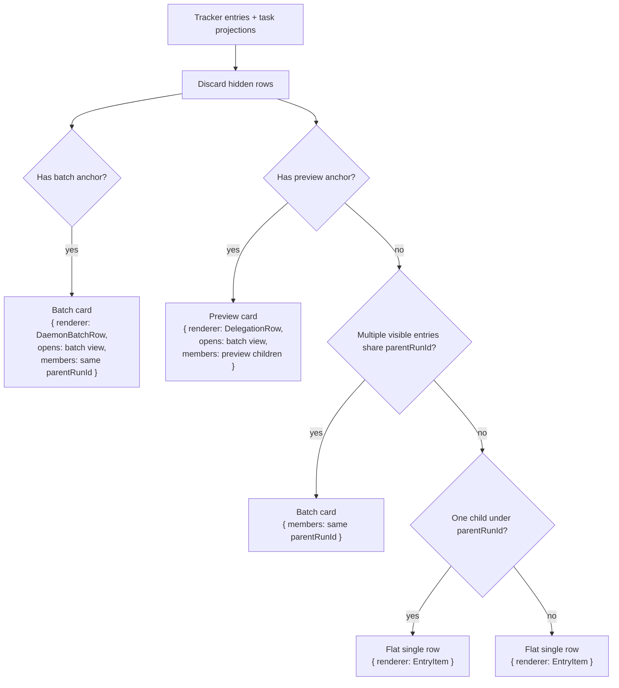

# Workflow Delegation Map

Last checked: 2026-06-02

This directory describes what each workflow does, which row archetype it emits, and how delegation appears in the dashboard after the workflow runtime migration.

Queue rows render from `WorkflowRunProjection` plus per-workflow `runtimePolicy`. Operator actions flow through `performWorkflowAction`. The docs here describe the resulting behavior: what appears in the queue, what appears in batch view, which workflow owns the work, and what cancel/retry means for that scope.

## Workflow Pages

| Workflow | Page | Primary shape |
|---|---|---|
| Oath Signature | [oath-signature.md](oath-signature.md) | EID signer rows, grouped for input/fan-out surfaces |
| Oath Upload | [oath-upload.md](oath-upload.md) | Single ticket row that waits for signer rows |
| OCR | [ocr.md](ocr.md) | Preview |
| Emergency Contact | [emergency-contact.md](emergency-contact.md) | OCR preview into final contact rows |
| Person Lookup | [person-lookup.md](person-lookup.md) | Single direct row; delegated utility rows group even when one |
| I9 Lookup | [i9-lookup.md](i9-lookup.md) | Delegated-only utility lookup |
| CRM Doc Download | [crm-doc-download.md](crm-doc-download.md) | Single utility download |
| SharePoint Download | [sharepoint-download.md](sharepoint-download.md) | Single utility download |
| Separations | [separations.md](separations.md) | Batch-capable daemon workflow |
| Onboarding | [onboarding.md](onboarding.md) | Batch-capable daemon workflow |
| Work Study | [work-study.md](work-study.md) | Single UCPath workflow |
| Kronos Reports | [kronos-reports.md](kronos-reports.md) | Batch-capable report workflow |
| Adding workflows | [adding-workflows.md](adding-workflows.md) | Checklist |

## Source Map

- Workflow registry and loader: `src/workflows/*/workflow.ts`, `src/core/workflow-loaders.ts`
- Upload-run registry: `src/dashboard/lib/run-modal-registry.ts`
- Input-run registry: `src/dashboard/lib/input-run-registry.ts`
- Queue surface builder: `src/tracker/queue-surfaces.ts`
- Rail badge counts: `src/tracker/queue-row-count.ts`, `src/dashboard/lib/workflow-rail-counts.ts`
- Queue renderer: `src/dashboard/components/queue-panel/QueuePanel.tsx`
- Flat queue row: `src/dashboard/components/queue-panel/EntryItem.tsx`
- Group row base UI: `src/dashboard/components/queue-panel/group-row-base.tsx`
- Approval delegation row: `src/dashboard/components/ocr/DelegationRow.tsx`
- Daemon/batch group row: `src/dashboard/components/queue-panel/DaemonBatchRow.tsx`
- Batch view: `src/dashboard/components/queue-panel/batch-queue-view.tsx`
- Pending controls: `src/dashboard/components/queue-panel/QueueItemControls.tsx`
- Running cancel control: `src/dashboard/components/queue-panel/CancelRunningButton.tsx`
- Retry/delete group controls: `src/dashboard/components/queue-panel/BatchFooterActions.tsx`
- Cancel endpoints: `src/tracker/dashboard/ops/cancel.ts`
- Retry endpoints: `src/tracker/dashboard/ops/retry.ts`
- Delete endpoints: `src/tracker/dashboard/ops/delete.ts`
- OCR prepare/approve/discard: `src/tracker/dashboard/ocr/*`
- Parent/child dependencies: `src/core/task-store/child-state.ts`, `src/core/task-store/terminal.ts`

## Row Units

| Unit | Meaning | Renderer | Opens batch view? | Common title | Common footer/subtitle |
|---|---|---|---|---|---|
| Single row | One tracker entry (`single` or `batch-member` archetype). | `EntryItem` | No. | `resolveEntryName()` from data/name/EID/file/person. | Time, `#run`, optional secondary id, duration. |
| Preview card | Preview anchor awaiting or past approval (OCR). | `DelegationRow` over `GroupRowBase` | Yes. | Prep/PDF title. | Prep footer; Oath prep uses `Oath · <last4 run id>` as the useful secondary id. |
| Batch card | Batch anchor or 2+ siblings sharing one `parentRunId`. | `DaemonBatchRow` over `GroupRowBase` | Yes. | Batch/workflow title or inherited parent subject. | Usual footer, but no raw `parentRunId` beside the run number. |
| Batch view member | A row shown inside an opened group. | `EntryItem` (same as single) | No nested batch view. | The member's own title. | The member's own footer/subtitle. |
| Log panel row label | Small bottom label in the right log panel. | Log panel surface classifier | N/A | Row type text: `Single`, `Preview`, or `Batch`. | Informational only. |

Title means the main title of the row. Subtitle means the footer text shown beside the run number.

Dashboard grouping is display-only unless an endpoint explicitly cancels/deletes descendants. Sharing a `parentRunId` makes rows appear together; it does not automatically make every button operate on the full tree.

## Global Queue Surface Algorithm

OCR is a preview archetype, not a batch. Person Lookup children spawned from OCR are delegated utility members with `alwaysBatchDelegatedMembers`; even one delegated lookup stays a one-member batch surface in the Person Lookup tab. Direct one-person input runs still render as a normal single row.

Workflow rail badges use backend `wfCounts` as the source of truth. The selected queue panel may be scoped or review-only, so its current top-level row count must not override the active workflow rail badge. Backend counts use the queue-surface/sidebar row counter and include resolved OCR prep rows that still render in the queue; retired `eid-lookup` and `active-check` ids are filtered from workflow lists and counts.

## Global Action Map

| Action | Where it appears | Endpoint | Scope | Effect |
|---|---|---|---|---|
| Start from upload run | Emergency Contact, OCR, Oath Upload. | `/api/ocr/prepare`, `/api/ocr/reupload`, or `/api/oath-upload/start` | Uploaded PDF list and selected form options. | Creates preview/root rows. Emergency Contact and Oath Upload prep go through OCR. |
| Start from input run | Separations, Person Lookup, Oath Signature, CRM Doc Download. | Workflow enqueue endpoint or modal handoff. | Input names/EIDs/doc ids. | Creates normal daemon rows, except empty Oath Signature opens OCR modal. |
| Cancel queued row | Pending row footer. | `/api/cancel-queued` | One queued task only. | Refuses claimed/running tasks. Marks task attempt cancelled, updates dependency child state as cancelled, writes cancelled/failed tracker audit. |
| Cancel queued OCR preview row | Pending OCR preview/proxy row footer. | `/api/ocr/discard-prepare` | The OCR preview run and children for that run. | Requests OCR abort, deletes delegated children for that OCR run, writes OCR discarded, mirrors discarded to parent when known. |
| Stop running row | Running row footer. | `/api/task/force-stop` | One running task. | Marks task cancelled immediately, records dependency cancelled, sends daemon `force-current`. Does not kill Chrome. |
| Stop running OCR preview row | Running OCR preview/proxy row footer. | `/api/ocr/discard-prepare` | The OCR preview run and children for that run. | Same as OCR discard. |
| Stop all visible active rows | Queue toolbar stop button. | `/api/cancel-active-bulk` | Visible pending/running rows in current filter. | Cancels pending through `/api/cancel-queued`; requests running cancellation through running cancel path. |
| Stop daemon | Daemon controls/API. | `/api/daemon/stop` or `/api/daemons/stop` | Daemon process/session, not automatically a workflow tree. | Stops the worker/daemon. Items not processed may later appear cancelled/failed depending on tracker/task state. |
| Kill browser | Session/worker controls. | `/api/browser/kill` | Recorded browser process only. | Sends kill command/SIGTERM for browser process. Does not by itself mark an entire delegation tree cancelled. |
| Retry one row | Failed/cancelled row footer. | `/api/retry` | One row/task, preserving parent batch context when known. | Re-enqueues from SQLite task when possible. Falls back to latest JSONL input. OCR and SharePoint have special retry handlers. |
| Retry group | Batch/delegation group footer. | `/api/retry-bulk` | Members passed by the group. | Retries each eligible member. Group retry is member retry, not a special parent transaction. |
| Delete one row | Terminal row footer. | Delete endpoint in `ops/delete.ts` | One row plus task subtree/projected entry when resolvable. | Rewrites tracker/log JSONL, removes screenshots, deletes task subtree data. |
| Delete group | Batch/delegation group footer or queue toolbar. | `/api/delete-bulk` | Members passed by caller or visible entries. | Bulk version of delete. OCR discard also calls delegated-child cleanup for that run. |
| Bump queued row | Pending row footer. | `/api/queue/bump` | One queued task. | Moves pending task earlier/later according to queue bump logic. |
| OCR approve | OCR preview/approval UI. | `/api/ocr/approve-batch` | Selected OCR records. | Enqueues target workflow children, pre-emits child pending rows, writes OCR approved/done, records dependencies when there is an upstream parent. |
| OCR discard | OCR preview/queue cancel. | `/api/ocr/discard-prepare` | One OCR preview file/run. | Cancels that file's OCR chain and removes delegated children for that run. |
| OCR retry page | OCR preview page action. | `/api/ocr/retry-page` | One OCR page. | Re-runs OCR for that page/session. |
| OCR re-OCR whole PDF | OCR preview action. | `/api/ocr/reocr-whole-pdf` | One OCR session/PDF. | Re-runs OCR for the PDF/session. |
| OCR force research | OCR preview action. | `/api/ocr/force-research` | One OCR record/session path. | Forces lookup/research path for unresolved OCR data. |
| OCR reupload | Run modal when existing preview file is replaced. | `/api/ocr/reupload` | One OCR preview/session. | Replaces source PDF and reruns preview path. |
| Edit and resume | Editable workflow detail fields. | `/api/run-with-data` | One failed/cancelled row with edited data. | Re-enqueues with `prefilledData`; used mostly by workflows with editable detail fields such as Separations. |

## Cancellation And Dependency Rules

| Situation | Current behavior |
|---|---|
| Cancel one queued child | Only that child task is cancelled. Parent dependency state becomes `cancelled`; if every dependency is either satisfied or cancelled, the parent can release. Sibling children continue. |
| Cancel one running child | Force-stop marks that child cancelled and notifies daemon. Siblings continue unless a parent/tree cancel endpoint is used. |
| Child fails | Dependency policy decides parent effect. Oath Upload approval dependencies use `block_parent`, so failed signature children block the parent until retried/resolved. |
| Child is cancelled | Dependency is marked `cancelled`, not `failed`. Parent may release if no unsatisfied or failed dependencies remain. |
| Parent/root cancel through normal row cancel | Normal row controls operate on the row/task. They do not automatically walk the full dependency tree unless the endpoint is a tree-aware path. |
| Parent/tree cancel through task-store helper | `requestCancelParentAndChildren()` can mark the parent cancelling/cancelled and cancel pending dependency children with cascade cancel enabled. This is task-store behavior, not every dashboard button. |
| OCR preview discard | This is the strongest file-scope cancel path. It aborts OCR, deletes delegated children for that OCR run, writes the preview as discarded, and mirrors discarded to the upstream parent when known. |
| Daemon stop | Stops processing. It is not the same as "cancel this workflow tree". Rows can remain cancelled/failed/queued based on where the daemon stopped and which tracker events were written. |
| Retry child | Re-enqueues that child and preserves parent/batch context. For dependency children, retry can let a blocked/waiting parent resume after the child reaches a good terminal state. |
| Delete child | Removes dashboard/tracker visibility for that child and task subtree. It is cleanup, not business approval. |

## Workflow Inventory

| Workflow | Archetype | Start paths | Queue row when direct | Delegates to | Batch view members | Notes |
|---|---|---|---|---|---|---|
| Oath Signature | `single` workflow; policy groups input/fan-out rows | Input run, OCR approve fan-out. | One-member or multi-member batch surface containing EID signer rows. | None. OCR approval enqueues signer rows directly. | Signer rows, one per EID. | EID-only; no PDF branch and no self-delegation. |
| Oath Upload | `single` | Upload run and OCR approve document fan-out. | Root/ticket single row using the same row through the ServiceNow flow. | None. It waits on oath-signature rows produced by OCR approval. | Signature/OCR children live under the OCR prep operation, not under an oath-signature PDF batch. | Full mode waits for all signer item ids before filing; upload-only skips the wait. |
| OCR | `preview` | OCR upload run, Oath/Emergency upload run, retry/reupload. | Preview/approval row. | SharePoint roster download, Person Lookup, then target workflow after approval. | OCR records and utility children depending stage. | OCR is not a batch row; delegated Person Lookup children batch even when only one lookup exists. |
| Emergency Contact | `batch` | Emergency Contact upload run through OCR approval. | OCR preview row first; final rows are emergency-contact daemon rows. | OCR preview, EID/verification utilities, final emergency-contact rows. | Contact/person rows after approval. | Final rows use editable contact detail fields. |
| Person Lookup | `single` | Input run, OCR utility child. | Normal row if direct. | None. | If OCR-created, delegated lookup rows group as a batch surface even for one lookup. | Resolves EID/person data and derives active status. Retired `eid-lookup` and `active-check` rows are hidden from dashboard workflow lists/counts. |
| I9 Lookup | `single` | Delegated only. | No dashboard start surface. | None. | Delegated signer-lookup rows, grouped even when one. | Category is `Utils`; resolves who signed I-9 Section 2. |
| CRM Doc Download | `single` | Input run, daemon loader. | Normal row. | None. | Usually none. | Retry uses normal retry path. |
| SharePoint Download | `single` | SharePoint UI/API, OCR roster-download child. | Normal/in-process row if direct. | None. | If OCR-created, delegated utility member under OCR preview. | Retry is special-cased by sharepoint download spec id. |
| Separations | `batch` | Input run, daemon loader. | Normal rows per separation/doc/person; multiple inputs can group as daemon batch. | None. | Separation rows. | Has editable detail fields and edit-and-resume. |
| Onboarding | `batch` | Daemon loader/API. | Normal rows per onboarding record; multiple inputs can group as daemon batch. | None. | Onboarding rows. | Multi-system workflow: CRM, UCPath, I-9. |
| Work Study | `single` | Daemon loader/API. | Normal row. | None. | None unless launched in a batch. | Direct UCPath transaction workflow. |
| Kronos Reports | `batch` | Workflow exists; not in generic dashboard loader. | Normal/batch rows when run by its own path. | None. | Kronos report rows. | Not currently exposed by upload-run or input-run registries. |
