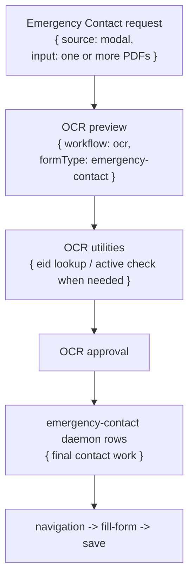

# Emergency Contact Workflow

## What It Does

Emergency Contact turns emergency-contact PDFs into UCPath emergency-contact updates. It starts with OCR preview and operator approval, then runs final emergency-contact daemon rows for each approved contact/person record.

## Delegation Model

The workflow delegates preview and verification work to OCR before final contact rows exist. After approval, each approved contact/person becomes final `emergency-contact` work.

## Queue Behavior

| Scenario | Queue row | Title | Footer/subtitle | Batch view | Actions |
|---|---|---|---|---|---|
| One PDF before approval | OCR approval delegation row. | PDF name when available. | Emergency/default preview footer. | OCR preview/records for that PDF. | OCR cancel/discard/retry/approve actions. |
| Multiple PDFs before approval | Batch delegation row over single-file OCR preview rows. | Batch/default emergency contact title. | No raw parent run id in group footer. | One PDF preview member per uploaded file. | Retry/delete group members; cancel each PDF through member row. |
| OCR utility lookup | One EID/active-check child is single; multiple siblings become a batch surface. | Person/EID. | Normal child footer. | Utility rows appear while OCR waits. | Cancel/retry one utility child only. |
| After approval | Final emergency-contact rows. | Employee/contact subject. | Normal footer. | Approved records become member rows. | Cancel/retry/delete one contact row; edit details where field editing is wired. |
