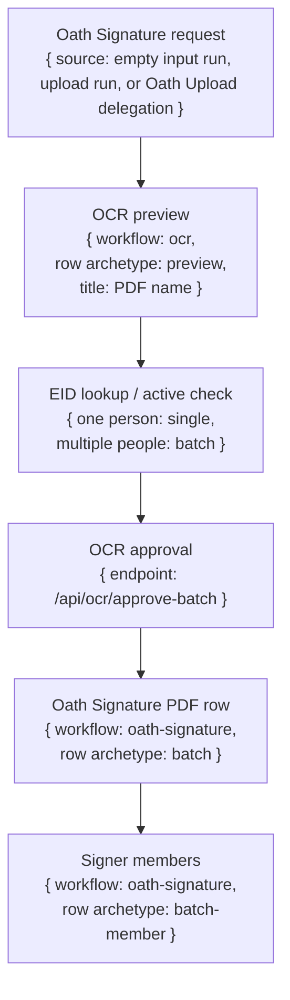

# Oath Signature Workflow

## What It Does

Oath Signature gets oath-signature PDFs through OCR, lets the operator approve the signer records, then runs a UCPath oath transaction for each approved employee.

It has two launch shapes:

- PDF upload or delegated Oath Upload signature stage: the PDF run is a batch row.
- Direct signer input: the signer input is a single row.

## Delegation Model

The delegated oath-signature PDF row is the main batch-shaped row.

| Field | Value |
|---|---|
| Workflow | `oath-signature` |
| Row archetype | `batch` |
| Scope | Delegated when it has `parentRunId = oath-upload runId` |
| Title | PDF filename from `pdfOriginalName` |
| Subtitle | `Oath · <last4 oath-signature PDF run id>` |
| Batch members | Per-signer `oath-signature` child rows created after OCR approval |

Each signer row under that PDF run is a batch member in the PDF batch surface.

| Field | Value |
|---|---|
| Workflow | `oath-signature` |
| Row archetype | `batch-member` |
| Rendered role | Batch member / delegation member inside the PDF batch surface |
| Title | Person name from the approved OCR record normalized into `name` |
| Subtitle | Usually EID or `__id` |
| Work | UCPath oath transaction for that one employee |

Oath Signature should not use a second "single signer under PDF" row type for approved OCR signer work. Approved signer work belongs under the PDF batch as batch members, even when the PDF has only one signer.

## Flow

## Single Oath PDF Upload

| Stage | Queue row | Title | Footer/subtitle | Batch view | Cancel effect |
|---|---|---|---|---|---|
| Oath Signature started | OCR preview row for one PDF file. | PDF name. | `Oath · <last4 run id>`. | OCR preview for that file. | Cancel/discard this file. Since it is the only file, the request is cancelled. |
| OCR running | Same OCR preview row. Log panel should show `Single delegation · Preview`. | PDF name. | `Oath · <last4 run id>`. | OCR records appear for that file. | Cancel from queue or preview discards this OCR run and its children. |
| EID lookup/active checks | One utility child is a single row; multiple utility children group as a batch surface. | Person/EID when known. | Normal child or group footer. | Utility rows appear in their own workflow tabs while OCR waits. | Cancel one utility lookup cancels that person/lookup only. |
| OCR approval | OCR preview row becomes approved/done. | PDF name. | `Oath · <last4 run id>`. | Approved selected people become downstream members. | Discard before approval cancels the file. After approval, cancel final person rows individually. |
| Final signature work | PDF batch row with signer member rows. | PDF batch title is the PDF name; signer title is the person name. | PDF subtitle is `Oath · <last4 PDF run id>`; signer subtitle is normal child footer. | Every approved person from the PDF gets a row in the PDF batch view. | Cancel one signer cancels only that signer and shows that member as Cancelled. |

## Multiple Oath PDF Upload

Multiple PDFs behave as multiple single-file OCR preview runs grouped for display. The shared batch id is a dashboard grouping id.

| Stage | Queue row | Title | Footer/subtitle | Batch view | Cancel effect |
|---|---|---|---|---|---|
| Oath Signature started | Batch delegation row over multiple single-file OCR preview rows. | `Oath · <last4 batch/run id>` when inherited; no PDF title at top because there are multiple files. | Empty/normal group footer; do not show raw parent run id beside `#run`. | Batch view contains preview rows, one per PDF. Each member title is PDF name and subtitle/default title is `Oath · <last4 file run id>`. | Current group actions are retry/delete, not a dedicated cancel-all. |
| Per-file OCR | Each PDF row is an OCR preview row inside the group. | PDF name. | `Oath · <last4 file run id>`. | Open file row to see OCR preview/logs. | Canceling one file cancels only that file's OCR/signature chain. Other PDFs continue. |
| Per-file EID lookup | One lookup is a single row; multiple lookups with the same OCR parent form a batch surface. | Person/EID when known. | Normal child footer. | Utility rows appear in their workflow tabs while OCR waits. | Cancel one lookup cancels one lookup/person only. |
| Per-file final signature | PDF batch with signer member rows. | PDF title for batch; person title for members. | PDF Oath subtitle; normal child footer for signer members. | Every person from each PDF gets a row under that PDF's context. | Cancel one signer cancels only that signer and marks the member Cancelled. |
