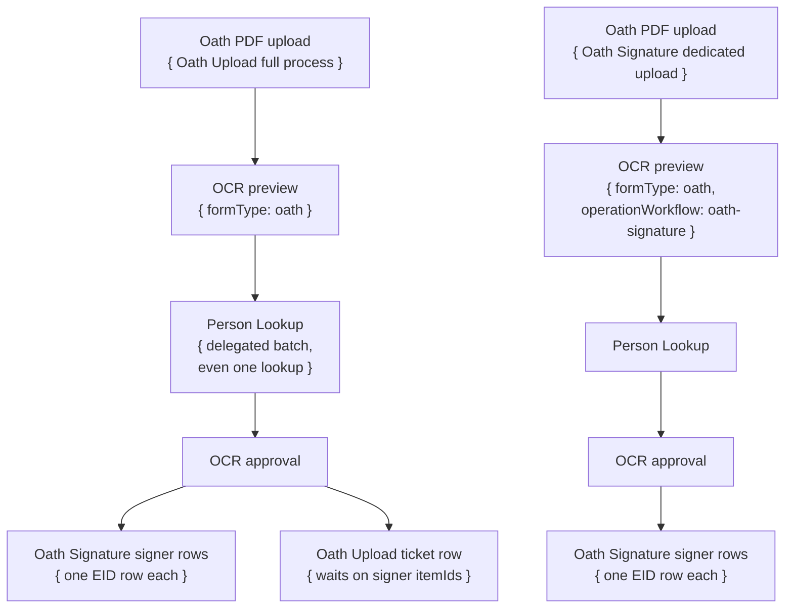

# Oath Signature Workflow

## What It Does

Oath Signature adds an Oath Signature Date row to UCPath Person Profile for one employee EID. It is EID-only: one input item, one UCPath transaction, one signer row. The PDF/OCR branch was removed; OCR now owns paper-roster prep and fans out signer rows here after approval.

## Delegation Model

Oath Signature does not delegate to another workflow. It can be started from the dashboard input-run surface or by OCR approval fan-out.

The two upload paths fan out differently at approve time:

- **Oath Upload full process** (`operationWorkflow: "oath-upload"`): fans out both signer rows (via `approveTo`) AND one Oath Upload ticket row (via `approveDocumentTo`) that waits for all signer item ids before filing the ServiceNow ticket.
- **Oath Signature dedicated upload** (`operationWorkflow: "oath-signature"`): fans out signer rows only — `approveDocumentTo` is suppressed (set to `undefined`) at approve time. No ticket row is created.

The two signer fan-out targets run on different daemons from the ticket row: Oath Signature performs the per-EID UCPath work; Oath Upload waits on those item ids. Do not reintroduce a PDF branch that delegates to `oath-signature` from inside `oath-signature`; that self-fan-out deadlocked the single-worker daemon.

## Queue Behavior

| Scenario | Queue row | Title | Footer/subtitle | Batch view | Actions |
|---|---|---|---|---|---|
| Manual input run | One-member or multi-member batch surface, depending on input count. Single-EID input runs are forced to a one-member batch by runtime policy. | Person name when present, otherwise EID. | Normal daemon footer. | Signer rows. | Cancel/retry/delete one signer row; group retry/delete for grouped rows. |
| OCR approval signer fan-out | Delegated signer row grouped as a batch surface even when there is one approved signer. | Person name from the approved OCR record, falling back to EID. | Normal delegated child footer. | Signer rows in the Oath Signature workflow context. | Cancel one signer only; Oath Upload will not file if a required signer row is missing, failed, or cancelled. |

## Stages

| Stage | Work | Notes |
|---|---|---|
| `ucpath-auth` | Authenticate to UCPath when the item reaches the handler. | The workflow's system login is a no-op at session launch so Duo is deferred until the signer row actually runs. |
| `transaction` | Add the Oath Signature Date row to UCPath Person Profile. | `loginToUCPath` is idempotent, so a warm daemon reuses the authenticated UCPath session across signer rows. |

## Important Rules

- Input subject is `eid`; the workflow no longer accepts PDFs.
- Runtime policy sets `alwaysBatchInputRun` and `alwaysBatchDelegatedMembers`, so even a single signer appears as a one-member batch surface.
- OCR approval uses the oath form spec's `approveTo` to enqueue signer rows here. The `approveDocumentTo` ticket fan-out (Oath Upload ticket) applies **only to the Oath Upload full-process path** (`operationWorkflow: "oath-upload"`); a dedicated Oath Signature upload (`operationWorkflow: "oath-signature"`) suppresses `approveDocumentTo` — no ticket row is created.
- The paper-roster flow belongs to OCR/Oath Upload, not to Oath Signature.
