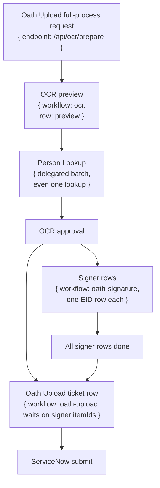

# Oath Upload Workflow

## What It Does

Oath Upload handles the ServiceNow oath-upload submission flow. In full mode, OCR approval fans out one Oath Upload ticket row plus one Oath Signature signer row per approved employee. The Oath Upload row waits for all signer item ids to finish before it files the ServiceNow ticket. In upload-only mode, it skips the signature wait and goes straight to the ServiceNow upload path.

The Oath Upload ticket row stays a single row through the workflow. In full mode that row is created by OCR approval; in upload-only mode it is created directly by `/api/oath-upload/start`.

## Delegation Model

Oath Upload no longer delegates signature work. OCR is the prep/approval hub. On approval, OCR enqueues signer rows to Oath Signature and a separate ticket row to Oath Upload; Oath Upload only waits on the signer rows.

After OCR approval, signer rows appear in Oath Signature and the ticket row appears in Oath Upload. The Oath Upload handler watches the exact signer item ids supplied by OCR approval and throws without filing if any signer row is missing, failed, or cancelled.

## Stages

| Stage | Queue row | Title | Footer/subtitle | Batch view | Cancel effect |
|---|---|---|---|---|---|
| Full process starts | OCR preview row. | PDF filename. | Oath subtitle for the OCR run. | OCR preview owns roster matching and approval. | Cancel/discard acts on the OCR prep file/run and its children. |
| Upload-only starts | Oath Upload ticket row (`single`). | Oath Upload/request title from upload data. | Normal root footer. | No signer rows. | Cancel root row cancels root task. |
| OCR preview | OCR appears as preview, not batch. | PDF filename. | Oath subtitle for the OCR run. | OCR approval view controls selected signer records. | Discard OCR blocks/cancels that preview path and mirrors discarded to parent when parent is known. |
| Person lookup | Delegated Person Lookup batch surface, even when there is only one lookup. | Person/EID. | Normal child footer. | Lookup rows appear in the Person Lookup tab while OCR waits. | Cancel one lookup cancels that lookup/person only. |
| Signer rows | Oath Signature rows are enqueued after OCR approval. | Person name. | Usually EID or `__id`. | Signer rows group according to Oath Signature runtime policy. | Cancel one signature child cancels that person only; Oath Upload will not file while a required signer is failed/cancelled/missing. |
| Wait signatures | Oath Upload ticket row waits cross-daemon on the signer item ids from OCR approval. | Root/PDF title. | Normal root footer. | Signer rows remain in the Oath Signature workflow context. | Failed/missing/cancelled signer rows cause Oath Upload to fail before ServiceNow filing. |
| Submit ServiceNow | Ticket row resumes after all signer rows succeed. | Root/PDF title. | Normal root footer. | Signature children remain visible as related history through the OCR operation. | Stop daemon stops processing, not a clean tree cancel. |
