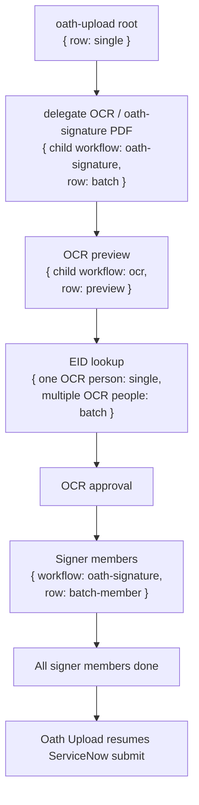

# Oath Upload Workflow

## What It Does

Oath Upload handles the ServiceNow oath-upload submission flow. In full mode, it first delegates signature work, waits for all approved signer rows to finish, then continues the ServiceNow upload. In upload-only mode, it skips signature delegation and goes straight to the ServiceNow upload path.

The root Oath Upload row stays a single row through the workflow.

## Delegation Model

Oath Upload delegates signature work instead of turning itself into a batch. The delegated signature stage creates an Oath Signature PDF batch row scoped under the Oath Upload run.

After OCR approval, signer rows start showing up in the delegated Oath Signature PDF batch as batch members. Oath Upload waits until those signer members are terminal. Once all required signer rows are done, Oath Upload continues.

## Stages

| Stage | Queue row | Title | Footer/subtitle | Batch view | Cancel effect |
|---|---|---|---|---|---|
| Root starts | Existing Oath Upload root row (`single`). | Oath Upload/request title from upload data. | Normal root footer. | Delegated signature work appears in the Oath Signature tab. | Cancel root row cancels root task. Tree-wide child cancellation depends on a tree-aware endpoint. |
| Delegate signature PDF | Same root row continues; delegated Oath Signature PDF batch appears. | PDF filename for delegated Oath Signature batch. | `Oath · <last4 oath-signature PDF run id>`. | The PDF batch owns OCR and signer context. | Cancel PDF/OCR child affects that delegated signature chain. |
| OCR preview | OCR child appears as preview, not batch. | PDF filename. | Oath subtitle for the OCR run. | OCR approval view controls selected signer records. | Discard OCR blocks/cancels that preview path and mirrors discarded to parent when parent is known. |
| EID lookup | One OCR person creates a single EID Lookup row; multiple OCR people create a batch surface. | Person/EID. | Normal child footer. | Lookup rows appear in the EID Lookup tab while OCR waits. | Cancel one lookup cancels that lookup/person only. |
| Signer members | Oath Signature child rows are enqueued after OCR approval. | Person name. | Usually EID or `__id`. | Signer rows are batch members of the delegated PDF batch. | Cancel one signature child cancels that person only; failed child blocks parent because dependency policy is `block_parent`. |
| Submit ServiceNow | Root row resumes after all signer members finish. | Root title. | Normal root footer. | Signature children remain visible as member history. | Stop daemon stops processing, not a clean tree cancel. |
