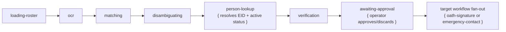

# OCR Workflow

## What It Does

OCR turns uploaded PDFs into operator-approved structured records. It loads any needed roster data, renders and OCRs the PDF, matches records, runs lookup/verification utilities, then pauses for operator approval. Approved records fan out into the target workflow, such as Oath Signature or Emergency Contact.

OCR is the only `preview` row archetype so far. It is not a batch row.

## Delegation Model

OCR utility children use normal count-based grouping:

- One OCR person needing Person Lookup is a single Person Lookup row.
- Multiple OCR people needing Person Lookup under the same OCR parent form a batch surface.

## Queue Behavior

| Scenario | Row type | Title | Footer/subtitle | Batch view | Actions |
|---|---|---|---|---|---|
| One PDF OCR preview | Approval delegation row; log label should be `Single delegation · Preview`. | PDF name. | Form-specific default title when present, otherwise normal footer id. | OCR preview/records for that file. | Cancel/discard, retry preview, delete preview, retry page, re-OCR whole PDF, force research, approve selected records. |
| Multiple PDFs OCR preview | Batch delegation row over multiple single-file preview rows. | Batch/default title. | No raw parent run id in group footer. | Preview rows, one per PDF. | Retry/delete group members; cancel per file through member row. |
| Roster download needed | Delegated SharePoint Download utility child under OCR. | Roster/download label. | Normal child footer. | Utility member row. | Cancel/retry utility child only. |
| Person lookup needed | One child is single; multiple siblings become a batch surface. | Person/EID. | Normal child footer. | Member rows in file/preview context. | Cancel/retry one lookup only. |
| OCR approved | Preview row becomes done/approved; selected records fan out. | PDF name. | Same preview footer. | Target workflow children appear as members. | Retry target children individually; retry preview only if the preview row is retried. |
| OCR discarded | Preview row is hidden from normal queue surfaces after discarded filtering. | PDF name in logs/history. | Same preview footer. | Delegated children for that OCR run are deleted. | Discard is file-scope cancellation. |
