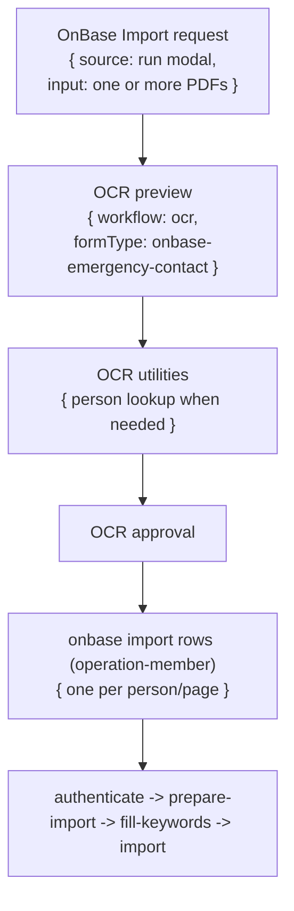

# OnBase Import Workflow

## What It Does

OnBase Import files HR documents into OnBase (Hyland) — one page per person. It starts with OCR preview and operator approval, then runs per-person import rows for each approved record. First document type wired: Emergency Contact (`X_HR_Emergency Contact`).

## Delegation Model

Multiple uploaded PDFs are merged into one combined PDF (each page = one person) before OCR. The operator uploads through the OnBase run modal → `/api/ocr/prepare?formType=onbase-emergency-contact&targetWorkflow=onbase`, which stamps an **operation coordinator** row in the OnBase panel and delegates one OCR prep under it. On approve, OCR fans out one `operation-member` row per approved record. The Employee Lookup keyset autofills every keyword except Document Name when the UCPath ID is entered — OCR's primary job is extracting the UCPath ID per page; all other field values are keyset-filled or used as fallback only.

## Queue Behavior

| Scenario | Queue row | Title | Footer/subtitle | Batch view | Actions |
|---|---|---|---|---|---|
| Before OCR approval | Operation coordinator row (display-only) with denormalized OCR status and "Open OCR review" link. | PDF filename. | OCR status label. | OCR prep delegation row is the review surface; switch to OCR panel to approve. | Discard/cancel via the delegated OCR row. |
| OCR utility lookup | Delegated Person Lookup rows. | Person/EID. | Normal child footer. | Utility rows appear while OCR processes. | Cancel/retry one utility child only. |
| After approval | Per-person import rows (`operation-member`). | Employee name. | Normal footer. | Member rows expand inline under the operation coordinator. | Cancel/retry/delete one import row. |
