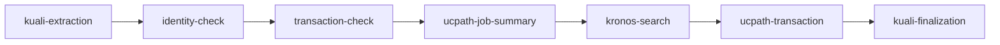

# Separations Workflow

## What It Does

Separations processes separation records across Kuali, Kronos, and UCPath. It extracts separation data, checks Kronos, verifies UCPath job summary data, performs the UCPath transaction, and finalizes the Kuali side.

## Delegation Model

Separations does not delegate to another workflow. It is `single`-archetype: one document, one row. A multi-doc input run renders as a *batch surface* (batch anchor + `batch-member` rows) via `rowShape`, but the declared archetype remains `single`.

## Queue Behavior

| Source | Queue row | Title | Footer/subtitle | Batch view | Actions |
|---|---|---|---|---|---|
| Input run / daemon loader | Normal row per separation record (`single` archetype); a multi-doc input run renders as a daemon batch surface (batch anchor + `batch-member` rows) via `rowShape`. | Person/name/doc/EID subject. | Normal footer. | Member rows for each separation record. | Cancel/retry/delete per row, group retry/delete, edit-and-resume via `/api/run-with-data` for editable fields. |
